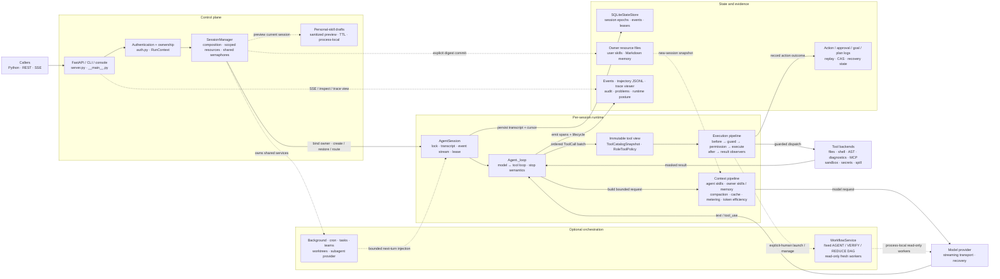

# mini-loop

A **minimal but complete-capability** coding agent, served as a **concurrent
multi-agent FastAPI server**.

The agent is the `s01` loop from
[`learn-claude-code`](./learn-claude-code/) with the essential harness
mechanisms layered on top — and nothing more:

```
Agent  = one async loop                              (s01)
       + tools: bash / read / write / edit / glob    (s02, workspace-scoped)
       + TodoWrite plan-then-execute            (s05)
       + subagent delegation (`task`)           (s06, fresh context)
       + on-demand skill loading                (s07)
       + four-layer context compaction          (s08)

Server = FastAPI + SessionManager
       + one isolated Agent per session
       + SSE live event stream
       + true concurrency across sessions
```

The one thing this project deliberately **does not** copy from the reference
`s_full.py` is its module-global state (`WORKDIR`, `TODO`, `TASK_MGR`, …). A
concurrent server needs every session fully isolated, so here **everything is
instance-based and async** — thousands of agents can run in one process without
sharing history or todos. File tools enforce workspace boundaries; shell commands
run with that workspace as their `cwd` and still require normal OS-level isolation
if untrusted users can submit prompts.

---

## Architecture

Architecture review baseline: **hardening round 188**; user-resource scoping
and personal-skill publication reviewed **2026-08-15**; the separate,
read-only research-site projection and its native-document navigation fallback
were reviewed **2026-08-16** and do not change runtime topology. Every
implementation iteration must review this map;
update the baseline in the same commit, and update the affected nodes, edges,
boundaries, and capability labels whenever the runtime changes.

<!-- architecture-map:start -->

<!-- architecture-map:end -->

The solid path is one ordinary turn. Dotted paths are optional or asynchronous:
most feature bundles are opt-in, and the experimental workflow store,
workflow-local journal, and outbox remain process-local. SQLite durability
applies to session epochs, events, leases, actions, and approvals only when a
real `StateStore` is configured; the default server still uses the documented
`Null*` boundaries. Agent skills are deployment-managed policy input. When
`MINILOOP_USER_RESOURCES_ROOT` is configured, user skills and Markdown memory
resolve from a digest-only owner directory before the Agent is built; they are
not SQLite state and do not imply host-level tenant isolation. An authenticated
owner may preview a personal skill from a bounded, masked ledger of completed
authenticated HTTP turns, then explicitly commit that exact short-lived draft
by digest.
Preview authority is process-local, while a committed `SKILL.md` is a durable
local file. Publication never replaces an existing user skill and activates
only in future independently resolved sessions, preserving every live Agent's
prompt/catalogue snapshot; a later teammate still inherits its live parent's
pinned snapshot. The feature remains default-off with the owner-resource root.

For an explorable version with guided request, tool, and orchestration views,
open the [interactive architecture](docs/mini-loop-system.architecture.html).
Its frozen source is
[`docs/mini-loop-system.architecture.json`](docs/mini-loop-system.architecture.json).
The Mermaid block above is the canonical GitHub view.

### Architecture maintenance contract

- Every implementation iteration updates the review baseline above, even when
  topology is unchanged.
- If module ownership, control/data flow, authority, persistence, public entry
  points, or default-on/default-off behavior changes, update the Mermaid and the
  boundary explanation in the same commit.
- Keep capability status explicit: `default-on`, `default-off`, `process-local`,
  and `durable` are different claims.
- Regenerate the interactive HTML from its JSON specification; do not hand-edit
  generated HTML. Report when the Mermaid is current but the companion artifact
  could not be regenerated.

---

## Why it's actually concurrent

The agent loop is `async`. LLM calls go through `AsyncAnthropic`
(non-blocking network I/O); blocking tool calls (`subprocess`, file I/O) are
offloaded with `asyncio.to_thread`. So while agent A waits on the model, agent
B's loop keeps running on the same event loop.

Measured with the bundled fake model (0.3s/call, 2 calls per run, 5 sessions):

| Mode                         | Wall time |
|------------------------------|-----------|
| 5 runs **sequential**        | 3.22 s    |
| 5 runs **concurrent**        | 0.67 s    |

A single global semaphore (`MINILOOP_MAX_CONCURRENT_LLM`, default 8) caps how
many LLM requests are in flight at once, so concurrency never blows the
provider's rate limit. A per-session `asyncio.Lock` serializes a *single*
session's runs (one conversation = one history) while different sessions stay
parallel.

Within one model turn, consecutive tools registered with
`parallel_safe=True` run concurrently. A second global semaphore
(`MINILOOP_MAX_CONCURRENT_TOOLS`, default 8) bounds those calls across all
sessions. Results are returned to the model in its original call order even
when completion order differs. Any tool not marked parallel-safe is an
ordering barrier; built-in `read_file` and `glob` opt in, while `bash` and
mutation tools remain sequential.

---

## Layout

```
mini_loop/
  config.py      env + LLM-client factory (anthropic import is lazy)
  harness.py     immutable policy/seam bundle inherited by child agents
  tools.py       per-workspace tools + structured CommandResult + safe_path
  registry.py    Tool / immutable ToolCatalogSnapshot / Hook / Hooks
  ast_context.py ast-outline 1.9.x adapter + four typed semantic-read tools
  token_efficiency.py
                 staged reducer/optimizer/policy registry + receipts + lifecycle
  token_tools.py scoped recovery of already-masked raw tool results
  tool_policy.py capability-based Explore/Worker tool inheritance
  permissions.py deny-list + PermissionRule + async approval callback
  builtins.py    the built-in tools as Tools; default/explore/worker registries
  skills.py      SkillLoader + layered agent/user catalogue and provenance
  user_resources.py
                 digest-only owner namespaces for user skills and memory
  skill_capture.py
                 authenticated-turn ledger + short-lived personal-skill drafts
  prompts.py     system_builder (default + sections_builder)
  compaction.py  Compactor protocol + budget / snip / micro / auto layers
  run_context.py immutable per-message provenance + capability approvals
  actions.py     in-memory/durable action journal + replay/conflict binding
  storage.py     optional SQLite WAL session epochs, events, leases, approvals
  trajectory.py append-only JSONL run evidence; trace_view.py renders it
  sandbox.py     host-effect boundary; secrets.py masks credentials
  spill.py       optional private recovery for bounded, already-masked output
  events.py      validated workflow event payloads for the session stream
  workflows/     experimental read-only declarative workflow runtime
  goals.py       durable objective/CAS state; plan_mode.py is soft log state
  diagnostics.py bounded syntax diagnostics; session_query.py searches epochs
  subagents.py   replaceable delegation provider with explicit lineage
  agent.py       the async loop: dispatch via registry + hooks + compactor
  session.py     AgentSession — history, status, event pub/sub, per-session lock
  manager.py     SessionManager — injects every seam, shared client + semaphore
  server.py      create_app() factory: REST + SSE + browser console at /
  fake_llm.py    deterministic offline stand-in for AsyncAnthropic
  __main__.py    `python -m mini_loop` → uvicorn
docs/
  CLAUDE_CODE_DYNAMIC_WORKFLOW_RESEARCH.md
                 Claude Code dynamic workflows research + mini-loop design
  LONGHORIZON_HARNESS_RESEARCH.md
                 LongHorizon-Harness source audit + mini-loop adoption boundary
  PI_RESEARCH.md Pi agent harness source audit + mini-loop adoption boundary
  TOKEN_EFFICIENCY_COMPONENTS.md
                 token-efficient tools, harness contracts, and rollout design
  AGENT_PLATFORM_ROADMAP.md
                 evidence-based platform gaps, dependencies, and acceptance gates
  TRAJECTORIES.md trajectory schema, inspection, privacy, and recovery boundary
skills/code_review/SKILL.md   sample skill (loadable via load_skill)
examples/custom_agent.py      all seams composed into a domain agent + custom server
tests/           offline tests (no key): loop, sandbox, subagent, compaction,
                 server, concurrency, and every extension seam
research-site/   read-only Sites app generated from top-level docs/*.md
```

Design docs: [hardening notes](docs/HARDENING_NOTES.md) (why the non-curriculum
modules exist, the traps they close, and what is still open),
[DeepSeek Harness adoption plan](docs/DEEPSEEK_HARNESS_PLAN.md),
[Claude Code dynamic workflows research](docs/CLAUDE_CODE_DYNAMIC_WORKFLOW_RESEARCH.md),
[LongHorizon-Harness research](docs/LONGHORIZON_HARNESS_RESEARCH.md),
[Pi agent harness research](docs/PI_RESEARCH.md),
[token-efficiency tools and harness components](docs/TOKEN_EFFICIENCY_COMPONENTS.md),
[Agent Platform Roadmap](docs/AGENT_PLATFORM_ROADMAP.md), and
[trajectory/recovery boundary](docs/TRAJECTORIES.md). The local resource-scope
contract is [user-scoped skills and memory](docs/USER_SCOPED_SKILLS_MEMORY_DESIGN.md).
Source-level external
architecture reviews include
[TencentDB Agent Memory](docs/TENCENTDB_AGENT_MEMORY_RESEARCH.md).
The [Research Atlas](research-site/README.md) is the browsable, searchable
projection of every maintained top-level Markdown document under `docs/`.

---

## Extending it (build your own business)

Every capability around the loop is a **swappable seam** you inject at
construction — no core edits. Add a tool, gate it with a permission hook, swap
the prompt/compaction/provider, provision per-tenant sandboxes, tap the event
stream:

```python
from mini_loop import SessionManager, build_client, load_settings, Hooks, default_registry
from mini_loop.server import create_app

registry = default_registry()

@registry.add("web_search", "Search the web.",
              {"type":"object","properties":{"query":{"type":"string"}},"required":["query"]})
async def web_search(ctx, query):
    return await my_search_api(query)        # ctx.workspace / ctx.state are yours

s = load_settings()
manager = SessionManager(s, build_client(s),
                         tool_registry=registry,          # your tools
                         hooks=Hooks([MyPolicy()]),       # permissions / audit
                         system_builder=my_prompt,        # prompt assembly
                         workspace_factory=per_tenant_dir,# sandbox provisioning
                         event_sink=my_metrics)           # observability
app = create_app(manager=manager)            # same REST + SSE + console
```

| Seam | Inject via | Changes |
|---|---|---|
| `Harness` | `harness=` | all of the below as one derivable value |
| `ToolRegistry` | `tool_registry=` | what the agent can do |
| `Hooks` | `hooks=` | permissions, audit, arg/output rewriting |
| `system_builder` | `system_builder=` | the system prompt |
| `Compactor` | `compactor=` | context trimming/summarization |
| `CachePolicy` | `cache_policy=` | where prompt-cache breakpoints go |
| `StateStore` | `state_store=` | whether a session survives a restart |
| `SecretRegistry` | `secrets=` | which credentials a tool can see or print |
| `Sandbox` | `sandbox=` | what the shell can reach on the host |
| `StuckDetector` | `stuck_detector=` | when a repeating agent is nudged or halted |
| `SkillLoader` + `skills/` | `skills=` | deployment-managed Agent knowledge |
| `UserResourceResolver` | `user_resources=` | owner-scoped user skills and memory |
| LLM client | `client=` / env | model / provider / base_url |
| `workspace_factory` | `workspace_factory=` | where/how the sandbox is provisioned |
| `event_sink` | `event_sink=` | global metrics / logging / persistence |

**Full guide with interfaces + runnable examples for each module:
[EXTENDING.md](./EXTENDING.md).**

### Feature coverage (learn-claude-code s01–s20)

The core loop is always on. The rest ship as optional modules — flip them all on
with `MINILOOP_FEATURES=all` (or `SessionManager(enable_features=True)` /
`full_registry()`):

| | Mechanism | | Mechanism |
|---|---|---|---|
| s01 | agent loop ✅ | s11 | error recovery ✅ (`recovery=`) |
| s02 | bash/read/write/edit/glob ✅ | s12 | task system ✅ (`install_tasks`) |
| s03 | permissions ✅ (`PermissionHook`) | s13 | background tasks ✅ (auto + explicit) |
| s04 | lifecycle hooks ✅ | s14 | durable cron ✅ (asyncio scheduler) |
| s05 | TodoWrite ✅ | s15–17 | teams + protocols + autonomy ✅ |
| s06 | subagent ✅ | s18 | task-bound worktrees ✅ |
| s07 | agent + user-scoped skills ✅ | s19 | MCP ✅ (`connect_mcp`, in-process + stdio) |
| s08 | four-layer compaction ✅ | s20 | comprehensive ✅ (`full_registry`) |
| s09 | auto memory lifecycle ✅ | s10 | per-call runtime prompt ✅ |

```sh
MINILOOP_FAKE_LLM=1 MINILOOP_FEATURES=all python -m mini_loop   # all built-in modules, no key
```

### Verifying the whole thing

`tests/test_fullstack.py` runs one session with **every** protection on at once —
authentication, per-caller scope, durable state, the durable action journal,
secret masking, shell confinement, prompt caching — and asserts the invariants
hold *simultaneously*. Eight of the defects found while building this harness
lived at a boundary between two modules and were each found by hand, one pair at
a time, because nothing ran the stack together.

The same composition is verified against a live model over HTTP; the offline
version is the one that runs in CI.

### Authentication

The HTTP surface had none. An anonymous caller could create a session, run shell
commands, enumerate *other* callers' sessions and download every recorded
transcript — demonstrated against a running server before this landed.

```sh
MINILOOP_API_TOKEN=…                       # single user
MINILOOP_API_TOKENS=alice:…,bob:…          # per-principal
```

Sessions are owned by the principal that created them; listing, reading, driving
and trajectories are all scoped to the owner. Someone else's session answers
**404, not 403** — 403 confirms the id exists. Tokens are compared with
`hmac.compare_digest`, and `python -m mini_loop` **refuses to start** on a
non-loopback bind with no tokens configured rather than warning about it.
With `MINILOOP_USER_RESOURCES_ROOT`, that same trusted owner is bound before
Agent construction and selects a digest-only user skill/memory namespace.
Agent-provided skills remain a separate, shared, read-only source.

### What is actually switched on

Every protection below is opt-in and defaults to a `Null*` implementation — right
per module, wrong in aggregate: a default deployment has no shell confinement, no
secret masking, no durable state, and an in-memory action journal, and nothing
says so. Ask it:

```sh
python -m mini_loop.audit                          # this machine's configuration
python -m mini_loop.audit --url http://host:port   # a server that is actually running
```

Both exit non-zero on any high/critical finding. `/healthz` carries a **build
fingerprint** (a content hash over the package source) alongside the posture, so
a client can assert it is talking to the build it just started rather than a
process that outlived a failed `pkill` — which is exactly how one round of
measurements here got taken against a fourteen-hour-old server. The remote audit
reports fewer checks than the local one, and says so: filesystem permissions and
the bind address are not observable from outside.

On this checkout, unconfigured, that reports 3 high and 2 medium — including the
combination that matters: unmasked transcripts written to disk while real
credential-shaped variables are set in the environment.

**Shell confinement** (`mini_loop/sandbox.py`, off by default) pays down the
caveat this README has always carried. A `SeatbeltSandbox` runs `bash` under
macOS `sandbox-exec`: writes confined to the workspace, reads denied for listed
roots, network denied unless granted. Policy shape follows the OpenAI Codex CLI
sandbox. Verified by execution — a real model asked to exfiltrate a canary got
it with the sandbox off and failed with it on. Not a container: no resource
limits, and a read deny-list only protects the paths you list.

**Secret handling** (`mini_loop/secrets.py`, off by default) closes a leak the
state store widened: `run_bash` inherits the process environment, so `printenv`
put the host API key into the transcript, the event stream, the trajectory *and*
the database. A `SecretRegistry` injects a credential into a shell command only
when the command names it, and masks every registered value out of tool output
regardless. Measured on a canary key: 4 of 4 sinks leaked before, 0 of 4 after.

**Durable conversation state** (`mini_loop/storage.py`, off by default) is the
first slice of the roadmap's `R1`: a SQLite (WAL) `StateStore` persists the
transcript and the event cursor, and `manager.restore_sessions()` rebuilds live
handles in a process that never saw them. Verified across two real OS processes
against a live model — the second process answered a question that could only be
resolved from the first process's transcript. A crash between dispatching a tool and recording its result is repaired on
restore by closing the call as *unknown* — the provider rejects an unanswered
`tool_use`, and reporting it as an error would invite re-running a side effect
that may already have happened. Not yet in it: durable action journal,
outbox, run state machine, cross-process leases, fork/snapshot. See
[EXTENDING.md](./EXTENDING.md#4-durable-conversation-state--statestore).

It also carries **prompt caching** (`mini_loop/caching.py`, on by default).
Providers cache a request by prefix (`tools` → `system` → `messages`), so the
old system prompt — which inlined the TodoWrite board — invalidated the whole
conversation every time the model updated its plan. Volatile state now rides the
message stream instead, and `DefaultCachePolicy` places `cache_control`
breakpoints per content block so a wide parallel tool batch cannot push the
previous breakpoint out of the provider's lookback window. Measured on a real
4-turn session: 3 distinct system prefixes before, 1 after. Swap or disable with
`cache_policy=`.

Beyond the curriculum, the loop also carries **stuck detection**
(`mini_loop/stuck.py`, on by default): `max_rounds` cannot tell thirty rounds of
work from thirty retries of one denied call, so a `StuckDetector` watches for
identical call+result repeats, identical call+error repeats, one tool that never
works however it is called, two calls ping-ponging, and tool-less monologues.
The default policy nudges once, then ends the turn and emits a `stuck` event.
Four rules are ported from the OpenHands SDK `StuckDetector`; the fifth covers a
blind spot shared by every consecutive-and-identical detector. Swap or disable
it with `stuck_detector=`
(see [EXTENDING.md](./EXTENDING.md#4b-loop-detection--stuckdetector)).

The harness now also has an explicit **token-efficiency pipeline**
(`mini_loop/token_efficiency.py`). It is off by default. `shadow` runs selected
components and emits content-free optimization receipts without changing the
model view; `enforce` can apply a post-mask observation projection, a
request-copy optimizer, and a concise response policy. Enforced observation
projection can retain a session-scoped, TTL-bound in-memory copy of the
**already masked** result and expose it through a 50 kB paged
`read_token_artifact`. Tool schemas and
the system prompt share one immutable `ToolCatalogSnapshot` and fingerprint per
provider request, and Explore/Worker children inherit tools by declared
capability instead of rebuilding hard-coded name lists. The optional
`ast-outline` adapter exposes `repo_map`, `file_outline`, `show_symbol`, and
`symbol_references` through direct argv execution and accepts only 1.9.x. See
[the extension guide](./EXTENDING.md#4c-token-efficiency-stages) and the
[source-level research](docs/TOKEN_EFFICIENCY_COMPONENTS.md).

`MINILOOP_REPO_ROOT=/path/to/repo` gives the worktree tools a target repository.
MCP servers are application dependencies, supplied through `mcp_servers=` when
constructing `SessionManager`; `connect_mcp` remains present and reports the
configured server names.

---

## Experimental local workflows

mini-loop includes a **default-off, local-only, process-local declarative
workflow MVP** inspired by Claude Code Dynamic workflows. It is not compatible
with Claude Code's generated JavaScript workflow scripts, and its in-memory
store, action journal, events, and outbox are not durable or restart-safe.
The unauthenticated FastAPI server never enables this surface.

The executable MVP is intentionally narrow:

- model-supplied definitions are canonicalized as `dynamic`; caller-supplied
  source/revision/hash identifiers are discarded and each run pins the
  runtime-owned revision, but the executable graph is fixed and acyclic with
  only `AGENT`, `VERIFY`, and `REDUCE` nodes;
- fresh workers receive only `read_file`, `glob`, and the synthetic
  schema-checked `return_artifact` tool;
- agent-facing launch and management tools require `explicit_human`
  provenance plus a per-message `workflow.launch` or `workflow.manage`
  capability approval; direct service methods are trusted local internals;
- workflow-local concurrency and attempt/round/wall-time caps compose with a
  manager/service-wide workflow-attempt semaphore and the manager's LLM/tool
  semaphores; multiple managers can share an explicitly injected
  `workflow_attempt_semaphore`;
- status, correlated session events, process-local cancellation, and terminal
  notifications are available; a completed result is injected only on the next
  real parent turn;
- non-`None` `token_budget` and JSON Schema constraints outside the supported
  MVP subset are rejected instead of being silently ignored.

The outbox uses a process-local lease, then append, then acknowledgement. An
append failure releases the lease for retry; an acknowledgement failure can
produce a later duplicate, so delivery is at-least-once rather than
exactly-once. Failed/cancelled notifications carry their compact error or
cancel reason. Nothing survives process restart.

Trusted local Python callers opt in explicitly. `definition` below is a
validated workflow-definition dictionary; a real model must emit it as the
`Workflow` tool input because this MVP has no keyword router or separate
planner:

```python
import json

from mini_loop import RunContext, SessionManager, build_client, load_settings

settings = load_settings()
definition = {...}  # a complete validated WorkflowDefinition dictionary
manager = SessionManager(
    settings,
    build_client(settings),
    enable_workflows=True,  # constructor opt-in; env/default server stay off
)
session = manager.create()

launch_context = RunContext.explicit_human(
    actor_id="local-user",
    channel="local-console",
    stamped_by="trusted-local-entrypoint",
    approved_capabilities=("workflow.launch",),
)
await session.run(
    "Launch this validated read-only workflow definition:\n"
    + json.dumps(definition),
    run_context=launch_context,
)
run_id = manager.workflows.summaries(session.id)[0]["run_id"]

# Approvals are per message and are not carried by with_new_message().
manage_context = launch_context.with_new_message(
    approved_capabilities=("workflow.manage",),
)
await session.run(
    f"Use WorkflowStatus to inspect {run_id}",
    run_context=manage_context,
)

await manager.stop()
```

`RunContext.explicit_human(...)` must be created only by an authenticated,
trusted local boundary. Immutability prevents in-run mutation; it does not make
an untrusted Python caller trustworthy. See the
[research and implementation boundary](docs/CLAUDE_CODE_DYNAMIC_WORKFLOW_RESEARCH.md)
for the exact implemented and unimplemented contracts.

---

## Quick start

```sh
python -m venv .venv && source .venv/bin/activate
pip install -r requirements.txt
cp .env.example .env            # set ANTHROPIC_API_KEY + MODEL_ID
python -m mini_loop             # http://127.0.0.1:8000  (open it: live console)
```

### Run with no API key

A deterministic fake model lets you exercise the whole stack offline:

```sh
MINILOOP_FAKE_LLM=1 MINILOOP_FAKE_DELAY=0.3 python -m mini_loop
```

Open <http://127.0.0.1:8000> in **two browser tabs** and run both — the pushed
event panels show both agents working in parallel, with expandable SSE payloads.
Every run is also recorded locally; the console can reopen it and export JSON
or JSONL. See [Agent trajectories](docs/TRAJECTORIES.md).

---

## API

| Method | Path | Body | Purpose |
|--------|------|------|---------|
| GET    | `/`                              | — | embedded console |
| GET    | `/healthz`                       | — | liveness + config |
| POST   | `/sessions`                      | `{system?, model?}` | create an isolated agent |
| GET    | `/sessions`                      | — | list sessions |
| GET    | `/sessions/{id}`                 | — | status, todos, message count |
| DELETE | `/sessions/{id}`                 | — | drop session + workspace |
| POST   | `/sessions/{id}/messages`        | `{message}` | run to completion → final text |
| POST   | `/sessions/{id}/messages/stream` | `{message}` | run, stream live events (SSE) |
| POST   | `/sessions/{id}/personal-skills/preview` | `{name, focus?}` | build a reviewable, short-lived personal-skill draft without writing a file |
| POST   | `/sessions/{id}/personal-skills/{draft_id}/commit` | `{digest}` | explicitly publish the exact reviewed draft for future sessions |
| GET    | `/sessions/{id}/events`          | — | persistent session event feed (SSE; `?envelope=true` emits one generic event name) |
| GET    | `/sessions/{id}/trajectories`    | — | list durable runs for a session |
| GET    | `/trajectories`                  | — | list all durable runs; filter with `?session_id=` |
| GET    | `/trajectories/{trajectory_id}`  | — | inspect an assembled trajectory |
| GET    | `/trajectories/{trajectory_id}/export` | — | download `?format=json` or `jsonl` |

```sh
# create a session, then send it a task
SID=$(curl -s -XPOST localhost:8000/sessions -d '{}' -H content-type:application/json | jq -r .id)
curl -s -XPOST localhost:8000/sessions/$SID/messages \
     -H content-type:application/json -d '{"message":"write fib.py and run it"}' | jq

# watch it work live
curl -sN -XPOST localhost:8000/sessions/$SID/messages/stream \
     -H content-type:application/json -d '{"message":"now add tests"}'
```

Personal-skill publication additionally requires token authentication and
`MINILOOP_USER_RESOURCES_ROOT`. Preview does not write a skill file; inspect the
returned `description`, `body`, coverage receipt, and digest before the separate
commit. The server never accepts an owner, path, or replacement body here:

```sh
TOKEN="${TOKEN:?set TOKEN to a value configured in MINILOOP_API_TOKENS}"
AUTH="Authorization: Bearer $TOKEN"
PERSONAL_SID=$(curl -s -XPOST localhost:8000/sessions \
  -H "$AUTH" -H content-type:application/json -d '{}' | jq -r .id)

# Send the authenticated turns that may become source evidence, then preview.
curl -s -XPOST localhost:8000/sessions/$PERSONAL_SID/messages \
  -H "$AUTH" -H content-type:application/json \
  -d '{"message":"review this workflow and verify the reusable steps"}' | jq
PREVIEW=$(curl -s -XPOST \
  localhost:8000/sessions/$PERSONAL_SID/personal-skills/preview \
  -H "$AUTH" -H content-type:application/json \
  -d '{"name":"review-helper","focus":"the reusable review workflow"}')
echo "$PREVIEW" | jq \
  '{description, body, coverage, omitted, compacted_history_excluded, expires_at, digest}'

DRAFT_ID=$(echo "$PREVIEW" | jq -r .draft_id)
DIGEST=$(echo "$PREVIEW" | jq -r .digest)
curl -s -XPOST \
  "localhost:8000/sessions/$PERSONAL_SID/personal-skills/$DRAFT_ID/commit" \
  -H "$AUTH" -H content-type:application/json \
  -d "{\"digest\":\"$DIGEST\"}" | jq
```

The receipt reports `activation: next_session` for the next independently
resolved session. `readonly` sessions may
preview but cannot commit, and an existing skill name is never overwritten.
Only successfully completed authenticated HTTP message turns from the current
process are source evidence; tool traffic, injected runtime text, restored
history, and internal continuations are excluded by construction. The preview
`digest` is the canonical `SKILL.md` identity and remains the commit receipt's
`digest`; `content_digest` identifies only the model-visible body.

SSE event types include `status`, `model_start`, `model_end`, `assistant_text`,
`tool_use`, `tool_result`, `trajectory_start`, `trajectory_end`,
`permission`, `recovery`, `memory`, `background_result`, `team_inbox`,
`subagent_start`, `subagent_end`, `todo`, `compact`, `done`, `error`, plus
custom hook events. Every event carries `seq`, `ts`, `session`, and `type`;
agent-originated events also carry `agent` + `depth`. Event IDs support safe
reconnection with `Last-Event-ID`.

`assistant_text.phase` is authoritative: `commentary` means the same user turn
will continue with tools, a provider resumption, or a stop-hook continuation;
`final_answer` means the agent is returning. Streaming `assistant_delta` events
arrive immediately as provisional `commentary` and carry a `stream_id`; the
following `assistant_text` with the same `stream_id` supplies the final phase.
The terminal `done` event is always `phase: final_answer`.

---

## Tests

All offline (injected fake model — no key, no network):

```sh
.venv/bin/python -m pytest -q
```

Covers the loop, sandbox and concurrency guarantees, permissions and all hook
phases, four-layer compaction, automatic cross-session memory, recovery paths,
atomic task claims, background notifications, strict/durable cron, team
protocols and autonomous claiming, task-bound worktrees, experimental
read-only workflows and their authority/resource/delivery boundaries, MCP
stdio, REST and SSE.

---

## Configuration

All via env (see `.env.example`): `ANTHROPIC_API_KEY`, `MODEL_ID`,
`ANTHROPIC_BASE_URL` (for Anthropic-compatible providers — GLM / MiniMax /
Kimi / DeepSeek), plus `MINILOOP_*` knobs for concurrency cap, turn limits,
token budget, compaction threshold, bash timeout, and the workspace/skills
directories. Comprehensive-mode settings also include `MINILOOP_MEMORY_ROOT`,
`MINILOOP_USER_RESOURCES_ROOT`, `MINILOOP_REPO_ROOT`, `MINILOOP_TEAM_IDLE_POLL`, and
`MINILOOP_TEAM_IDLE_TIMEOUT`. Trajectory settings are
`MINILOOP_TRAJECTORIES`, `MINILOOP_TRAJECTORY_ROOT`, and
`MINILOOP_TRAJECTORY_CAPTURE_CONTENT`; recording is enabled locally by default.
`MINILOOP_EXPERIMENTAL_WORKFLOWS` only supplies configuration defaults for
explicit local integrations; it does not enable workflows on the default
FastAPI server. Construct `SessionManager(enable_workflows=True)` to opt in.

Token-efficiency settings are `MINILOOP_TOKEN_EFFICIENCY_MODE`
(`off|shadow|enforce`), `MINILOOP_TOKEN_EFFICIENCY_RESPONSE_STYLE`
(`normal|concise`), `MINILOOP_TOKEN_EFFICIENCY_PERSIST_RAW`,
`MINILOOP_TOKEN_EFFICIENCY_RAW_MIN_BYTES`,
`MINILOOP_TOKEN_EFFICIENCY_ARTIFACT_TTL_SECONDS`,
`MINILOOP_TOKEN_EFFICIENCY_MAX_ARTIFACT_BYTES`, and
`MINILOOP_TOKEN_EFFICIENCY_MAX_TOTAL_BYTES`. Semantic code tools are controlled
by `MINILOOP_AST_OUTLINE_ENABLED`, `MINILOOP_AST_OUTLINE_BINARY`,
`MINILOOP_AST_OUTLINE_SHA256`,
`MINILOOP_AST_OUTLINE_TIMEOUT`, and `MINILOOP_AST_OUTLINE_MAX_OUTPUT_BYTES`.
Both feature families default off. Enabling ast-outline through `Settings` and
`SessionManager` requires an operator-configured absolute binary path plus its
SHA-256; the adapter rechecks that digest on every invocation and accepts only
`>=1.9.0,<1.10.0`.
