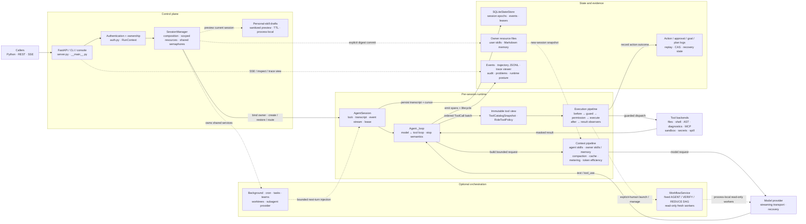

# mini-loop

A compact, inspectable coding-agent harness served as a concurrent FastAPI
application.

mini-loop starts with the `s01` agent loop from
[`learn-claude-code`](./learn-claude-code/) and adds the runtime boundaries a
real multi-session service needs: workspace-scoped tools, session isolation,
permissions, context management, event streaming, observability, and optional
durability. The default path stays narrow; production protections and experimental
orchestration remain explicit choices.

## Read this in layers

| If you want to… | Start here |
|---|---|
| See what the project is | [30-second overview](#30-second-overview) |
| Run it locally | [Quick start](#quick-start) |
| Understand one request | [How one turn works](#how-one-turn-works) |
| Decide what to enable | [Runtime posture](#runtime-posture) |
| Integrate over HTTP or Python | [Use the runtime](#use-the-runtime) |
| Build a domain-specific agent | [Extend the harness](#extend-the-harness) |
| Review the full system | [Architecture](#architecture) |
| Find detailed design evidence | [Documentation map](#documentation-map) |

## 30-second overview

```text
Caller
  └─ SessionManager
       └─ isolated AgentSession (workspace + history + lock)
            ├─ async model ↔ tool loop
            ├─ guarded tool execution
            └─ SSE events + trajectories + optional durable state
```

- **One session, one isolated agent.** History, todos, workspace, runtime state,
  and the run lock are never module-global.
- **Many sessions, one concurrent service.** Sessions make progress in
  parallel; a single conversation remains serial and ordered.
- **One small default, many injectable seams.** Tools, hooks, prompts,
  compaction, model providers, storage, sandboxing, secrets, skills, and event
  sinks are construction-time choices.
- **Evidence is part of the runtime.** REST/SSE status, trajectories, action
  records, audit posture, and optional SQLite state make behavior inspectable.
- **Capability does not imply enablement.** Default-on, default-off,
  process-local, library-only, and durable paths are labeled separately below.

## Quick start

The deterministic fake model exercises the server without an API key or
network call:

```sh
python -m venv .venv
source .venv/bin/activate
pip install -r requirements.txt
MINILOOP_FAKE_LLM=1 MINILOOP_FAKE_DELAY=0.3 python -m mini_loop
```

Open <http://127.0.0.1:8000> in two tabs to watch isolated agents run in
parallel. The browser console shows live events and recorded trajectories; the
generated OpenAPI reference is at <http://127.0.0.1:8000/docs>.

The conversation workspace is at <http://127.0.0.1:8000/ui>: a searchable session
sidebar, a command palette, configurable shortcuts, visited-session navigation,
light/dark themes, expandable tool records, and a session-tools panel
for tasks, team, trajectories, transcript, cron, skills, memory, improvements,
and the fake benchmark. It uses the same REST/SSE and approval boundaries as
the classic console. See [Web UI design and verification](mini_loop/webui/README.md).

For a real Anthropic-compatible provider:

```sh
cp .env.example .env       # set ANTHROPIC_API_KEY, MODEL_ID, and optional base URL
python -m mini_loop
```

## How one turn works

1. A Python caller or HTTP principal (anonymous on the default loopback server)
   creates or restores a session.
2. `SessionManager` binds the workspace, owner, runtime policy, model client,
   and optional resources before constructing the `Agent`.
3. `AgentSession` serializes that conversation and stamps the request with an
   immutable `RunContext`.
4. `Agent._loop` builds a bounded model request from the pinned tool catalogue,
   skills, memory, compaction state, and runtime facts.
5. Tool calls pass through hooks, monotonic guards, permission/approval, the
   action journal, execution, masking, and result observers before returning to
   the model.
6. The session emits correlated lifecycle events and records the transcript,
   trajectory, and configured durable state.

Concurrency is bounded at two levels. `MINILOOP_MAX_CONCURRENT_LLM` limits
model calls across sessions (default `8`), while
`MINILOOP_MAX_CONCURRENT_TOOLS` limits `parallel_safe` tools (default `8`).
Parallel tool results return in the model's original call order. Shell and
mutation tools remain ordering barriers.

## Runtime posture

The table is the fastest way to distinguish “implemented” from “active here.”

| Capability | Default posture | How it changes |
|---|---|---|
| Async agent loop, workspace tools, session isolation, REST/SSE console | **On** | Core runtime |
| Prompt caching and stuck detection | **On** | Replace or disable through injected policies |
| Local trajectory recording | **On** | `MINILOOP_TRAJECTORIES=0` disables it |
| Comprehensive s09–s20 feature bundle | **Off** | `MINILOOP_FEATURES=all` or `enable_features=True` |
| HTTP authentication | **Off on loopback** | Configure `MINILOOP_API_TOKEN` or `MINILOOP_API_TOKENS`; non-loopback startup without tokens is refused |
| Sandbox, secret registry, SQLite state | **Null boundaries** | Inject/configure the protection needed by the deployment |
| Owner-scoped skills, memory, and personal-skill publication | **Off** | Configure `MINILOOP_USER_RESOURCES_ROOT` and authenticated owners |
| Token-efficiency pipeline and semantic code tools | **Off** | Explicit `shadow`/`enforce` and pinned `ast-outline` settings |
| Guardian approval reviewer | **Off** | `MINILOOP_GUARDIAN=1`; it may approve, deny, or defer, never widen authority |
| Declarative workflow MVP | **Off, process-local** | Trusted Python construction with `enable_workflows=True` |
| Verified execute → verify → fold loop | **Library-only** | Call `VerifiedLoopService` explicitly; no HTTP/tool surface |

<details>
<summary>Reference curriculum mapping (learn-claude-code s01–s20)</summary>

This is module coverage, not a claim that every module is enabled or that the
default server is production-ready.

| | Mechanism | | Mechanism |
|---|---|---|---|
| s01 | agent loop | s11 | error recovery |
| s02 | bash/read/write/edit/glob | s12 | task system |
| s03 | permissions | s13 | background tasks |
| s04 | lifecycle hooks | s14 | durable cron |
| s05 | TodoWrite | s15–17 | teams, protocols, autonomy |
| s06 | subagents | s18 | task-bound worktrees |
| s07 | agent and owner-scoped skills | s19 | MCP |
| s08 | four-layer compaction | s20 | comprehensive registry |
| s09 | memory lifecycle | s10 | per-call runtime prompt |

```sh
MINILOOP_FAKE_LLM=1 MINILOOP_FEATURES=all python -m mini_loop
```

</details>

### Before exposing the server

The default is a development harness, not a host-level multi-tenant sandbox.
Before binding beyond loopback:

1. Configure token authentication. `python -m mini_loop` refuses an open bind
   without it.
2. Run `python -m mini_loop.audit` locally, or
   `python -m mini_loop.audit --url http://host:port` against the live server.
3. Choose explicit sandbox, secret-masking, persistence, and retention policy
   for the trust level of the callers.
4. Add OS/container isolation and resource limits when prompts or tools are
   untrusted; workspace path checks alone are not that boundary.

The audit exits non-zero for high or critical findings. See
[the extension guide](./EXTENDING.md) for the concrete `Sandbox`,
`SecretRegistry`, `StateStore`, and authentication seams, and
[hardening notes](docs/HARDENING_NOTES.md) for the evidence behind them.

## Use the runtime

### REST and SSE

The OpenAPI page at `/docs` is the complete route reference. The common route
families are:

| Purpose | Route |
|---|---|
| Health and runtime posture | `GET /healthz` |
| Create or list sessions | `POST /sessions`, `GET /sessions` |
| Inspect or delete one session | `GET /sessions/{id}`, `DELETE /sessions/{id}` |
| Run a turn | `POST /sessions/{id}/messages` |
| Run with live events | `POST /sessions/{id}/messages/stream` |
| Steer, fork, cancel, or change mode | `POST /sessions/{id}/steer`, `/fork`, `/cancel`, `/mode` |
| Inspect transcript, approvals, or events | `GET /sessions/{id}/transcript`, `/approvals`, `/events` |
| Inspect or export trajectories | `GET /sessions/{id}/trajectories`, `GET /trajectories/...` |
| Preview and publish a personal skill | `POST /sessions/{id}/personal-skills/preview`, `/personal-skills/{draft_id}/commit` |

```sh
SID=$(curl -s -XPOST localhost:8000/sessions \
  -H content-type:application/json -d '{}' | jq -r .id)

curl -sN -XPOST localhost:8000/sessions/$SID/messages/stream \
  -H content-type:application/json \
  -d '{"message":"write fib.py, run it, and explain the result"}'
```

Every event carries `seq`, `ts`, `session`, and `type`; agent events also carry
lineage and turn correlation. `Last-Event-ID` supports reconnection.
`assistant_text.phase` is authoritative: `commentary` means the turn continues,
while `final_answer` means the agent is returning. The terminal `done` event is
always `final_answer`. See [Agent trajectories](docs/TRAJECTORIES.md) for the
recording, viewer, export, privacy, and retention model.

Personal-skill publication additionally requires token authentication and an
owner-resource root. Preview is a bounded, masked, short-lived draft; commit
accepts its digest, never overwrites an existing skill, and activates only in a
future independently resolved session. The full contract and examples live in
[Skills and user-scoped knowledge](./EXTENDING.md#5-skills-and-user-scoped-knowledge).

### Python composition

Use the same runtime without the default server, or inject only the seams your
application owns:

```python
import asyncio

from mini_loop import SessionManager, build_client, default_registry, load_settings

async def main():
    settings = load_settings()
    manager = SessionManager(
        settings,
        build_client(settings),
        tool_registry=default_registry(),
    )
    try:
        session = manager.create(owner="local-user")
        answer = await session.run(
            "inspect this repository and summarize its entry points"
        )
        print(answer)
    finally:
        await manager.stop()

asyncio.run(main())
```

See [`examples/custom_agent.py`](examples/custom_agent.py) for a composed domain
agent and [EXTENDING.md](./EXTENDING.md) for every injectable interface.

## Extend the harness

The loop itself does not need to change when the surrounding business logic
does:

| Need | Primary seam |
|---|---|
| Add or restrict capabilities | `ToolRegistry`, `ToolCatalogSnapshot`, `RoleToolPolicy` |
| Enforce policy or observe lifecycle | `Hooks`, permission/approval, result observers |
| Change model-visible context | `system_builder`, `Compactor`, skills, memory, token-efficiency stages |
| Change provider behavior | `ModelProvider`, client, transport, recovery |
| Add durability or evidence | `StateStore`, action journal, trajectory store, `event_sink` |
| Isolate tenants and credentials | `Authenticator`, `workspace_factory`, `Sandbox`, `SecretRegistry` |
| Compose the whole policy set | `Harness` |

The [extension guide](./EXTENDING.md) contains the contracts, runnable examples,
concurrency rules, and failure boundaries. Experimental orchestration is kept
separate:

- [Verified loop design](docs/VERIFIED_LOOP_DESIGN.md) documents the explicit,
  library-only execute → verify → fold coordinator and the opt-in Guardian.
- [Dynamic workflow research and implementation boundary](docs/CLAUDE_CODE_DYNAMIC_WORKFLOW_RESEARCH.md)
  documents the default-off, read-only, process-local workflow MVP. It is not
  Claude Code workflow-script compatibility and is not restart-safe.

## Architecture

Runtime review baseline: committed runtime `f6f0503` (conversation UI redesign),
reviewed **2026-08-28**. The Minke-inspired command palette, browser-local
shortcuts, page-local session navigation, and read-only Research Atlas remain
projections of existing APIs. They do not change runtime topology, authority,
persistence, or feature enablement.

<!-- architecture-map:start -->

<!-- architecture-map:end -->

The solid path is one ordinary turn; dotted paths are optional or asynchronous.
Most feature bundles are opt-in. The workflow store, workflow-local journal,
outbox, and verified-loop coordinator are process-local or library-only. The
Guardian is an opt-in reviewer inside the existing approval boundary, not a new
source of authority.

SQLite durability applies only when a real `StateStore` is configured; the
default server keeps the documented `Null*` boundaries. Owner skills and
Markdown memory are digest-resolved files, not SQLite tenant isolation.
Personal-skill previews are process-local; a committed `SKILL.md` is durable,
never replaces an existing skill, and appears only in future session snapshots.

Open the [interactive architecture](docs/mini-loop-system.architecture.html) for
guided request, tool, and orchestration views. Its source is
[`docs/mini-loop-system.architecture.json`](docs/mini-loop-system.architecture.json).
The Mermaid block above remains the canonical GitHub view.

<details>
<summary>Architecture maintenance contract</summary>

- Review and update the runtime baseline on every implementation iteration.
- When ownership, control/data flow, authority, persistence, entry points, or
  defaults change, update the Mermaid, boundary explanation, and interactive
  specification in the same commit.
- Keep `default-on`, `default-off`, `process-local`, `library-only`, and
  `durable` claims distinct.
- Regenerate interactive HTML from its JSON source; never hand-edit generated
  HTML.

</details>

## Repository map

| Path | Responsibility |
|---|---|
| `mini_loop/agent.py` | Async model/tool loop and execution pipeline |
| `mini_loop/session.py` | Per-session history, lock, events, lease, and persistence bridge |
| `mini_loop/manager.py` | Composition root, ownership, shared services, session lifecycle |
| `mini_loop/server.py` | FastAPI factory, REST/SSE surface, embedded console |
| `mini_loop/builtins.py` | Default and comprehensive tool registries |
| `mini_loop/workflows/` | Experimental read-only declarative workflow runtime |
| `tests/` | Offline loop, safety, persistence, concurrency, API, and seam coverage |
| `examples/` | Runnable custom composition |
| `docs/` | Design evidence, research, hardening record, and roadmap |
| `research-site/` | Read-only browsable projection generated from `docs/*.md` |

Use [EXTENDING.md](./EXTENDING.md) instead of reading modules in directory order;
it follows the construction seams from caller identity through serving.

## Configuration

[`.env.example`](.env.example) is the configuration index. The main groups are:

| Concern | Variables |
|---|---|
| Provider | `ANTHROPIC_API_KEY`, `MODEL_ID`, `ANTHROPIC_BASE_URL` |
| Runtime limits | `MINILOOP_MAX_CONCURRENT_*`, turn/token/compaction/bash limits |
| Optional modules | `MINILOOP_FEATURES`, `MINILOOP_GUARDIAN` |
| Workspace and resources | `MINILOOP_WORKSPACE_ROOT`, `MINILOOP_REPO_ROOT`, `MINILOOP_USER_RESOURCES_ROOT`, `MINILOOP_MEMORY_ROOT` |
| Evidence | `MINILOOP_TRAJECTORIES`, `MINILOOP_TRAJECTORY_ROOT`, content-capture settings |
| Token efficiency and AST | `MINILOOP_TOKEN_EFFICIENCY_*`, `MINILOOP_AST_OUTLINE_*` |

`MINILOOP_EXPERIMENTAL_WORKFLOWS` supplies settings for an explicit local
integration; it does not enable workflows on the default FastAPI server.

## Validation

The default test suite is offline and deterministic:

```sh
.venv/bin/python -m pytest -q
.venv/bin/python tools/verify_invariants.py
```

Additional mutation guards and source scans protect load-bearing boundaries:

```sh
.venv/bin/python tools/verify_guards.py
.venv/bin/python tools/verify_scans.py
```

## Documentation map

| Question | Document |
|---|---|
| How do I inject or replace a runtime seam? | [Extending mini-loop](./EXTENDING.md) |
| Why does a guard or invariant exist? | [Hardening notes](docs/HARDENING_NOTES.md) |
| What is durable, inspectable, or exported? | [Agent trajectories](docs/TRAJECTORIES.md) |
| How do owner skills and memory resolve? | [User-scoped skills and memory](docs/USER_SCOPED_SKILLS_MEMORY_DESIGN.md) |
| What is the verified-loop adoption status? | [Verified loop design](docs/VERIFIED_LOOP_DESIGN.md) |
| What remains before a broader agent platform? | [Agent Platform Roadmap](docs/AGENT_PLATFORM_ROADMAP.md) |
| What informed the token-efficiency design? | [Token-efficiency components](docs/TOKEN_EFFICIENCY_COMPONENTS.md) |
| Where are the source-level external studies? | [Research Atlas](research-site/README.md) |
