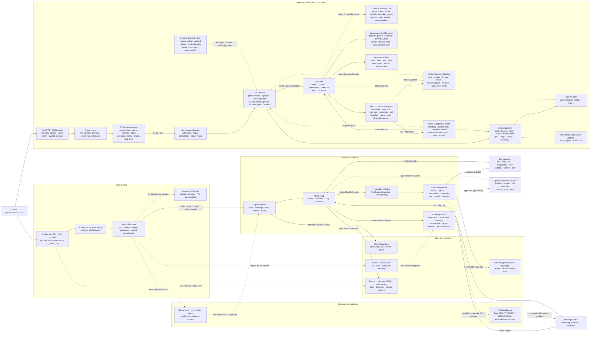

# mini-loop

A compact, inspectable coding-agent harness. The existing FastAPI implementation
lives in `python/`; an independent Go implementation is being built in `go/`.
See the [port plan](GO_PORT_PLAN.md) and [parity matrix](GO_PARITY_MATRIX.md).

mini-loop starts with the `s01` agent loop from
[`learn-claude-code`](./learn-claude-code/) and adds the runtime boundaries a
real multi-session service needs: workspace-scoped tools, session isolation,
permissions, context management, event streaming, observability, and optional
durability. The default path stays narrow; production protections and experimental
orchestration remain explicit choices.

## Read this in layers

| If you want to… | Start here |
|---|---|
| See what the project is | [30-second overview](#30-second-overview) |
| Run it locally | [Quick start](#quick-start) |
| Understand one request | [How one turn works](#how-one-turn-works) |
| Decide what to enable | [Runtime posture](#runtime-posture) |
| Integrate over HTTP or Python | [Use the runtime](#use-the-runtime) |
| Build a domain-specific agent | [Extend the harness](#extend-the-harness) |
| Review the full system | [Architecture](#architecture) |
| Find detailed design evidence | [Documentation map](#documentation-map) |

## 30-second overview

```text
Caller
  └─ SessionManager
       └─ isolated AgentSession (workspace + history + lock)
            ├─ async model ↔ tool loop
            ├─ guarded tool execution
            └─ SSE events + trajectories + optional durable state
```

- **One session, one isolated agent.** History, todos, workspace, runtime state,
  and the run lock are never module-global.
- **Many sessions, one concurrent service.** Sessions make progress in
  parallel; a single conversation remains serial and ordered.
- **One small default, many injectable seams.** Tools, hooks, prompts,
  compaction, model providers, storage, sandboxing, secrets, skills, and event
  sinks are construction-time choices.
- **Evidence is part of the runtime.** REST/SSE status, trajectories, action
  records, audit posture, and optional SQLite state make behavior inspectable.
- **Capability does not imply enablement.** Default-on, default-off,
  process-local, library-only, and durable paths are labeled separately below.

## Quick start

The deterministic fake model exercises the server without an API key or
network call:

```sh
python -m venv .venv
source .venv/bin/activate
pip install -r python/requirements.txt
MINILOOP_FAKE_LLM=1 MINILOOP_FAKE_DELAY=0.3 PYTHONPATH=python python -m mini_loop
```

Open <http://127.0.0.1:8000> in two tabs to watch isolated agents run in
parallel. The browser console shows live events and recorded trajectories; the
generated OpenAPI reference is at <http://127.0.0.1:8000/docs>.

The conversation workspace is at <http://127.0.0.1:8000/ui>: a searchable session
sidebar, a command palette, configurable shortcuts, visited-session navigation,
light/dark themes, expandable tool records, and a session-tools panel
for tasks, team, trajectories, transcript, cron, skills, memory, improvements,
and the fake benchmark. It uses the same REST/SSE and approval boundaries as
the classic console. See [Web UI design and verification](python/mini_loop/webui/README.md).

For a real Anthropic-compatible provider:

```sh
cp python/.env.example .env # set ANTHROPIC_API_KEY, MODEL_ID, and optional base URL
PYTHONPATH=python python -m mini_loop
```

## How one turn works

1. A Python caller or HTTP principal (anonymous on the default loopback server)
   creates or restores a session.
2. `SessionManager` binds the workspace, owner, runtime policy, model client,
   and optional resources before constructing the `Agent`.
3. `AgentSession` serializes that conversation and stamps the request with an
   immutable `RunContext`.
4. `Agent._loop` builds a bounded model request from the pinned tool catalogue,
   skills, memory, compaction state, and runtime facts.
5. Tool calls pass through hooks, monotonic guards, permission/approval, the
   action journal, execution, masking, and result observers before returning to
   the model.
6. The session emits correlated lifecycle events and records the transcript,
   trajectory, and configured durable state.

Concurrency is bounded at two levels. `MINILOOP_MAX_CONCURRENT_LLM` limits
model calls across sessions (default `8`), while
`MINILOOP_MAX_CONCURRENT_TOOLS` limits `parallel_safe` tools (default `8`).
Parallel tool results return in the model's original call order. Shell and
mutation tools remain ordering barriers.

## Runtime posture

The table is the fastest way to distinguish “implemented” from “active here.”

| Capability | Default posture | How it changes |
|---|---|---|
| Async agent loop, workspace tools, session isolation, REST/SSE console | **On** | Core runtime |
| Prompt caching and stuck detection | **On** | Replace or disable through injected policies |
| Local trajectory recording | **On** | `MINILOOP_TRAJECTORIES=0` disables it |
| Comprehensive s09–s20 feature bundle | **Off** | `MINILOOP_FEATURES=all` or `enable_features=True` |
| HTTP authentication | **Off on loopback** | Configure `MINILOOP_API_TOKEN` or `MINILOOP_API_TOKENS`; non-loopback startup without tokens is refused |
| Sandbox, secret registry, SQLite state | **Null boundaries** | Inject/configure the protection needed by the deployment |
| Owner-scoped skills, memory, and personal-skill publication | **Off** | Configure `MINILOOP_USER_RESOURCES_ROOT` and authenticated owners |
| Token-efficiency pipeline and semantic code tools | **Off** | Explicit `shadow`/`enforce` and pinned `ast-outline` settings |
| Guardian approval reviewer | **Off** | `MINILOOP_GUARDIAN=1`; it may approve, deny, or defer, never widen authority |
| Typed decisions: choice, score, and noul | **Off, including the full feature bundle** | `MINILOOP_DECISIONS=llm\|jev` or explicit `install_decisions()`; judgments return data through the existing tool boundary |
| Declarative workflow MVP | **Off, process-local** | Trusted Python construction with `enable_workflows=True` |
| Verified execute → verify → fold loop | **Library-only** | Call `VerifiedLoopService` explicitly; no HTTP/tool surface |

<details>
<summary>Reference curriculum mapping (learn-claude-code s01–s20)</summary>

This is module coverage, not a claim that every module is enabled or that the
default server is production-ready.

| | Mechanism | | Mechanism |
|---|---|---|---|
| s01 | agent loop | s11 | error recovery |
| s02 | bash/read/write/edit/glob | s12 | task system |
| s03 | permissions | s13 | background tasks |
| s04 | lifecycle hooks | s14 | durable cron |
| s05 | TodoWrite | s15–17 | teams, protocols, autonomy |
| s06 | subagents | s18 | task-bound worktrees |
| s07 | agent and owner-scoped skills | s19 | MCP |
| s08 | four-layer compaction | s20 | comprehensive registry |
| s09 | memory lifecycle | s10 | per-call runtime prompt |

```sh
MINILOOP_FAKE_LLM=1 MINILOOP_FEATURES=all PYTHONPATH=python python -m mini_loop
```

</details>

### Before exposing the server

The default is a development harness, not a host-level multi-tenant sandbox.
Before binding beyond loopback:

1. Configure token authentication. `PYTHONPATH=python python -m mini_loop` refuses an open bind
   without it.
2. Run `PYTHONPATH=python python -m mini_loop.audit` locally, or
   `PYTHONPATH=python python -m mini_loop.audit --url http://host:port` against the live server.
3. Choose explicit sandbox, secret-masking, persistence, and retention policy
   for the trust level of the callers.
4. Add OS/container isolation and resource limits when prompts or tools are
   untrusted; workspace path checks alone are not that boundary.

The audit exits non-zero for high or critical findings. See
[the extension guide](./EXTENDING.md) for the concrete `Sandbox`,
`SecretRegistry`, `StateStore`, and authentication seams, and
[hardening notes](docs/HARDENING_NOTES.md) for the evidence behind them.

## Use the runtime

### REST and SSE

The OpenAPI page at `/docs` is the complete route reference. The common route
families are:

| Purpose | Route |
|---|---|
| Health and runtime posture | `GET /healthz` |
| Create or list sessions | `POST /sessions`, `GET /sessions` |
| Inspect or delete one session | `GET /sessions/{id}`, `DELETE /sessions/{id}` |
| Run a turn | `POST /sessions/{id}/messages` |
| Run with live events | `POST /sessions/{id}/messages/stream` |
| Steer, fork, cancel, or change mode | `POST /sessions/{id}/steer`, `/fork`, `/cancel`, `/mode` |
| Inspect transcript, approvals, or events | `GET /sessions/{id}/transcript`, `/approvals`, `/events` |
| Inspect or export trajectories | `GET /sessions/{id}/trajectories`, `GET /trajectories/...` |
| Preview and publish a personal skill | `POST /sessions/{id}/personal-skills/preview`, `/personal-skills/{draft_id}/commit` |

```sh
SID=$(curl -s -XPOST localhost:8000/sessions \
  -H content-type:application/json -d '{}' | jq -r .id)

curl -sN -XPOST localhost:8000/sessions/$SID/messages/stream \
  -H content-type:application/json \
  -d '{"message":"write fib.py, run it, and explain the result"}'
```

Every event carries `seq`, `ts`, `session`, and `type`; agent events also carry
lineage and turn correlation. `Last-Event-ID` supports reconnection.
`assistant_text.phase` is authoritative: `commentary` means the turn continues,
while `final_answer` means the agent is returning. The terminal `done` event is
always `final_answer`. See [Agent trajectories](docs/TRAJECTORIES.md) for the
recording, viewer, export, privacy, and retention model.

Personal-skill publication additionally requires token authentication and an
owner-resource root. Preview is a bounded, masked, short-lived draft; commit
accepts its digest, never overwrites an existing skill, and activates only in a
future independently resolved session. The full contract and examples live in
[Skills and user-scoped knowledge](./EXTENDING.md#5-skills-and-user-scoped-knowledge).

### Python composition

Use the same runtime without the default server, or inject only the seams your
application owns:

```python
import asyncio

from mini_loop import SessionManager, build_client, default_registry, load_settings

async def main():
    settings = load_settings()
    manager = SessionManager(
        settings,
        build_client(settings),
        tool_registry=default_registry(),
    )
    try:
        session = manager.create(owner="local-user")
        answer = await session.run(
            "inspect this repository and summarize its entry points"
        )
        print(answer)
    finally:
        await manager.stop()

asyncio.run(main())
```

See [`examples/custom_agent.py`](python/examples/custom_agent.py) for a composed domain
agent and [EXTENDING.md](./EXTENDING.md) for every injectable interface.

## Extend the harness

The loop itself does not need to change when the surrounding business logic
does:

| Need | Primary seam |
|---|---|
| Add or restrict capabilities | `ToolRegistry`, `ToolCatalogSnapshot`, `RoleToolPolicy` |
| Enforce policy or observe lifecycle | `Hooks`, permission/approval, result observers |
| Change model-visible context | `system_builder`, `Compactor`, skills, memory, token-efficiency stages |
| Change provider behavior | `ModelProvider`, client, transport, recovery |
| Add durability or evidence | `StateStore`, action journal, trajectory store, `event_sink` |
| Isolate tenants and credentials | `Authenticator`, `workspace_factory`, `Sandbox`, `SecretRegistry` |
| Compose the whole policy set | `Harness` |

The [extension guide](./EXTENDING.md) contains the contracts, runnable examples,
concurrency rules, and failure boundaries. Experimental orchestration is kept
separate:

- [Verified loop design](docs/VERIFIED_LOOP_DESIGN.md) documents the explicit,
  library-only execute → verify → fold coordinator and the opt-in Guardian.
- [Dynamic workflow research and implementation boundary](docs/CLAUDE_CODE_DYNAMIC_WORKFLOW_RESEARCH.md)
  documents the default-off, read-only, process-local workflow MVP. It is not
  Claude Code workflow-script compatibility and is not restart-safe.

## Architecture

Runtime review baseline: `ad71e05` plus the Python directory split, its
package-relative default skills path, and the Go typed loop, execution gate
and workspace files, bounded glob search, todo/skill/question handlers, typed
model requests, token metering, four-layer context compaction and typed subagent
execution with run provenance, action replay and typed journal transitions,
a bound approval broker with session grants and textual questions, and optional
registered-secret masking across the implemented Go result/recording paths,
and a real foreground workspace shell with typed results, group cancellation
and bounded capture, plus default cache annotations and bounded stuck detection, core lifecycle
telemetry, bounded subscriptions and managed turn admission/cancellation,
plus typed prompt hooks/injectors, Todo reminders and shared model/tool pools
with ordered parallel groups, and process-local fleet composition, owner-scoped
lookup, workspace policy and draining deletion/shutdown, plus typed HTTP authentication,
REST admission, idempotency/rate bounds and SSE projection,
reviewed **2026-10-03** (Go baseline `e6540af` plus the HTTP slice).
The optional `decision` tool evaluates explicit state through a configured
provider; its typed result returns through
the existing permission, tool-result, and event boundaries.

<!-- architecture-map:start -->

```mermaid
flowchart LR
    Caller["Callers<br/>Python · REST · SSE"]

    subgraph Control["Control plane"]
        Entry["Python FastAPI / CLI / console<br/>python/mini_loop/server.py · __main__.py"]
        Trust["Authentication + ownership<br/>auth.py · RunContext"]
        Manager["SessionManager<br/>composition · scoped resources · shared semaphores"]
        Drafts["Personal-skill drafts<br/>sanitized preview · TTL · process-local"]
        Entry --> Trust --> Manager
    end

    subgraph Runtime["Per-session runtime"]
        Session["AgentSession<br/>lock · transcript · event stream · lease"]
        Agent["Agent._loop<br/>model ↔ tool loop · stop semantics"]
        Context["Context pipeline<br/>agent skills · owner skills / memory<br/>compaction · cache · metering · token efficiency"]
        Catalog["Immutable tool view<br/>ToolCatalogSnapshot · RoleToolPolicy"]
        Gate["Execution pipeline<br/>before → guard → permission → execute<br/>after → result observers"]

        Session --> Agent
        Agent -->|build bounded request| Context
        Agent -->|ordered ToolCall batch| Catalog --> Gate
    end

    Provider["Model provider<br/>streaming transport · recovery"]
    Backends["Tool backends<br/>files · shell · AST · diagnostics · MCP<br/>sandbox · secrets · spill"]
    Decisions["Optional DecisionProvider<br/>Jev API or explicit LLM estimates<br/>choice · score · noul"]

    subgraph Async["Optional orchestration"]
        Coordination["Background · cron · tasks · teams<br/>worktrees · subagent provider"]
        Workflow["WorkflowService<br/>fixed AGENT / VERIFY / REDUCE DAG<br/>read-only fresh workers"]
    end

    subgraph Evidence["State and evidence"]
        State["SQLiteStateStore<br/>session epochs · events · leases"]
        Resources["Owner resource files<br/>user skills · Markdown memory"]
        Journal["Action / approval / goal / plan logs<br/>replay · CAS · recovery state"]
        Trace["Events · trajectory JSONL · trace viewer<br/>audit · problems · runtime posture"]
    end

    subgraph GoPort["Independent Go port · in progress"]
        GoEntry["Go HTTP / SSE handler<br/>bounded ingress · typed JSON / event projection"]
        GoTrust["Authenticator<br/>one admitted principal · owner-scoped routes"]
        GoFake["FakeProvider<br/>typed requests · replies · usage"]
        GoManager["Go SessionManager<br/>owner lookup · shared services / pools<br/>workspace policy · delete / stop drain"]
        GoManaged["Go ManagedSession<br/>admission · active cancellation · status / done"]
        GoSession["Go Session<br/>prompt hooks · injectors · Todo reminder<br/>ordered parallel groups · inherited pools · events"]
        GoContext["Context pipeline<br/>fitted schemas · skills · cache · token meter<br/>spill → snip → micro → summary"]
        GoArchives["Workspace compaction artifacts<br/>.task_outputs · .transcripts"]
        GoActions["Optional action journal<br/>typed states · stable identity · bounded results<br/>memory implementation · store interface"]
        GoSecrets["Optional Secret Registry<br/>named lookup · cached values · masked copies<br/>typed environment selection API"]
        GoApprovals["Optional approval broker<br/>park · resolve · timeout · cancel<br/>session grants · reviewer · typed store seam"]
        GoGate["ToolGate<br/>before → guard → permission → execute<br/>after → observer"]
        GoBash["Workspace shell.Executor<br/>process groups · deadline · shared capture<br/>selected environment · masked typed result"]
        GoFiles["Workspace Files<br/>read · write · edit · glob<br/>bound path · atomic replacement"]
        GoResources["Bound session resources<br/>TodoWrite · load_skill · ask_user · compress · task<br/>snapshot · digest check · deferred summary"]
        GoChildren["Fresh subagent sessions<br/>capability-selected tools · peer RunContext<br/>inherited seams / pools · fresh counters"]
        GoEntry --> GoTrust --> GoManager
        GoManager -->|create / own| GoManaged --> GoSession
        GoSession --> GoContext --> GoFake
        GoFake --> GoSession
        GoContext --> GoArchives
        GoSession -->|parallel groups / barriers| GoGate --> GoBash
        GoGate --> GoFiles
        GoGate --> GoResources
        GoGate -. replay / reconcile / settle .-> GoActions
        GoGate -. permission ask .-> GoApprovals
        GoResources -. textual question .-> GoApprovals
        GoApprovals -. scoped approval events .-> GoSession
        GoSecrets -. bind gate / context / recording / shell .-> GoSession
        GoResources -->|task / depth gate| GoChildren
        GoChildren --> GoContext
        GoChildren -->|selected tools| GoGate
        GoChildren -. scoped events .-> GoSession
    end

    Caller --> Entry
    Caller --> GoEntry
    Manager -->|bind owner · create / restore / route| Session
    Manager -. preview current session .-> Drafts
    Manager -. explicit digest commit .-> Resources
    Resources -. new-session snapshot .-> Context
    Context -->|model request| Provider
    Provider -->|text / tool_use| Agent
    Gate -->|guarded dispatch| Backends
    Backends -->|masked result| Agent
    Gate -. approved typed query .-> Decisions
    Decisions -. typed result; no action .-> Agent

    Manager -. owns shared services .-> Coordination
    Coordination -. bounded next-turn injection .-> Session
    Gate -. explicit-human launch / manage .-> Workflow
    Workflow -. process-local read-only workers .-> Provider

    Session -->|persist transcript + cursor| State
    Gate -->|record action outcome| Journal
    Agent -->|emit spans + lifecycle| Trace
    Entry -. SSE / inspect / trace view .-> Trace
```
<!-- architecture-map:end -->

The main diagram describes the current Python runtime under `python/`. The
separate Go subgraph is an in-memory port in progress and serves no Python or
HTTP requests. The solid Python path is one ordinary turn; dotted paths are
optional or asynchronous.
The Python default agent skills now resolve from `python/skills/` regardless
of the current working directory; `MINILOOP_SKILLS_DIR` still overrides it.
The Go port types all ten Python default tool inputs, but its immutable
workspace catalogue registers `bash`, `read_file`, `write_file`, `edit_file`
and `glob` through `NewWorkspaceSession`; the older `NewSession` convenience constructor
still registers Bash only. File effects bind one resolved workspace and check
paths at execution; write permissions use the same resolver. This file boundary
does not provide OS shell confinement. Glob preserves Python filename matching,
filters resolved results to the workspace and budgets enumeration before sorting
and deduplication; it supports cancellation and bounds open directory handles.
`NewRuntimeSession` adds `TodoWrite`, `load_skill` and `ask_user` through that
same gate, with state bound to its session and owner. It uses explicit skill
and textual-question interfaces; a nil skill source is an empty catalogue,
and a nil question surface reports unavailability. The deployment skill loader
snapshots bounded bodies and descriptions and verifies the normalized source
hash at load time. User-scoped skill layering remains pending. Todo, stop and stuck
events, model/tool spans, text phases, activity labels, compaction receipts, approval
events and scoped child events share a typed, sequenced 200-event backlog. Bounded
subscriptions retain the newest 2,000 live events; late replay excludes ephemeral
deltas. `EventsAfter` returns only the available in-memory suffix. HTTP/SSE
and durable cursor gap recovery remain pending. `RuntimeConfig.EventSink` receives
detached, masked records in publication order; failures become bounded diagnostics
and do not abort the turn. A slow synchronous sink can delay the emitter. Sinks may
inspect `ManagedSession.Info`, event snapshots or subscriptions, but must not
recursively emit or call the blocking `Messages` accessor during a run. Model requests consume one fitted,
immutable schema snapshot and the deployment skill descriptions. Provider usage
anchors the token meter; unrelated summary calls do not change that anchor.
Workspace-backed sessions use the four-layer compactor, which writes bounded
tool-result previews and full transcript archives inside the bound workspace
before generating a summary. Empty or failed summaries preserve the transcript.
`NewRuntimeSession` also registers `compress`; it crosses
the write-risk gate and defers the summary until the whole tool batch is paired.
The Bash-only constructor uses in-memory snip/micro for an unbound injected
executor; a real workspace-bound executor selects the workspace compactor. Internal automatic compaction can write workspace artifacts
even with a readonly tool mode, matching the Python ordinary-agent path; a
read-only worker must explicitly select `InMemoryCompactor`. Default cache
annotation projects at most four ephemeral breakpoints into a detached wire
request, including summary calls; raw transcript blocks retain no cache fields.
The system prefix takes one slot, with eligible user blocks selected at the
Python stride. `RuntimeConfig.CachePolicy` can select `NullCachePolicy` or a
custom typed policy. The fake counts annotated wire payloads and enforces the
four-point ceiling; real provider reuse and savings have not been verified.
Existing system block-list input and user-resource prompt sections remain
pending. Optional
`RuntimeConfig.Secrets` binds a typed registry to the gate, compactor, event
backlog and approval surface. Tool results are masked after post hooks and
before journal settlement, observers and model results; raw executed arguments
and live model-call history retain their original values. Deployment masking
remains off by default. Registered values resolve lazily and stay cached until
explicit re-registration; failed lookups retry after 60 seconds and unresolved
or short values are reportable. Matching includes interleaved ANSI controls,
Unicode characters and longest values first. JSON recording projections mask
strings and keys before final escaping, with bounded size/depth and last-value
key collision semantics. Default compaction masks spill files, archives and
summaries; fresh children retain the same registry. Typed environment APIs
scrub registered names and select only names mentioned by the command. The
real `go/shell.Executor` consumes this environment before spawning `/bin/sh` in
its bound workspace. `RuntimeConfig.Secrets` creates a credential-scoped executor
copy; copies retain the shared explicit interrupt tracker. Full captured streams
are masked before rendering/truncation, including credentials split across pipes.
The shared capture budget is 5,000,000 decoded characters, preserving Python's
existing "bytes" notice; stdout and stderr retain their own channels otherwise.
A 120-second default deadline covers process exit and pipe EOF. Cancellation,
timeout and overflow kill the new process group; bounded repeat signals cover
a child joining during a concurrent fork, including explicit interruption.
Cleanup closes pipe readers
after a further bounded five seconds if a detached child still holds them.
A descendant that deliberately starts a new session is outside that group and
is not reclaimed by group cancellation. The gate preserves structured failure
and detached exit/timeout/overflow/duration metadata for observers; replays
retain stored text without inventing fresh process metadata. Legacy injected
string executors remain supported. Host execution is the default: workspace
cwd and the typo blocklist do not provide shell confinement. A typed rebinding
Sandbox argv seam is implemented, but no Go Seatbelt backend ships yet.
Runtime process tests ran on macOS; Linux process-group code has not been run
on a Linux host, and other platforms reject executor construction. Typed HTTP JSON
and SSE data now use the optional recording projection; provider, durable-storage
and optional-feature sink coverage remains pending.
The Go session uses one typed gate for rewrites, guards, permission, execution
and observers. Its event backlog, approvals and cancellation repair are
process-local. `RuntimeConfig.ActionJournal` optionally binds a replay journal:
final rewritten inputs are hashed after guard/permission checks, terminal results
replay through post hooks, and unknown actions only retry after a verifier proves
non-landing. `write_file` has a workspace-bound verifier; Bash has none. Typed
settlement precedes result observers; cancellation settles as cancelled. The
memory journal keeps every action identity while bounding retained result text.
`StoredActionJournal` supplies transitions over an explicit `ActionStore`; the
shipped Go SQLite backend remains pending. No journal
claims cross-process dispatch ownership or restart-safe exactly-once effects.
Default subagents do not inherit the parent journal, matching Python fresh child
state. Compaction files are durable local artifacts, not a session-restoration
store. Future SQLite, trajectory and optional-feature sinks must use the
same recording boundary as they are ported.
`RuntimeConfig.Approvals` optionally binds one process-local broker to the
permission and textual-question surfaces. It checks session, owner and workspace
binding, records typed approval rows through an optional `ApprovalStore`, and
emits typed required/timeout/grant/reviewer events into the session backlog.
Human remembered grants precede the optional reviewer and expire with explicit
session cancellation; they are never persisted. Reviewer faults abstain, and
reviewers cannot bypass readonly or final-deny rules. An empty question answer
remains answered. Explicit broker cancellation records `cancelled`; cancellation
of the waiting context removes the pending entry and leaves its last stored row
pending, matching Python. Store faults are reported without changing the human
decision. The optional redactor masks previews before JSON escaping and answers
before storage; `RuntimeConfig.Secrets` supplies the registry for the bound
session without changing a shared broker configuration. Fresh children
do not inherit the parent broker surface. Authenticated approval routes bind the
admitted owner and requested session. SQLite rows and restore-time expiry remain
pending.
`task` is the tenth runtime tool and crosses the execution-risk gate before
delegation. The default in-process provider creates a fresh child history,
todo state and token meter, with a capability-selected subset of the parent
catalogue. Explore uses readonly mode; general-purpose/worker children use
interactive mode independently of the parent. Default roles omit unclassified
tools, including `task`. Custom role policies can select them, with built-in
handlers rebound to each child. The depth limit (default 2) is checked before
calling even a custom provider; child rounds default to 30. Run provenance is
caller-stamped, never inferred from model text. Default child derivation drops
human actor and approvals, records peer authority and links the parent message.
Child events retain label, depth and detached provenance in the parent's bounded
backlog. Round exhaustion leads with an explicit stop marker before partial
output. Default stuck detection retains the latest 20 final rewritten tool
input/output hashes per user turn. Five Python rules detect repeated results,
repeated errors, unproductive tools, alternating calls and continued monologues.
One reminder clears the window; a repeated signal halts with paired results and
a stop marker before partial text. Monologue detection applies only when an
explicit `StopHook` requests continuation. `RuntimeConfig.StuckDetector` can
select `NullStuckDetector`; children inherit policies and hooks with fresh
windows and nudge budgets. Optional input absence and explicit JSON null remain
distinct in wire payloads and identity hashes. Typed `UserPromptHooks` rewrite
submitted text in order (nil keeps it; empty replaces it) before the user row.
Named `Injectors` append fully validated message batches before runtime facts
and compaction on every model round. Their detached views include caller-stamped
authority; injected text cannot grant authority. Children inherit both seams.
An open todo board receives a reminder after three tool batches without an
attempted `TodoWrite`; this counter persists across user turns.
Consecutive parallel-safe calls share a group; exclusive calls wait for the
preceding group and form ordered barriers. A typed per-call classifier overrides
the static flag before gate rewrites; error, panic or invalid mode means exclusive.
Read file and glob are parallel by default; readonly alone does not opt in.
Results and stuck steps retain model order even when completion order differs.
Cancelled groups join every started worker before repairing history; completed
results survive while unfinished calls are unknown. Custom concurrent handlers
and hooks must synchronize their state and honor context cancellation.
`RuntimeConfig.ModelLimiter` optionally supplies a shared model pool, including
summary calls; nil is unbounded like a bare Python Agent. Each session has a
parallel-tool pool of eight unless `ToolLimiter` is explicitly shared. Children
inherit the exact pools. Exclusive tools bypass the tool pool, so default task
delegation can progress through a child. `NewSessionManager` supplies shared
eight-slot model/tool pools, a process-local approval broker and bounded-result
action journal by default. Environment configuration is still pending. Provider
streaming/recovery remain pending in Go. `NewManagedSession` privately owns a runtime
and adds
context-aware turn admission, idle/running/error status and operator cancellation.
Queued callers cannot replace the cancellation target; admission is rechecked
after waiting. `Info` reads immutable live snapshots without waiting for the loop
lock and refines running activity to awaiting approval or stuck. A turn commits
its terminal decision before emitting final events; cancellation at that point
returns false. `NewSessionManager` owns these handles and requires an explicit,
already established owner for create/get/list/cancel/delete. Foreign and missing
IDs return the same typed error. The HTTP handler binds that owner from one admitted
principal, with foreign and missing sessions returning the same 404. Binding is
disabled unless allowlisted roots are supplied; resolved
paths are checked against policy before existence, and the manager scratch root
cannot be bound. Bound directories are retained. Scratch deletion closes admission,
revokes approvals, drains the active turn and then reclaims the directory only when
no live or retiring handle shares it. Stop closes fleet admission and joins pending
creation and deleted-session cleanup, preserving surviving scratch directories.
Caller cancellation ends the Stop wait; shutdown continues and can be joined again.
Factories receive typed session bindings and must not recursively create/delete/stop
the manager. Nil skills remain an empty catalogue; deployment loading is explicit.
`go/httpapi.New` returns a standard `http.Handler` over that manager. Twelve method/path
combinations implement basic health, create/list/detail/delete, message/stream/cancel,
approvals/resolution, events and the Null-store transcript response. Token/anonymous
authentication is resolved once; the ten-MiB ingress cap precedes it. An admitted HTTP
turn remains untrusted, with only the personal-skill capture-source stamp. Completed
message retries use detached owner/session/key snapshots before spending rate budget;
non-streaming admission rejects busy turns atomically. Stream submissions queue, and
a disconnect cancels their own active turn or admission wait. Event observers replay
the bounded backlog with cursor deduplication and optional envelopes. Typed flat event
JSON and HTTP responses use the optional recording projection without changing live
model history; encoder failures return no raw fallback. These are process-local handler
services: the embedding application owns listening/shutdown and must call
`RefuseOpenBind` before listening. There is no Go CLI, UI, full health posture, durable
catch-up, mode/steering/fork route, trajectory or optional fleet service yet. Full
FastAPI validation detail/coercion parity remains open. Durable restoration is pending.
The interactive map folds ManagedSession into the Go SessionManager node. Raw
child sessions emit core spans and text without
outer status/done events. Transcript replacement increments event epochs, including
with no state store. Tool failures and denials retain their flags in telemetry;
paired model-visible results omit `is_error`, matching Python. Empty refusal
content uses an empty string because the strict request domain forbids empty
block arrays. Absent and explicit-null provider caller metadata remain distinct.
See the parity matrix.
Most feature bundles are opt-in. The workflow store, workflow-local journal,
outbox, and verified-loop coordinator are process-local or library-only. The
Guardian is an opt-in reviewer inside the existing approval boundary, not a new
source of authority.

Typed decisions are also default-off, including with `MINILOOP_FEATURES=all`.
Both decision backends use the existing external-risk permission gate. Jev
preserves the service's returned model, probabilities, confidence, and usage;
the separately selected LLM backend labels its probabilities as estimates.
Neither backend executes the selected action or grants permission to do so.
Decision results use existing tool and event records; no decision database,
session-restoration mechanism, or HTTP route is added. See
[Typed decisions](docs/DECISIONS.md) for configuration and evidence boundaries.

SQLite durability applies only when a real `StateStore` is configured; the
default server keeps the documented `Null*` boundaries. Owner skills and
Markdown memory are digest-resolved files, not SQLite tenant isolation.
Personal-skill previews are process-local; a committed `SKILL.md` is durable,
never replaces an existing skill, and appears only in future session snapshots.

Open the [interactive architecture](docs/mini-loop-system.architecture.html) for
guided request, tool, and orchestration views. Its source is
[`docs/mini-loop-system.architecture.json`](docs/mini-loop-system.architecture.json).
The Mermaid block above remains the canonical GitHub view.

<details>
<summary>Architecture maintenance contract</summary>

- Review and update the runtime baseline on every implementation iteration.
- When ownership, control/data flow, authority, persistence, entry points, or
  defaults change, update the Mermaid, boundary explanation, and interactive
  specification in the same commit.
- Keep `default-on`, `default-off`, `process-local`, `library-only`, and
  `durable` claims distinct.
- Regenerate interactive HTML from its JSON source; never hand-edit generated
  HTML.

</details>

## Repository map

| Path | Responsibility |
|---|---|
| `python/mini_loop/agent.py` | Python async model/tool loop and execution pipeline |
| `python/mini_loop/session.py` | Python per-session history, lock, events, lease, and persistence bridge |
| `python/mini_loop/manager.py` | Python composition root, ownership, shared services, session lifecycle |
| `python/mini_loop/server.py` | Python FastAPI factory, REST/SSE surface, embedded console |
| `python/mini_loop/builtins.py` | Python default and comprehensive tool registries |
| `python/mini_loop/workflows/` | Python experimental read-only declarative workflow runtime |
| `python/tests/` | Python offline loop, safety, persistence, concurrency, API, and seam coverage |
| `python/tools/` | Python verification and benchmark scripts |
| `python/examples/` | Runnable Python custom composition |
| `go/` | Independent Go implementation; see the parity matrix for current coverage |
| `go/httpapi/` | Embeddable typed authentication, REST admission and process-local SSE |
| `go/secrets/` | Typed optional credential lookup, environment selection and masking |
| `go/internal/` | Shared Python filename matching and pinned Unicode/text semantics |
| `go/testdata/` | Generated Python tool, OpenAPI, and SQLite contract snapshots |
| `docs/` | Design evidence, research, hardening record, and roadmap |
| `research-site/` | Read-only browsable projection generated from `docs/*.md` |

Use [EXTENDING.md](./EXTENDING.md) instead of reading modules in directory order;
it follows the construction seams from caller identity through serving.

## Configuration

[`python/.env.example`](python/.env.example) is the Python configuration index. The main groups are:

| Concern | Variables |
|---|---|
| Provider | `ANTHROPIC_API_KEY`, `MODEL_ID`, `ANTHROPIC_BASE_URL` |
| Runtime limits | `MINILOOP_MAX_CONCURRENT_*`, turn/token/compaction/bash limits |
| Optional modules | `MINILOOP_FEATURES`, `MINILOOP_GUARDIAN` |
| Typed decisions | `MINILOOP_DECISIONS=off\|llm\|jev`, `TYPESAFE_API_KEY`, `MINILOOP_DECISION_MODEL` |
| Workspace and resources | `MINILOOP_WORKSPACE_ROOT`, `MINILOOP_BINDABLE_ROOTS` (directories a session may be bound to via `POST /sessions {"workspace": ...}`; empty refuses binding), `MINILOOP_REPO_ROOT`, `MINILOOP_USER_RESOURCES_ROOT`, `MINILOOP_MEMORY_ROOT` |
| Evidence | `MINILOOP_TRAJECTORIES`, `MINILOOP_TRAJECTORY_ROOT`, content-capture settings |
| Token efficiency and AST | `MINILOOP_TOKEN_EFFICIENCY_*`, `MINILOOP_AST_OUTLINE_*` |

`MINILOOP_EXPERIMENTAL_WORKFLOWS` supplies settings for an explicit local
integration; it does not enable workflows on the default FastAPI server.

## Validation

The default test suite is offline and deterministic:

```sh
.venv/bin/python -m pytest -q
.venv/bin/python python/tools/verify_invariants.py
```

Additional mutation guards and source scans protect load-bearing boundaries:

```sh
.venv/bin/python python/tools/verify_guards.py
.venv/bin/python python/tools/verify_scans.py
```

The current Go slice is checked independently:

```sh
cd go
go test ./...
go vet ./...
go test -race ./...
```

Check the Python contract snapshot before extending the Go port:

```sh
.venv/bin/python python/tools/export_go_contracts.py --check
.venv/bin/python python/tools/export_go_unicode.py --check
```

## Documentation map

| Question | Document |
|---|---|
| How do I inject or replace a runtime seam? | [Extending mini-loop](./EXTENDING.md) |
| Why does a guard or invariant exist? | [Hardening notes](docs/HARDENING_NOTES.md) |
| What is durable, inspectable, or exported? | [Agent trajectories](docs/TRAJECTORIES.md) |
| How do owner skills and memory resolve? | [User-scoped skills and memory](docs/USER_SCOPED_SKILLS_MEMORY_DESIGN.md) |
| How do typed judgments and Jev integrate? | [Typed decisions](docs/DECISIONS.md) |
| What is the verified-loop adoption status? | [Verified loop design](docs/VERIFIED_LOOP_DESIGN.md) |
| What remains before a broader agent platform? | [Agent Platform Roadmap](docs/AGENT_PLATFORM_ROADMAP.md) |
| What informed the token-efficiency design? | [Token-efficiency components](docs/TOKEN_EFFICIENCY_COMPONENTS.md) |
| What is the Python-to-Go migration sequence and current parity? | [Go port plan](GO_PORT_PLAN.md) and [parity matrix](GO_PARITY_MATRIX.md) |
| Where are the source-level external studies? | [Research Atlas](research-site/README.md) |
