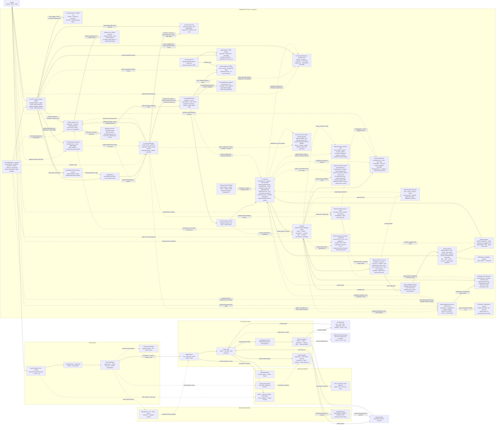

# mini-loop

A compact, inspectable coding-agent harness. The existing FastAPI implementation
lives in `python/`; an independent Go implementation is being built in `go/`.
See the [port plan](GO_PORT_PLAN.md) and [parity matrix](GO_PARITY_MATRIX.md).

mini-loop starts with the `s01` agent loop from
[`learn-claude-code`](./learn-claude-code/) and adds the runtime boundaries a
real multi-session service needs: workspace-scoped tools, session isolation,
permissions, context management, event streaming, observability, and optional
durability. The default path stays narrow; production protections and experimental
orchestration remain explicit choices.

## Read this in layers

| If you want to… | Start here |
|---|---|
| See what the project is | [30-second overview](#30-second-overview) |
| Run it locally | [Quick start](#quick-start) |
| Understand one request | [How one turn works](#how-one-turn-works) |
| Decide what to enable | [Runtime posture](#runtime-posture) |
| Integrate over HTTP or Python | [Use the runtime](#use-the-runtime) |
| Build a domain-specific agent | [Extend the harness](#extend-the-harness) |
| Review the full system | [Architecture](#architecture) |
| Find detailed design evidence | [Documentation map](#documentation-map) |

## 30-second overview

```text
Caller
  └─ SessionManager
       └─ isolated AgentSession (workspace + history + lock)
            ├─ async model ↔ tool loop
            ├─ guarded tool execution
            └─ SSE events + trajectories + optional durable state
```

- **One session, one isolated agent.** History, todos, workspace, runtime state,
  and the run lock are never module-global.
- **Many sessions, one concurrent service.** Sessions make progress in
  parallel; a single conversation remains serial and ordered.
- **One small default, many injectable seams.** Tools, hooks, prompts,
  compaction, model providers, storage, sandboxing, secrets, skills, and event
  sinks are construction-time choices.
- **Evidence is part of the runtime.** REST/SSE status, trajectories, action
  records, audit posture, and optional SQLite state make behavior inspectable.
- **Capability does not imply enablement.** Default-on, default-off,
  process-local, library-only, and durable paths are labeled separately below.

## Quick start

The deterministic fake model exercises the server without an API key or
network call:

```sh
python -m venv .venv
source .venv/bin/activate
pip install -r python/requirements.txt
MINILOOP_FAKE_LLM=1 MINILOOP_FAKE_DELAY=0.3 PYTHONPATH=python python -m mini_loop
```

Open <http://127.0.0.1:8000> in two tabs to watch isolated agents run in
parallel. The browser console shows live events and recorded trajectories; the
generated OpenAPI reference is at <http://127.0.0.1:8000/docs>.

The conversation workspace is at <http://127.0.0.1:8000/ui>: a searchable session
sidebar, a command palette, configurable shortcuts, visited-session navigation,
light/dark themes, expandable tool records, and a session-tools panel
for tasks, team, trajectories, transcript, cron, skills, memory, improvements,
and the fake benchmark. It uses the same REST/SSE and approval boundaries as
the classic console. See [Web UI design and verification](python/mini_loop/webui/README.md).

For a real Anthropic-compatible provider:

```sh
cp python/.env.example .env # set ANTHROPIC_API_KEY, MODEL_ID, and optional base URL
PYTHONPATH=python python -m mini_loop
```

## How one turn works

1. A Python caller or HTTP principal (anonymous on the default loopback server)
   creates or restores a session.
2. `SessionManager` binds the workspace, owner, runtime policy, model client,
   and optional resources before constructing the `Agent`.
3. `AgentSession` serializes that conversation and stamps the request with an
   immutable `RunContext`.
4. `Agent._loop` builds a bounded model request from the pinned tool catalogue,
   skills, memory, compaction state, and runtime facts.
5. Tool calls pass through hooks, monotonic guards, permission/approval, the
   action journal, execution, masking, and result observers before returning to
   the model.
6. The session emits correlated lifecycle events and records the transcript,
   trajectory, and configured durable state.

Concurrency is bounded at two levels. `MINILOOP_MAX_CONCURRENT_LLM` limits
model calls across sessions (default `8`), while
`MINILOOP_MAX_CONCURRENT_TOOLS` limits `parallel_safe` tools (default `8`).
Parallel tool results return in the model's original call order. Shell and
mutation tools remain ordering barriers.

## Runtime posture

The table is the fastest way to distinguish “implemented” from “active here.”

| Capability | Default posture | How it changes |
|---|---|---|
| Async agent loop, workspace tools, session isolation, REST/SSE console | **On** | Core runtime |
| Prompt caching and stuck detection | **On** | Replace or disable through injected policies |
| Local trajectory recording | **On** | `MINILOOP_TRAJECTORIES=0` disables it |
| Comprehensive s09–s20 feature bundle | **Off** | `MINILOOP_FEATURES=all` or `enable_features=True` |
| HTTP authentication | **Off on loopback** | Configure `MINILOOP_API_TOKEN` or `MINILOOP_API_TOKENS`; non-loopback startup without tokens is refused |
| Sandbox, secret registry, SQLite state | **Null boundaries** | Inject/configure the protection needed by the deployment |
| Owner-scoped skills, memory, and personal-skill publication | **Off** | Configure `MINILOOP_USER_RESOURCES_ROOT` and authenticated owners |
| Token-efficiency pipeline and semantic code tools | **Off** | Explicit `shadow`/`enforce` and pinned `ast-outline` settings |
| Guardian approval reviewer | **Off** | `MINILOOP_GUARDIAN=1`; it may approve, deny, or defer, never widen authority |
| Typed decisions: choice, score, and noul | **Off, including the full feature bundle** | `MINILOOP_DECISIONS=llm\|jev` or explicit `install_decisions()`; judgments return data through the existing tool boundary |
| Declarative workflow MVP | **Off, process-local** | Trusted Python construction with `enable_workflows=True` |
| Verified execute → verify → fold loop | **Library-only** | Call `VerifiedLoopService` explicitly; no HTTP/tool surface |

<details>
<summary>Reference curriculum mapping (learn-claude-code s01–s20)</summary>

This is module coverage, not a claim that every module is enabled or that the
default server is production-ready.

| | Mechanism | | Mechanism |
|---|---|---|---|
| s01 | agent loop | s11 | error recovery |
| s02 | bash/read/write/edit/glob | s12 | task system |
| s03 | permissions | s13 | background tasks |
| s04 | lifecycle hooks | s14 | durable cron |
| s05 | TodoWrite | s15–17 | teams, protocols, autonomy |
| s06 | subagents | s18 | task-bound worktrees |
| s07 | agent and owner-scoped skills | s19 | MCP |
| s08 | four-layer compaction | s20 | comprehensive registry |
| s09 | memory lifecycle | s10 | per-call runtime prompt |

```sh
MINILOOP_FAKE_LLM=1 MINILOOP_FEATURES=all PYTHONPATH=python python -m mini_loop
```

</details>

### Before exposing the server

The default is a development harness, not a host-level multi-tenant sandbox.
Before binding beyond loopback:

1. Configure token authentication. `PYTHONPATH=python python -m mini_loop` refuses an open bind
   without it.
2. Run `PYTHONPATH=python python -m mini_loop.audit` locally, or
   `PYTHONPATH=python python -m mini_loop.audit --url http://host:port` against the live server.
3. Choose explicit sandbox, secret-masking, persistence, and retention policy
   for the trust level of the callers.
4. Add OS/container isolation and resource limits when prompts or tools are
   untrusted; workspace path checks alone are not that boundary.

The audit exits non-zero for high or critical findings. See
[the extension guide](./EXTENDING.md) for the concrete `Sandbox`,
`SecretRegistry`, `StateStore`, and authentication seams, and
[hardening notes](docs/HARDENING_NOTES.md) for the evidence behind them.

## Use the runtime

### REST and SSE

The OpenAPI page at `/docs` is the complete route reference. The common route
families are:

| Purpose | Route |
|---|---|
| Health and runtime posture | `GET /healthz` |
| Create or list sessions | `POST /sessions`, `GET /sessions` |
| Inspect or delete one session | `GET /sessions/{id}`, `DELETE /sessions/{id}` |
| Run a turn | `POST /sessions/{id}/messages` |
| Run with live events | `POST /sessions/{id}/messages/stream` |
| Steer, fork, cancel, or change mode | `POST /sessions/{id}/steer`, `/fork`, `/cancel`, `/mode` |
| Inspect transcript, approvals, or events | `GET /sessions/{id}/transcript`, `/approvals`, `/events` |
| Inspect or export trajectories | `GET /sessions/{id}/trajectories`, `GET /trajectories/...` |
| Preview and publish a personal skill | `POST /sessions/{id}/personal-skills/preview`, `/personal-skills/{draft_id}/commit` |

```sh
SID=$(curl -s -XPOST localhost:8000/sessions \
  -H content-type:application/json -d '{}' | jq -r .id)

curl -sN -XPOST localhost:8000/sessions/$SID/messages/stream \
  -H content-type:application/json \
  -d '{"message":"write fib.py, run it, and explain the result"}'
```

Every event carries `seq`, `ts`, `session`, and `type`; agent events also carry
lineage and turn correlation. `Last-Event-ID` supports reconnection.
`assistant_text.phase` is authoritative: `commentary` means the turn continues,
while `final_answer` means the agent is returning. The terminal `done` event is
always `final_answer`. See [Agent trajectories](docs/TRAJECTORIES.md) for the
recording, viewer, export, privacy, and retention model.

Personal-skill publication additionally requires token authentication and an
owner-resource root. Preview is a bounded, masked, short-lived draft; commit
accepts its digest, never overwrites an existing skill, and activates only in a
future independently resolved session. The full contract and examples live in
[Skills and user-scoped knowledge](./EXTENDING.md#5-skills-and-user-scoped-knowledge).

### Python composition

Use the same runtime without the default server, or inject only the seams your
application owns:

```python
import asyncio

from mini_loop import SessionManager, build_client, default_registry, load_settings

async def main():
    settings = load_settings()
    manager = SessionManager(
        settings,
        build_client(settings),
        tool_registry=default_registry(),
    )
    try:
        session = manager.create(owner="local-user")
        answer = await session.run(
            "inspect this repository and summarize its entry points"
        )
        print(answer)
    finally:
        await manager.stop()

asyncio.run(main())
```

See [`examples/custom_agent.py`](python/examples/custom_agent.py) for a composed domain
agent and [EXTENDING.md](./EXTENDING.md) for every injectable interface.

## Extend the harness

The loop itself does not need to change when the surrounding business logic
does:

| Need | Primary seam |
|---|---|
| Add or restrict capabilities | `ToolRegistry`, `ToolCatalogSnapshot`, `RoleToolPolicy` |
| Enforce policy or observe lifecycle | `Hooks`, permission/approval, result observers |
| Change model-visible context | `system_builder`, `Compactor`, skills, memory, token-efficiency stages |
| Change provider behavior | `ModelProvider`, client, transport, recovery |
| Add durability or evidence | `StateStore`, action journal, trajectory store, `event_sink` |
| Isolate tenants and credentials | `Authenticator`, `workspace_factory`, `Sandbox`, `SecretRegistry` |
| Compose the whole policy set | `Harness` |

The [extension guide](./EXTENDING.md) contains the contracts, runnable examples,
concurrency rules, and failure boundaries. Experimental orchestration is kept
separate:

- [Verified loop design](docs/VERIFIED_LOOP_DESIGN.md) documents the explicit,
  library-only execute → verify → fold coordinator and the opt-in Guardian.
- [Dynamic workflow research and implementation boundary](docs/CLAUDE_CODE_DYNAMIC_WORKFLOW_RESEARCH.md)
  documents the default-off, read-only, process-local workflow MVP. It is not
  Claude Code workflow-script compatibility and is not restart-safe.

## Architecture

Runtime review baseline: `3b3a0be` plus legacy workflow payload decoding
and Source-compatible archive/SSE scalar output,
the Python directory split, its
package-relative default skills path, and the Go typed loop, execution gate
and workspace files, bounded glob search, todo/skill/question handlers, typed
model requests, token metering, four-layer context compaction and typed subagent
execution with run provenance, action replay and typed journal transitions,
a bound approval broker with session grants and textual questions, and optional
registered-secret masking across the implemented Go result/recording paths,
and a real foreground workspace shell with typed results, group cancellation
and bounded capture, plus default cache annotations and bounded stuck detection, core lifecycle
telemetry, bounded subscriptions and managed turn admission/cancellation,
plus typed prompt hooks/injectors, Todo reminders and shared model/tool pools
with ordered parallel groups, and process-local fleet composition, owner-scoped
lookup, workspace policy and draining deletion/shutdown, plus typed HTTP authentication,
REST admission, idempotency/rate bounds and SSE projection, plus bounded steering,
live permission modes and owned HTTP wakeup, plus completed-boundary conversation
forks with fresh scratch workspaces and typed lineage, plus an explicit direct
Anthropic-compatible HTTP adapter and bounded SDK retries, plus typed SSE assembly,
provisional stream progress and shown-text interruption repair, plus typed default
Agent recovery with retries, escalation, continuation, reactive shrink and fallback,
plus captured stream-progress settings and stateful signed fake-model calls,
plus typed environment settings, embedded default skills and a standalone HTTP launcher,
plus a typed private spill store and masked string-Bash preservation,
plus default per-run trajectory JSONL recording and owner-scoped list/inspect/export,
plus the typed HTML ledger, filtered record visitor and independent traceview CLI,
plus the embedded public development console and full browser shell,
plus an optional typed persistent task graph and owned task-board HTTP view,
plus the operator library worktree lifecycle and task binding,
plus five explicitly installed worktree tools and serialized execution workspace
switching with retained lifecycle cleanup ownership, plus an explicit typed
managed-worktree factory with source directory-cleanup semantics, plus a typed
operator background-command service with merged byte capture and orphan records,
plus two explicitly enabled background tools, conditional Bash dispatch, bounded
completion injection, interruption survivor markers and manager-owned close/join
with independent startup selection, plus selected child scopes retained for
lifetime cleanup with independent qualified IDs and completion queues,
plus an explicitly bound typed cron operator scheduler with masked persistence,
disarmed restoration, exclusive minute claims and cancellation/join,
plus manager-owned cron with fresh untrusted turns, owner-scoped operations,
delete/stop joins and standalone startup, plus three explicit cron model tools,
four owned cron HTTP operations and individual launcher selection,
plus concrete schema-v7 state contracts and archival event decoding,
plus optional injected session state, request guards and confirmed lease-loss cancellation,
plus explicit injected-store manager restoration, lease-gated approval expiry and crash-tail repair,
plus lazy stable-identity cron restoration with bound/factory workspace selection,
plus owner-scoped bounded event-store SSE catch-up with distinct ordinal/sequence types,
plus configured-store transcript epoch reads with concrete historical snapshots,
plus explicit typed plan-mode tools, review callbacks and log-folded prompt guidance,
plus explicit typed goal tools, CAS snapshots, bounded default stop continuation
and disarmed log restoration,
reviewed **2026-10-08** (Go baseline `640aace` plus typed workflow tool inputs and journal contracts;
remaining route groups and runtime-profile differences remain explicit).
The optional `decision` tool evaluates explicit state through a configured
provider; its typed result returns through
the existing permission, tool-result, and event boundaries.

<!-- architecture-map:start -->

```mermaid
flowchart LR
    Caller["Callers<br/>Python · REST · SSE"]

    subgraph Control["Control plane"]
        Entry["Python FastAPI / CLI / console<br/>python/mini_loop/server.py · __main__.py"]
        Trust["Authentication + ownership<br/>auth.py · RunContext"]
        Manager["SessionManager<br/>composition · scoped resources · shared semaphores"]
        Drafts["Personal-skill drafts<br/>sanitized preview · TTL · process-local"]
        Entry --> Trust --> Manager
    end

    subgraph Runtime["Per-session runtime"]
        Session["AgentSession<br/>lock · transcript · event stream · lease"]
        Agent["Agent._loop<br/>model ↔ tool loop · stop semantics"]
        Context["Context pipeline<br/>agent skills · owner skills / memory<br/>compaction · cache · metering · token efficiency"]
        Catalog["Immutable tool view<br/>ToolCatalogSnapshot · RoleToolPolicy"]
        Gate["Execution pipeline<br/>before → guard → permission → execute<br/>after → result observers"]

        Session --> Agent
        Agent -->|build bounded request| Context
        Agent -->|ordered ToolCall batch| Catalog --> Gate
    end

    Provider["Model provider<br/>streaming transport · recovery"]
    Backends["Tool backends<br/>files · shell · AST · diagnostics · MCP<br/>sandbox · secrets · spill"]
    Decisions["Optional DecisionProvider<br/>Jev API or explicit LLM estimates<br/>choice · score · noul"]

    subgraph Async["Optional orchestration"]
        Coordination["Background · cron · tasks · teams<br/>worktrees · subagent provider"]
        Workflow["WorkflowService<br/>fixed AGENT / VERIFY / REDUCE DAG<br/>read-only fresh workers"]
    end

    subgraph Evidence["State and evidence"]
        State["SQLiteStateStore<br/>session epochs · events · leases"]
        Resources["Owner resource files<br/>user skills · Markdown memory"]
        Journal["Action / approval / goal / plan logs<br/>replay · CAS · recovery state"]
        Trace["Events · trajectory JSONL · trace viewer<br/>audit · problems · runtime posture"]
    end

    subgraph GoPort["Independent Go port · in progress"]
        GoTeams["Go team protocols<br/>bounded mailbox / 200 handshakes<br/>owned GET / injection / idle turns"]
        GoImprovement["Go improvement / verified core<br/>lineage · verified Git proposals<br/>live GET / owned proposal POST"]
        GoSelfAudit["Go self-audit observer / snapshot core<br/>activity · problems · trajectories · skill usage<br/>suggestions · inadmissible task drafts"]
        GoBenchmarkLibrary["Go benchmark instrument<br/>admitted tasks · setup · effect judges<br/>typed statistics · conservative paired verdict"]
        GoLaunch["Go cmd/miniloop · launcher<br/>typed settings · workflow / decision / memory selection · bind guard<br/>listener ownership · signal shutdown"]
        GoEntry["Go HTTP / SSE / browser handler<br/>bounded ingress · typed JSON / event projection<br/>owned catalogue / memory / drafts · typed admission"]
        GoTrust["Authenticator<br/>one admitted principal · owner-scoped routes"]
        GoProvider["Model providers<br/>Stateful signed fake · direct Anthropic-compatible HTTP<br/>typed replies · SSE · usage · SDK retries"]
        GoDecisionLibrary["Optional decision providers · default off<br/>closed choice / score / noul judgments<br/>masked state + result projections · fixed Jev HTTP<br/>isolated current-LLM query · shared model pool"]
        GoManager["Go SessionManager<br/>owner lookup · resource snapshots / default scoped memory<br/>workspace policy · delete / stop drain"]
        GoManaged["Go ManagedSession<br/>admission · active cancellation · status / done<br/>completed fork history · lineage · stored epoch reads"]
        GoControls["Owned session controls<br/>bounded steering · live mode · posture notes"]
        GoSession["Go Session<br/>prompt hooks · injectors · Todo reminder<br/>ordered parallel groups · inherited pools · events<br/>configured coalescing · interrupted text<br/>DefaultRecovery · live / side history ownership<br/>default goal stop · bounded continuation<br/>optional writable memory capture"]
        GoContext["Context pipeline<br/>fitted schemas · skills · cache · token meter<br/>pinned layers · optional memory selection/index / team inbox<br/>spill → snip → micro → summary · optional plan guidance"]
        GoBrowser["Embedded Python browser sources<br/>public console / ui shell<br/>authenticated data requests"]
        GoTraceCLI["Go traceview CLI<br/>operator-selected export / stored runs<br/>private standalone HTML"]
        GoTraceView["Typed ledger / HTML renderer<br/>span fold · nested rows · real timing<br/>escaped inspectors · embedded CSS / filter JS"]
        GoTraces["Private trajectory JSONL<br/>per-run owner · masked full fields<br/>append-only files · no session restore"]
        GoArchives["Workspace compaction artifacts<br/>.task_outputs · .transcripts"]
        GoActions["Optional journal / session state<br/>typed replay · epochs · events · restore<br/>in-memory diagnostic snapshot · injected backend; SQLite pending"]
        GoSecrets["Optional Secret Registry<br/>named lookup · cached values · masked copies<br/>typed environment selection API"]
        GoApprovals["Optional approval broker<br/>park · resolve · timeout · cancel<br/>session grants · reviewer · typed store seam · diagnostic snapshot"]
        GoGate["ToolGate<br/>optional pinned catalogue subset<br/>before → guard → permission → execute<br/>after → observer<br/>text refusals · fault flags"]
        GoBash["Workspace shell.Executor<br/>process groups · deadline · shared capture<br/>selected environment · masked typed result<br/>spill.Store: string preservation only"]
        GoFiles["Filesystem libraries<br/>workspace read · write · edit · glob<br/>bound path · anchored create / prepared catalogues<br/>skill publication · snapshots · memory lifecycle lock"]
        GoBackground["Explicit background service / runtime tools<br/>typed tasks · independent contexts / groups<br/>merged byte capture · results · orphan ledger"]
        GoBgLedger["Workspace .background records<br/>masked command · pid · start time<br/>orphan report; no process/session restore"]
        GoBackground -->|shared argv / environment / group control| GoBash
        GoBackground -->|atomic best-effort in-flight files| GoBgLedger
        GoGate -. optional background tools / Bash dispatch .-> GoBackground
        GoBackground -. bounded completion / live interruption count .-> GoSession
        GoManager -. delete / stop after turn drain: cancel and join .-> GoBackground
        GoLaunch -. explicit background-tools flag .-> GoBackground
        GoChildren -. selected background tools: separate scopes / queues .-> GoBackground
        GoCron["Explicit operator cron<br/>typed jobs · five fields · disarmed restore<br/>per-session controls · ticker / run cancellation"]
        GoCronStore["Operator cron JSON / claim files<br/>masked prompts · mark before dispatch<br/>exclusive minute claim; no external transaction"]
        GoCronRunner["Managed resolver / scheduled runner<br/>fresh untrusted ManagedSession.Run<br/>live reuse / injected-store restore"]
        GoManager -->|default ownership / owner-scoped operations| GoCron
        GoLaunch -. Serve starts disarmed restored jobs .-> GoCron
        GoManager -. revoke turns then stop / join .-> GoCron
        GoGate -. optional three cron tools; no model arm .-> GoCron
        GoEntry -->|owner-scoped list / schedule / cancel / arm| GoCron
        GoLaunch -. explicit cron-tools selection .-> GoGate
        GoCron -->|atomic persisted mark / O_EXCL claim| GoCronStore
        GoCron -->|only after occurrence admission| GoCronRunner
        GoCronRunner -->|fresh untrusted serialized turn| GoManaged
        GoCronRunner -. stable identity lookup / restore .-> GoManager
        GoWorktrees["Explicit worktree service / tools<br/>Git create / keep / inspect / safe remove<br/>task binding · audit · exclusive enter"]
        GoDraftLibrary["Go userresources draft / preview libraries<br/>typed candidate / two-attempt model seam<br/>explicit standalone Session adapter<br/>owner + session + digest · operator create-only publication"]
        GoSkillCapture["Go admitted-turn evidence<br/>process-local · 64 messages / 40k characters<br/>mask before budget · sticky screening failure"]
        GoWorkflow["Optional manager-owned WorkflowService<br/>trusted launch / manage · shared worker pools<br/>process-local DAG / outbox · cancel / join<br/>18 observation kinds · scoped summaries<br/>archival scalars / SSE · authenticated HTTP launch · owned reads / cancel"]
        GoGate -. explicit-human workflow tools .-> GoWorkflow
        GoWorkflow -. events / summaries / later-turn results .-> GoSession
        GoResources["Bound session resources<br/>TodoWrite · load_skill · ask_user · compress · task<br/>optional task / plan / goal / team / workflow tools · goal CAS snapshots<br/>snapshot · digest check · deferred summary"]
        GoChildren["Fresh subagent sessions<br/>capability-selected tools · peer RunContext<br/>inherited seams / pools · fresh counters"]
        GoLaunch --> GoEntry --> GoTrust --> GoManager
        GoEntry -->|public static documents| GoBrowser
        GoBrowser -->|authenticated API / SSE| GoTrust
        GoLaunch -. construct / stop .-> GoManager
        GoManager -. explicit typed workspace factory .-> GoWorktrees
        GoManager -->|create / fork / restore · owned teammate idle turns · bind owner resources| GoManaged --> GoControls --> GoSession
        GoControls -. mode at permission evaluation .-> GoGate
        GoSession --> GoContext --> GoProvider
        GoProvider --> GoSession
        GoContext --> GoArchives
        GoManaged -->|start / ordered capture / finish| GoTraces
        GoManaged -->|successful terminal flush + capture capability| GoSkillCapture
        GoEntry -. owner-scoped list / inspect / export .-> GoTraces
        GoEntry -->|owned bounded document| GoTraceView
        GoTraceCLI -->|operator read| GoTraces
        GoTraceCLI --> GoTraceView
        GoSession -->|parallel groups / barriers| GoGate --> GoBash
        GoGate --> GoFiles
        GoManager -. owner / admission / lease / preview + commit .-> GoDraftLibrary
        GoSession -. standalone non-live preview .-> GoDraftLibrary
        GoSession -. writable auto-memory lifecycle .-> GoFiles
        GoGate --> GoResources
        GoGate -. explicit external-risk decision tool .-> GoDecisionLibrary
        GoDecisionLibrary -. isolated complete-only query .-> GoProvider
        GoGate -. optional five model tools .-> GoWorktrees
        GoWorktrees -. serialized files / shell / sandbox scope .-> GoFiles
        GoWorktrees -. prepare before publishing execution scope .-> GoBash
        GoSession -. injected state / leases / restore / catch-up / epochs .-> GoActions
        GoGate -. replay / reconcile / settle .-> GoActions
        GoGate -. permission ask .-> GoApprovals
        GoResources -. textual question .-> GoApprovals
        GoApprovals -. scoped approval events .-> GoSession
        GoSecrets -. bind gate / context / recording / shell .-> GoSession
        GoResources -->|task / depth gate| GoChildren
        GoChildren --> GoContext
        GoChildren -->|selected tools| GoGate
        GoChildren -. scoped events .-> GoSession
    end

    Caller --> Entry
    Caller --> GoEntry
    GoEntry -->|GET lineage / POST proposal; bound owner| GoImprovement
    GoManager -->|fixed bus / protocols; owned idle loop / inbox / task claims| GoTeams
    GoEntry -->|owned team GET; peek latest 50| GoTeams
    GoManaged -. explicit verified task / proposal admission .-> GoSession
    Caller -. explicit typed observations .-> GoSelfAudit
    GoManaged -. owner admission before diagnostic / recording IO .-> GoSelfAudit
    GoEntry -->|report / suggestions / drafts; admitted owner scope| GoSelfAudit
    GoSession -. optional self_audit via ToolGate; trusted view .-> GoSelfAudit
    Caller -. supplied results / transcripts .-> GoBenchmarkLibrary
    GoEntry -->|authenticated fake-only comparison / rate budget| GoBenchmarkLibrary
    GoBenchmarkLibrary -. explicit operator arm create / run / stop .-> GoManager
    Caller -. operator owner directory binding .-> GoFiles
    Caller -. explicit operator evaluation .-> GoDecisionLibrary
    Caller -. explicit library selection .-> GoWorktrees
    Caller -. operator-owned background commands .-> GoBackground
    GoWorktrees -. pinned task files; execution scope switch .-> GoResources
    Manager -->|bind owner · create / restore / route| Session
    Manager -. preview current session .-> Drafts
    Manager -. explicit digest commit .-> Resources
    Resources -. new-session snapshot .-> Context
    Context -->|model request| Provider
    Provider -->|text / tool_use| Agent
    Gate -->|guarded dispatch| Backends
    Backends -->|masked result| Agent
    Gate -. approved typed query .-> Decisions
    Decisions -. typed result; no action .-> Agent

    Manager -. owns shared services .-> Coordination
    Coordination -. bounded next-turn injection .-> Session
    Gate -. explicit-human launch / manage .-> Workflow
    Workflow -. process-local read-only workers .-> Provider

    Session -->|persist transcript + cursor| State
    Gate -->|record action outcome| Journal
    Agent -->|emit spans + lifecycle| Trace
    Entry -. SSE / inspect / trace view .-> Trace
```
<!-- architecture-map:end -->

The main diagram describes the current Python runtime under `python/`. The
separate Go subgraph is a process-local port in progress with an embeddable
HTTP handler and a standalone `go/cmd/miniloop` launcher. It runs independently
of Python, embeds the default code-review skill, and owns listening and shutdown.
Default trajectory files are enabled and private spill storage is best-effort;
configured but unavailable optional features refuse activation. It reads an environment
snapshot without `.env` discovery, uses typed settings, and checks both the requested
host and actual listener before admitting unauthenticated traffic. `--dump-config`
reports redacted settings/availability without creating a runtime or probing a model;
it is not the full Python effective-posture report. See
[Go startup](go/README.md#run-the-standalone-http-server).
Explicit `RuntimeConfig.PlanModeTools` / `ManagerServices.PlanModeTools` add
`enter_plan_mode` and `exit_plan_mode` through the same execution gate. Both
stay registered while inactive and remain exclusive read-risk tools. A whole
boolean `plan_mode` event records every successful call, including repeated
entry; restore folds the log's last value. The default system builder adds soft
planning guidance, while custom builders receive `SystemContext.PlanMode` and
choose their own prompt. Sandbox/permission modes remain independent. Optional
`PlanApprover` receives typed plan text and bound caller authority; rejection,
fault or cancellation retains planning. Nil uses Python's headless auto-approval.
Inactive/invalid/rejected plan results keep source error text with failed=false;
callback/hook faults set failed=true. Journal settlement, observers, events and
stuck steps preserve that distinction. Model result blocks omit is_error.
`--plan-mode-tools` selects this individual service; no human approval UI is
implied by that flag. Forks start inactive. Selected child handlers own fresh
state; default role profiles omit these capability-free tools. Stored-event SSE
and trajectories carry the boolean event, and injected-store restore reloads it
without starting a turn or recovering reviewer authority. Native SQL restart and
the combined feature bundle remain open.
See [Go plan mode](go/README.md#plan-mode-tools-and-logged-guidance).

The five Go goal tools are individually selected by `GoalTools` or `--goal-tools`.
Create/resume require caller-stamped explicit human provenance; authenticated
HTTP, cron and peer turns do not provide it. Complete/block use revision CAS.
The default stateless `GoalContinuation` stop hook requests bounded continuation
and blocks at the cap. An explicit StopHooks list replaces it; an empty list
turns the consumer off. Goal records are per-session facts, with detached owned
`GET /sessions/{id}/goal` projection. Concrete `goal_change` snapshots reach
capture/trajectory/SSE; restore folds them but always disarms. Forks and selected
children start fresh. No native SQLite durability is implied by injected-store
restoration. See [Go goals](go/README.md#goal-tools-and-bounded-continuation).

`go/decisions` now provides named Request/Result/Question/Answer/TokenUsage and
an explicit Provider seam. State and descriptions use six closed JSON variants;
choice distributions, probability-weighted score rubrics and noul probabilities
are validated without changing the provider's answer. Jev uses the source fixed
URL, disables redirects, bounds the full call including retry waits, and retains
the actual served model and usage. Construction performs no network request.
The operator library remains available independently. Explicit RuntimeConfig or
ManagerServices DecisionTools now binds the external-risk tool through the common
gate; provider injection alone does not activate it. Both backends receive masked,
revalidated explicit state and share model limits. The LLM child uses a fresh
complete-only query with no parent history/tools/cache/stream/meter, shared recovery
and isolated fallback. Typed metadata reaches existing event sinks; full masked
input is private trajectory evidence. Default-off, readonly and approval guards
remain authoritative during replay. The interactive map aggregates bound decision
handlers in Session Resources and transports in Go providers; its Go-path card
explains the isolated query. The Go launcher now accepts MINILOOP_DECISIONS=llm
or jev, retaining explicit backend precedence and credential-free inspection.
Source snapshots cover large-result retention and cooperative cancellation.
Go additionally masks the closed result before escaping to prevent encoded
backend model values from leaking through output/journal/recording sinks.
Native SQL restart and live-provider audit remain pending. See [Go decisions](go/README.md#typed-decision-operator-library).

`go/userresources` now separates user-authored skill fields from agent skills.
Its pure typed constructor validates and normalizes canonical SKILL.md content;
owner directory keys hash exact trusted identifiers without trimming or folding.
An explicit DirectoryResolver now pins the configured physical root, creates
private 0700 digest/skills/memory directories, refuses pre-planted child links and
caches immutable exact-owner bindings. It is an operator filesystem library,
aggregated with filesystem backends in the interactive map. Optional launcher
configuration and authenticated capture/publication are implemented below.
`skills.NewLayeredCatalog` now provides explicit agent/user provenance, collision
refusal, a shared prompt budget and source-owned serve-time verification; it is
available through explicit owner-bound RuntimeConfig and ManagerServices snapshots.
`go/memory` now provides typed Markdown Store/ScopedStore libraries: exact owner
keys, scoped replacement, lexical search, lazy index/cache and secret masking.
Explicit `RuntimeConfig.MemoryTools` now installs typed `remember`/`recall` through
the common permission gate. Runtime construction requires a matching scoped store
or uses the admitted owner resource bundle; `ManagerServices.MemoryTools` selects
these tools with an explicit resolver. Model inputs contain no owner/root.
Selected children retain the bound store, and read-only mode denies writes.
Explicit remember acquires the Store-owned process-local lifecycle lock; scoped
bindings of the same Store share it. Waiting is cancellable. Ordinary scoped
operations use a separate lock, allowing extraction/consolidation to hold
the lifecycle across multiple operations. This is neither rollback nor external
process fencing; independent Store instances do not share the lock.
With both tools selected, automatic memory selection now uses a 200-token side
request, falling back to lexical search. It injects selected provenance blocks
after prompt rewriting and before the user message is appended. The side request
uses normal model/recovery/limiter/cache/event flow without changing the live token
meter. An explicit false MemoryAuto disables selection; its value is detached.
The dynamic index appears only with recall, and is appended only when it changes.
The extraction stage now cleans recalled contexts, runtime facts and tool-result
bodies, sends the source 40,000-character JSON tail, and writes at most five
owner-bound auto_extracted records incrementally. Its normal agent_turn side
request uses recovery/cache/transport/events without taking live history or token
meter ownership. Automatic capture now holds the lifecycle across extraction
and consolidation on a normal final answer, a stop-hook continuation stuck halt,
and round exhaustion. Read-only mode, MemoryAuto=false or a missing tool pair
skip it. Provider-error and cancellation exits initiate no capture. The source's
tool-batch stuck halt has no capture call; Go preserves this measured omission.
At ten owner memories, a 2,500-token memory_consolidation side request replaces
only the bound owner's records, retaining unchanged origins and marking changed
facts consolidated. Ordinary capture failures emit a bounded masked
memory_capture_error and preserve the completed result; cancellation and native
transcript/lease failures propagate. Typed memory/extract counts and capture
errors support detached access and archival reads without granting authority.
Default tools and launcher activation remain unchanged. Root configuration
remains pending; carrying a bundle alone installs no tools.
`userresources.NewResolver` now composes exact-owner directory, layered skill and
bound memory snapshots, caching only complete bindings. Its operator problem
view preserves owner-local logs and skips shared deployment diagnostics.
Explicit ManagerServices.UserResources now resolves trusted owners before
create/fork/restore session construction; RuntimeConfig.UserResources validates a
complete matching owner bundle before filesystem effects. Sessions and selected
children keep their fixed catalogue and scoped memory binding; forks resolve the
latest cache. The nil default keeps legacy skills. Launcher activation remains pending. Operator-only publication is implemented.
`go/durable` adds the publication prerequisite: component-wise no-follow directory
opens, bounded regular-file reads and fsynced create-only hard links. The hard link
is the commit point; post-commit cleanup cannot turn success into a retryable error.
`Catalog.WithSourceDocument` prepares a detached, path-ordered snapshot without
filesystem effects, using the normal parser and retaining full source verification.
It refuses name/path collisions and carries an independent bounded diagnostic log.
`Resolver.PublishSkill` composes canonical validation, raw-field secret screening
and health checks, fresh disk collision checks, bounded no-follow idempotent
verification, prepared receipts/catalogues and create-only files. Successful
publication replaces only the resolver cache for future resolutions, preserving
live snapshots and the bound memory service. It remains an operator library.
Typed process-local draft storage, model preview, admitted-turn projection and
owned HTTP skill routes are implemented below; launcher
memory roots and independent selection are implemented. Custom maskers without a typed registration surface fail closed.

`go/background` is an explicit operator library; native runtime sessions can
select `RuntimeConfig.BackgroundTools`. Typed task IDs/statuses,
independent contexts and native process groups let admitted commands outlive the
caller turn. It shares shell argv, credential scrubbing/injection, masking and
bounded cleanup with foreground execution, while merging stdout/stderr and
counting raw bytes. The default capture is five million bytes; rendering keeps
the tail at 50,000 characters and names overflow/nonzero exit. Foreground
Interrupt excludes background groups. CancelAll requests cancellation and returns
joinable handles; Close cancels and joins the current handles;
Close requires caller-owned admission quiescence and permits later Run.
The workspace `.background` ledger masks commands before atomic best-effort
writes. A new manager reports orphan outcome/PID liveness without re-running or
signalling the PID. It is evidence, not session/process recovery or ownership.
Full results retain 100 completions, listings and notification projections keep
the newest 50; metadata and undrained notifications still grow like Python.
Rebind prepares future cwd/sandbox together; admitted tasks stay pinned and the
ledger retains its original root. Go cleans cancellation even before process
start, where actual Python can leave running metadata and an orphan record.
Two optional tools use the common gate and exact typed inputs, including null
identity and shell approval prefixes. Enabled Bash can enqueue explicit/heuristic
background work; foreground Bash keeps structured results. Per-session lazy state
delivers the newest 50 completion messages and a typed background_result event
before model requests; interruption markers name live survivors. Workspace entry
publishes a prepared background executor with the other bindings. ManagerServices
can explicitly enable the feature for fresh sessions and forks. Delete/stop close
and join created task ownership after the active turn drains, before workspace
reclamation; an idle background owner is cleaned asynchronously. The startup
`--background-tools` flag selects this service independently of the still
unsupported comprehensive MINILOOP_FEATURES bundle. Explicit role selection of
background tools gives a child independent task state and a qualified ID prefix;
the parent retains its scope for recursive lifetime cancellation/join after the
child returns. Queues and checks remain local to each scope. The root adopts
existing evidence before admitting children; a child never adopts the live
parent's ledger. Default roles keep foreground Bash and omit these tools.
Root restart adoption reports qualified child records without controlling their
PIDs. This adds guards around an actual source gap: inherited source injectors
can orphan a live parent's record, and child return has no automatic service
close. No host lease or cross-process/shared-session ledger arbitration is
claimed. Bare library callers quiesce admission before CloseBackground; retained
child metadata/queues are not globally bounded. Default tools remain ten.
See [background library](go/README.md#operator-background-commands).
`go/cron` is an explicit operator library: named job/session IDs, five-field
matching, per-session cancel/arm, masked atomic files and exclusive minute claims.
Restored jobs stay disarmed until an operator authorizes them in this process;
activation is never persisted. Occurrence marks and one-shot removal are saved
before dispatch, so save/claim failures report lost work and never dispatch it.
The manager owns a scheduler by default, matching Python, and resolves live
sessions into fresh untrusted ManagedSession.Run turns without retaining the
scheduling caller's actor or grants. Owner-scoped library operations hide foreign
sessions/jobs. Delete removes future jobs before scratch cleanup; stop revokes
turn admission, drains sessions, then cancels/joins cron. Standalone Serve starts
loaded jobs without arming them. Explicit CronTools / --cron-tools installs
schedule_cron, list_crons and cancel_cron through the common gate. Arm is confined
to the owned operator HTTP/library surface. Four HTTP operations work independently
of model-tool activation; fork retains activation with fresh jobs, while selected
children report unconfigured. Durable session restore remains pending.
Raw operator Start remains explicit. Independent live
writers still hold stale whole-file state; claim files do not transact with external effects or prove
exactly-once execution. See [cron library](go/README.md#operator-cron-scheduler).
`go/worktrees` is an explicitly selected library service: named records and
task binding, Git status/ahead checks plus Git's independent refusal, and local
JSONL audit events. Factory failures can return plain directories, matching Python;
that fallback is not a Git branch. `agent.NewWorktreeWorkspaceFactory(service)`
explicitly adapts this service to `ManagerConfig.WorkspaceFactory`, without
installing model tools. Factory paths are scratch, matching Python: ordinary
delete removes even dirty directories after draining/shared-reference checks,
but leaves Git registration and branches. Stop and `PreserveWorkspace` retain
them. An explicitly supplied `CreateSessionRequest.Workspace` instead passes
owned/bindable admission and remains after deletion. The model/operator service
Remove API has independent dirty/ahead and native Git guards; manager directory
cleanup does not call it. This is an actual Python cleanup gap, not a pending
source Git-aware reclaimer.
`RuntimeConfig.WorktreeTools` / `ManagerServices.WorktreeTools` installs five typed
model tools through the common risk/permission gate. `enter_worktree` is an
exclusive barrier even with a custom execution classifier: it prepares files,
shell/sandbox, approval/question surfaces and the replacement catalogue before
publishing execution scope. Later model context, hooks, tools and fresh children
use that scope. Manager Info, task HTTP roots, trajectory attribution and scratch
cleanup retain the original lifecycle workspace, so deletion preserves entered
work. Initialized task boards remain pinned; lazy first admission after entry
uses the new root. Fresh in-process children bind current files/shell but start
without the parent worktree service/task board; selected worktree tools report
unconfigured. The default system builder follows SystemContext; supplied fixed
prompts retain their source contract. Built-in shell rebinding retains secrets, spill, deadlines,
capture and interrupt ownership; custom executors require an explicit workspace
factory. Comprehensive feature activation remains pending. Go additionally
reclaims unpublished scratch on construction failure; with a Git factory this
removes the directory while leaving registration and branch, unlike Python
create, which leaves the allocation. Audit append is not a transaction with
Git/task binding or a host ownership/lease boundary.
The solid Python path is one ordinary turn; dotted paths are
optional or asynchronous.
The Python default agent skills now resolve from `python/skills/` regardless
of the current working directory; `MINILOOP_SKILLS_DIR` still overrides it.
The Go port types all ten Python default tool inputs, but its immutable
workspace catalogue registers `bash`, `read_file`, `write_file`, `edit_file`
and `glob` through `NewWorkspaceSession`; the older `NewSession` convenience constructor
still registers Bash only. File effects bind one resolved workspace and check
paths at execution; write permissions use the same resolver. This file boundary
does not provide OS shell confinement. Glob preserves Python filename matching,
filters resolved results to the workspace and budgets enumeration before sorting
and deduplication; it supports cancellation and bounds open directory handles.
`NewRuntimeSession` adds `TodoWrite`, `load_skill` and `ask_user` through that
same gate, with state bound to its session and owner. It uses explicit skill
and textual-question interfaces; a nil skill source is an empty catalogue,
and a nil question surface reports unavailability. The deployment skill loader
snapshots bounded bodies and descriptions and verifies the normalized source
hash at load time. User-scoped skill layering remains pending. Todo, stop and stuck
events, model/tool spans, text phases, activity labels, compaction receipts, approval
events and scoped child events share a typed, sequenced 200-event backlog. Bounded
subscriptions retain the newest 2,000 live events; late replay excludes ephemeral
deltas. `EventsAfter` returns only the available in-memory suffix. HTTP/SSE replays
that bounded suffix; durable cursor gap recovery remains pending.
`RuntimeConfig.EventSink` receives
detached, masked records in publication order; failures become bounded diagnostics
and do not abort the turn. A slow synchronous sink can delay the emitter. Sinks may
inspect `ManagedSession.Info`, event snapshots or subscriptions, but must not
recursively emit or call the blocking `Messages` accessor during a run. Model requests consume one fitted,
immutable schema snapshot and the deployment skill descriptions. Provider usage
anchors the token meter; unrelated summary calls do not change that anchor.
Workspace-backed sessions use the four-layer compactor, which writes bounded
tool-result previews and full transcript archives inside the bound workspace
before generating a summary. Empty or failed summaries preserve the transcript.
`NewRuntimeSession` also registers `compress`; it crosses
the write-risk gate and defers the summary until the whole tool batch is paired.
The Bash-only constructor uses in-memory snip/micro for an unbound injected
executor; a real workspace-bound executor selects the workspace compactor. Internal automatic compaction can write workspace artifacts
even with a readonly tool mode, matching the Python ordinary-agent path; a
read-only worker must explicitly select `InMemoryCompactor`. Default cache
annotation projects at most four ephemeral breakpoints into a detached wire
request, including summary calls; raw transcript blocks retain no cache fields.
The system prefix takes one slot, with eligible user blocks selected at the
Python stride. `RuntimeConfig.CachePolicy` can select `NullCachePolicy` or a
custom typed policy. The fake counts annotated wire payloads and enforces the
four-point ceiling; real provider reuse and savings have not been verified.
Existing system block-list input and user-resource prompt sections remain
pending. Optional
`RuntimeConfig.Secrets` binds a typed registry to the gate, compactor, event
backlog and approval surface. Tool results are masked after post hooks and
before journal settlement, observers and model results; raw executed arguments
and live model-call history retain their original values. Deployment masking
remains off by default. Registered values resolve lazily and stay cached until
explicit re-registration; failed lookups retry after 60 seconds and unresolved
or short values are reportable. Matching includes interleaved ANSI controls,
Unicode characters and longest values first. JSON recording projections mask
strings and keys before final escaping, with bounded size/depth and last-value
key collision semantics. Default compaction masks spill files, archives and
summaries; fresh children retain the same registry. Typed environment APIs
scrub registered names and select only names mentioned by the command. The
real `go/shell.Executor` consumes this environment before spawning `/bin/sh` in
its bound workspace. `RuntimeConfig.Secrets` creates a credential-scoped executor
copy; copies retain the shared explicit interrupt tracker. Full captured streams
are masked before rendering/truncation, including credentials split across pipes.
The shared capture budget is 5,000,000 decoded characters, preserving Python's
existing "bytes" notice; stdout and stderr retain their own channels otherwise.
A 120-second default deadline covers process exit and pipe EOF. Cancellation,
timeout and overflow kill the new process group; bounded repeat signals cover
a child joining during a concurrent fork, including explicit interruption.
Cleanup closes pipe readers
after a further bounded five seconds if a detached child still holds them.
A descendant that deliberately starts a new session is outside that group and
is not reclaimed by group cancellation. The gate preserves structured failure
and detached exit/timeout/overflow/duration metadata for observers; replays
retain stored text without inventing fresh process metadata. Legacy injected
string executors remain supported. Host execution is the default: workspace
cwd and the typo blocklist do not provide shell confinement. A typed rebinding
Sandbox argv seam is implemented, but no Go Seatbelt backend ships yet.
Runtime process tests ran on macOS; Linux process-group code has not been run
on a Linux host, and other platforms reject executor construction. Typed HTTP JSON
and SSE data now use the optional recording projection; durable-storage
and optional-feature sink coverage remains pending. The explicit `go/provider.Client`
sends typed Anthropic-compatible requests over HTTP, retaining cache annotations,
served-model identity, signed thinking and default-tool input variants. HTTP retries
match the pinned Python SDK 0.107.1: two retries, selected status codes, retry override
headers and bounded SDK backoff/Retry-After rules. Request and reply bytes are capped,
contexts own calls/waits, redirects are refused, and diagnostics scrub the configured
API key. The adapter never discovers credentials; the launcher explicitly passes
its validated environment settings. This
adapter supplies SDK-level retry; the session now applies separate default Agent
recovery: at most ten transient retries, bounded outer waits, token escalation,
whole-answer continuation, one reactive shrink and optional fallback model. Backoff
waits release shared model permits. Context overflow retries only after request
shrink, and mirrors paired live history explicitly. Fallback selection persists
per session; children inherit the policy with fresh fallback state. Explicit `provider.NewStreaming` adds bounded
SSE assembly and validates text, signed thinking and complete tool JSON before
returning a final reply. Per-session `StreamingProvider` progress defaults to coalescing at
200 Unicode characters or 200 ms on fragment arrival. Explicit captured
`StreamProgressConfig` thresholds propagate through manager/fork/child construction;
zero or negative values flush every nonempty fragment. Clock callbacks must be
concurrency-safe when shared. A fake client owns an atomic message-ID sequence,
prepends signed thinking by default, and exposes an explicit streaming view that
lifts the direct ceiling. Thinking, responder, delay and ceiling settings are typed
and explicit; the standalone launcher captures `MINILOOP_FAKE_DELAY` and passes
it at fake-client construction. Fresh ephemeral stream IDs correlate
provisional commentary with authoritative final/commentary events; progress never
replays. Only shown answer text is preserved on managed cancellation, and successful
streams clear partial state, including internal summaries. Body drops surface to
Agent recovery as a fresh generation, whose stream_start supersedes prior progress. Nonempty citation/search/server-tool
blocks and their typed payloads remain unsupported; nullable SDK text citation
metadata is omitted. Production endpoint/cache savings are unverified.
The Go session uses one typed gate for rewrites, guards, permission, execution
and observers. Its event backlog, approvals and cancellation repair are
process-local. `RuntimeConfig.ActionJournal` optionally binds a replay journal:
final rewritten inputs are hashed after guard/permission checks, terminal results
replay through post hooks, and unknown actions only retry after a verifier proves
non-landing. `write_file` has a workspace-bound verifier; Bash has none. Typed
settlement precedes result observers; cancellation settles as cancelled. The
memory journal keeps every action identity while bounding retained result text.
`StoredActionJournal` supplies transitions over an explicit `ActionStore`; the
shipped Go SQLite backend remains pending. `agent.SessionRecord` and separate
session/transcript/event/lease/approval-read contracts model the v7 projections.
`DecodeStoredEvent` reads current known event variants into detached typed rows;
historical provenance has untrusted authority and cannot reinstall human grants.
`RuntimeConfig.StateStore` and `ManagerServices.StateStore` now opt into live
session projection, pre-request transcript checks, epoch replacement, event-first
capture and process lease admission/renewal. Default manager journals and approval
rows use the supplied backend; explicit service overrides retain their own stores.
Queued steering is saved before acknowledgment. Delete disables writes before
cancellation and removes operational rows; stop releases leases after turn drain.
Ordinary write faults are reported by `PersistenceStatus`; confirmed renewal loss
cancels the turn before later model/tool admission. Renewal requires transcript
growth, and session metadata can retain `running` after the last growth beat.
Snapshots 44/45 execute actual Python SQL and session guard/capture probes; Go
compares typed projections and runtime ordering through a test-only backend.
`SessionManager.RestoreSessions(ctx)` now rebuilds recorded owner, binding,
system/run/status, highest epoch references, Todo and steering over the injected
store. It recreates missing saved workspaces, starts interactive with no turn,
claims before expiry/repair and reloads pending foreign-held snapshots on admission.
Restore faults refuse publication and release owned leases without removing old
rows/workspaces. Stop waits for restore and prevents late publication. Source
snapshot 46 pins Python's repair-time metadata overwrite and physical sequence
reset; Go preserves metadata and sequences, and delays repair until claimed.
No stored human grants or activation are restored. Cron now resolves missing
handles through RestoreScheduledSession inside its owned cancellation context.
Saved bound sessions use the recorded path; saved scratch calls the current
factory. Scheduled construction uses the current system builder, matching the
source omission of recorded explicit system. Missing rows become anonymous;
an injected SQL-like store cannot grant a lease without a row, so that first
turn is refused/reported without creating a row. With no backend it is an
ordinary ephemeral turn. Stop cancels pending restore reads and waits for their
cleanup. Source snapshot 47 makes the next real offline model request.
Plan/goal variants and folding remain pending. Driver approval, a real Go backend,
native restart validation and state-backend launcher selection remain required.
ManagedSession.CatchUpEvents reads at most the newest 2,000 stored rows, using
EventOrdinal for physical positions and EventSequence for SSE IDs. Observers
subscribe before reading, then de-duplicate both historical and queued records.
Fresh/invalid/negative cursors keep the recent backlog; no store keeps memory-only
replay. Historical reads are context-owned, do not hold the live persistence lock,
validate scope/order/known variants and reinstall no authority or grants. Read
faults fail the HTTP request with an opaque 503 before SSE headers; they do not
change writer degradation/lease status. Source snapshot 48 invokes the actual
endpoint iterator with SQLite/Null. It measures a 50-event hole when ephemeral
sequences are incorrectly used as stored ordinals, and huge-ID SQL overflow; Go
uses a physical window plus sequence filtering and saturates valid huge IDs.
The parser retains Python 3.11 default integer syntax and its 4,300-digit bound.
Queue shedding and the 2,000-row window can still leave visible gaps; this is
a bounded resume, not complete history or cross-process live tailing. The injected
store seam is implemented; native Go SQL persistence/reopen remains pending.
`ManagedSession.ReadTranscript(ctx, selection)` returns a detached persisted epoch,
including old compaction inputs and unfinished crash tails. Current selection is
the zero value; explicit integer selections retain out-of-range identities for
not-found errors. No live-memory substitution, flush, repair, model turn or lease
claim occurs. Empty storage has current epoch zero; a missing intermediate epoch
inside the highest bound returns an empty message array. The owned HTTP route
validates its last repeated epoch query after authentication and before owner
lookup, matching the source. Snapshot 49 compares 56 real FastAPI/SQLite/Null
responses; backend read failures return opaque 503 and do not change writer status.
No journal claims cross-process dispatch ownership or restart-safe exactly-once effects.
Default subagents do not inherit the parent journal, matching Python fresh child
state. Compaction files are durable local artifacts, not a session-restoration
store. Future SQLite and optional-feature sinks must use the
same recording boundary as they are ported.
`RuntimeConfig.Approvals` optionally binds one process-local broker to the
permission and textual-question surfaces. It checks session, owner and workspace
binding, records typed approval rows through an optional `ApprovalStore`, and
emits typed required/timeout/grant/reviewer events into the session backlog.
Human remembered grants precede the optional reviewer and expire with explicit
session cancellation; they are never persisted. Reviewer faults abstain, and
reviewers cannot bypass readonly or final-deny rules. An empty question answer
remains answered. Explicit broker cancellation records `cancelled`; cancellation
of the waiting context removes the pending entry and leaves its last stored row
pending, matching Python. Store faults are reported without changing the human
decision. The optional redactor masks previews before JSON escaping and answers
before storage; `RuntimeConfig.Secrets` supplies the registry for the bound
session without changing a shared broker configuration. Fresh children
do not inherit the parent broker surface. Authenticated approval routes bind the
admitted owner and requested session. Injected-store restore-time expiry is
implemented; the Go SQLite backend remains pending.
`task` is the tenth runtime tool and crosses the execution-risk gate before
delegation. The default in-process provider creates a fresh child history,
todo state and token meter, with a capability-selected subset of the parent
catalogue. Explore uses readonly mode; general-purpose/worker children use
interactive mode independently of the parent. Default roles omit unclassified
tools, including `task`. Custom role policies can select them, with built-in
handlers rebound to each child. The depth limit (default 2) is checked before
calling even a custom provider; child rounds default to 30. Run provenance is
caller-stamped, never inferred from model text. Default child derivation drops
human actor and approvals, records peer authority and links the parent message.
Child events retain label, depth and detached provenance in the parent's bounded
backlog. Round exhaustion leads with an explicit stop marker before partial
output. Default stuck detection retains the latest 20 final rewritten tool
input/output hashes per user turn. Five Python rules detect repeated results,
repeated errors, unproductive tools, alternating calls and continued monologues.
One reminder clears the window; a repeated signal halts with paired results and
a stop marker before partial text. Monologue detection applies only when an
explicit `StopHook` requests continuation. `RuntimeConfig.StuckDetector` can
select `NullStuckDetector`; children inherit policies and hooks with fresh
windows and nudge budgets. Optional input absence and explicit JSON null remain
distinct in wire payloads and identity hashes. Typed `UserPromptHooks` rewrite
submitted text in order (nil keeps it; empty replaces it) before the user row.
Named `Injectors` append fully validated message batches before runtime facts
and compaction on every model round. Their detached views include caller-stamped
authority; injected text cannot grant authority. Children inherit both seams.
An open todo board receives a reminder after three tool batches without an
attempted `TodoWrite`; this counter persists across user turns.
Consecutive parallel-safe calls share a group; exclusive calls wait for the
preceding group and form ordered barriers. A typed per-call classifier overrides
the static flag before gate rewrites; error, panic or invalid mode means exclusive.
Read file and glob are parallel by default; readonly alone does not opt in.
Results and stuck steps retain model order even when completion order differs.
Cancelled groups join every started worker before repairing history; completed
results survive while unfinished calls are unknown. Custom concurrent handlers
and hooks must synchronize their state and honor context cancellation.
`RuntimeConfig.ModelLimiter` optionally supplies a shared model pool, including
summary calls; nil is unbounded like a bare Python Agent. Each session has a
parallel-tool pool of eight unless `ToolLimiter` is explicitly shared. Children
inherit the exact pools. Exclusive tools bypass the tool pool, so default task
delegation can progress through a child. `NewSessionManager` supplies shared
eight-slot model/tool pools, a process-local approval broker and bounded-result
action journal by default. Typed environment configuration and the standalone
launcher are implemented. Direct HTTP
and SSE model calls are available through `go/provider.Client` and
`StreamingClient`; default Agent recovery wraps each attempt. `NewManagedSession` privately owns a runtime
and adds
context-aware turn admission, idle/running/error status and operator cancellation.
Queued callers cannot replace the cancellation target; admission is rechecked
after waiting. `Info` reads immutable live snapshots without waiting for the loop
lock and refines running activity to awaiting approval or stuck. A turn commits
its terminal decision before emitting final events; cancellation at that point
returns false. `NewSessionManager` owns these handles and requires an explicit,
already established owner for create/get/list/cancel/delete. Foreign and missing
IDs return the same typed error. The HTTP handler binds that owner from one admitted
principal, with foreign and missing sessions returning the same 404. Binding is
disabled unless allowlisted roots are supplied; resolved
paths are checked against policy before existence, and the manager scratch root
cannot be bound. Bound directories are retained. Scratch deletion closes admission,
revokes approvals, drains the active turn and then reclaims the directory only when
no live or retiring handle shares it. Stop closes fleet admission and joins pending
creation and deleted-session cleanup, preserving surviving scratch directories.
Caller cancellation ends the Stop wait; shutdown continues and can be joined again.
Factories receive typed session bindings and must not recursively create/delete/stop
the manager. Nil skills remain an empty catalogue; deployment loading is explicit.
The launcher best-effort constructs a private `spill.LocalStore` at the configured
root (`./var/spill` by default; empty disables it). Typed `ManagerServices.Spill`
and `RuntimeConfig.Spill` bind the store to independent real shell executors,
retaining selected credentials and shared process cancellation. `ExecuteBash`
corresponds to Python's string `run_bash`: over 50,000 characters it preserves the
already-masked captured output, then appends an opaque locator and retrieval hint.
The default Bash adapter calls `ExecuteBashResult` instead; **both actual Python
and Go currently bypass preservation on this structured path**. The store being
configured does not imply the default tool preserves its full output. Compaction
artifacts remain a separate workspace path. Spill namespaces use the workspace
basename, hashed for grouping; they are not owner ACLs. The local store limits
artifacts to 8,000,000 UTF-8 bytes, creates a private root/new namespace (0700)
and exclusive leaves (0600), and syncs the file. Existing namespaces are retained
as in Python. Leaf exclusivity does not confine parent-directory races or sandbox
the host shell. Store errors keep the preview; no TTL or automatic purge exists,
and deletion/shutdown retains evidence. Go additionally rejects invalid UTF-8,
honors cancellation and checks short writes. Failed-write cleanup checks the leaf
identity before removing it; that check and unlink are not atomic against host tampering.

`go/trajectory.Store` records independent per-run JSONL files, enabled by default
in the launcher at `MINILOOP_TRAJECTORY_ROOT` or `<workspace root>/.trajectories`.
A configured root failure refuses startup. ManagedSession owns start, ordered
non-ephemeral capture and finish; full masked model inputs/outputs and tool or child
results reach the file without entering the 200-record live backlog. Terminal
status/duration are captured before the final event write, and the live persistence
receipt is published after file finish. Recording errors degrade to an explicit
masked diagnostic without rewriting the run outcome. `MINILOOP_TRAJECTORIES=0`
disables recording; `MINILOOP_TRAJECTORY_CAPTURE_CONTENT=0` recursively redacts source content
fields. The library uses named writer/reader/store interfaces and typed metadata.

Recorded owner checks precede full-document reading or streaming. Legacy null-owner
records use the manager's bounded remembered owners; owned files remain readable
after session deletion and server restart. Listing summaries retain one capped
record at a time. JSON inspect/export refuse source files over eight MiB; JSONL
exports stream 64 KiB byte chunks without holding append locks across client waits.
Default deletion retains evidence; explicit library `RemoveTrajectories` joins the
writer before purge. New roots use 0700 and files 0600; existing modes remain as in
Python. The store uses 32 process-local striped locks and adds a 64 MiB single-record
limit. Append close is not an fsync guarantee, locks do not coordinate processes,
and filenames/owner fields are not a host filesystem sandbox or ACL. Files survive
restart, but do not restore transcripts, leases or durable SSE cursors. The Python
HTML ledger is available at `/trajectories/{id}/view`, after the same owner and
eight-MiB checks. The independent `go/cmd/traceview` renders an exported file,
trajectory ID or recorded session to a self-contained 0600 HTML file. Its typed
rows fold span pairs, preserve child depth/request numbering and retain unknown
events as inspector text; unclosed spans have no invented duration. Totals cover
all rows before the 2000-row tail cap; previews and inspectors retain Python
character caps. Embedded CSS/filter JS match the source language and typography.
The file CLI has no whole-file eight-MiB cap; its reader retains Go's 64 MiB
single-record limit. `VisitRecords` streams detached encoded values with a typed
query and yielded-record limit; filters may scan the entire file. It holds no
append lock across a visitor. Offline reads are an operator capability.

`go/httpapi.New` returns a standard `http.Handler` over that manager. Twenty-eight method/path
combinations implement basic health, create/list/detail/delete, message/stream/cancel,
approvals/resolution, mode/steer/fork, events, the owned task-board view, five trajectory read/view/export operations,
the public `/` console and `/ui` shell, and configured-store transcript epoch reads (Null storage retains 404). Token/anonymous
authentication is resolved once; the ten-MiB ingress cap precedes it. An admitted HTTP
turn remains untrusted, with only the personal-skill capture-source stamp. Completed
message retries use detached owner/session/key snapshots before spending rate budget;
non-streaming admission rejects busy turns atomically. Stream submissions queue, and
a disconnect cancels their own active turn or admission wait. Event observers replay
the bounded backlog with cursor deduplication and optional envelopes; a positive
resume cursor also reads the configured event store before queued live delivery. Typed flat event
JSON and HTTP responses use the optional recording projection without changing live
model history; encoder failures return no raw fallback. These are process-local handler
services: the embedding application owns listening/shutdown and must call
`RefuseOpenBind` before listening. The standalone launcher supplies that ownership
and additionally checks its actual listener. Full health posture, native SQL
restart evidence and optional fleet services remain pending. Full
FastAPI validation detail/coercion parity remains open. Injected-store restoration
and bounded catch-up exist; the native Go backend remains pending.
Both browser documents use embedded copies of the Python source HTML/CSS/JS.
`python/tools/export_go_webui.py --check` verifies the copies; no Python process,
source checkout, external assets or static directory mount is needed at runtime.
The UI's existing core session/turn/approval/control/trajectory flows consume the
typed Go APIs. Cron list/schedule/cancel/arm APIs and the owned Goal read endpoint
are also implemented, alongside owned skill catalogue, preview/commit and memory
reads. Optional Team/Workflows/Improve/Benchmark and Self-audit APIs remain
unimplemented, so those panes currently show source error
states. Serving the complete source shell is not full UI feature parity.
`go/tasks` is a named file-backed task graph under each workspace's `.tasks`.
Explicit `RuntimeConfig.TaskTools` / `ManagerServices.TaskTools` install five tools
through the same bound handler and execution gate; they are off by default and
are distinct from the default `task` delegation tool. Dependencies gate claims;
exclusive owner markers arbitrate across processes, and abandoned markers report
without takeover. Writes mask before escaping, fsync a fresh file, rename beside
the target and best-effort sync the directory. Rendering retains the last 50
rows with 200-character subjects and missing-dependency diagnostics. The owned
HTTP Tasks view checks admission before opening the board and lists structured
records without consuming claims. File state is workspace-local; no lease,
automatic stale-claim takeover or session recovery is implied. Comprehensive
`MINILOOP_FEATURES` activation remains unsupported until the other groups ship.
Managed controls have a separate lock from model/transcript execution. Library
`Steer` parks at most 100 inputs, each capped at 16,000 Unicode characters with a
truncation marker, dropping the oldest. The next round injects one ordered
`user_interjection` after custom injectors and before context budgeting; events
project the first 2,000 characters. HTTP steering of an idle session publishes an
owned background holder before responding and runs the original text as a new
turn; busy steering queues for the next round. Request disconnect does not own
this background turn, but manager deletion/shutdown drains it. It uses default
untrusted provenance, matching Python's steer wakeup. Mode changes become effective
at permission evaluation after before/guard hooks; prior decisions are not revoked.
After the first run starts, a real mode change queues a separate harness-authored
`posture_update` with its meaning for the model. Pre-first changes and no-ops stay
silent. Fresh children retain their selected mode and never drain parent controls.
Steering is stored/restored when an explicit StateStore is supplied; posture
remains process-local and native Go SQLite persistence remains pending.
Manager `Fork` and the owner-scoped HTTP fork route copy only an idle, paired transcript while holding source admission. The child inherits explicit
system and current mode, uses the manager default model, and has fresh tool/control
state and a newly provisioned scratch workspace. Typed `forked_from` lineage and
cloned history are installed before publication; `session_forked` appears in the
source stream after successful construction. Failed construction emits no success
event and reclaims its unused scratch directory. Empty histories and repaired
cancellation boundaries can fork. Go forks remain process-local; Python with a real
StateStore also flushes the fork before its first turn, which remains G5 work here.
The interactive map folds ManagedSession into the Go SessionManager
node together with its private trajectory file service, folds the launcher into
Go HTTP / SSE together with the independent ledger CLI/renderer, and folds
controls into Go Session. Raw
child sessions emit core spans and text without
outer status/done events. Transcript replacement increments event epochs, including
with no state store. Tool failures and denials retain their flags in telemetry;
paired model-visible results omit `is_error`, matching Python. Empty refusal
content uses an empty string because the strict request domain forbids empty
block arrays. Absent and explicit-null provider caller metadata remain distinct.
See the parity matrix.
Most feature bundles are opt-in. The workflow store, workflow-local journal,
outbox, and verified-loop coordinator are process-local or library-only. The
Guardian is an opt-in reviewer inside the existing approval boundary, not a new
source of authority.

Typed decisions are also default-off, including with `MINILOOP_FEATURES=all`.
Both decision backends use the existing external-risk permission gate. Jev
preserves the service's returned model, probabilities, confidence, and usage;
the separately selected LLM backend labels its probabilities as estimates.
Neither backend executes the selected action or grants permission to do so.
Decision results use existing tool and event records; no decision database,
session-restoration mechanism, or HTTP route is added. See
[Typed decisions](docs/DECISIONS.md) for configuration and evidence boundaries.

Go `userresources.DraftStore` is a separate operator library with no runtime or
HTTP binding yet. Its immutable handles retain private owner/session identity;
public previews detach evidence arrays. FIFO quotas cannot evict another owner,
and commit cleanup checks object identity after publication, including after TTL.
It does not write skill files or invoke a model. Separate pure skill projections
filter legacy protocol history or preserve already-admitted text, mask strings
and retain a whole-message suffix under the source Unicode JSON budget. Display
labels grant no role or provenance. ManagedSession now records trimmed admitted
input/final pairs after successful terminal flush, only with the trusted capture
capability stamped by HTTP admission. Ordinary/peer/cron turns, failed admission
and cancellation do not gain evidence. Keys/labels/content are masked before
64-message and 40k compact Unicode JSON bounds; eviction removes single oldest
messages, preserving source omission counts. String-history compaction markers
set a sticky exclusion flag. Short/unresolved or unavailable secret screening
rejects new evidence and latches a preview refusal without failing the completed
turn. Detached evidence is process-local, fresh per agent and not reconstructed
from restored/forked history. The separate candidate parser now checks exact
schema fields, recursive sensitive-output refusal, create/skip semantics and
unique in-range integer evidence before canonical skill validation. It retains
only typed validated fields; source JSON duplicate-key and nonfinite-type
outcomes are preserved without retained nonfinite values. A separate typed
SkillPreviewer now implements the source projection/focus/masking, two-attempt
generation/repair, health checks and owner/session-bound draft retention through
an explicit non-live model interface. An empty supplied ledger never falls back
to history. The repair prompt contains a safe reason, never the previous output.
Standalone Session.PreviewPersonalSkill now binds that seam to the normal model
cache/recovery/limiter/telemetry path with personal_skill_preview purpose and empty
tools, concatenating only text blocks. It serializes with core turns and preserves
live history/token-meter ownership. Manager construction now owns one process-local
DraftStore and injects it through the common create/fork/restore runtime factory,
preserving fleet-wide quotas and owner/session/digest binding. A new manager gets
a fresh pool; drafts are never reconstructed from persisted state. Manager
PreviewPersonalSkill now checks owned handles, rejects anonymous/disabled
publication configuration and rechecks accepting identity after admission. It
requires the lease and always supplies the capture ledger, including empty state.
Previews retain idle turn status and count; a separate private lifetime is cancelled
and joined by deletion/stop, including lease-acquisition waiting. This native
join is additional to Python’s currently turn-only cleanup. CommitPersonalSkill
now rejects readonly before peeking at the owner/session/digest-bound draft.
It publishes through the existing create-only resolver, returns next_session
activation, then discards only the exact draft. Publication failure retains the
draft; expiry/cancellation after durable success cannot rewrite the receipt.
Existing live snapshots remain unchanged. HTTP preview/commit routes now inherit
one authenticated principal and bounded ingress, decode closed request values and
require owned sessions before manager admission. Service policy/draft errors keep
typed code/message details and reviewed status. Responses use detached masked JSON.
Preview creates a process-local draft; commit publishes only its reviewed digest.
Source routes do not add rate accounting. Valid JSON request errors now preserve
ordered Pydantic validation lists, locations, context and input through a
closed diagnostic tree; strings and keys are masked before encoding. Syntax
errors preserve source code-point positions and safe messages. Only application
JSON media types enter parsing; missing/other media retain byte-string input.
Byte detection now follows source BOM precedence and NUL heuristics for scalar
UTF-8/16/32 JSON, independently of charset parameters. Invalid units/truncation
refuse before syntax processing. Source surrogatepass code points remain transient
boundary data through syntax processing and exact duplicate-key overwrites.
Escaped pairs become scalars; raw UTF-32 pairs remain separate code points. Active
non-scalars match the safe source plain 500 response, while malformed documents
retain their syntax errors. Scalar-only normalized data enters concrete requests;
no replacement character substitutes for rejected Unicode. Numeric parsing now
normalizes finite doubles and negative integer zero, preserves arbitrary precision
integers within the pinned source 4300-digit limit, and retains an explicit
nonfinite diagnostic variant until duplicate resolution. Surviving nonfinite values
match source plain 500; oversized integers fail during parsing with source 400 even
when later overwritten. Parsing now permits up to 985 nested containers in the
pinned CPython/default Uvicorn HTTP profile, while echoed validation input permits
978 before a safe source plain 500. Only retained echoed values consume that budget;
discarded duplicate values remain eligible for admission. Request diagnostics use
a separately bounded masking projection so deep strings and keys stay masked;
ordinary recording retains its 256-depth limit. TestClient thresholds differ due
to its stack, and alternate interpreter/server stacks are not claimed covered.
Previews grant no publication authority.

The owned `GET /sessions/{session_id}/skills` route now returns the exact description
source retained by that session's model requests, through a concrete session/catalogue
response and the existing registered-secret projection. Reads do not load skill
bodies or refresh the owner's publication cache. Existing sessions retain their
snapshot after publication; new independent sessions and forks resolve the current
owner bundle. Other owners cannot observe it; open deployments retain their single
anonymous principal. Custom catalogue exceptions return safe plain 500.

Go embedding can supply `ManagerServices.Memory` as one shared Markdown store;
when nil, manager construction creates `<workspace root>/.memory` with its configured
secret masker. An unavailable shared root fails construction, including when an
owner resource resolver is selected.
Create, fork and ordinary/scheduled restoration bind the admitted owner before
runtime publication; an explicit owner resource resolver takes precedence. This
binding alone does not install memory tools. Standalone startup constructs shared
storage at `MINILOOP_MEMORY_ROOT` or `<workspace root>/.memory`; an optional
`MINILOOP_USER_RESOURCES_ROOT` selects owner-local resources. `--memory-tools`
installs remember/recall, and `--memory-auto=false` disables their automatic
selection/capture. Both roots must construct successfully, including the shared
root with owner-local resources selected. Pure configuration inspection does not
construct them.

Owned memory GET routes read the session's fixed owner binding. The list exposes
only name/type/description/origin; the body route returns name/type/description/body. Memory
writes remain visible to existing same-owner sessions, unlike pinned skill
catalogues. Neither read refreshes owner resource bindings or enables model tools.
Native backing-store failures return a safe plain 500; a removed root differs from
Python's empty glob result. Snapshot 89 compares 45 actual Python HTTP outcomes
across shared, owner-local and anonymous modes; native tests add output masking
and failure containment.

SQLite durability applies only when a real `StateStore` is configured; the
default server keeps the documented `Null*` boundaries. Owner skills and
Markdown memory are digest-resolved files, not SQLite tenant isolation.

The native `go/benchmark` operator library aggregates supplied task results and
compares paired arms. Six explicit measurement fields use exact integers, finite
doubles or source-compatible booleans, with detached storage and optional values.
Passes require a strict majority; medians retain integer/float identity. Any task
regression wins over improvements; ordered performance warnings do not change the
verdict. Transcript metrics count identical read windows as waste and preserve
source rendered-error vocabulary. Snapshot 90 compares 51 actual Python outcomes.
`agent.SelectTools` now pins an optional immutable whitelist before runtime gate
construction; the same subset supplies model schemas and executable handlers.
The zero value retains installed tools; an explicit empty selection removes all.
Unknown names cannot activate optional features, and permission modes stay intact.
Selection belongs to one construction: independent sessions, forks and restored
handles use their configured profile, without restoring this transient selection.
It is not a persisted policy or host sandbox. Child role policies narrow the
selected parent catalogue. `benchmark.RunArm` now owns a manager and runs each
admitted task in a fresh anonymous interactive session. Setup faults abort the
arm; run/judge faults score failed rows, and cancellation aborts with joined
manager teardown. Duration covers only the run; cost/motion use the actual final
typed transcript. Workspaces remain available for inspection. Caller-owned
custom factories must supply isolated paths. This is explicit operator launch
authority. `POST /benchmark` now constructs four independent fake clients and
owned arms, exposing visible rows and heldout comparison. It reads supported
configuration freshly per request, retains the app deployment skills path and
joins managers before deleting transient a/b roots. Main provider/owner snapshots
are not inherited. Explicit external memory/trajectory paths keep their configured
semantics. Unsupported comprehensive features, workflow, guardian, token-efficiency
and AST activation remain errors; those runtime profiles are not claimed migrated.
The five visible and three heldout admitted tasks now have concrete immutable
specifications, typed trusted judge/setup callbacks and detached optional tool
names. Prompts, 6000-line log bytes, permissive substring/existence judges and
Python Unicode splitlines semantics match snapshot 91's eight specifications,
50 actual judge outcomes and seed digest. Text reads are strict UTF-8 in the
pinned source environment; directory/read failures remain judge errors. These
callbacks do not admit model-generated task definitions. Snapshot 92 compares
actual visible/heldout default-fake arms, empty workloads, setup/run/judge faults
and provider-failure recovery. A recovered error text is still judged as source
does. Native fault labels differ from Python exception classes; the recovered
fault fixture measures 38 native tokens versus 32 source tokens because of that
diagnostic spelling. All eight default-fake task effects/final texts/metrics match.
The launcher uses `FakeProvider.ObjectView()` to reproduce Python fake-object
transcript serialization, omitting caller metadata while preserving the raw
client wire view and real-provider absent/null distinctions. Empty history costs zero.
Go problems.Log now retains 50 distinct FIFO entries with exact nonnegative
integer occurrence/lifetime/eviction counters. Repeats retain their original
position; returning evicted messages restart retained counts. Clear resets counts
without changing capacity. Snapshots detach slices and integer storage. Approval
and in-memory action holders now expose the optional typed SelfAuditProblems seam,
recording every occurrence while preserving their legacy Problems() API. The live manager now collects these and native cron, trajectory, skill, task, gate
and memory diagnostics through detached typed snapshots. Stored-journal diagnostics
still require an optional adapter; optional model binding is described below.
The Go selfaudit library now renders concrete observations for session activity,
problem ledgers/counts/churn, trajectory trends, skill-load correlation and cron
arming. Owner filtering, global inclusion and source scan/report bounds are
explicit. Suggestions remain strings for human review; benchmark drafts contain
only a fixed null expectation and cannot become admitted tasks. It performs no
IO or model calls. ObserveSelfAudit reads actual managed sessions and native holders,
then streams admitted recording events without manager/session locks across IO.
Snapshot 96 compares six real Python manager/session profiles; native tests exercise
actual JSONL, scan caps, cancellation, private fault classes and lazy task diagnostics.
GET /self-audit now serves the live
plain-text report; /self-audit/suggestions and /self-audit/bench-task-drafts serve
typed inert proposals. Authentication pairs the admitted owner with no fleet
ledgers; an open deployment retains its operator view. These source GETs ignore
query/body overrides and spend no rate budget. Curation uses ledger-only collection,
skipping Info, cron overview and recording IO. Registered-secret projection fails
closed, and plain text is recapped after masking. Snapshot 97 compares 72 actual
Python HTTP responses across open, authenticated and owner-resource deployments.
Explicit SelfAuditTools installs the source read-risk/readonly/exclusive model tool
through ToolGate. The bound observer and finite trusted SelfAuditView control
visibility; the default owner view collects only that session owner's resources.
An explicit operator view retains Python's unscoped report. Standalone
`--self-audit-tools` chooses owner view under configured auth and operator view
when open. This corrects Python model-tool fleet visibility under auth; model
arguments cannot select another owner or global inclusion. New/restored/forked
managed runtimes use the same construction map. Selected children inherit the
bound view; default role capabilities do not acquire this capability. A bare
activated runtime without an observer returns the source no-manager notice.
Observation runs without reentering the turn lock; cancellation is retained,
projection uses the existing tool-result boundary, and injected observer panics
expose a fixed private failure. Source report caps apply before ordinary result
hooks and secret projection, as with other model tools. Snapshot 94 retains
26 source processing profiles. Adapters must authorize owner scope before storage
reads, mask private output and capture failures without their private messages.
Owned memory observation reads a binding-local ledger of explicitly attributed
write/replacement diagnostics. Unreadable shared filenames stay in privileged raw
store diagnostics. Separate bindings do not aggregate each other; owner resource
fleet views currently retain attributed binding diagnostics, so unattributed
per-resource store errors remain a documented collection gap. The observer adds a
64 MiB total event-byte budget, reported by class if exceeded, alongside source
100-session/50-recording/200-event limits.
The Go team bus now implements the source in-memory and JSONL mailboxes with
16,000-character messages, 100-message queues/delivery and a 2,009,600-byte tail
read. A consume reports loss with the source notice and ledger; peek neither drains
nor reports malformed rows on behalf of a future reader. Persisted masking acts
on keys and values before ASCII JSON escaping; in-memory messages retain source
unmasked behavior. Historical rows use the same immutable closed Python JSON
variants as the improvement archive, including distinct integers/floats and
observable nonfinite/surrogate values that cannot enter a standard HTTP response.
Managed sessions bind team=id/name=lead during creation and restoration; forks
bind their own identity. GET /sessions/{session_id}/team checks owner before IO,
returns the latest 50 and performs no second historical-data mask or rate spending.
Snapshot 107 compares 32 source mailbox recipes; snapshot 108 compares 11 actual
HTTP outcomes plus the source custom-agent teamless projection. Native TCP tests
prove viewing leaves all 75 messages for subsequent delivery and foreign callers
cannot trigger an owned unreadable mailbox error. Python and Go reject dot path
components before IO; lexical checks and instance locks provide neither filesystem
confinement nor cross-process delivery transactions. Actual Python manager state
binds the shared mailbox as `bus`, while self-audit
scans a distinct `teams` slot. Shared bus problems therefore do not enter either
actual manager's fleet or owner report. Differential probes preserve unread mail;
adding fleet bus aggregation would be a source enhancement, not missing parity.
Explicit team activation now supplies round injection
and owned teammate idle/task scheduling, described below. All ten source team/protocol tools now have concrete input variants,
source schemas, immutable metadata and sorted/masked recording projections; the
codec rejects model-supplied identity/root fields. Snapshot 109 compares 74 actual
source keyword bindings and JSON identities, including metadata key collisions.
These codecs define the input layer. Manager-bound tool execution is described
below; automatic round injection follows the installed team slice.
The Go team library also provides a native process-local protocol coordinator:
shutdown requests/acknowledgments, task-plan requests, plan submissions/reviews,
correlated responses and a global 200-handshake table. Resolved history is evicted
before live pending requests. Reports retain a truncated preview while oversized
instructions are refused. State publication/resolution precedes delivery; filesystem
failure may leave the table changed, and a malformed row may fail after the inbox
has drained and earlier shutdown acknowledgments have been sent. These are source
semantics, not an outbox transaction. Snapshot 110 compares 25 actual Python manager
recipes and 117 operations with fixed time/UUIDs and a trusted roster construction
fixture. Member sessions and bus IO are real; spawning is not claimed by that seam.
Correlation retains the source request-ID/type/status rule, without adding sender
verification. Closed JSON response truthiness, Python str/repr and ASCII indent
rendering preserve historical data. Printable characters are pinned to Python's
Unicode 14.0.0, including characters assigned later in Go's database. The coordinator
is now owned by the manager alongside its bus. Ten team tools are independently
enabled by ManagerServices.TeamTools or standalone --team-tools, including
spawn_teammate for an owned concurrent initial turn.
The fixed session identity supplies sender/team/root; model arguments cannot select
them. Source roster checks, broadcast refusal counts, lead-only shutdown/plan/review,
and exact inbox/protocol notices use the same gate and declared source traits.
read_inbox remains source read-risk/read-only despite draining and sending acks.
A private binding guard precedes journal replay as well as new effects; foreign,
deleted and stopped bindings cannot recover private inbox results. Accepted shutdown
assignments remain sticky even after partial consume faults. Selected delegated
children inherit tool schemas with their own guard but no parent manager/bus state,
matching the source unconfigured-child boundary. Snapshot 111 compares eleven real
installed-handler recipes; native tests add gate rewrite/mask/replay, owner scope,
readonly acknowledgment, selection/forks and child authority isolation. A real HTTP
model round verifies tool publication/send/read and repeated non-consuming GET.
Native SpawnTeammate publishes a fresh owner-bound member in the parent's original
lifecycle workspace, inheriting the fixed skill/memory bundle without another resource
resolution. It uses the manager model/system builder and interactive permission mode,
with a teammate prompt prefix and named peer provenance that drops human capabilities.
The child shares the original task board and omits recursive spawn. Name reservations
prevent concurrent duplicates. Its initial run is independent of the spawning request;
normal completion delivers a result to lead. Delete/stop cancel and join the worker
before shared scratch reclamation; deleting the parent leaves the child registered,
and bound workspaces are retained. Native tests cover these boundaries and construction
rollback, stopped publication, readonly gating and parent-turn mutex independence.
Snapshot 112 now exercises real Python spawning before 8 injector and 11 idle-loop
recipes. It checks initial resource inheritance, exact prompts/results, named peer
contexts, retained task effects, partial inbox errors and prepared worktree path selection.
Round injection runs after background notifications and before custom injectors, drains
only the bound registered inbox and emits a typed team_inbox count before rendering.
Delegated subagents have no manager binding and cannot consume parent mail.
The owned worker proceeds from its initial result into the source idle loop: poll,
consume, pop sticky shutdown, react to messages, then claim the first runnable task.
Message turns use raw historical JSON with default Python spacing; round injection
uses cleaned indented rows. Activity resets the monotonic deadline. Claims retain the
original task board/lifecycle root; existing named worktrees select an atomic execution
workspace rebind, with original-root fallback when missing/invalid. Idle turns use fresh
session_manager peer provenance without human grants. Normal timeout reports an idle
notification; shutdown/cancellation does not. The lifetime is joined on delete/stop;
timeout/shutdown does not unregister the handle. Poll/timeout settings reach the launcher.
Team identity/runner state is process-local and not restored as a teammate. An actual
Python SQLite close/reopen recipe and native injected-store reconstruction verify
ordinary lead identity, retained owner/workspace/history and old unread teammate mail
without a restarted runner or recovered roster. Persisted running status can remain
without active work. Manager roots and restored handles use the source label `main`;
explicit teammate labels remain their names. Native SQLite remains unimplemented. Full feature
activation and the other open migration packages remain pending. The shared bus
self-audit omission matches actual source, as documented above.
Team tools are off by default; task/worktree model tools retain their separate selection.
The separate Go workflows library now supplies finite named node/run/attempt/
verification/source states, immutable definition projections and artifact records.
Snapshot 113 compares actual Python defaults, all state predicates, canonical
UTF-8 digests, derived/explicit identities and normalized artifact effects. Definitions
recompute saved hashes and separate semantic content from revision metadata. Typed
schema/value projections retain Python integer/float identity. Snapshot 114 now compares
36 definition/DAG, 18 schema, 21 value, four submission and nine verification recipes.
Native validators preserve refusal order, read-only tool budgets, the three supported
engine node kinds, DAG acyclicity and the source JSON Schema subset. Numeric schema
admission excludes booleans; enum/const use Python equality. Structured artifact
completion binds the controller's attempt IDs and validates its schema before creation.
Run provenance snapshots and their named IDs now live in `go/runmeta`; the agent
retains its private trusted RunContext and source-compatible public aliases.
Decoded snapshot data cannot mint a trusted context or grant execution authority.
Snapshot 115 compares 46 actual Python run/node/claim/attempt/outbox projections
and eight constructor refusals. Native records use named identities/counters,
closed immutable object args/payload and detached optional/slice fields. Strict
record decoders retain source defaults, array order, empty identities and negative
counters; null or invalid status values cannot acquire default execution states.
Historical provenance remains inert data, including unrecognized authority text.
Snapshot 116 now compares 53 actual store operations, the full 169-entry run
transition matrix and three canonical hash refusals. InMemoryStore registers immutable
definitions, deduplicates session/key launches, keeps detached reads and performs
versioned transitions and atomic claims under one process-local mutex. Empty claims
increment the version; active nodes follow definition order. Dependency readiness
and concurrency scheduling remain engine-owned. This core neither authorizes launch
nor validates argument schemas. Snapshot 117 compares 14 actual attempt starts
and 32 commit/replay outcomes. Native attempt CAS, terminal settlement and artifact
provenance binding update the attempt/node/run projections in source order. Store
accepts independent terminal-state combinations and does not validate artifact schemas
or establish verification truth. The source late invalid-verification failure, including
its partial artifact/attempt effects, is preserved and recorded; typed callers should
supply known verification variants. Snapshot 118 compares 131 cancellation, finish,
failure and finalization profiles with repeated outcomes and full state projections.
Unstarted attempts settle in claim insertion order. Cancellation retains source
reason/refusal effects and the two-version RUNNING-to-CANCELLED path without active
nodes. FinalizeRun requires successful nodes and an existing artifact, then creates
one typed completion outbox record; artifact ownership remains an upper-layer check.
Outbox reads are detached and ordered. Snapshot 119 compares 106 actual outbox
enqueue/lease/acknowledgment/release profiles and repeated state projections.
Enqueue deduplicates run/kind; bounded claims select in insertion order before
sorting results and do not mark delivery. Session-scoped acknowledgment/release
retain source sequential effects on a later refusal. Caller append must precede
acknowledgment; this store does not perform external delivery. Snapshot 120 compares
65 whole graph retention profiles, the default 500-run bound and timestamp ties.
PruneTerminalRuns evicts only terminal runs without unread notifications, removing
owned nodes/attempts/artifacts/outbox/keys/launches and both insertion indexes under
one mutex. Parent references in surviving runs remain historical metadata. Evicted
launch keys start fresh on replay, making deduplication a retention window.
Snapshot 121 compares 42 actual Python engine profiles and five constructor limits.
The native engine schedules definition-ordered dependency batches through an explicit
WorkflowRunner, shares an optional AttemptPool, serializes each run and settles
structured artifacts, verifier fallback and cooperative cancellation. Inputs retain
source scalar/list folding and dependency names can overwrite args. Wall-time budget
handling remains service-owned. Idle execution locks are reclaimed; decoded provenance
cannot supply live runner authority. Snapshot 122 compares eight real Python isolated
worker profiles. Go FreshWorkflowRunner constructs fresh readonly sessions with an
Explore catalogue, exact synthetic artifact schema, confined/masked reads, fresh
in-memory compaction and typed trusted live context resolution. Named peer contexts
drop human capabilities. Invalid submission can repair; duplicate capture keeps the
first value. Native tests exercise widened-catalogue readonly denial, isolated histories,
no context-management writes and engine/worker completion. The operator runner is
callable. Snapshot 123 compares 33 actual Python service projection/delivery profiles,
including the real parent injector. ServiceViews now returns coherent detached status
and ordered summaries, retains first launch turns, clears pruned bookkeeping and
claims at most 50 later-turn notices. Strict >8,000 UTF-8 bytes selects a 2,000-code-point
preview and retrieval hint. Run diagnostics retain source outbox fallback. An explicit
NotificationAppender receives the untrusted-data wrapper before ack; failed construction
or append releases claims. This callable adapter is not bound to live parent sessions.
Snapshot 124 compares 20 actual Python dynamic-admission recipes. DefinitionAdmission
captures concrete operator caps, strips runtime-owned identity/source fields, validates
the definition before ordered process-cap checks and returns immutable content plus
the source policy digest. Admission alone grants no authority. Snapshot 125 compares
three actual tool schemas, eight canonical/action identities, 20 advertised-shape
refusals and 18 memory/SQLite journal profiles. Protocol now carries concrete
Workflow/WorkflowStatus/WorkflowCancel inputs, original immutable object definition/
args and a shared named run ID. Recursive masking leaves the original input unchanged;
admission does not replace the raw journal payload. Existing native journals begin,
bind and refuse conflicting replays with full source record effects. The native stored
journal still uses an injected store, not a native SQLite driver. Snapshot 126
compares 23 actual Python owned-service profiles. Native agent.WorkflowService
checks trusted human launch capabilities, admits arguments, binds actions and owns
background execution, wait/cancel, wall-time limits, terminal outbox effects and
closed lifecycle/progress events. Queued replay requires a matching trusted live
context; persisted provenance cannot grant authority. Close and parent deletion
cancel and join workers; caller timeout leaves background cleanup owned. Active
tasks pin graphs until terminal publication finishes. Observer failures are bounded
and do not change execution results. The service is an explicit operator library;
manager/model/HTTP installation, SSE/archive integration and automatic parent
notification append remain pending. Snapshot 127 now compares 21 actual Python
workflow tool handler profiles and exact risk/readonly/barrier traits. Explicit
RuntimeConfig.WorkflowService activates the three tools and binds its own journal;
WorkflowTools alone exposes the source unavailable-service boundary. Managed
launch captures the real parent turn and original model input. Trusted launch/manage
capabilities and immutable identity/workspace guards run before cached results.
Tools retain sorted spaced UTF-8 JSON, source session filtering and cancel reason.
The GoResources node includes this explicit runtime surface. Snapshot 128 compares
12 actual Python manager composition/cleanup profiles. ManagerServices.WorkflowTools
or an injected WorkflowService now activates one fleet-owned service, captured caps,
its journal and a shared attempt pool. Default workers inherit model/tool pools and
readonly seams. Normal creation, fork and restore bind the service; autonomous
teammates omit all three tools. Delete revokes lookup/admission and joins workflows
through terminal publication before scratch reclamation; failed cleanup pins shared
workspace paths for shutdown retry. Stop owns service closure even if its caller
cancels. Managed launch and cancellation snapshot share an admission barrier, so
a pending launch cannot escape deletion cleanup. Defaults remain off. Snapshot 129 now compares the 12 emitted workflow event variants through actual
Python session capture, masking, subscriber/sink/backlog and SQLite rows. Manager
parents route events through the common Go event bus, injected state store and active
trajectory; archival decoding keeps provenance untrusted. Session info and existing
owner-scoped HTTP projections expose typed workflow summaries. Workflow SSE uses
normal resume cursors plus the source sequence alias. Snapshot 130 compares the actual manager-installed workflow injector: no delivery
in the launch turn, custom-injector ordering, later-turn append-before-ack, and no
duplicate on a further turn. Go manager parents now install this path automatically
when workflows are enabled; failed appends release claims. Result messages retain
the Source untrusted-artifact-data wrapper and grant no capability. Snapshot 131
compares dedicated workflow HTTP routes; snapshot 132 verifies actual default Source
lifespan activation. Go supports the Source environment flag and --workflow-tools.
Snapshot 133 compares all eighteen Source observation kinds, complete finite JSON
payloads, optional phase identity and ten constructor refusals. Historical unknown
fields and non-approved decisions remain inert data in an immutable JSON value;
recursive masking precedes capture. The native service still emits twelve typed
variants. Reserved observations do not activate controllers or grant authority.
Snapshot 134 exercises nonfinite numbers, escaped surrogate text/keys and masked
key collisions through actual Source session capture, SQLite and the observe route.
Go restores these inert payload values and emits them through owned TCP SSE catch-up;
standard JSON serialization still refuses historical scalars. Source SQLite accepts
nonfinite values but degrades surrogate writes while SSE can publish escaped text.
Native Go SQLite, trajectory scalar fidelity and permissive header profiles remain pending.
The separate Go improvement library now classifies touched verifier paths and
computes a typed 16-byte acceptance-instrument fingerprint. It matches the four
source root-relative globs, their ordering, file-symlink behavior and unreadable
read marker. Substring touch classification has a broader scope than those globs.
Snapshot 99 compares actual source classification and ten filesystem digests.
The archive now appends typed lineage records to archive.jsonl, masking keys and
values before IO. This is a best-effort index: filesystem failure still returns
the allocated ID; the proposal branch commit remains authoritative. Snapshot 100
compares source null/empty fields, owner/parent metadata, masking and write failures.
Its per-instance lock does not establish cross-process fencing. Archive.List now
retains unknown legacy fields and non-object rows in a closed compatibility value,
reads newest first, and filters by a caller-bound owner before counting the limit.
Snapshot 101 compares 27 source reads. Malformed JSON lines are skipped; UTF-8,
integer-conversion, nesting and scoped non-object failures abort. IO errors return
an empty index, matching source. It reads the whole file and applies no additional
masking to old rows. The Go nesting profile permits 1000 containers; the exact
CPython call-stack-dependent cutoff is not established. The manager now owns the
archive at workspace_root/.improvements without creating its directory at startup.
Default GET /improvements binds the authenticated owner, or uses an operator-wide
view on an open deployment. Snapshot 102 compares 46 source HTTP responses,
including historical secret retention, empty/IO results and private plain 500s.
GET ignores owner/limit/body overrides and spends no rate budget. Nonfinite and
lone-surrogate response values fail before response bytes are written. The
receipt-gated verified loop, proposal branch/commit flow and POST improvement
operation remain pending; HTTP inventory is now 38/44 operations (35 patterns).
The separate verifiedloop package now supplies detached task/checkpoint/receipt
values, five closed patch-operation variants and a pure atomic ApplyPatch.
Only a same-contract, complete, clean receipt covering the requirement permits
verified status; stale CAS and every supporting foreign receipt are refused.
Snapshot 103 compares 32 actual source folds and byte-identical hash/canonical
identities. Task hash intentionally excludes source surface/persistence metadata.
Duplicate checkpoint IDs keep source first-lookup/last-fold semantics. These are
explicit library transitions. Service now coordinates trusted Worker and
AcceptanceRunner effects, baseline/per-judgment integrity probes and three typed
telemetry variants. ShellAcceptance reuses a configured shell executor, while
WorkspaceIntegrity samples the four source verifier globs. Snapshot 104 compares
22 actual source coordinator scenarios; native tests also run real workspace
commands and detect tampering even when acceptance restores the instruments.
ManagedSession.RunVerifiedWithContext now binds one admitted cancellable turn to
the real worker subagent, configured structured command executor and typed session
events. Worker effects retain role/permission hooks; operator-supplied acceptance
runs directly on the executor as in Python, without model tool approval. Optional
instrument checks use the execution workspace. Verified events pass through the
existing masking, stored-event, trajectory and subscription pipeline. Configured
leases are renewed at worker/acceptance/event/return boundaries because these
tasks do not grow the parent transcript. This is not continuous process fencing
or OS confinement. The trusted caller owns external owner admission. Proposal
POST /sessions/{session_id}/propose-improvement now binds the admitted session
owner and manager archive, refuses busy admission, and runs in the session's
existing execution workspace. It neither creates a worktree nor spends rate
budget, matching source; the operator prepares an isolated checkout. Snapshot 106
compares 41 real Python HTTP admission/validation outcomes with an observed effect
seam. Native TCP tests also execute a child write, acceptance, actual Git commit
and owner-scoped archive read. The selfimprove service composes the verified loop with
fixed Git status/add/commit/diff/branch commands and optional archive lineage.
ProposeImprovementWithContext holds managed admission through the entire proposal,
binds the session owner and emits typed improvement_proposed events. Snapshot 105
compares 17 source scenarios; native tests also create actual Git branch commits
and cancel before staging. Failed add/commit returns the working-tree change;
unverified attempts still produce reviewable proposals. Source staging includes
all changed paths, so the operator must supply an isolated workspace. No merge,
model tool or HTTP operation is added. Native revisions use signed 64-bit counters with overflow refusal,
and canonical text must be scalar UTF-8. Receipt records are not signatures or
proof that an acceptance command has executed.
A verified loop must sample the fingerprint before each acceptance judgment;
computing or restoring a digest alone does not establish verified completion.
Personal-skill previews are process-local; a committed `SKILL.md` is durable,
never replaces an existing skill, and appears only in future session snapshots.

The Go HTTP workflow list, detail and cancel routes resolve the admitted session
owner before accessing the optional manager-owned service. Cancellation reduces
capability and requires ownership without minting human launch authority. Required
cancel-body validation precedes session lookup; ingress authentication remains first.
The Go workflow HTTP launch route requires an authenticated deployment and an owned
parent, then stamps only workflow.launch with explicit_human authority. Its action_id
derives a stable msg_ identity for journal replay; absent/null/empty actions receive
a fresh wfhttp_ identity. General HTTP messages retain untrusted authority.
Workflow execution is selected by MINILOOP_EXPERIMENTAL_WORKFLOWS or the explicit
Go --workflow-tools flag. All four process caps are captured from typed settings;
defaults remain disabled. The manager owns worker pools, journal, cancellation and
terminal publication through normal launcher shutdown.

Open the [interactive architecture](docs/mini-loop-system.architecture.html) for
guided request, tool, and orchestration views. Its source is
[`docs/mini-loop-system.architecture.json`](docs/mini-loop-system.architecture.json).
The Mermaid block above remains the canonical GitHub view.

<details>
<summary>Architecture maintenance contract</summary>

- Review and update the runtime baseline on every implementation iteration.
- When ownership, control/data flow, authority, persistence, entry points, or
  defaults change, update the Mermaid, boundary explanation, and interactive
  specification in the same commit.
- Keep `default-on`, `default-off`, `process-local`, `library-only`, and
  `durable` claims distinct.
- Regenerate interactive HTML from its JSON source; never hand-edit generated
  HTML.

</details>

## Repository map

| Path | Responsibility |
|---|---|
| `python/mini_loop/agent.py` | Python async model/tool loop and execution pipeline |
| `python/mini_loop/session.py` | Python per-session history, lock, events, lease, and persistence bridge |
| `python/mini_loop/manager.py` | Python composition root, ownership, shared services, session lifecycle |
| `python/mini_loop/server.py` | Python FastAPI factory, REST/SSE surface, embedded console |
| `python/mini_loop/builtins.py` | Python default and comprehensive tool registries |
| `python/mini_loop/workflows/` | Python experimental read-only declarative workflow runtime |
| `python/tests/` | Python offline loop, safety, persistence, concurrency, API, and seam coverage |
| `python/tools/` | Python verification and benchmark scripts |
| `python/examples/` | Runnable Python custom composition |
| `go/` | Independent Go implementation; see the parity matrix for current coverage |
| `go/httpapi/` | Embeddable typed authentication, REST admission and process-local SSE |
| `go/secrets/` | Typed optional credential lookup, environment selection and masking |
| `go/internal/` | Shared Python filename matching and pinned Unicode/text semantics |
| `go/testdata/` | Generated Python tool, OpenAPI, and SQLite contract snapshots |
| `docs/` | Design evidence, research, hardening record, and roadmap |
| `research-site/` | Read-only browsable projection generated from `docs/*.md` |

Use [EXTENDING.md](./EXTENDING.md) instead of reading modules in directory order;
it follows the construction seams from caller identity through serving.

## Configuration

[`python/.env.example`](python/.env.example) is the Python configuration index. The main groups are:

| Concern | Variables |
|---|---|
| Provider | `ANTHROPIC_API_KEY`, `MODEL_ID`, `ANTHROPIC_BASE_URL` |
| Runtime limits | `MINILOOP_MAX_CONCURRENT_*`, turn/token/compaction/bash limits |
| Optional modules | `MINILOOP_FEATURES`, `MINILOOP_GUARDIAN` |
| Typed decisions | `MINILOOP_DECISIONS=off\|llm\|jev`, `TYPESAFE_API_KEY`, `MINILOOP_DECISION_MODEL` |
| Workspace and resources | `MINILOOP_WORKSPACE_ROOT`, `MINILOOP_BINDABLE_ROOTS` (directories a session may be bound to via `POST /sessions {"workspace": ...}`; empty refuses binding), `MINILOOP_REPO_ROOT`, `MINILOOP_USER_RESOURCES_ROOT`, `MINILOOP_MEMORY_ROOT` |
| Evidence | `MINILOOP_TRAJECTORIES`, `MINILOOP_TRAJECTORY_ROOT`, content-capture settings |
| Token efficiency and AST | `MINILOOP_TOKEN_EFFICIENCY_*`, `MINILOOP_AST_OUTLINE_*` |

`MINILOOP_EXPERIMENTAL_WORKFLOWS` supplies settings for an explicit local
integration; it does not enable workflows on the default FastAPI server.

## Validation

The default test suite is offline and deterministic. Runnable documentation
examples select the fake provider inside their test fixture, including examples
that reload settings and construct their own client:

```sh
.venv/bin/python -m pytest -q
.venv/bin/python python/tools/verify_invariants.py
```

Additional mutation guards and source scans protect load-bearing boundaries:

```sh
.venv/bin/python python/tools/verify_guards.py
.venv/bin/python python/tools/verify_scans.py
```

The current Go slice is checked independently:

```sh
cd go
go test ./...
go vet ./...
go test -race ./...
```

Check the Python contract snapshot before extending the Go port:

```sh
.venv/bin/python python/tools/export_go_contracts.py --check
.venv/bin/python python/tools/export_go_unicode.py --check
```

## Documentation map

| Question | Document |
|---|---|
| How do I inject or replace a runtime seam? | [Extending mini-loop](./EXTENDING.md) |
| Why does a guard or invariant exist? | [Hardening notes](docs/HARDENING_NOTES.md) |
| What is durable, inspectable, or exported? | [Agent trajectories](docs/TRAJECTORIES.md) |
| How do owner skills and memory resolve? | [User-scoped skills and memory](docs/USER_SCOPED_SKILLS_MEMORY_DESIGN.md) |
| How do typed judgments and Jev integrate? | [Typed decisions](docs/DECISIONS.md) |
| What is the verified-loop adoption status? | [Verified loop design](docs/VERIFIED_LOOP_DESIGN.md) |
| What remains before a broader agent platform? | [Agent Platform Roadmap](docs/AGENT_PLATFORM_ROADMAP.md) |
| What informed the token-efficiency design? | [Token-efficiency components](docs/TOKEN_EFFICIENCY_COMPONENTS.md) |
| What is the Python-to-Go migration sequence and current parity? | [Go port plan](GO_PORT_PLAN.md) and [parity matrix](GO_PARITY_MATRIX.md) |
| Where are the source-level external studies? | [Research Atlas](research-site/README.md) |
