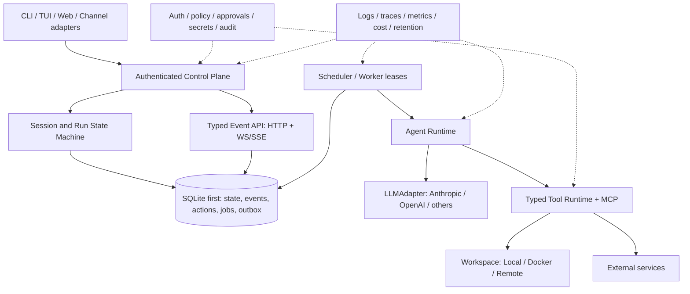

# mini-loop Agent Platform Roadmap

> 状态：Draft for execution
>
> 基线：mini-loop `a3c2e7b64c7be892caa97f7e20513cdfb82e7e43`（2026-07-21）
>
> 对标快照：OpenClaw `60c9b49d`、Hermes Agent `73c8d404`、OpenHands `f4bfa7f` / OpenHands SDK `68aa583e`
>
> 排期假设：2 名全职工程师；阶段顺序比日历日期更重要。

## 1. 结论先行

mini-loop 已经是一套完整度很高的**教学型 agent harness / 可扩展参考实现**：它具备 agent loop、工具、权限、压缩与恢复、记忆、任务、后台任务、cron、团队协作、worktree、MCP、SSE 以及可持久化 trajectory，当前测试基线为 96 个测试通过。

但如果目标是接近 OpenClaw、Hermes Agent、OpenHands 这类可长期运行、可接入真实用户和真实代码库的 agent 平台，当前最关键的差距并不是“工具数量还不够”，而是三块底座尚未闭环：

1. **可执行状态不持久**：trajectory 能审计，但不能作为 crash recovery、resume、fork、replay 的执行依据。
2. **执行边界不够硬**：文件路径有限制，但 shell 仍在宿主机上直接执行；权限规则也还不是可持久审批、安全分级和租户隔离体系。
3. **控制面还不是生产协议**：缺少鉴权、幂等、取消/暂停/恢复、持久队列、租约、交付账本、限流以及多进程一致性。

因此推荐的建设顺序是：

```text
状态/事件模型
    → 取消、审批、checkpoint
    → workspace sandbox、鉴权、secret boundary
    → 多模型与结构化工具运行时
    → 持久任务、子 agent、调度
    → 插件、渠道、学习与产品界面
```

不要反过来先铺 20 个渠道、浏览器、语音或技能市场。那会把当前的进程内不确定性扩散到更多入口。

## 2. 研究范围与方法

本 roadmap 同时使用两类证据：

- **本仓库语义路径**：检查功能的真实入口、状态变化、持久化边界和测试，而不是只看 README 的功能勾选。
- **固定上游提交**：避免把浮动主分支当成稳定事实；链接均尽量固定到下表提交。

| 项目 | 固定提交 | 本次重点 |
| --- | --- | --- |
| OpenClaw | `60c9b49dfde41752e833881d971bceee5c610b67` | Gateway 控制面、会话生命周期、sandbox、安全审计、插件边界 |
| Hermes Agent | `73c8d40464ad551c9e198ad6e32de8f994f0e10d` | 多入口共核、provider、checkpoint、委派、cron、技能演进 |
| OpenHands | `f4bfa7f9498110d3f193d9eea4f954305fdc70ac` | 完整产品面、集成与远程运行 |
| OpenHands SDK | `68aa583ebf07efefbb9219b63859c1aacecaf7b3` | typed event、ConversationState、workspace、agent server、安全确认 |

本次不把“代码量更大”视为成熟，也不建议直接复制任一项目的全部产品面。mini-loop 应保留“小内核、宽适配器”的优势。

## 3. 当前已经做得好的部分

以下能力应当保留并演进，而不是重写：

- Agent loop 已覆盖工具调用、hook、上下文压缩、恢复和子 agent 基础路径，见 [`agent.py`](../mini_loop/agent.py)。
- Toolset 已有统一注册和 workspace 文件边界，见 [`tools.py`](../mini_loop/tools.py)。
- 权限规则有 allow / ask / deny 语义，可作为后续风险审批的策略输入，见 [`permissions.py`](../mini_loop/permissions.py)。
- Session 有串行锁、订阅事件、SSE replay backlog，见 [`session.py`](../mini_loop/session.py) 与 [`server.py`](../mini_loop/server.py)。
- trajectory 已形成稳定 JSONL 审计载体，并明确了它当前不是 checkpoint，见 [`TRAJECTORIES.md`](TRAJECTORIES.md#design-references-and-boundary)。
- memory、task、cron、team、MCP、worktree 都已有可工作的最小实现；后续可以逐个替换底层存储和传输，而不必改变上层教学接口。
- 测试覆盖了 s01–s20 的核心语义，适合继续作为兼容层和回归底座。

这些基础说明 mini-loop 不需要“推倒重来”。真正需要的是把进程内对象之间的隐式约定，提升为稳定的持久化契约和安全契约。

## 4. 从三个上游项目提取的设计原则

### 4.1 OpenClaw：先把 Gateway 当安全边界

OpenClaw 的价值不只是渠道多，而是把长期运行的 Gateway 作为统一控制面：请求/响应/推送事件有明确协议，副作用请求需要幂等标识，会话、设备身份、路由和安全策略在入口统一处理。其 sandbox 还区分 mode、scope、backend 和 workspace access，并默认收紧网络、root filesystem 与 capabilities。

对 mini-loop 的启示：

- server 不能只是把进程内 `SessionManager` 包一层 HTTP；它需要成为身份、租户、幂等和运行生命周期的唯一入口。
- “路径检查 + 危险字符串 deny-list”不构成隔离。真正的 shell 边界应由 workspace backend 提供。
- 插件不是 import 任意 Python 文件，而应有 manifest、能力声明、版本、来源、配置 schema、信任和失败隔离。

参考：[Architecture](https://github.com/openclaw/openclaw/blob/60c9b49dfde41752e833881d971bceee5c610b67/docs/concepts/architecture.md)、[Sandboxing](https://github.com/openclaw/openclaw/blob/60c9b49dfde41752e833881d971bceee5c610b67/docs/gateway/sandboxing.md)、[Security](https://github.com/openclaw/openclaw/blob/60c9b49dfde41752e833881d971bceee5c610b67/docs/gateway/security/index.md)、[Plugin architecture](https://github.com/openclaw/openclaw/blob/60c9b49dfde41752e833881d971bceee5c610b67/docs/plugins/architecture.md)。

### 4.2 Hermes Agent：同一内核，多入口、多 provider、多执行环境

Hermes 把 CLI、Gateway、TUI 和桌面等入口放在同一个 agent/session 内核之上；provider、终端环境、memory、browser 等通过接口扩展。它还补齐了长任务需要的 checkpoint、持久任务认领、heartbeat、失败恢复、委派树和技能 provenance。

对 mini-loop 的启示：

- LLM、workspace、memory、scheduler 都应是协议接口，不应继续耦合到单一 Anthropic client 或宿主机 subprocess。
- 子 agent 需要 registry、父子关系、深度/并发/工具策略、取消和恢复；“创建一个临时 Agent 然后等待”只适合教学路径。
- 自动学习和技能自修改必须晚于备份、来源、审计、评测和回滚。
- checkpoint 应围绕 mutation 创建，支持 diff、restore 和 prune；它和 conversation snapshot 是两个不同层次。

参考：[Session lifecycle](https://github.com/NousResearch/hermes-agent/blob/73c8d40464ad551c9e198ad6e32de8f994f0e10d/docs/session-lifecycle.md)、[Checkpoint manager](https://github.com/NousResearch/hermes-agent/blob/73c8d40464ad551c9e198ad6e32de8f994f0e10d/tools/checkpoint_manager.py)、[Delegation patterns](https://hermes-agent.nousresearch.com/docs/guides/delegation-patterns/)、[Security](https://hermes-agent.nousresearch.com/docs/user-guide/security/)、[Curator](https://hermes-agent.nousresearch.com/docs/user-guide/features/curator)。

### 4.3 OpenHands：可恢复状态、typed event 和可替换 workspace

OpenHands SDK 的关键设计是把组件尽量做成无状态对象，把 `ConversationState` 作为单一可变真相；所有重要变化进入 typed、append-only event log。Conversation 因此可以 pause、resume、fork、navigate，并能在本地、Docker 或远程 workspace 之间切换。Agent server 再提供鉴权、多用户隔离和远程生命周期控制。

对 mini-loop 的启示：

- `messages`、status、pending action、tool result 和 usage 不能只留在 Python 对象中。
- trajectory 与可执行事件日志必须分层：前者为观测/导出，后者为状态恢复和一致性。
- workspace 接口应至少覆盖 execute、upload/download、git diff、变更集和资源限制。
- 确认机制应由 typed action + policy 驱动，而不是只对命令字符串做匹配。

参考：[Architecture overview](https://docs.openhands.dev/sdk/arch/overview)、[Events](https://docs.openhands.dev/sdk/arch/events)、[Workspace](https://docs.openhands.dev/sdk/arch/workspace)、[Security](https://docs.openhands.dev/sdk/arch/security)、[Agent server](https://docs.openhands.dev/sdk/arch/agent-server)。固定实现可见 [`ConversationState`](https://github.com/OpenHands/software-agent-sdk/blob/68aa583ebf07efefbb9219b63859c1aacecaf7b3/openhands-sdk/openhands/sdk/conversation/state.py) 与 [`EventLog`](https://github.com/OpenHands/software-agent-sdk/blob/68aa583ebf07efefbb9219b63859c1aacecaf7b3/openhands-sdk/openhands/sdk/conversation/event_store.py)。

## 5. Gap Matrix

| 能力域 | mini-loop 当前状态 | 成熟实现的基线 | 严重度 | 决策 |
| --- | --- | --- | --- | --- |
| 可执行会话状态 | `messages`、status、subscriber 在内存；重启只重建空 session | 持久 state + append-only event，可 resume/fork | P0 | 首先建设 |
| 副作用一致性 | tool call 无 action journal / idempotency key | pending action、attempt、commit/fail、幂等边界 | P0 | 与状态层同批 |
| 中断控制 | 没有公开 cancel/pause/resume/steer | 明确状态机，可中断并恢复 | P0 | 与状态层同批 |
| Workspace 隔离 | `shell=True` 在宿主机执行 | local/docker/remote backend，资源和网络策略 | P0 | server 默认 sandbox |
| 身份与租户 | HTTP/SSE 无 auth/tenant scope | token/device/user auth，多租户隔离 | P0 | 对外监听前必须完成 |
| 审批与风险 | 字符串规则 + 可选 callback | typed risky action、持久审批、超时和审计 | P0 | 与 sandbox 同批 |
| Secret 边界 | 环境变量直接进入进程 | secret reference、按需注入、统一脱敏/轮换 | P0 | 与 auth 同批 |
| LLM provider | Anthropic-compatible 单实现、非 token streaming | 多 provider、capability negotiation、fallback、usage/cost | P1 | 先抽接口，再扩 provider |
| 工具协议 | 返回文本为主，shell/file 粗粒度 | typed result、structured error、patch/git/browser/process | P1 | 与 provider runtime 同批 |
| MCP | stdio + 最小 JSON-RPC | stdio/HTTP/SSE、OAuth、resources/prompts、连接生命周期 | P1 | 在 runtime 稳定后扩展 |
| 子 agent | 临时同步调用，无 registry | durable tree、并发/深度限制、interrupt、recovery | P1 | 依赖状态与租约 |
| Task / background | JSON 文件和进程内 asyncio task | leases、heartbeat、attempt、retry、跨进程 claim | P1 | 依赖 SQLite core |
| Cron | 单进程 ticker | lock、misfire/catchup、交付账本、pause/edit | P1 | 与 durable jobs 同批 |
| Plugin / skill | 启动时目录扫描 | manifest、版本、来源、schema、隔离、usage/rollback | P2 | 基础安全完成后 |
| 可观测与运维 | trajectory + SSE；指标有限，无 retention | OTel/metrics/cost/budget/retention/readiness/audit | P1 | 从 Phase 0 埋点，Phase 6 完整化 |
| 产品入口 | FastAPI console + Python API | CLI/TUI/Web/channel 共用一套稳定控制协议 | P2 | 先做一个端到端入口 |

## 6. 十个最需要补齐的具体问题

### G1. trajectory 还不能恢复执行

[`TRAJECTORIES.md`](TRAJECTORIES.md#design-references-and-boundary) 已明确 trajectory 只用于检查和导出，不是 checkpoint。当前 `SessionManager.restore_scheduled_session()` 只会重建 session/agent，无法恢复 transcript、pending tool call 或上下文压缩状态。

**风险**：进程退出后，用户看到“session 还在”，但 agent 实际失忆；若退出发生在外部副作用前后，还可能重复执行。

### G2. 没有副作用 action journal

tool call 直接执行后再把结果追加回消息。系统没有 `prepared → running → committed/failed/unknown` 记录，也没有工具级幂等键。

**风险**：崩溃时无法判断一次命令、写文件、发消息或创建 issue 到底完成没有。对任意外部系统无法承诺 exactly-once，只能通过幂等键、状态查询和人工确认逼近 effectively-once。

### G3. shell 的安全边界仍是宿主机

[`tools.py`](../mini_loop/tools.py) 对文件工具做了 safe path，但 `run_bash` 使用宿主机 `subprocess.run(..., shell=True)`；绝对路径、环境、网络、进程和资源都没有硬隔离。

**风险**：一条绕过 deny-list 的命令即可访问 workspace 外数据或产生不可控资源消耗。

### G4. server 缺少身份、租户和幂等

[`server.py`](../mini_loop/server.py) 的 session、message、event 和 trajectory 路由没有 auth、tenant scope、rate limit、idempotency key 或 pagination。默认绑定 loopback 降低了意外暴露概率，但环境变量改变 host 后并没有第二层保护。

**风险**：一旦用于局域网、容器或远程入口，任何调用者都可能读取 session 或触发工具执行。

### G5. 运行状态机不足以承载真实交互

当前主要是 idle/running/error，缺少 paused、waiting-for-confirmation、cancelled、stuck、finished、deleting 等状态，也没有公开的 cancel、pause、resume、steer API。

**风险**：长任务只能等待或杀进程；审批等待无法跨重启；客户端也无法可靠区分“正在跑”和“卡住”。

### G6. provider 与模型能力未抽象

[`config.py`](../mini_loop/config.py) 和 [`agent.py`](../mini_loop/agent.py) 面向 Anthropic-compatible messages API；缺少 Responses/chat 差异、流式 token、模型 capability、fallback、重试分类、prompt cache、usage/cost 统一结构。

**风险**：每增加一个模型供应商都会侵入 agent loop，且难以跨 provider 做一致性测试。

### G7. background、task、cron 都未达到 durable job 语义

background task 随进程消失；task JSON 的锁主要是进程内线程锁；cron 虽然保存配置，但执行认领、misfire、catchup、delivery 和 retry 没有跨进程协议。

**风险**：多 worker 会重复认领，单 worker 崩溃会漏跑或重跑。

### G8. 子 agent 是调用技巧，不是可运营实体

当前子 agent 没有持久 ID、父子树、attempt、heartbeat、并发/深度配额、工具策略快照或 interrupt/recovery。

**风险**：一旦并行委派，就很难解释“谁还在运行、用了什么权限、失败后该重试谁”。

### G9. plugin / skill 缺少供应链边界

[`skills.py`](../mini_loop/skills.py) 主要做目录扫描，没有 manifest、版本、依赖、安装来源、签名/校验、配置 schema、能力声明和故障隔离。

**风险**：技能越多，启动期隐式代码和 prompt 依赖越难审计；自我改写技能会进一步放大风险。

### G10. 观测数据还不能回答生产问题

trajectory 可回答“发生过什么”，但还缺少跨 session/run/action 的稳定关联、模型费用、排队时间、tool latency、重试、租约、资源使用、retention/prune 和统一脱敏。

**风险**：无法回答“为什么慢、为什么贵、是否重复执行、哪个租户触发、能否安全删除”。

## 7. 推荐目标架构



关键约束：

- SQLite 是第一阶段的正确默认值：足以提供事务、WAL、跨进程锁语义和迁移，同时保持单机部署简单。不要在单机一致性尚未完成时先引入分布式数据库。
- event log 是**可执行事实**；trajectory 是经过整理的**观测投影**。二者可以相互引用，但不能混为一个文件。
- workspace 是所有文件、命令和 git 操作的能力边界；agent loop 不直接调用 subprocess。
- 所有外部副作用都必须对应 action record；审批、重试、恢复和审计围绕 action ID 发生。

## 8. 分阶段 Roadmap

### Phase 0 — 冻结契约与故障基线（1–2 周）

**目标**：先定义将来不能随意破坏的状态、事件和安全语义，不改变现有用户体验。

建议落点：

- 新增 `mini_loop/events.py`：typed event envelope，至少含 `event_id`、`session_id`、`run_id`、`sequence`、`occurred_at`、`kind`、`payload_version`、`payload`。
- 新增 `mini_loop/state.py`：Session / Run / Action 状态枚举与合法迁移表。
- 新增 `docs/adr/`：事件事实源、幂等边界、trajectory 投影、workspace trust model 四份 ADR。
- 建立 kill-point 测试工具：在模型响应前后、action prepare/execute/commit 前后、event append 前后注入退出。
- 给现有 SSE envelope 增加版本和稳定关联 ID，但保留兼容格式。

验收标准：

- 状态迁移有 table-driven tests，非法迁移稳定拒绝。
- 同一 run 内 event sequence 单调且唯一。
- 20 个故障注入点有明确预期：可恢复、可重试、需人工确认三类均不能模糊。
- 现有 96 个测试保持通过。

停止条件：

- 如果还无法定义“tool 已执行但 commit event 未写入”后的行为，不进入 Phase 1。

### Phase 1 — Durable Conversation Core（2–3 周）

**目标**：重启后恢复真实对话和运行状态，并为所有后续能力提供事务底座。

建议落点：

- 新增 `mini_loop/storage/`：
  - `StateStore` protocol；
  - SQLite 默认实现，WAL + schema migrations；
  - `sessions`、`runs`、`messages`、`events`、`actions`、`snapshots`、`outbox` 表。
- `SessionManager` 只管理 live handles，事实从 store 加载；不再把 `_sessions` 当作唯一真相。
- Agent loop 在每个副作用前写 `action.prepared`，执行后写 `committed` / `failed`；不确定状态写 `unknown`，禁止静默重跑。
- 增加 `POST /sessions/{id}/runs/{run_id}:cancel|pause|resume`，以及受约束的 `:steer`。
- 增加 resume、fork 和 snapshot API；fork 必须保留来源 event cursor。
- trajectory 改为 event/action 的异步或提交后投影，并保持现有导出格式兼容。

验收标准：

- 在任意 kill point 终止进程，再启动后 transcript、run status、pending action 与 SSE cursor 一致。
- 相同 `Idempotency-Key` 重放消息不会产生第二个 run 或第二次本地副作用。
- `unknown` 外部副作用必须进入人工确认或外部 reconcile，不能自动当作 failed 重试。
- 两个 server 进程读取同一数据库时，不会同时推进同一 run。
- 支持从 event N fork 新 session，并保持原 session 不变。

停止条件：

- 如果 action 与 event 不能在一个本地事务内形成可解释顺序，不进入并行 worker 或渠道建设。

### Phase 2 — 安全执行与信任边界（2–3 周）

**目标**：让 server 可以在受控环境中接收非本机可信输入。

建议落点：

- 新增 `mini_loop/workspaces/`：`Workspace` protocol 与 `LocalWorkspace`、`DockerWorkspace`；以后再增加 remote backend。
- protocol 至少提供 `execute`、`read/write`、`upload/download`、`git_diff`、`changes`、`checkpoint/restore`、`close`。
- server 模式默认 Docker：network none、只读 root filesystem、非 root、cap-drop、CPU/memory/pid/time limits；workspace mount 明确 `none|ro|rw`。
- LocalWorkspace 明确标记 trusted-only，不作为公网服务默认值。
- 将权限升级为 typed action risk classifier：读、写、执行、网络、secret、外部发布分别判级；审批记录持久化并带过期时间。
- 新增 token auth、tenant/user scope；所有 session、event、trajectory、workspace 查询强制 scope filter。
- 引入 `SecretRef`，运行前按 tool/action 最小范围注入；统一日志、SSE、trajectory 脱敏。
- mutation 前自动创建 checkpoint，支持 diff、restore、prune 和总大小上限。
- 新增 `mini-loop security audit`，检查 host bind、auth、workspace backend、网络、secret、目录权限和危险 plugin。

验收标准：

- sandbox fixture 无法读取宿主机 workspace 外 canary、无法默认访问公网、无法 fork bomb、超限后可回收。
- 未鉴权、跨租户、过期 token 请求全部稳定拒绝；SSE 同样受保护。
- risky action 等待审批期间可重启；批准/拒绝均有不可变审计记录。
- secret canary 在 event、SSE、trajectory、异常、日志和模型可见 prompt 的非授权位置均为 0 泄露。
- checkpoint 能恢复一次失败 patch，并能展示准确 diff。

停止条件：

- 如果 Docker backend 不能成为 server 的默认执行路径，不开放远程渠道。

### Phase 3 — Provider 与工具运行时（2–3 周）

**目标**：保持 agent loop 稳定，通过适配器扩展模型与工具。

建议落点：

- 新增 `LLMAdapter`、`ModelCapabilities`、`ModelResponse`、`Usage`、`ProviderError`。
- 首批支持 Anthropic Messages、OpenAI Responses，以及一个 OpenAI-compatible chat provider。
- 支持 token/event streaming、tool delta 聚合、retry classification、fallback policy、prompt caching metadata、cost accounting。
- 将工具输出统一为 `ToolResult(content, structured, artifacts, metrics, error)`。
- 增加结构化 `apply_patch`、process、git status/diff、search 工具；browser 作为可选 plugin，不进入核心依赖。
- MCP 扩展为 stdio + Streamable HTTP/SSE，补 resources、prompts、OAuth 和连接健康状态。
- provider/tool 均建立 conformance suite，不让 adapter 特例渗入 agent loop。

验收标准：

- 三类 provider 运行同一组 tool-use、stream、compaction、retry、cancel 测试。
- 不支持某能力时在 run 前或明确事件中降级，不在运行中静默改变语义。
- 每个模型请求都有 latency、input/output/cache token、估算费用和 provider request ID。
- 大输出工具通过 artifact/reference 传递，不把所有内容塞回上下文。
- MCP server 断开、超时和 OAuth 失效都有 typed failure，不拖死 session。

停止条件：

- 如果 provider conformance 仍需要在 `Agent` 中按厂商分支，不继续增加第四个 provider。

### Phase 4 — Durable Orchestration 与自动化（2–3 周）

**目标**：让 task、background、cron 和子 agent 共用同一套可靠工作认领机制。

建议落点：

- SQLite 增加 `jobs`、`attempts`、`leases`、`deliveries`；worker 使用有期限 lease + heartbeat。
- job 支持 retry policy、backoff、deadline、priority、cancel、dead-letter 和 stale claim recovery。
- 子 agent 注册为 durable run tree：父子 ID、角色、工具策略快照、深度、并发上限、预算和 interrupt propagation。
- background tool 返回 durable job ID，进程重启后仍能查询和接续。
- cron 支持 create/edit/pause/resume/delete、timezone、misfire policy、catchup、fresh/reuse session、delivery outbox。
- 所有外部交付记录 destination + idempotency key + status，失败时可 reconcile。

验收标准：

- 两个 worker 并发处理 10,000 次测试触发，没有同一 attempt 双重 claim。
- worker 在 tool 执行中被 kill，lease 过期后进入预定义的 retry/unknown/reconcile 分支。
- 子 agent 达到深度、并发、预算或权限上限时稳定拒绝；父任务取消会传播。
- cron 在停机跨过触发点后，按配置准确 skip 或 catch up，交付不重复。
- UI/API 能展示完整 run tree、attempt、heartbeat、pending approval 和 delivery 状态。

停止条件：

- 如果 side effect 仍没有 action ID 与 delivery ledger，不允许自动 retry 外部发布类任务。

### Phase 5 — Extension Ecosystem 与首个完整入口（第 4–5 月）

**目标**：形成可安装、可审计、可降级的扩展面，并验证一条真实用户路径。

建议落点：

- 定义 plugin manifest：ID、version、compatibility、entrypoint、capabilities、config schema、permissions、source、integrity。
- plugin 发现、加载和运行失败不能拖垮核心；安装前做静态扫描，运行时按能力隔离。
- skill 增加触发条件、来源、版本、usage、评测结果、归档、备份和 rollback。
- curator/self-improvement 只做 opt-in proposal：先生成 diff 和离线评测，由人批准后发布新版本。
- 定义 versioned HTTP + WebSocket 控制协议；SSE 保留为单向兼容入口。
- 只选择一个端到端产品面：推荐 CLI/TUI + GitHub integration，或 Web console + 一个消息渠道。不要同时做全部渠道。

验收标准：

- plugin manifest schema 可版本化；不兼容版本在加载前失败。
- 恶意/崩溃 plugin 无法读取未声明 secret，且不会终止 server。
- skill 更新可比较前后 eval、可回滚，来源和审批者可追踪。
- 同一 run 可在选定入口发起、观察、审批、取消、恢复并查看 diff/成本。

停止条件：

- 没有 plugin capability boundary 时，不提供自动安装或自我修改。

### Phase 6 — Production Operations 与规模化集成（第 5–6 月及以后）

**目标**：在单机正确性成立后，补齐生产运营与有限规模部署。

建议落点：

- `/livez`、`/readyz`、graceful drain、schema migration、backup/restore、retention/prune。
- OpenTelemetry traces、Prometheus metrics、结构化日志、usage/cost budget、workspace 资源指标。
- API pagination、rate limits、quota、request id、audit export、webhook signing。
- Docker Compose 首选部署；只有出现明确多节点需求后再评估 PostgreSQL / distributed queue / Kubernetes。
- 首批外部集成优先 GitHub/GitLab 一类可用 idempotency key 和状态回查的系统。
- 建立真实仓库任务 benchmark：成功率、无回归率、人工接管率、P50/P95 latency、token/cost、重复副作用数。

验收标准：

- backup 后可在干净环境恢复 active/paused session、job、approval 和 audit history。
- retention 不破坏仍被 active session、fork 或审计引用的数据。
- 任一 run 可从用户请求追踪到 model calls、tool actions、workspace changes 和外部 delivery。
- 预算超限会暂停或降级，不能静默继续烧费。
- 发布门槛包含安全回归、故障注入和升级/回滚演练。

## 9. 建议的 Epic 拆分

| Epic | 产物 | 依赖 | 优先级 |
| --- | --- | --- | --- |
| R0-01 Event Envelope | versioned typed events + sequence | 无 | P0 |
| R0-02 Run State Machine | transition table + cancel/pause/resume | R0-01 | P0 |
| R1-01 SQLite StateStore | schema、migration、repository | R0-01 | P0 |
| R1-02 Action Journal | prepare/commit/fail/unknown + idempotency | R1-01 | P0 |
| R1-03 Resume/Fork | snapshot、cursor、recovery | R1-01/02 | P0 |
| R2-01 Workspace Protocol | local/docker contract | R1-02 | P0 |
| R2-02 Auth/Tenant/Secrets | scope、SecretRef、redaction | R1-01 | P0 |
| R2-03 Approval/Checkpoint | persistent decisions + rollback | R1-02/R2-01 | P0 |
| R3-01 LLMAdapter | 3-provider conformance | R0-01 | P1 |
| R3-02 Typed Tool Runtime | ToolResult、patch/git/process | R2-01 | P1 |
| R3-03 MCP Transport | HTTP/SSE/OAuth/resources/prompts | R3-02 | P1 |
| R4-01 Durable Job Engine | lease/heartbeat/retry/dead-letter | R1-01/02 | P1 |
| R4-02 Delegation Tree | durable child runs + budgets | R4-01 | P1 |
| R4-03 Cron/Delivery | misfire/catchup/outbox | R4-01 | P1 |
| R5-01 Plugin Manifest | trust、schema、isolation | R2-02/R3-02 | P2 |
| R5-02 First Product Slice | one end-to-end interface | R0–R4 | P2 |
| R6-01 Observability/Ops | OTel、metrics、backup、retention | 全阶段渐进 | P1 |

## 10. 横向质量门槛

每个阶段都应持续测量以下指标，而不是到 Phase 6 才补：

### 正确性

- crash injection 后 transcript corruption：0。
- 同 idempotency key 的重复本地副作用：0。
- `unknown` action 被静默自动重放：0。
- event sequence 缺口或重复：0（明确 tombstone/compaction 除外）。

### 安全

- 默认 server workspace 的宿主机 escape：0。
- 默认网络访问：0，除非 action 明确授权。
- secret canary 在非授权 event/log/SSE/trajectory 中出现：0。
- 跨租户资源访问：0。

### 可靠性

- 两 worker 双重 claim：0。
- scheduler 触发恢复符合 misfire policy：100%。
- active session 进程重启恢复成功率：100%。
- cancel acknowledgment P95：先设 `< 2s`，再按真实 backend 调整。

### 效率与质量

- 每 run 可计算 token、费用、model/tool latency。
- benchmark 同时记录 task success、regression、人工接管和 cost，不以“模型回复完成”代替任务完成。
- provider adapter 的通用 conformance 覆盖率 100%，厂商特例不得进入 core loop。

## 11. 明确暂不做的事情

在 Phase 0–4 完成前，不建议投入：

- 同时覆盖大量聊天渠道、语音、电话和多媒体。
- 公共插件市场、计费系统或组织级管理后台。
- 无人工批准的技能自修改、prompt 自发布或生产代码自部署。
- Kubernetes、多区域或复杂分布式一致性。
- 用向量数据库替代尚未定义清楚的 memory lifecycle。
- 把 benchmark 目标简化为“工具数量”或“渠道数量”。

## 12. 仍需产品层拍板的 Unknown Unknowns

这些问题不会阻塞 Phase 0，但会改变 Phase 2 之后的取舍：

1. **产品身份**：mini-loop 最终是教学框架、Python SDK、coding agent，还是个人助理 Gateway？推荐先选 SDK + coding agent slice。
2. **信任模型**：输入者、模型、插件、workspace owner 和 server operator 是否属于同一信任域？
3. **部署模型**：单用户本机、团队单机服务，还是多租户 SaaS？默认建议先保证单机多进程正确。
4. **副作用承诺**：哪些外部系统提供 idempotency key 或可查询状态？任意 shell 命令无法承诺 exactly-once。
5. **Sandbox 平台**：macOS 本地开发如何与 Linux Docker 生产语义对齐？是否需要 remote workspace？
6. **数据保留**：message、event、trajectory、workspace snapshot、secret audit 各自保留多久？谁能删除？
7. **模型契约**：最低支持哪些 tool calling、streaming、reasoning、vision 和 cache 能力？
8. **插件供应链**：允许本地任意源码、签名包，还是只允许管理员登记来源？
9. **人机审批体验**：审批者可能离线多久？超时默认 deny、cancel 还是保持 paused？
10. **质量基准**：主要优化教程一致性、真实 repo 修改成功率、长时间自治，还是多渠道个人助理体验？

## 13. 建议立即启动的第一个 Sprint

如果现在只开一个两周 Sprint，建议只做以下六项：

1. 写 ADR，冻结 Session / Run / Action 状态机与 event envelope。
2. 建 SQLite migration 和 `StateStore` 最小骨架，只迁移 session/message/event。
3. 把现有 SSE event 映射到 durable event，并保留旧响应兼容。
4. 实现 run cancel 与进程重启后 transcript 恢复。
5. 建 8–10 个 kill-point 测试，先覆盖“模型返回—工具执行—结果提交”主路径。
6. 做 DockerWorkspace spike：证明 workspace 外文件和默认网络不可达，不急着接入全部工具。

Sprint 完成定义：

- 有一条真实 session 在进程被强制终止后恢复 transcript、event cursor 和 run 状态。
- 有一次 tool action 在崩溃窗口内被标记为 `unknown`，且系统不会自动重复执行。
- 有一条 Docker sandbox 测试证明默认 host filesystem/network boundary 生效。
- 旧测试全部通过，新故障测试稳定通过。

## 14. 来源索引

### mini-loop

- [`README.md`](../README.md)
- [`agent.py`](../mini_loop/agent.py)
- [`session.py`](../mini_loop/session.py)
- [`manager.py`](../mini_loop/manager.py)
- [`server.py`](../mini_loop/server.py)
- [`tools.py`](../mini_loop/tools.py)
- [`permissions.py`](../mini_loop/permissions.py)
- [`trajectory.py`](../mini_loop/trajectory.py)
- [`TRAJECTORIES.md`](TRAJECTORIES.md)

### OpenClaw @ `60c9b49d`

- [Architecture](https://github.com/openclaw/openclaw/blob/60c9b49dfde41752e833881d971bceee5c610b67/docs/concepts/architecture.md)
- [Sandboxing](https://github.com/openclaw/openclaw/blob/60c9b49dfde41752e833881d971bceee5c610b67/docs/gateway/sandboxing.md)
- [Security](https://github.com/openclaw/openclaw/blob/60c9b49dfde41752e833881d971bceee5c610b67/docs/gateway/security/index.md)
- [Plugin architecture](https://github.com/openclaw/openclaw/blob/60c9b49dfde41752e833881d971bceee5c610b67/docs/plugins/architecture.md)

### Hermes Agent @ `73c8d404`

- [Repository instructions / architecture map](https://github.com/NousResearch/hermes-agent/blob/73c8d40464ad551c9e198ad6e32de8f994f0e10d/AGENTS.md)
- [Session lifecycle](https://github.com/NousResearch/hermes-agent/blob/73c8d40464ad551c9e198ad6e32de8f994f0e10d/docs/session-lifecycle.md)
- [Checkpoint manager](https://github.com/NousResearch/hermes-agent/blob/73c8d40464ad551c9e198ad6e32de8f994f0e10d/tools/checkpoint_manager.py)
- [Delegation patterns](https://hermes-agent.nousresearch.com/docs/guides/delegation-patterns/)
- [Cron internals](https://hermes-agent.nousresearch.com/docs/developer-guide/cron-internals)
- [Curator](https://hermes-agent.nousresearch.com/docs/user-guide/features/curator)

### OpenHands / SDK @ `f4bfa7f` / `68aa583e`

- [SDK architecture overview](https://docs.openhands.dev/sdk/arch/overview)
- [Design principles](https://docs.openhands.dev/sdk/arch/design)
- [Events](https://docs.openhands.dev/sdk/arch/events)
- [Workspace](https://docs.openhands.dev/sdk/arch/workspace)
- [Security](https://docs.openhands.dev/sdk/arch/security)
- [Agent server](https://docs.openhands.dev/sdk/arch/agent-server)
- [`ConversationState`](https://github.com/OpenHands/software-agent-sdk/blob/68aa583ebf07efefbb9219b63859c1aacecaf7b3/openhands-sdk/openhands/sdk/conversation/state.py)
- [`EventLog`](https://github.com/OpenHands/software-agent-sdk/blob/68aa583ebf07efefbb9219b63859c1aacecaf7b3/openhands-sdk/openhands/sdk/conversation/event_store.py)
- [`Workspace` base](https://github.com/OpenHands/software-agent-sdk/blob/68aa583ebf07efefbb9219b63859c1aacecaf7b3/openhands-sdk/openhands/sdk/workspace/base.py)
- [`ConfirmationPolicy`](https://github.com/OpenHands/software-agent-sdk/blob/68aa583ebf07efefbb9219b63859c1aacecaf7b3/openhands-sdk/openhands/sdk/security/confirmation_policy.py)
