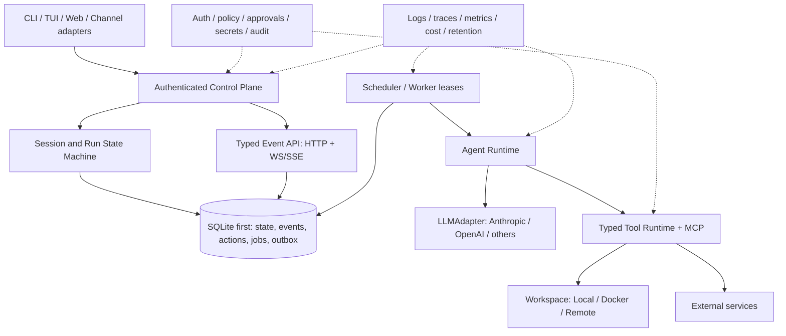

# mini-loop Agent Platform Roadmap

> 状态：Draft for execution
>
> 基线：mini-loop `a3c2e7b64c7be892caa97f7e20513cdfb82e7e43`（2026-07-21）
>
> 对标快照：OpenClaw `60c9b49d`、Hermes Agent `73c8d404`、OpenHands `f4bfa7f` / OpenHands SDK `68aa583e`
>
> 排期假设：2 名全职工程师；阶段顺序比日历日期更重要。

## 1. 结论先行

mini-loop 已经是一套完整度很高的**教学型 agent harness / 可扩展参考实现**：它具备 agent loop、tool、permission、compaction / recovery、memory、task、background task、cron、team、worktree、MCP、SSE 以及 durable trajectory，当前测试基线为 96 个测试通过。

但如果目标是接近 OpenClaw、Hermes Agent、OpenHands 这类可长期运行、可接入真实用户和真实代码库的 agent 平台，当前最关键的差距并不是“tool 数量还不够”，而是三块底座尚未闭环：

1. **缺少 durable executable state**：trajectory 能审计，但不能作为 crash recovery、resume、fork、replay 的执行依据。
2. **缺少 hard execution boundary**：文件路径有限制，但 shell 仍在宿主机上直接执行；permission rule 也还不是 durable approval、risk classification 和 tenant isolation 体系。
3. **control plane 还不是 production-grade protocol**：缺少 authentication、idempotency、cancel / pause / resume、durable queue、lease、delivery ledger、rate limiting 以及 multi-process consistency。

因此推荐的建设顺序是：

```text
state / event model
    → cancel / approval / checkpoint
    → workspace sandbox / authentication / secret boundary
    → multi-model / typed tool runtime
    → durable jobs / subagents / scheduling
    → plugins / channels / learning / product surfaces
```

不要反过来先铺 20 个 channel、browser、voice 或 skill marketplace。那会把当前的 in-process 不确定性扩散到更多入口。

## 2. 研究范围与方法

本 roadmap 同时使用两类证据：

- **本仓库语义路径**：检查功能的真实 entry point、state transition、persistence boundary 和 tests，而不是只看 README 的 feature checklist。
- **固定上游提交**：避免把浮动主分支当成稳定事实；链接均尽量固定到下表提交。

| 项目 | 固定提交 | 本次重点 |
| --- | --- | --- |
| OpenClaw | `60c9b49dfde41752e833881d971bceee5c610b67` | Gateway control plane、session lifecycle、sandbox、security audit、plugin boundary |
| Hermes Agent | `73c8d40464ad551c9e198ad6e32de8f994f0e10d` | shared core、provider、checkpoint、delegation、cron、skill evolution |
| OpenHands | `f4bfa7f9498110d3f193d9eea4f954305fdc70ac` | full product surface、integrations、remote execution |
| OpenHands SDK | `68aa583ebf07efefbb9219b63859c1aacecaf7b3` | typed event、ConversationState、workspace、agent server、confirmation policy |

本次不把“代码量更大”视为成熟，也不建议直接复制任一项目的全部 product surface。mini-loop 应保留“small core、wide adapters”的优势。

### 2.1 Terminology convention

涉及上游 architecture、API 和 runtime contract 时，本文保留原始英文术语，不再另造中文直译。重点包括 `control plane`、`side effect`、`action journal`、`state machine`、`event log`、`source of truth`、`workspace`、`sandbox`、`provider`、`runtime`、`checkpoint`、`idempotency`、`lease`、`outbox`、`delivery ledger`、`plugin` 与 `skill`。中文仅用于解释这些概念之间的关系。

## 3. 当前已经做得好的部分

以下能力应当保留并演进，而不是重写：

- Agent loop 已覆盖 tool calling、hook、context compaction、recovery 和 subagent 基础路径，见 [`agent.py`](../mini_loop/agent.py)。
- Toolset 已有统一 registry 和 workspace file boundary，见 [`tools.py`](../mini_loop/tools.py)。
- Permission rule 有 allow / ask / deny 语义，可作为后续 approval policy 的输入，见 [`permissions.py`](../mini_loop/permissions.py)。
- Session 有串行锁、event subscription、SSE replay backlog，见 [`session.py`](../mini_loop/session.py) 与 [`server.py`](../mini_loop/server.py)。
- trajectory 已形成稳定的 JSONL audit artifact，并明确了它当前不是 checkpoint，见 [`TRAJECTORIES.md`](TRAJECTORIES.md#design-references-and-boundary)。
- memory、task、cron、team、MCP、worktree 都已有可工作的最小实现；后续可以逐个替换底层存储和传输，而不必改变上层教学接口。
- 测试覆盖了 s01–s20 的核心语义，适合继续作为兼容层和回归底座。

这些基础说明 mini-loop 不需要“推倒重来”。真正需要的是把 in-process 对象之间的隐式约定，提升为稳定的 persistence contract 和 security contract。

## 4. 从三个上游项目提取的设计原则

### 4.1 OpenClaw：先把 Gateway 当 security boundary

OpenClaw 的价值不只是 channel coverage，而是把长期运行的 Gateway 作为 unified control plane：request / response / push event 采用明确 protocol，对 side-effecting request 要求 idempotency key，并在入口统一处理 session、device identity、routing 和 security policy。其 sandbox 还区分 mode、scope、backend 和 workspace access，并默认收紧 network、root filesystem 与 capabilities。

对 mini-loop 的启示：

- server 不能只是把 in-process `SessionManager` 包一层 HTTP；它需要成为 identity、tenant、idempotency 和 run lifecycle 的 canonical entry point。
- “path validation + dangerous-string deny-list”不构成 isolation。真正的 shell boundary 应由 workspace backend 提供。
- plugin 不是 import 任意 Python 文件，而应有 manifest、capability declaration、version、provenance、config schema、trust policy 和 failure isolation。

参考：[Architecture](https://github.com/openclaw/openclaw/blob/60c9b49dfde41752e833881d971bceee5c610b67/docs/concepts/architecture.md)、[Sandboxing](https://github.com/openclaw/openclaw/blob/60c9b49dfde41752e833881d971bceee5c610b67/docs/gateway/sandboxing.md)、[Security](https://github.com/openclaw/openclaw/blob/60c9b49dfde41752e833881d971bceee5c610b67/docs/gateway/security/index.md)、[Plugin architecture](https://github.com/openclaw/openclaw/blob/60c9b49dfde41752e833881d971bceee5c610b67/docs/plugins/architecture.md)。

### 4.2 Hermes Agent：shared core、多 entry point、多 provider、多 execution environment

Hermes 把 CLI、Gateway、TUI 和 desktop 等入口放在同一个 agent / session core 之上；provider、terminal environment、memory、browser 等通过 interface 扩展。它还补齐了 long-running task 所需的 checkpoint、durable job claiming、heartbeat、failure recovery、delegation tree 和 skill provenance。

对 mini-loop 的启示：

- LLM、workspace、memory、scheduler 都应是 protocol interface，不应继续耦合到单一 Anthropic client 或 host subprocess。
- subagent 需要 registry、parent-child relationship、depth / concurrency / tool policy、cancel 和 recovery；“创建一个临时 Agent 然后等待”只适合教学路径。
- self-learning 和 skill self-modification 必须晚于 backup、provenance、audit、eval 和 rollback。
- checkpoint 应围绕 mutation 创建，支持 diff、restore 和 prune；它和 conversation snapshot 是两个不同层次。

参考：[Session lifecycle](https://github.com/NousResearch/hermes-agent/blob/73c8d40464ad551c9e198ad6e32de8f994f0e10d/docs/session-lifecycle.md)、[Checkpoint manager](https://github.com/NousResearch/hermes-agent/blob/73c8d40464ad551c9e198ad6e32de8f994f0e10d/tools/checkpoint_manager.py)、[Delegation patterns](https://hermes-agent.nousresearch.com/docs/guides/delegation-patterns/)、[Security](https://hermes-agent.nousresearch.com/docs/user-guide/security/)、[Curator](https://hermes-agent.nousresearch.com/docs/user-guide/features/curator)。

### 4.3 OpenHands：recoverable state、typed event 和 swappable workspace

OpenHands SDK 的关键设计是把 component 尽量做成 stateless object，把 `ConversationState` 作为 single source of truth；所有重要变化进入 typed、append-only event log。Conversation 因此可以 pause、resume、fork、navigate，并能在 local、Docker 或 remote workspace 之间切换。Agent server 再提供 authentication、multi-user isolation 和 remote lifecycle control。

对 mini-loop 的启示：

- `messages`、status、pending action、tool result 和 usage 不能只留在 Python object 中。
- trajectory 与 executable event log 必须分层：前者用于 observability / export，后者用于 state recovery 和 consistency。
- workspace interface 应至少覆盖 execute、upload / download、git diff、change set 和 resource limit。
- confirmation flow 应由 typed action + policy 驱动，而不是只对 command string 做匹配。

参考：[Architecture overview](https://docs.openhands.dev/sdk/arch/overview)、[Events](https://docs.openhands.dev/sdk/arch/events)、[Workspace](https://docs.openhands.dev/sdk/arch/workspace)、[Security](https://docs.openhands.dev/sdk/arch/security)、[Agent server](https://docs.openhands.dev/sdk/arch/agent-server)。固定实现可见 [`ConversationState`](https://github.com/OpenHands/software-agent-sdk/blob/68aa583ebf07efefbb9219b63859c1aacecaf7b3/openhands-sdk/openhands/sdk/conversation/state.py) 与 [`EventLog`](https://github.com/OpenHands/software-agent-sdk/blob/68aa583ebf07efefbb9219b63859c1aacecaf7b3/openhands-sdk/openhands/sdk/conversation/event_store.py)。

## 5. Gap Matrix

| 能力域 | mini-loop 当前状态 | 成熟实现的基线 | 严重度 | 决策 |
| --- | --- | --- | --- | --- |
| Durable conversation state | `messages`、status、subscriber 在 memory；restart 只重建空 session | durable state + append-only event，可 resume / fork | P0 | 首先建设 |
| Side-effect consistency | tool call 无 action journal / idempotency key | pending action、attempt、commit / fail、idempotency boundary | P0 | 与 state layer 同批 |
| Run control | 没有公开 cancel / pause / resume / steer | 由明确的 state machine 驱动，并支持 interrupt / recovery | P0 | 与 state layer 同批 |
| Workspace isolation | `shell=True` 在 host 执行 | local / Docker / remote backend，resource 和 network policy | P0 | server 默认 sandbox |
| Identity / tenant isolation | HTTP/SSE 无 auth / tenant scope | token / device / user auth，multi-tenant isolation | P0 | 对外监听前必须完成 |
| Approval / risk | 字符串规则 + 可选 callback | typed risky action、durable approval、timeout 和 audit | P0 | 与 sandbox 同批 |
| Secret boundary | environment variable 直接进入进程 | secret reference、least-privilege injection、redaction / rotation | P0 | 与 auth 同批 |
| LLM provider | Anthropic-compatible 单实现、非 token streaming | 多 provider、capability negotiation、fallback、usage/cost | P1 | 先抽接口，再扩 provider |
| Tool protocol | 返回文本为主，shell / file 粗粒度 | typed result、structured error、patch / git / browser / process | P1 | 与 provider runtime 同批 |
| MCP | stdio + 最小 JSON-RPC | stdio / HTTP / SSE、OAuth、resources / prompts、connection lifecycle | P1 | 在 runtime 稳定后扩展 |
| Subagent | 临时同步调用，无 registry | durable tree、concurrency / depth limit、interrupt、recovery | P1 | 依赖 state 和 lease |
| Task / background | JSON 文件和 in-process asyncio task | lease、heartbeat、attempt、retry、cross-process claim | P1 | 依赖 SQLite core |
| Cron | single-process ticker | lock、misfire / catchup、delivery ledger、pause / edit | P1 | 与 durable jobs 同批 |
| Plugin / skill | 启动时目录扫描 | manifest、version、provenance、schema、isolation、usage / rollback | P2 | 基础安全完成后 |
| Observability / operations | trajectory + SSE；metrics 有限，无 retention | OTel / metrics / cost / budget / retention / readiness / audit | P1 | 从 Phase 0 开始 instrumentation，Phase 6 完整化 |
| Product surface | FastAPI console + Python API | CLI / TUI / Web / channel 共用一套稳定 control protocol | P2 | 先做一个 end-to-end surface |

## 6. 十个最需要补齐的具体问题

### G1. trajectory 还不能用于 execution recovery

[`TRAJECTORIES.md`](TRAJECTORIES.md#design-references-and-boundary) 已明确 trajectory 只用于 inspection / export，不是 checkpoint。当前 `SessionManager.restore_scheduled_session()` 只会重建 session / agent，无法恢复 transcript、pending tool call 或 context compaction state。

**风险**：进程退出后，用户看到“session 还在”，但 agent 实际失忆；若退出发生在 external side effect 前后，还可能重复执行。

### G2. 没有 side-effect action journal

tool call 直接执行后再把 result append 回 message。系统没有 `prepared → running → committed / failed / unknown` 记录，也没有 tool-level idempotency key。

**风险**：crash 时无法判断一次 command、file write、message send 或 issue creation 到底完成没有。对任意 external system 无法承诺 exactly-once，只能通过 idempotency key、status query 和 manual confirmation 逼近 effectively-once。

### G3. shell 仍缺少 hard execution boundary

[`tools.py`](../mini_loop/tools.py) 的 file tools 有 safe-path check，但 `run_bash` 使用 host `subprocess.run(..., shell=True)`；absolute path、environment、network、process 和 resource 都没有 hard isolation。

**风险**：一条绕过 deny-list 的 command 即可访问 workspace 外数据或产生不可控 resource consumption。

### G4. server 缺少 identity、tenant isolation 和 idempotency

[`server.py`](../mini_loop/server.py) 的 session、message、event 和 trajectory 路由没有 auth、tenant scope、rate limit、idempotency key 或 pagination。默认绑定 loopback 降低了意外暴露概率，但环境变量改变 host 后并没有第二层保护。

**风险**：一旦用于 LAN、container 或 remote entry point，任何 caller 都可能读取 session 或触发 tool execution。

### G5. run state machine 不足以承载真实交互

当前主要是 `idle / running / error`，缺少 `paused / waiting-for-confirmation / cancelled / stuck / finished / deleting` 等 state，也没有公开的 cancel / pause / resume / steer API。

**风险**：long-running task 只能等待或 kill process；pending approval 无法跨 restart；client 也无法可靠区分 running 和 stuck。

### G6. LLM provider 与 model capability 未抽象

[`config.py`](../mini_loop/config.py) 和 [`agent.py`](../mini_loop/agent.py) 面向 Anthropic-compatible Messages API；缺少 Responses / Chat 差异、token streaming、model capability、fallback、retry classification、prompt cache、usage / cost 统一结构。

**风险**：每增加一个 provider 都会侵入 agent loop，且难以执行 cross-provider conformance test。

### G7. background、task、cron 都未达到 durable job semantics

background task 随 process 消失；task JSON 的 lock 主要是 in-process thread lock；cron 虽然保存 config，但 job claiming、misfire、catchup、delivery 和 retry 没有 cross-process protocol。

**风险**：多个 worker 可能发生 duplicate claim；单 worker crash 会导致 missed run 或 duplicate run。

### G8. subagent 是调用技巧，不是可运营实体

当前 subagent 没有 durable ID、parent-child tree、attempt、heartbeat、concurrency / depth quota、tool policy snapshot 或 interrupt / recovery。

**风险**：一旦启用 parallel delegation，就很难解释“谁还在 running、使用了什么 permission、失败后该 retry 谁”。

### G9. plugin / skill 缺少 supply-chain boundary

[`skills.py`](../mini_loop/skills.py) 主要做 directory scan，没有 manifest、version、dependency、installation provenance、signature / integrity check、config schema、capability declaration 和 failure isolation。

**风险**：skill 越多，startup 阶段的 implicit code 和 prompt dependency 越难 audit；skill self-modification 会进一步放大风险。

### G10. observability data 还不能回答生产问题

trajectory 可回答“发生过什么”，但还缺少跨 session / run / action 的 stable correlation、model cost、queue time、tool latency、retry、lease、resource usage、retention / prune 和统一 redaction。

**风险**：无法回答“为什么慢、为什么贵、是否发生 duplicate execution、由哪个 tenant 触发、能否安全删除”。

## 7. 推荐目标架构



关键约束：

- SQLite 是第一阶段的正确默认值：足以提供 transaction、WAL、cross-process locking semantics 和 migration，同时保持 single-host deployment 简单。不要在 single-host consistency 尚未完成时先引入 distributed database。
- event log 是 executable source of truth；trajectory 是经过整理的 observability projection。二者可以相互引用，但不能混为一个文件。
- workspace 是所有 file、command 和 git operation 的 capability boundary；agent loop 不直接调用 subprocess。
- 所有 external side effect 都必须对应 action record；approval、retry、recovery 和 audit 围绕 action ID 发生。

## 8. 分阶段 Roadmap

### Phase 0 — 冻结 contract 与 failure-injection baseline（1–2 周）

**目标**：先定义将来不能随意破坏的 state、event 和 security semantics，不改变现有用户体验。

建议落点：

- 新增 `mini_loop/events.py`：typed event envelope，至少含 `event_id`、`session_id`、`run_id`、`sequence`、`occurred_at`、`kind`、`payload_version`、`payload`。
- 新增 `mini_loop/state.py`：Session / Run / Action state enum 与合法 transition table。
- 新增 `docs/adr/`：event source of truth、idempotency boundary、trajectory projection、workspace trust model 四份 ADR。
- 建立 kill-point test harness：在 model response 前后、action prepare / execute / commit 前后、event append 前后注入 process exit。
- 给现有 SSE envelope 增加 version 和 stable correlation ID，但保留兼容格式。

验收标准：

- state transition 有 table-driven tests，invalid transition 稳定拒绝。
- 同一 run 内 event sequence 单调且唯一。
- 20 个 failure-injection point 有明确预期：recoverable、retryable、manual confirmation 三类均不能模糊。
- 现有 96 个测试保持通过。

停止条件：

- 如果还无法定义“tool 已执行但 commit event 未写入”后的 recovery semantics，不进入 Phase 1。

### Phase 1 — Durable Conversation Core（2–3 周）

**目标**：在 restart 后恢复真实 conversation / run state，并为所有后续能力提供 transactional foundation。

建议落点：

- 新增 `mini_loop/storage/`：
  - `StateStore` protocol；
  - SQLite 默认实现，WAL + schema migrations；
  - `sessions`、`runs`、`messages`、`events`、`actions`、`snapshots`、`outbox` 表。
- `SessionManager` 只管理 live handles，store 是 source of truth；不再把 `_sessions` 当作唯一真相。
- Agent loop 在每个 side effect 前写 `action.prepared`，执行后写 `committed` / `failed`；不确定状态写 `unknown`，禁止 silent replay。
- 增加 `POST /sessions/{id}/runs/{run_id}:cancel|pause|resume`，以及受约束的 `:steer`。
- 增加 resume、fork 和 snapshot API；fork 必须保留 source event cursor。
- trajectory 由 event / action 生成 async projection 或 post-commit projection，并保持现有 export format 兼容。

验收标准：

- 在任意 kill point 终止进程，再启动后 transcript、run status、pending action 与 SSE cursor 一致。
- 相同 `Idempotency-Key` replay message 不会产生第二个 run 或第二次 local side effect。
- `unknown` external side effect 必须进入 manual confirmation 或 external reconcile，不能将其当作 failed 后自动 retry。
- 两个 server process 读取同一 database 时，不会同时推进同一 run。
- 支持从 event N fork 新 session，并保持原 session 不变。

停止条件：

- 如果 action 与 event 不能在一个 local transaction 内形成可解释顺序，不进入 parallel worker 或 channel 建设。

### Phase 2 — Secure execution 与 trust boundary（2–3 周）

**目标**：让 server 可以在受控 environment 中接收 untrusted remote input。

建议落点：

- 新增 `mini_loop/workspaces/`：`Workspace` protocol 与 `LocalWorkspace`、`DockerWorkspace`；以后再增加 remote backend。
- protocol 至少提供 `execute`、`read/write`、`upload/download`、`git_diff`、`changes`、`checkpoint/restore`、`close`。
- server mode 默认 Docker：network none、read-only root filesystem、non-root、cap-drop、CPU / memory / PID / time limits；workspace mount 明确 `none|ro|rw`。
- LocalWorkspace 明确标记 trusted-only，不作为公网服务默认值。
- 将 permission system 升级为 typed action risk classifier：read、write、execute、network、secret、external publish 分别判级；approval record 需要 durable storage 和 expiration。
- 新增 token auth、tenant / user scope；所有 session、event、trajectory、workspace query 强制 scope filter。
- 引入 `SecretRef`，运行前按 tool / action 最小范围注入；统一 log、SSE、trajectory redaction。
- mutation 前自动创建 checkpoint，支持 diff、restore、prune 和总大小上限。
- 新增 `mini-loop security audit`，检查 host bind、auth、workspace backend、network、secret、directory permission 和 dangerous plugin。

验收标准：

- sandbox fixture 无法读取 host workspace 外 canary、无法默认访问 public network、无法 fork bomb、超限后可回收。
- unauthenticated、cross-tenant、expired-token request 全部稳定拒绝；SSE 同样受保护。
- risky action 在 pending approval 期间可 restart；approve / deny 均有 immutable audit record。
- secret canary 在 event、SSE、trajectory、exception、log 和 model-visible prompt 的未授权位置均为 0 泄露。
- checkpoint 能恢复一次失败 patch，并能展示准确 diff。

停止条件：

- 如果 Docker backend 不能成为 server 的默认 execution path，不开放 remote channel。

### Phase 3 — Provider 与 Tool Runtime（2–3 周）

**目标**：保持 agent loop 稳定，通过 adapters 扩展 LLM 与 tools。

建议落点：

- 新增 `LLMAdapter`、`ModelCapabilities`、`ModelResponse`、`Usage`、`ProviderError`。
- 首批支持 Anthropic Messages、OpenAI Responses，以及一个 OpenAI-compatible chat provider。
- 支持 token / event streaming、tool delta aggregation、retry classification、fallback policy、prompt caching metadata、cost accounting。
- 将 tool output 统一为 `ToolResult(content, structured, artifacts, metrics, error)`。
- 增加 structured `apply_patch`、process、git status / diff、search tool；browser 作为 optional plugin，不进入 core dependency。
- MCP 扩展为 stdio + Streamable HTTP / SSE，补 resources、prompts、OAuth 和 connection health state。
- provider/tool 均建立 conformance suite，不让 adapter 特例渗入 agent loop。

验收标准：

- 三类 provider 运行同一组 tool-use、stream、compaction、retry、cancel 测试。
- 不支持某 capability 时在 run 前或明确 event 中降级，不在运行中静默改变 semantics。
- 每个 LLM request 都有 latency、input / output / cache token、estimated cost 和 provider request ID。
- large tool output 通过 artifact / reference 传递，不把所有内容塞回 context。
- MCP server 断开、超时和 OAuth 失效都有 typed failure，不拖死 session。

停止条件：

- 如果 provider conformance 仍需要在 `Agent` 中按厂商分支，不继续增加第四个 provider。

### Phase 4 — Durable Orchestration 与 Automation（2–3 周）

**目标**：让 task、background、cron 和 subagent 共用同一套 durable claim / lease mechanism。

建议落点：

- SQLite 增加 `jobs`、`attempts`、`leases`、`deliveries`；worker 使用有期限 lease + heartbeat。
- job 支持 retry policy、backoff、deadline、priority、cancel、dead-letter 和 stale claim recovery。
- subagent 注册为 durable run tree：parent / child ID、role、tool policy snapshot、depth、concurrency limit、budget 和 interrupt propagation。
- background tool 返回 durable job ID，进程重启后仍能查询和接续。
- cron 支持 create/edit/pause/resume/delete、timezone、misfire policy、catchup、fresh/reuse session、delivery outbox。
- 所有 external delivery 记录 destination + idempotency key + status，失败时可 reconcile。

验收标准：

- 两个 worker 并发处理 10,000 个 test trigger，不允许同一 attempt 出现 double claim。
- worker 在 tool 执行中被 kill，lease 过期后进入预定义的 retry/unknown/reconcile 分支。
- subagent 达到 depth、concurrency、budget 或 permission limit 时稳定拒绝；parent cancellation 会传播。
- cron 在 downtime 跨过 trigger time 后，按 config 准确 skip 或 catch up，不产生 duplicate delivery。
- UI/API 能展示完整 run tree、attempt、heartbeat、pending approval 和 delivery 状态。

停止条件：

- 如果 side effect 仍没有 action ID 与 delivery ledger，不允许自动 retry 外部发布类任务。

### Phase 5 — Extension Ecosystem 与首个 end-to-end surface（第 4–5 月）

**目标**：形成 installable、auditable、failure-tolerant extension surface，并验证一条真实 user journey。

建议落点：

- 定义 plugin manifest：ID、version、compatibility、entrypoint、capabilities、config schema、permissions、provenance、integrity。
- plugin discovery、loading 或 runtime failure 不能拖垮 core；安装前做 static scan，在 runtime 中按声明的 capability 进行 isolation。
- skill 增加 trigger、provenance、version、usage、eval result、archive、backup 和 rollback。
- curator / self-improvement 只做 opt-in proposal：先生成 diff 和 offline eval，由人批准后发布新 version。
- 定义 versioned HTTP + WebSocket control protocol；SSE 保留为单向兼容入口。
- 只选择一个 end-to-end product surface：推荐 CLI / TUI + GitHub integration，或 Web console + 一个 messaging channel。不要同时做全部 channels。

验收标准：

- plugin manifest 支持 schema versioning；incompatible version 在 loading 前失败。
- malicious / crashed plugin 无法读取 undeclared secret，且不会终止 server。
- skill update 可比较前后 eval、可 rollback，provenance 和 approver 可追踪。
- 同一 run 可在选定 surface 发起、observe、approve、cancel、resume 并查看 diff / cost。

停止条件：

- 没有 plugin capability boundary 时，不提供自动安装或自我修改。

### Phase 6 — Production Operations 与 Scaled Integrations（第 5–6 月及以后）

**目标**：在单机正确性成立后，补齐生产运营与有限规模部署。

建议落点：

- `/livez`、`/readyz`、graceful drain、schema migration、backup/restore、retention/prune。
- OpenTelemetry traces、Prometheus metrics、structured logs、usage / cost budget、workspace resource metrics。
- API pagination、rate limits、quota、request id、audit export、webhook signing。
- Docker Compose 首选部署；只有出现明确多节点需求后再评估 PostgreSQL / distributed queue / Kubernetes。
- 首批 external integration 优先 GitHub / GitLab 一类支持 idempotency key 和 status reconciliation 的 system。
- 建立真实 repository-task benchmark：success rate、regression-free rate、human takeover rate、P50 / P95 latency、token / cost、duplicate side-effect count。

验收标准：

- backup 后可在干净环境恢复 active/paused session、job、approval 和 audit history。
- retention 不破坏仍被 active session、fork 或审计引用的数据。
- 任一 run 可从用户请求追踪到 model calls、tool actions、workspace changes 和外部 delivery。
- 预算超限会暂停或降级，不能静默继续烧费。
- release gate 包含 security regression、failure injection 和 upgrade / rollback drill。

## 9. 建议的 Epic 拆分

| Epic | 产物 | 依赖 | 优先级 |
| --- | --- | --- | --- |
| R0-01 Event Envelope | versioned typed events + sequence | 无 | P0 |
| R0-02 Run State Machine | transition table + cancel / pause / resume | R0-01 | P0 |
| R1-01 SQLite StateStore | schema、migration、repository | R0-01 | P0 |
| R1-02 Action Journal | prepare/commit/fail/unknown + idempotency | R1-01 | P0 |
| R1-03 Resume/Fork | snapshot、cursor、recovery | R1-01/02 | P0 |
| R2-01 Workspace Protocol | local/docker contract | R1-02 | P0 |
| R2-02 Auth / Tenant / Secrets | scope、SecretRef、redaction | R1-01 | P0 |
| R2-03 Approval/Checkpoint | persistent decisions + rollback | R1-02/R2-01 | P0 |
| R3-01 LLMAdapter | 3-provider conformance | R0-01 | P1 |
| R3-02 Typed Tool Runtime | ToolResult、patch/git/process | R2-01 | P1 |
| R3-03 MCP Transport | HTTP/SSE/OAuth/resources/prompts | R3-02 | P1 |
| R4-01 Durable Job Engine | lease / heartbeat / retry / dead-letter | R1-01/02 | P1 |
| R4-02 Delegation Tree | durable child runs + budgets | R4-01 | P1 |
| R4-03 Cron/Delivery | misfire/catchup/outbox | R4-01 | P1 |
| R5-01 Plugin Manifest | trust、schema、isolation | R2-02/R3-02 | P2 |
| R5-02 First Product Slice | one end-to-end interface | R0–R4 | P2 |
| R6-01 Observability / Ops | OTel、metrics、backup、retention | 全阶段渐进 | P1 |

## 10. 横向质量门槛

每个阶段都应持续测量以下指标，而不是到 Phase 6 才补：

### 正确性

- crash injection 后 transcript corruption：0。
- 同 idempotency key 的 duplicate local side effect：0。
- `unknown` action 被静默自动重放：0。
- event sequence 缺口或重复：0（明确 tombstone/compaction 除外）。

### 安全

- 默认 server workspace 的宿主机 escape：0。
- 默认网络访问：0，除非 action 明确授权。
- secret canary 在非授权 event/log/SSE/trajectory 中出现：0。
- cross-tenant resource access：0。

### 可靠性

- 两 worker 双重 claim：0。
- scheduler recovery 符合 misfire policy：100%。
- active session 在 process restart 后的 recovery success rate：100%。
- cancel acknowledgment P95：先设 `< 2s`，再按真实 backend 调整。

### 效率与质量

- 每 run 可计算 token、费用、model/tool latency。
- benchmark 同时记录 task success、regression、human takeover 和 cost，不以“model response 完成”代替 task completion。
- provider adapter 的通用 conformance 覆盖率 100%，厂商特例不得进入 core loop。

## 11. 明确暂不做的事情

在 Phase 0–4 完成前，不建议投入：

- 同时覆盖大量 messaging channels、voice、telephony 和 multimedia。
- public plugin marketplace、billing system 或 organization admin console。
- 无 human approval 的 skill self-modification、prompt self-publishing 或 production code self-deployment。
- Kubernetes、多区域或复杂分布式一致性。
- 用向量数据库替代尚未定义清楚的 memory lifecycle。
- 把 benchmark 目标简化为 tool count 或 channel count。

## 12. 仍需产品层拍板的 Unknown Unknowns

这些问题不会阻塞 Phase 0，但会改变 Phase 2 之后的取舍：

1. **产品身份**：mini-loop 最终是教学框架、Python SDK、coding agent，还是个人助理 Gateway？推荐先选 SDK + coding agent slice。
2. **Trust model**：input source、model、plugin、workspace owner 和 server operator 是否属于同一 trust domain？
3. **Deployment model**：single-user local、team single-host service，还是 multi-tenant SaaS？默认建议先保证 single-host multi-process correctness。
4. **Side-effect guarantee**：哪些 external system 提供 idempotency key 或可查询 status？任意 shell command 无法承诺 exactly-once。
5. **Sandbox 平台**：macOS 本地开发如何与 Linux Docker 生产语义对齐？是否需要 remote workspace？
6. **数据保留**：message、event、trajectory、workspace snapshot、secret audit 各自保留多久？谁能删除？
7. **Model capability contract**：最低支持哪些 tool calling、streaming、reasoning、vision 和 cache capability？
8. **Plugin supply chain**：允许 arbitrary local source、signed package，还是只允许 admin-registered provenance？
9. **Human-in-the-loop approval UX**：approver 可能 offline 多久？timeout 默认 deny、cancel 还是保持 paused？
10. **Quality benchmark**：主要优化 tutorial consistency、真实 repo 修改成功率、long-running autonomy，还是 multi-channel personal assistant UX？

## 13. 建议立即启动的第一个 Sprint

如果现在只开一个两周 Sprint，建议只做以下六项：

1. 写 ADR，冻结 Session / Run / Action state machine 与 event envelope。
2. 建 SQLite migration 和 `StateStore` 最小骨架，只迁移 session/message/event。
3. 把现有 SSE event 映射到 durable event，并保留旧响应兼容。
4. 实现 run cancel 与进程重启后 transcript 恢复。
5. 建 8–10 个 kill-point tests，先覆盖“model response → tool execution → result commit”主路径。
6. 做 DockerWorkspace spike：证明 workspace 外 file 和 default network 不可达，不急着接入全部 tools。

Sprint 完成定义：

- 有一条真实 session 在进程被强制终止后恢复 transcript、event cursor 和 run 状态。
- 有一次 tool action 在崩溃窗口内被标记为 `unknown`，且系统不会自动重复执行。
- 有一条 Docker sandbox 测试证明默认 host filesystem/network boundary 生效。
- 旧测试全部通过，新故障测试稳定通过。

## 14. 来源索引

### mini-loop

- [`README.md`](../README.md)
- [`agent.py`](../mini_loop/agent.py)
- [`session.py`](../mini_loop/session.py)
- [`manager.py`](../mini_loop/manager.py)
- [`server.py`](../mini_loop/server.py)
- [`tools.py`](../mini_loop/tools.py)
- [`permissions.py`](../mini_loop/permissions.py)
- [`trajectory.py`](../mini_loop/trajectory.py)
- [`TRAJECTORIES.md`](TRAJECTORIES.md)

### OpenClaw @ `60c9b49d`

- [Architecture](https://github.com/openclaw/openclaw/blob/60c9b49dfde41752e833881d971bceee5c610b67/docs/concepts/architecture.md)
- [Sandboxing](https://github.com/openclaw/openclaw/blob/60c9b49dfde41752e833881d971bceee5c610b67/docs/gateway/sandboxing.md)
- [Security](https://github.com/openclaw/openclaw/blob/60c9b49dfde41752e833881d971bceee5c610b67/docs/gateway/security/index.md)
- [Plugin architecture](https://github.com/openclaw/openclaw/blob/60c9b49dfde41752e833881d971bceee5c610b67/docs/plugins/architecture.md)

### Hermes Agent @ `73c8d404`

- [Repository instructions / architecture map](https://github.com/NousResearch/hermes-agent/blob/73c8d40464ad551c9e198ad6e32de8f994f0e10d/AGENTS.md)
- [Session lifecycle](https://github.com/NousResearch/hermes-agent/blob/73c8d40464ad551c9e198ad6e32de8f994f0e10d/docs/session-lifecycle.md)
- [Checkpoint manager](https://github.com/NousResearch/hermes-agent/blob/73c8d40464ad551c9e198ad6e32de8f994f0e10d/tools/checkpoint_manager.py)
- [Delegation patterns](https://hermes-agent.nousresearch.com/docs/guides/delegation-patterns/)
- [Cron internals](https://hermes-agent.nousresearch.com/docs/developer-guide/cron-internals)
- [Curator](https://hermes-agent.nousresearch.com/docs/user-guide/features/curator)

### OpenHands / SDK @ `f4bfa7f` / `68aa583e`

- [SDK architecture overview](https://docs.openhands.dev/sdk/arch/overview)
- [Design principles](https://docs.openhands.dev/sdk/arch/design)
- [Events](https://docs.openhands.dev/sdk/arch/events)
- [Workspace](https://docs.openhands.dev/sdk/arch/workspace)
- [Security](https://docs.openhands.dev/sdk/arch/security)
- [Agent server](https://docs.openhands.dev/sdk/arch/agent-server)
- [`ConversationState`](https://github.com/OpenHands/software-agent-sdk/blob/68aa583ebf07efefbb9219b63859c1aacecaf7b3/openhands-sdk/openhands/sdk/conversation/state.py)
- [`EventLog`](https://github.com/OpenHands/software-agent-sdk/blob/68aa583ebf07efefbb9219b63859c1aacecaf7b3/openhands-sdk/openhands/sdk/conversation/event_store.py)
- [`Workspace` base](https://github.com/OpenHands/software-agent-sdk/blob/68aa583ebf07efefbb9219b63859c1aacecaf7b3/openhands-sdk/openhands/sdk/workspace/base.py)
- [`ConfirmationPolicy`](https://github.com/OpenHands/software-agent-sdk/blob/68aa583ebf07efefbb9219b63859c1aacecaf7b3/openhands-sdk/openhands/sdk/security/confirmation_policy.py)
