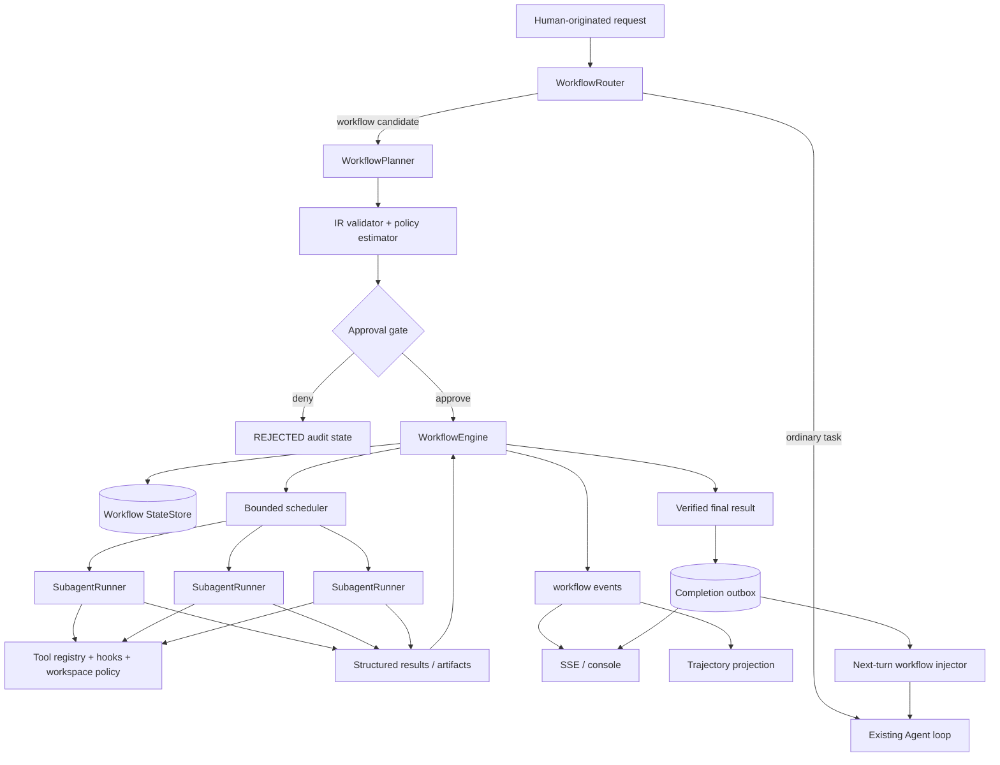

# Claude Code Dynamic Workflows 机制调研与 mini-loop 落地设计

> 调研日期：2026-07-29
>
> 上游观察基线：Claude Code `2.1.220` changelog、当前 Dynamic workflows 文档
>
> 功能首发基线：Claude Code `2.1.154`
>
> 文档状态：上游研究、当前 MVP 实现边界与后续设计。仓库已实现 default-off、local-only、
> process-local 的 declarative read-only vertical slice；它不是 Claude Code JavaScript workflow
> runtime 的兼容实现，也不具备 durable / restart-safe 语义。

本文回答两个问题：

1. Claude Code 的 **dynamic workflows** 到底是什么，它与 subagent、Skill、agent team 有什么本质区别；
2. mini-loop 应如何复用现有 agent loop、tool registry、task、team、worktree、SSE 和 trajectory，逐步实现同类能力。

本文是 [`AGENT_PLATFORM_ROADMAP.md`](AGENT_PLATFORM_ROADMAP.md) 的专项设计输入，不改变其中
`event/state contract -> durable state -> job/lease -> delegation tree` 的依赖顺序。尤其不能因为做出
一个并行 subagent demo，就把 Roadmap 中的 Durable Orchestration 标记为完成。

---

## 1. 结论先行

Claude Code dynamic workflow 不是“让主 Agent 多调用几次 Agent tool（旧称 Task tool）”，而是：

> Claude 针对当前任务即时生成一个 orchestration program；受限 runtime 在主对话之外执行这个
> program，由 program 保存 plan、branch、loop 和 intermediate results，并批量调度独立 subagents。

它最关键的架构变化是 **who holds the plan**：

- 普通 agent loop 中，LLM 在 context window 里逐轮决定下一步；
- dynamic workflow 中，script/runtime 持有 orchestration；是否先审批取决于 surface 和 permission
  mode，progress 通过 workflow UI/task panel 暴露，主对话最终接收 coordinated result。

对 mini-loop 的推荐实现不是第一天就执行任意 JavaScript，而是：

```text
human prompt
    -> WorkflowRouter
    -> WorkflowPlanner
    -> validated declarative Workflow IR
    -> approval when required
    -> bounded WorkflowEngine
    -> isolated SubagentRunner
    -> verifier / reducer
    -> one coordinated result
```

具体结论：

1. **先实现 declarative IR，再考虑 JavaScript DSL。** JSON/Python dataclass IR 更容易校验、
   限权、测试、checkpoint 和迁移；任意脚本执行会提前引入 sandbox、determinism 和 supply-chain
   问题。
2. **先交付 read-only vertical slice。** 第一条 workflow 应选择 repo audit / deep research：
   discover -> fan-out analysis -> adversarial verification -> synthesis。它只能复用当前 child Agent
   的 construction、events 和 semaphores，必须新建只含 `read_file` / `glob` 的严格 registry；
   当前 `explore_registry()` 仍包含 host `bash`，不能视为 hard read-only。
3. **Workflow state 必须独立于 conversation。** `messages` 会 compact，`TodoManager` 只在内存，
   `TaskStore` 只是 dependency projection，trajectory 只是 audit/export；它们都不能成为 workflow
   source of truth。
4. **动态生成不等于运行中任意自改 graph。** 一个 run 应冻结 `definition_revision` 和 policy
   snapshot。需要 replan 时生成下一 revision，记录父 revision 和原因，重新校验；扩大权限或预算时
   必须重新审批。
5. **并发规模必须有 hard cap。** “small / medium / large”只能作为 planner guideline；runtime 还要
   强制 concurrency、agent count、token/cost、wall time、depth、round 和 no-progress 上限。
6. **验证必须是一等 phase。** 不能让发现问题或写代码的同一个 agent 独自为自己背书；结果至少要有
   `verified / refuted / unverified` 三态。
7. **接近产品级可靠性前，先完成 Roadmap 的 Durable Core。** pause/resume、process restart、
   multi-worker claim、external side-effect retry 都依赖 SQLite state、action journal、lease 和
   idempotency，不应继续堆在 prompt 或 workspace JSON 上。

截至当前 checkout，前两项已经形成一个窄 MVP：model 可以提交 dynamic definition，但 definition
一经 canonicalize、validate 和 launch，就冻结为只含 `AGENT / VERIFY / REDUCE` 的固定 DAG；
worker 只拥有 `read_file / glob / return_artifact`。这证明的是 bounded orchestration contract，
不是 Claude Code parity，更不是 Durable Orchestration 已完成。

---

## 2. 研究范围、版本和证据边界

### 2.1 官方事实基线

本次只把 Anthropic 官方资料作为上游事实来源：

- [Dynamic workflows 官方文档](https://code.claude.com/docs/en/workflows)
- [Introducing dynamic workflows in Claude Code（2026-05-28）](https://claude.com/blog/introducing-dynamic-workflows-in-claude-code)
- [A harness for every task: dynamic workflows in Claude Code（2026-06-02）](https://claude.com/blog/a-harness-for-every-task-dynamic-workflows-in-claude-code)
- [Claude Code `2.1.220` pinned release](https://github.com/anthropics/claude-code/releases/tag/v2.1.220)
- [Claude Code `2.1.154` launch release](https://github.com/anthropics/claude-code/releases/tag/v2.1.154)
- [Claude Code mutable changelog](https://github.com/anthropics/claude-code/blob/main/CHANGELOG.md)
- [Agent SDK TypeScript reference: Workflow tool](https://code.claude.com/docs/en/agent-sdk/typescript)
- [Subagents 官方文档](https://code.claude.com/docs/en/sub-agents)
- [Worktrees 官方文档](https://code.claude.com/docs/en/worktrees)
- [Hooks 官方文档](https://code.claude.com/docs/en/hooks-guide)

观察到的版本演进：

| 版本 | 与 dynamic workflows 直接相关的变化 |
| --- | --- |
| `2.1.154` | 首次引入 dynamic workflows 和 `/workflows` |
| `2.1.160` | literal trigger 从 `workflow` 改为 `ultracode`；自然语言请求仍有效 |
| `2.1.196` | `/deep-research` 将无法核验的 claim 标为 `unverified`，并继续改善长任务恢复 |
| `2.1.202` | 增加 workflow size guideline，以及 `workflow.run_id` / `workflow.name` OTel attributes |
| `2.1.210` | keyword opt-in 只认可 human-originated input，避免 webhook/comment 仅凭关键词升级执行 |
| `2.1.219` | 默认 `medium` guideline，目标少于 15 个 agents；增加 settings key |
| `2.1.220` | 调研时 changelog 最新版本，只有通用 bug fix / reliability 说明 |

官方博客已经把该能力更新为 Generally Available。具体并发数、permission、resume 和 keyword 行为仍在
快速变化，所以实现时必须保存 `source_version` 和 `observed_at`，不能把本文数字当永久协议。
上面的 pinned releases 用于复现版本快照；`main` changelog 和产品文档用于核对调研日的最新行为，
之后可能继续变化。

### 2.2 能确认与不能确认的内容

公开资料能确认：

- 用户看到的 trigger、approval、progress、save、resume 和 limits；
- 保存脚本的基本形态，以及 `agent()`、`parallel()`、`pipeline()`、`phase()` 等 orchestration
  primitives；
- Workflow tool 的公开 input/output contract；
- script 没有直接 filesystem / shell capability，副作用由 subagent tools 执行；
- workflow 与 subagent、Skill、agent team 的产品语义区别。

公开资料不能确认：

- Claude Code 内部 scheduler、checkpoint store 和 cache 的完整源码实现；
- 未公开 runtime helper 的内部细节和稳定性保证；
- daemon restart、CLI exit、same-session resume 之间所有 edge case 的内部 state transition。

因此本文会把“官方公开行为”和“mini-loop 推荐设计”分开，不用产品现象反推未公开源码。

---

## 3. Dynamic workflow 与已有 primitives 的本质区别

官方文档用“谁持有 plan”区分四类能力：

| 机制 | 下一步由谁决定 | intermediate results 在哪里 | 可复用的对象 | 适合规模 |
| --- | --- | --- | --- | --- |
| Subagent | 主 Claude 逐轮决定 | 主/子 context | worker definition | 少量 delegation |
| Skill | Claude 按 instructions 决定 | context | instructions / knowledge | 重复方法 |
| Agent team | lead agent 逐轮协调 | shared task list + peer sessions | team definition | 少量长时 peers |
| Dynamic workflow | script/runtime 决定 | script variables / runtime store | orchestration program | 数十到数百 agents |

这里有三条容易混淆的边界：

1. **Workflow 不是 Skill。** Skill 告诉 Claude“怎样做”；workflow runtime 真正保存并执行
   branch、loop、barrier 和 aggregation。两者可组合：当 worker 可使用 Skill tool 或预载 skills
   时，它可以调用对应 Skill。
2. **Workflow 不是 agent team。** Team 的 lead 仍在 context 中逐轮做调度决策；workflow 把调度
   变成可读、可保存、可重跑的 program。
3. **Workflow 不是静态 DAG 的同义词。** 它由 Claude 针对本次任务动态生成，可在脚本里根据
   structured result 进行 classify、branch、filter、repeat-until-done 和 tournament；但一个已审批
   run 的 program 仍应可审计和可复现。

Dynamic workflow 主要解决三个长任务 failure mode：

- **agentic laziness**：大清单只完成一部分便提前声明完成；
- **self-preferential bias**：同一个 context 生成结论又评价自己的结论；
- **goal drift**：长会话和 compaction 后逐步丢失原始目标、边界或禁止项。

把 plan、coverage ledger 和 stop condition 移到 runtime，可以结构性降低这些风险，而不是仅靠
“请认真完成”这种 prompt。

---

## 4. Claude Code 的公开运行机制

### 4.1 Trigger 与 authority provenance

公开入口包括：

- 人工请求 “use / run / create a workflow”；
- 人工输入 `ultracode`；
- `/effort ultracode`：使用 `xhigh` effort，并允许 Claude 为 substantive task 自动选择 workflow；
  该 session mode 要求 Claude Code `2.1.203+`；
- 调用已保存 workflow 或内置 `/deep-research`。

截至 `2.1.210`，literal keyword 只在明确标为 human-originated 的交互输入中触发。`-p`、
scheduled task、webhook、PR comment 或没有 human origin 的 SDK message，不能仅凭文本中出现
`ultracode` 自动升级为高成本 workflow。

这是一个必须复用的 security boundary：

```text
untrusted payload contains "ultracode"
    != human authorized large multi-agent run
```

mini-loop 当前 `MessageReq` 只有 `message` 字段，没有 origin / actor / trust metadata。任何自动
workflow routing 上线前，必须先补 typed provenance。

### 4.2 生成的 orchestration program

保存后的 workflow 是带 `meta` 的 JavaScript，使用 top-level `await`。官方公开的核心形态可抽象为：

```javascript
export const meta = {
  name: "audit-module",
  description: "Discover targets, audit each target, verify, then synthesize"
}

const discovery = await agent("Return a structured target list", { schema: targetSchema })
const findings = await pipeline(discovery.targets, target =>
  agent(`Audit ${target}`, { label: target, schema: findingSchema })
)
const checked = await pipeline(findings, finding =>
  agent(`Independently verify ${JSON.stringify(finding)}`, { schema: verdictSchema })
)
return checked.filter(item => item.verdict !== "refuted")
```

重点不在 JavaScript 语法，而在：

- `agent()` 创建独立 worker context；
- `pipeline()` / `parallel()` 做 bounded fan-out；
- `phase()` / `meta.phases` 为 progress view 提供 named-stage grouping；官方没有公开承诺按 phase
  隔离 budget 或 tracing；
- JSON Schema 让 node result 可组合、可校验；
- 普通 language construct 保存 branch、loop、aggregation 和 stop condition。

### 4.3 Runtime isolation

官方 runtime 与主 conversation 分离：

- orchestration script 本身不能直接读写 filesystem 或执行 shell；
- 真正的 file、shell、Web、MCP side effect 只能由 agent tools 发起；
- intermediate results 留在 runtime variables，不逐条灌入主 context；
- 每个 worker 使用独立 context window；
- 最后只向主 conversation 返回 coordinated result。

这同时是 context management 和 capability boundary。mini-loop 不应给 workflow engine 暴露
`Toolset.run_bash()`；engine 只能请求 `SubagentRunner`，由 worker 的 registry、hooks、permissions
和 workspace policy 决定它能做什么。

### 4.4 并发、规模和成本

当前官方文档列出的 runtime constraints：

- 最多 16 个 concurrent workflow agents，低 CPU 环境可能更少；
- 单 run 最多 1,000 个 agents；
- size guideline：`small < 5`、`medium < 15`、`large < 50`、`unrestricted`；
- `2.1.219` 起默认 `medium`；
- guideline 是 planner advice，不是 hard cap；
- 默认情况下，超过 25 agents 或 projected token 超过 1.5M 时显示 advisory large-run warning；
  如果用户显式选择 size guideline，其 agent count 取代 25 作为 warning threshold，而
  `/effort ultracode` session 不显示该 warning；
- 官方博客说明 prompt 可以指定 token budget，例如 “use 10k tokens”；公开 Workflow tool input
  没有独立 budget 字段，因此不进一步推断其内部表示；
- stage 可以选择不同 model，否则继承 session model。

这些值适合做产品参考，不适合原样照搬到当前教学型仓库。mini-loop 当前 process-wide
`max_concurrent_llm` 默认 8；workflow 还必须给主 session、cron 和其他 sessions 留出容量。

### 4.5 Quality patterns

官方列出的常见 program shapes：

- **classify-and-act**：先分类，再路由到不同 worker 或处理路径；
- **fan-out-and-synthesize**：按 file/source/item 并行，再经 barrier 汇总；
- **adversarial verification**：一个 agent 产出，另一个 agent 按 rubric 反驳或核验；
- **generate-and-filter**：生成多个候选，去重、测试、筛选；
- **tournament**：多个独立方案两两比较，由 judge 选优；
- **loop until done**：未知工作量时，以 no-new-findings / checks-pass / no-progress 为终止条件。

一个可信的 coding workflow 通常不是单层 map，而是：

```text
discover
  -> partition
  -> implement in isolated workspaces
  -> verify each result independently
  -> integrate
  -> run executable checks
  -> repair loop
  -> final synthesis
```

### 4.6 Approval、progress 和 run control

是否出现 launch approval 取决于 surface 和 permission mode：

- default / accept-edits 通常每次确认，也可对指定 project/workflow 记住允许；
- Auto 通常首次确认，`ultracode` 下可跳过；
- bypass permissions、`claude -p` 和 Agent SDK 不显示 launch approval。

启动后，workflow agents 固定以 `acceptEdits` 运行并继承 session tool allowlist；file edits
自动批准，未 allowlist 的 shell、Web 和 MCP tools 仍按权限规则处理，sandbox 继续生效。因此
workflow launch consent 不是绕过 capability enforcement。

当前官方 runtime 不接收任意 mid-run user input；运行中只有 permission prompt 可以暂停。
需要阶段性人工 sign-off 时，应把 discover、review、implement 等阶段拆成多个 workflows。
本文后续设计的 durable `WAITING_APPROVAL` 是 mini-loop 的扩展目标，不是对 Claude Code
现状的等价描述。

`/workflows` 可查看：

- phase、agent count、token 和 elapsed time；
- 单个 agent 的 prompt、recent tool calls 和 result；
- pause/resume、stop agent/run、restart agent；
- 保存本次 script。

这意味着 observability 不是事后 trajectory，而是 active run control plane 的组成部分。

### 4.7 Resume 的准确边界

官方当前文档描述的是一种有序 replay：

- 输入未变的已完成 `agent()` result 通常会从 cache 返回，但官方没有给出绝对保证；
- 从第一个未完成的 agent 开始重跑；
- 按当前文档，在它之后按启动顺序出现的 agents 即使曾完成也会重跑；
- 明确保证的 resume scope 是 same Claude Code session。

早期博客曾用更宽泛的语言描述退出终端后的恢复；当前 workflow 文档又明确指出新 session 会 fresh
start。实现 mini-loop 时应采用更保守的 contract，不宣传未经测试的 cross-process recovery。

另外，官方 prefix replay 易于解释，但会浪费独立 fan-out 已完成结果。mini-loop 可以在 durable
版本使用更严格的 content-addressed node cache：

```text
cache_key =
  node_revision
  + canonical_input_hash
  + dependency_output_hashes
  + model_and_prompt_hash
  + tool_policy_hash
  + workspace_baseline_hash
```

只要任意 security-或behavior-relevant input 改变，就不能复用旧 result。

### 4.8 保存、参数化和分发

成功 workflow 可保存到：

- project：`.claude/workflows/`
- personal：`~/.claude/workflows/`
- plugin：plugin 的 `workflows/`

保存后成为可调用 command，并通过全局 `args` 接受 structured input。嵌套 monorepo 中，同名
project workflow 使用离 cwd 最近的定义。

Agent SDK `v0.3.149+` 的 `Workflow` tool 公开了很有参考价值的 contract：

| Input | 含义 |
| --- | --- |
| `script` / `name` / `scriptPath` | 至少提供一个；若同时提供，`scriptPath` 优先 |
| `args` | 任意 JSON invocation input |
| `resumeFromRunId` | 在同一 session 内恢复 prior run |

启动 response 必有 `taskId`；`runId`、`workflowName`、`transcriptDir`、`scriptPath` 等为可选，
并以 `async_launched` / `remote_launched` 区分执行位置。`remote_launched` 没有 `runId`，其恢复
句柄是 `sessionUrl`。消费者还必须先检查 `error`：官方 contract 中 syntax check 失败也可能返回
`status: "async_launched"`，但 run 实际没有启动。mini-loop 可以复用“异步 launch + management
API”的形状，但应把 validation failure 设计成明确失败，不必兼容这一容易误判的 status 语义，也
不必兼容 JavaScript source format。

---

## 5. mini-loop 当前真实能力

### 5.1 主调用链

ordinary turn 仍走固定 agent loop；显式启用 workflow 的 trusted local session 才增加第二条
process-local execution path：

```text
AgentSession.run(message, immutable RunContext)
  -> Agent.run(message, RunContext)
  -> user-prompt hooks + memory prefetch
  -> Agent._loop(RunContext)
      -> injectors
      -> compaction
      -> model(tools.schemas(), refresh_system())
      -> tool batch -> ToolContext(run_context, action_id)
          -> Workflow tool
              -> validate + canonical definition revision
              -> InMemoryActionJournal / InMemoryWorkflowStore
              -> bounded WorkflowEngine
              -> fresh read-only Agents
              -> process-local outbox
      -> tool results
      -> repeat or stop hooks
```

`SessionManager(enable_workflows=True)` 是唯一显式 opt-in；默认 FastAPI server 即使看到环境配置也
不注册 workflow surface。`RunContext.default()` 是 `untrusted`，而 `workflow.launch` 与
`workflow.manage` 必须由 trusted local entrypoint 对**当前 message**分别批准。`with_new_message()`
默认清空 capability approvals，child/subagent 也会降权为 `peer_agent`。

### 5.2 已实现的 MVP contract

| 能力 | 当前实现 |
| --- | --- |
| Definition | model input 强制 canonicalize 为 `dynamic`；caller source/revision/hash 被丢弃，runtime 生成并冻结 hash/revision/policy snapshot |
| Executable IR | 固定 acyclic DAG；只接受 `AGENT`、`VERIFY`、`REDUCE` |
| Validation | launch 前校验 graph/schema/policy/budget；未知 JSON Schema constraint 和非空 `token_budget` 明确拒绝 |
| Worker capability | fresh Agent；严格 `read_file`、`glob`、synthetic `return_artifact` |
| Structured result | `return_artifact` JSON Schema validation；bounded repair rounds |
| Verification | producer/verifier 使用不同 attempts；failure 记为 `unverified` 而非 `refuted` |
| State | process-local definition/run/node/attempt/artifact store + CAS version/transition checks |
| Idempotency | per-tool `action_id` + process-local action journal；same payload replay / different payload conflict |
| Budget | workflow-local concurrency、attempt、round、wall-time hard caps |
| Shared capacity | 一个 service/manager 的所有 runs 共享 attempt semaphore；多 manager 可显式注入同一个 semaphore；workers 同时受 `SessionManager` LLM/tool semaphores 约束 |
| Observe/control | correlated session events、status query、process-local cancel |
| Delivery | terminal outbox 先获取 process-local lease，再 append、ack；只在下一次真实 parent turn 注入 |

“dynamic definition”只表示 definition 可以由本次 model/tool call 生成。launch 后的 graph、revision 和
policy snapshot 固定，runtime 不会在执行中悄悄扩大 graph、tool capability 或 budget。

### 5.3 当前安全与 delivery 边界

- 对 agent-facing tools，`explicit_human` 本身还不够；launch message 必须带
  `approved_capabilities=("workflow.launch",)`，status/cancel message 必须重新批准
  `("workflow.manage",)`；direct service methods 属于 trusted local internal surface。
- approval 由 trusted local Python boundary stamp，不从 prompt/body 自报；unauthenticated REST
  仍无 workflow 能力。
- workflow engine 自身没有 filesystem/shell capability；只有 fresh worker 的 allowlist tools
  能读取 workspace。
- outbox 是 process-local lease -> append -> ack notification，不是 durable message queue。append
  失败会 release lease；ack 失败可能在 lease 到期后重复投递，因此是 live-process at-least-once，
  不是 exactly-once。failed/cancelled notification 会携带 compact error/cancel reason；restart 后
  既不能恢复 pending notification，也不能恢复 run。
- cancellation 会停止当前 process 内的 task 和后续 claim；outbox lease 不等于 execution lease，
  executor 仍没有 durable claim/heartbeat、draining 或 external side-effect `UNKNOWN` 语义。
- `TrajectoryStore`、session backlog 和 workflow events 都是 projection/audit surface，不是
  executable checkpoint。

### 5.4 可复用但不等价的既有 primitives

MVP 没有把仓库原有机制改名后冒充 workflow。它们仍各自承担相邻责任：

| 既有机制 | scope / persistence | 可复用能力 | 不能代表 |
| --- | --- | --- | --- |
| `TodoManager` | 单 Agent 内存 | 简单 coverage checklist | durable plan / branch / resume |
| `TaskStore` | workspace `.tasks/*.json` | dependency、claim、worktree binding | attempt、lease、retry、checkpoint |
| inline `task` subagent | 同一 call 内同步等待 | fresh child context、既有 registries | concurrent run tree、durable child |
| team protocol | concurrent AgentSessions + shared tasks/mailbox | peer execution、approval shape | durable scheduler/source of truth |
| `CronScheduler` | definition 可持久化 | stable scheduled trigger | 完整 execution attempt/checkpoint |

对应源码边界：

- [`Agent._loop()`](../mini_loop/agent.py) 每轮读取 live tool schemas；workflow scheduler 没有塞回
  ordinary model loop；
- [`ToolRegistry`](../mini_loop/registry.py) 的 clone/subset 能构造严格 worker catalog；
- [`Hooks`](../mini_loop/registry.py) 可继续执行 policy checks，但 mutable workflow state 不放进
  shared hook；
- [`TaskStore`](../mini_loop/tasks.py)、[`teams.py`](../mini_loop/teams.py) 与
  [`worktrees.py`](../mini_loop/worktrees.py) 可作为 future runner adapter 或 UI projection，不能
  反向成为 workflow source of truth；
- [`AgentSession.emit()`](../mini_loop/session.py) 和
  [`TrajectoryStore`](../mini_loop/trajectory.py) 提供 live/audit projection；trajectory 仍不是
  executable checkpoint。

### 5.5 Gap Matrix

| 能力 | 当前 MVP | 后续仍需 |
| --- | --- | --- |
| Planner/router | model 可提交 definition；无 keyword router | explicit routing、planner repair、ordinary-turn non-interference proof |
| Runtime | fixed `AGENT/VERIFY/REDUCE` DAG | dynamic map/branch/loop/barrier、runtime replan |
| JavaScript | 不执行 | Claude Code JS script compatibility 如未来确有需要 |
| Child execution | fresh read-only Agent + bounded rounds | durable child runs、lease/heartbeat/retry |
| Run control | status + cancel | pause/resume、approval decision、restart recovery |
| Persistence | in-memory store/journal/outbox | shared SQLite StateStore、durable event/action/outbox |
| Concurrency | per-workflow cap + manager/service-wide semaphore；支持显式跨 manager 共享 | fairness、multi-worker claim、no double execution |
| Cost/budget | attempt/round/wall-time；拒绝 `token_budget` | token/cost ledger、deadline/no-progress policy |
| Isolation | shared read-only workspace | writable per-node worktree lease + integration barrier |
| Saved workflows | source enum/args model only | project/personal/plugin load/save/version precedence |
| Observability | correlated live session events | durable cursor replay、phase UI、token/cost progress |
| Delivery | next-real-turn process-local outbox | restart-safe delivery、dead-letter、deleted-parent policy |

这与 Roadmap 的
[G7](AGENT_PLATFORM_ROADMAP.md#g7-backgroundtaskcron-都未达到-durable-job-semantics)、
[G8](AGENT_PLATFORM_ROADMAP.md#g8-subagent-是调用技巧不是可运营实体) 和
[Phase 4](AGENT_PLATFORM_ROADMAP.md#phase-4--durable-orchestration-与-automation23-周) 一致。

---

## 6. 推荐目标架构



### 6.1 Control plane

建议新增：

- `WorkflowRouter`：判断 ordinary turn 与 explicit workflow request；校验 message origin；
- `WorkflowPlanner`：让 LLM 输出符合 schema 的 Workflow IR；
- `WorkflowRegistry`：保存 definition revision、name resolution、provenance 和 fingerprint；
- `WorkflowEngine`：唯一合法 transition owner；
- `WorkflowStore`：definition、run、node attempt、artifact、approval、budget ledger 的 source of truth；
- `WorkflowPolicy`：size guideline、hard caps、tool/model/workspace policy；
- `WorkflowService`：提供 launch、observe、pause、resume、cancel、save 接口，并把 completed result
  写入 completion outbox。

`async_launched` 不表示 parent turn 会一直等待。建议的 delivery contract 是：

- result 和 compact notification 先写入 outbox，再发布 completion event；
- parent 空闲时不自动伪造一轮 user message；下一次真实 turn 由 `workflow_injector` 注入通知；
- 用户也可随时按 `run_id` 查询结果；
- parent 正在运行时等待下一轮，parent 被删除或取消时保留 result 到 retention deadline，但不自动
  重新唤醒；
- “完成后自动触发新的 `session.run()`”只能作为后续 opt-in dispatcher，并需要 idempotency、
  session lock、restart 和 authorization contract。

### 6.2 Execution plane

建议新增：

- `SubagentRunner`：从 node spec 创建 fresh Agent/context 和显式 subset registry，执行 schema-first
  task；不依据 `Explore` 这类名称推断 capability；
- `WorktreeLease`：writing node 获取 isolated worktree，负责 baseline、ownership 和 cleanup；
- `VerifierRunner`：把 producer output、rubric 和 evidence 交给独立 verifier；
- `ReducerRunner`：dedupe、rank、vote、synthesize；
- 后续由 Roadmap 的 durable job engine 提供 claim、lease、heartbeat、retry 和 dead-letter。

### 6.3 Source of truth 与 projections

必须固定以下 ownership：

| 数据 | source of truth | projection |
| --- | --- | --- |
| workflow definition/revision | shared durable `StateStore` 中的 workflow tables | saved file / UI |
| run/node/attempt state | 同一 transaction boundary 下的 workflow tables | SSE / trajectory |
| executable checkpoint | workflow tables + executable event/action log | 不从 trajectory 反推 |
| task/job board | durable job engine | `TaskStore` UI adapter |
| conversation text | shared durable `StateStore`；`AgentSession` 只持 live handle | workflow next-turn summary |
| completion delivery | durable outbox | SSE / next-turn injector |
| audit/export | executable event log 是 source；trajectory 只是 projection | JSON/JSONL export |

---

## 7. Workflow IR 与状态模型

### 7.1 为什么 MVP 选择 declarative IR

| 方案 | 优点 | 风险 | 决策 |
| --- | --- | --- | --- |
| arbitrary JavaScript | 表达力高、接近 Claude Code | code execution、sandbox、迁移和 deterministic replay 难 | 后续可选 |
| Python callable DSL | 与仓库语言一致 | closure/source version 难持久化，仍是代码执行 | 不作为 wire format |
| declarative JSON IR | 可 schema validate、diff、hash、迁移、限权 | 表达力需显式设计 | **MVP 推荐** |

Python API 可以提供 builder sugar，但落盘和网络传输必须统一为 versioned JSON IR。

### 7.2 建议的 definition

下面是 target IR 示意，其中 `map/items_from` 尚不能由当前 MVP 执行：

```yaml
schema_version: 1
name: repo-audit
revision: wfdef_...
description: Discover targets, audit in parallel, verify, and synthesize
input_schema:
  type: object
  required: [question]
budget:
  size_guideline: small
  max_concurrent_agents: 4
  max_agents: 32
  max_rounds: 4
  wall_time_seconds: 900
policy:
  origin_authority_required: explicit_human
  agent_profile: workflow-readonly
  allowed_tools: [read_file, glob]
nodes:
  - id: discover
    kind: agent
    prompt_template: Return a structured list of targets for {{ args.question }}
    output_schema: { ... }
  - id: audit
    kind: map
    needs: [discover]
    items_from: discover.targets
    body:
      kind: agent
      output_schema: { ... }
  - id: verify
    kind: map
    needs: [audit]
    body:
      kind: verify
  - id: synthesize
    kind: reduce
    needs: [verify]
return_from: synthesize
```

长期 target 只需支持少量正交 primitives：

- `agent`
- `map`
- `reduce`
- `verify`
- `sequence`
- `branch`
- `repeat_until`
- `barrier`
- `return`

当前 executable subset 只有 `agent`、`verify`、`reduce`，且 graph 必须在 launch 时完整展开为 DAG；
`map/items_from`、`sequence`、`branch`、`repeat_until`、`barrier`、`return` 都会在 validation 阶段拒绝。

不需要一开始实现任意 expression language。condition 可以采用受限 JSON predicate：

```json
{"op": "eq", "path": "check.status", "value": "passed"}
```

### 7.3 核心实体

`WorkflowDefinition`

- `definition_id`
- `schema_version`
- `name`
- `revision`
- `parent_revision`
- `source`：dynamic / project / personal / plugin
- `source_version`
- `content_hash`
- `input_schema` / `output_schema`
- `nodes` / `edges`
- `budget_policy`
- `tool_policy`
- `workspace_policy`
- `created_by` / `approved_by`

`WorkflowRun`

- `run_id`
- `definition_revision`
- `session_id`
- `parent_run_id`
- immutable `run_context` / stamped `origin`
- `launch_action_id` / `idempotency_key`
- `args`
- `status`
- `created_at` / `started_at` / `ended_at`
- `active_node_ids`
- `event_cursor`
- `budget_used`
- `policy_snapshot_hash`
- `workspace_baseline`
- `final_artifact_id`

`NodeAttempt`

- `node_id`
- `attempt`
- `agent_id`
- `parent_agent_id`
- `spawn_index`
- `status`
- `input_hash`
- `cache_key`
- `prompt_hash`
- `model`
- `tool_catalog_hash`
- `workspace_id`
- `started_at` / `heartbeat_at` / `ended_at`
- `result_artifact_id`
- `verification_status`
- `error` / `retry_reason`

`Artifact`

- structured JSON result；
- file/patch/report reference；
- content hash、media type、provenance；
- producer node/attempt；
- verification ledger。

### 7.4 Run state machine

建议显式状态：

```text
CREATED -> PLANNING -> AWAITING_APPROVAL

AWAITING_APPROVAL -> QUEUED | REJECTED | CANCELLED
QUEUED            -> RUNNING | CANCELLED
RUNNING           -> PAUSING -> PAUSED
PAUSED            -> QUEUED | CANCELLED
RUNNING           -> WAITING_APPROVAL
WAITING_APPROVAL  -> RUNNING | REJECTED | CANCELLED
RUNNING           -> CANCELLING -> CANCELLED
RUNNING           -> COMPLETED | FAILED
```

Node attempt：

```text
PENDING -> CLAIMED -> RUNNING -> SUCCEEDED
                            \-> FAILED
                            \-> UNKNOWN
                            \-> CANCELLED
```

所有 transition 必须：

1. 在 engine 中 table-validate；
2. 使用 `expected_version` 以 compare-and-swap / transaction 持久化；
3. 追加 versioned event；
4. 再发布 SSE/trajectory projection。

不能让模型通过 tool input 直接覆写 raw status。拒绝必须保留 `REJECTED` terminal state、actor、
reason 和 policy revision；不能无痕回落到 ordinary loop。

### 7.5 Replan 与 definition revision

允许动态 replan，但必须满足：

- 原 revision immutable；
- 新 revision 记录 `parent_revision`、reason 和 diff；
- 已完成 artifact 只有 cache key 仍相同时才复用；
- 新 revision 扩大 tool、model、workspace 或 budget 权限时重新 approval；
- UI/API 明确显示 run 在何时、为何切换 revision。

这保留“dynamic”的适应能力，又不让运行中的 script 悄悄改变安全边界。

---

## 8. Runtime 执行算法

概念算法：

```python
async def execute(run_id):
    in_flight = set()

    while True:
        run = await store.load_run(run_id)
        if run.is_terminal:
            return run
        if run.status in {"PAUSED", "WAITING_APPROVAL"}:
            return  # durable wake-up resumes the worker later

        policy.check_run_budget(run)

        claimed = await scheduler.claim_transactionally(
            graph.runnable_nodes(run),
            limit=policy.available_concurrency(run),
            expected_version=run.version,
        )
        for attempt in claimed:
            in_flight.add(
                asyncio.create_task(runner.execute_and_commit(attempt))
            )

        if in_flight:
            done, in_flight = await asyncio.wait(
                in_flight,
                return_when=asyncio.FIRST_COMPLETED,
            )
            for task in done:
                await task  # each attempt has already committed independently
            continue

        if graph.is_complete(run):
            return await store.finalize_and_enqueue_result(run.id)
        if graph.has_retry_backoff_or_external_attempt(run):
            return  # retry deadline / heartbeat / result event wakes the worker
        return await store.fail_deadlocked_run(run.id)
```

claim、external execution 和 result commit 不能放在一个长 transaction 中。每个 attempt 应按
`claim transaction -> execute with independent heartbeat -> result/artifact/budget/event/outbox
transaction` 提交；一个慢 sibling 不能阻止已完成结果落盘。`no runnable node` 也不等于 run
结束，它可能正在执行、paused、waiting approval 或 retry backoff。

### 8.1 Planner

- 只在 explicit human request 或预配置 trusted policy 下运行；
- 使用 structured output 生成 IR；
- validator 检查 graph acyclic 部分、loop bound、schema、tool/model/workspace policy；
- estimator 给出 projected agents、worst-case rounds 和 budget；
- validation error 返回 planner 修复，次数有上限。

### 8.2 Scheduler

- manager/service-wide workflow-attempt semaphore 限制其所有 runs 的活跃 workers；多个 managers
  只有显式注入同一个 semaphore 时才共享 application-wide ceiling；
- per-workflow concurrency limit 防止单个 run 一次 claim 过多 nodes；
- process-wide LLM semaphore 继续限制实际 model calls；
- mutation nodes 默认串行；
- read-only fan-out 才可共享 checkout；
- node claim 必须 durable，生产版本采用 lease + heartbeat；
- cancel 从 parent run 传播到 pending/running child attempts，但只能承诺 cooperative cancellation：
  cancel 后不再 claim 新 node，可取消的 LLM/runner task 收到 cancellation；无法中断的 subprocess
  或 external call 进入 draining / `UNKNOWN`，由 deadline 和 reconcile 决定终态。

### 8.3 Worker context

每个 worker 只获得：

- node prompt 和 structured inputs；
- 必要的 project instructions / Skill；
- 明确的 tool allowlist / denylist；
- workspace handle；
- budget 和 stop condition；
- artifact output schema。

不要默认传入主 conversation 全历史。worker result 写入 ArtifactStore，progress 通过 event/UI
观察；final result 进入 completion outbox，并在下一次真实 parent turn 注入或按 `run_id` 查询。

当前 `Agent.run()` 只返回自由文本，不能假装已有 schema enforcement。MVP 推荐注册 synthetic
`return_artifact` tool：

1. node-specific JSON Schema 成为该 tool 的 input schema；
2. tool handler canonicalize + validate 后写 ArtifactStore；
3. worker 没有成功调用该 tool 就不算 `SUCCEEDED`；
4. schema failure 进入 bounded repair loop，超过上限后显式失败；
5. Fake LLM tests 也必须走真实 tool/schema/repair path，不能直接塞一个已解析 dict。

未来 provider 支持稳定 structured output adapter 后，可替换 transport，但 Artifact contract 不变。

### 8.4 Verification

producer 和 verifier 使用不同 agent attempt。verdict schema 至少包含：

```json
{
  "status": "verified | refuted | unverified",
  "claim_id": "string",
  "evidence": [],
  "reason": "string"
}
```

失败的 verifier、rate limit 或 missing evidence 不能等同于 `refuted`。最终 reducer 需要保留
`unverified`，或按 workflow policy 从 final answer 排除。

### 8.5 Repeat-until-done

每个 loop 必须同时有：

- semantic stop condition；
- `max_rounds`；
- wall-clock/token/agent hard budget；
- no-progress detector；
- stable state fingerprint，避免相同输入无限重试。

### 8.6 Side effects

在 action journal 完成前：

- read-only workflow 可以 retry；
- isolated worktree 内的本地编辑可以保留为 review artifact；
- push、comment、publish、deploy 等 external delivery 不得自动 retry；
- tool 已执行但 result/event 未提交时进入 `UNKNOWN`，不能猜测成功或失败。

---

## 9. 映射到当前仓库

当前已使用 `mini_loop/workflows/` package；下表同时区分现有文件和 future target，避免把
planner、store、runtime 和 API 全塞进一个 `workflows.py`：

| 文件 | 责任 |
| --- | --- |
| `mini_loop/workflows/models.py` | versioned IR、run/node/artifact dataclasses/enums |
| `mini_loop/workflows/validation.py` | schema、graph、budget、policy validator |
| `mini_loop/workflows/store.py` | 当前 concrete in-memory implementation；future `WorkflowStore` protocol/shared SQLite adapter |
| `mini_loop/workflows/service.py` | 当前 process-local launch/status/cancel/task/outbox orchestration |
| `mini_loop/workflows/artifacts.py` | 当前 structured artifact conversion/verification |
| `mini_loop/workflows/planner.py` | future structured-output planner/router；当前不存在 |
| `mini_loop/workflows/engine.py` | 当前 fixed-DAG transition/scheduler；future branch/join/loop |
| `mini_loop/workflows/runner.py` | 当前 strict read-only child Agent/structured result；future worktree adapter |
| `mini_loop/workflows/tools.py` | 当前 Workflow launch/status/cancel tools |
| `mini_loop/actions.py` | 当前 process-local action journal；future durable action log |
| `mini_loop/events.py` | Roadmap R0-01 的统一 typed envelope；workflow 只增加 payload kinds，不另建 envelope |

现有文件的最小接入：

| 现有文件 | 变更 |
| --- | --- |
| [`config.py`](../mini_loop/config.py) | workflow enabled、guideline、hard caps、store path、trigger policy |
| [`manager.py`](../mini_loop/manager.py) | 构造共享 WorkflowService；注入 service handle；start/stop runtime workers |
| [`builtins.py`](../mini_loop/builtins.py) | core registry 保持不变；manager 显式调用 `install_workflows(registry)` |
| [`agent.py`](../mini_loop/agent.py) | 已显式传递 immutable RunContext/action_id；future `SubagentSpec`；scheduler 不进 `_loop()` |
| [`prompts.py`](../mini_loop/prompts.py) | dynamic session 注入 summary；固定 system 由 composite API 或每轮 injector 覆盖 |
| [`session.py`](../mini_loop/session.py) | `run(message, *, run_context)`；event correlation；active workflow summaries |
| [`registry.py`](../mini_loop/registry.py) | `ToolContext.run_context/action_id`；tool catalog revision/deep snapshot/fingerprint |
| [`server.py`](../mini_loop/server.py) | 当前明确不暴露 workflow；future authenticated origin/management/durable replay |
| [`worktrees.py`](../mini_loop/worktrees.py) | lease/baseline/owner/integration lifecycle |
| [`trajectory.py`](../mini_loop/trajectory.py) | 接收 workflow correlation fields，仍只做 projection |

### 9.1 不应直接复用的捷径

- 不把 `TaskStore` 当 workflow database；
- 不把 `TodoManager` 当 planner IR；
- 不把 team mailbox 当 durable event bus；
- 不把 trajectory replay 当 resume；
- 不简单把 `task` tool 标成 `parallel_safe`；
- 不把 mutable workflow state 放进共享 Hook；
- 不让 `WorkflowEngine` 直接调用 host shell；
- 不用 dynamic register/unregister 顺序作为未声明的 cache key。

---

## 10. 建议的产品/API contract

### 10.1 Message provenance

authority 不能由 request payload 自报。客户端仍只提交业务内容：

```json
{
  "message": "use a workflow to audit all route handlers"
}
```

authenticated transport、route 和 server policy 在 prompt 之外生成不可修改的 `RunContext`：

```json
{
  "message_id": "msg_...",
  "origin": {
    "kind": "human",
    "actor_id": "user_...",
    "channel": "local_console",
    "authority": "explicit_human",
    "stamped_by": "server_policy_v1"
  }
}
```

`RunContext` 应是 per-run immutable value，不是写进长期共享 `agent.state` 的临时字段。建议显式穿过：

```text
AgentSession.run(message, run_context)
  -> Agent.run(message, run_context)
  -> Agent._loop(run_context)
  -> Agent._exec_tool(..., run_context)
  -> ToolContext.run_context
  -> Workflow handler authority check
```

`ToolContext` 还应携带 action journal 在执行 handler 前持久化的 `action_id`。child Agent 必须生成
derived RunContext（例如 `peer_agent` + `delegated_by`），不能原样继承 parent 的
`explicit_human` authority。

合法 `kind` 至少包括：

- `human`
- `scheduled`
- `webhook`
- `peer_agent`
- `system_notification`
- `api`

当前 FastAPI server 没有 authentication/device identity，因此任意 caller 都可以伪造 body；在这条
边界补齐前，unauthenticated REST/API 必须禁止 prompt-trigger workflow。local console 只有在明确的
loopback/local policy 下才能由 server stamp 为 `explicit_human`。其他 origin 必须通过预保存
workflow name + server-side policy 启动，不能靠 payload 文本或客户端提交
`{"kind":"human","trusted":true}` 自行提权。

### 10.2 Agent-facing Workflow tool

推荐一个高层 `Workflow` tool，而不是把 raw transition tools 全交给模型。当前 MVP 只实现
`definition + args` new launch，以及独立的 `WorkflowStatus` / `WorkflowCancel`；下面的
`saved_name`、resume 和 approval status 是 future target，不是当前 public contract：

新 definition launch：

```json
{
  "name": "Workflow",
  "input": {
    "definition": {},
    "args": {}
  }
}
```

saved definition launch：

```json
{
  "name": "Workflow",
  "input": {
    "saved_name": "repo-audit",
    "args": {}
  }
}
```

resume：

```json
{
  "name": "Workflow",
  "input": {
    "resume_run_id": "wfrun_...",
    "expected_definition_revision": "wfdef_..."
  }
}
```

schema 使用 `oneOf`：new launch 恰好提供 `definition` 或 `saved_name`；resume 只提供
`resume_run_id` 和 pinned/expected revision，不与新的 definition/args 混用。handler 先
validate/persist，再返回：

```json
{
  "status": "awaiting_approval | async_launched | rejected",
  "run_id": "wfrun_...",
  "workflow_name": "repo-audit",
  "definition_revision": "wfdef_...",
  "estimated_size": "small",
  "error": null
}
```

create-run idempotency 不能依赖模型自己生成稳定字段。Agent-facing handler 使用
`ToolContext.action_id` 作为 launch key；该 action ID 必须在 handler 前由 action journal 持久化，
并与保存的 assistant tool block / provider `tool_use_id` 绑定。只有 journal 明确复用原 action ID
时，provider ID 才可参与 key，不能在 restart 后临时重新推导。

当前 action ID binding 和 journal semantics 已在单 process 内实现，但 journal 本身仍是 memory-only；
“持久化”和 restart replay 是 Phase C target。

StateStore 对 `(session_id, idempotency_key)` 建唯一约束：

- 第一次调用创建并返回 `run_id`；
- 相同 key 的 replay 返回原 `run_id`；
- 不同 payload 携带同一 key 时拒绝并记录 conflict；
- API launch 使用必需的 `Idempotency-Key` header，不能让 body/prompt 覆盖。

mini-loop 不应复制官方“syntax error 仍可带 `async_launched`”的易误判语义：只有 run 已持久化且已
queued/running 才返回 `async_launched`。Workflow mutation tool 仍必须
`parallel_safe=False`，但这只保证同一 Agent 的一个 model-emitted batch 内有 ordering barrier；
management API、其他 session 和 background worker 仍可能并发推进同一 `run_id`，所以所有入口
必须共同使用 `expected_version` CAS 和 idempotency key。

### 10.3 Management API

这是 Phase C Durable Core 之后的 target contract；Phase B local experiment 不向当前 unauthenticated
server 暴露。建议：

```text
POST /sessions/{session_id}/workflows
GET  /sessions/{session_id}/workflows
GET  /workflows/{run_id}
GET  /workflows/{run_id}/events
POST /workflows/{run_id}/pause
POST /workflows/{run_id}/resume
POST /workflows/{run_id}/cancel
POST /workflows/{run_id}/decision
POST /workflows/{run_id}/save
```

`decision` body 至少包含 `decision: approve | deny`、`feedback`、`expected_version`。
pause/resume/cancel 也必须带 expected version。所有 mutation endpoint 接受 idempotency key，并对
transition 做 compare-and-swap。SSE 可以继续作为单向观察入口，但 restart 后的 replay 必须来自
durable workflow event store，而不是内存 backlog。

### 10.4 Events

最小事件集：

- `workflow_planned`
- `workflow_approval_required`
- `workflow_decision_recorded`
- `workflow_rejected`
- `workflow_started`
- `workflow_phase_started`
- `workflow_node_claimed`
- `workflow_agent_started`
- `workflow_agent_progress`
- `workflow_agent_completed`
- `workflow_verdict_recorded`
- `workflow_checkpointed`
- `workflow_paused`
- `workflow_resumed`
- `workflow_cancelled`
- `workflow_failed`
- `workflow_completed`
- `workflow_result_enqueued`

所有事件复用 Roadmap R0-01 的统一 envelope，而不是定义 workflow 私有 envelope。common required
fields：

- `event_id`
- `session_id`
- `run_id`
- `sequence`
- `occurred_at`
- `kind`
- `payload_version`
- `payload`

每个 workflow payload 再要求：

- `workflow_run_id`
- `workflow_name`
- `definition_revision`

其他 correlation 按 kind 要求，不能为 run-level event 伪造空 ID：

- phase event：`phase_id`；
- node event：`phase_id`、`node_id`；
- attempt event：`node_id`、`attempt_id`；
- agent event：`attempt_id`、`agent_id`，有父节点时再带 `parent_agent_id`。

---

## 11. 默认 policy 与资源预算

当前仓库建议以保守配置起步：

| 配置 | 初始建议 | 理由 |
| --- | --- | --- |
| trigger | explicit human only | 先建立 authority boundary |
| size guideline | `small` | 教学仓库，不复制官方默认规模 |
| concurrent workflow agents | hard cap 4 | 给默认 8 个 LLM slots 留出其他 session 容量 |
| total agents per run | hard cap 32 | 足够验证 fan-out，同时防 runaway |
| nested workflow | 禁止 | worker 不得再次启动 Workflow |
| nested ordinary subagent | depth 1 | MVP 降低 run-tree 复杂度 |
| repeat rounds | hard cap 4 | 必须另有 no-progress stop |
| tool access | 仅显式 `read_file` / `glob` registry | 现有 Explore registry 含 host `bash` |
| write access | experimental slice 禁止 | 避免共享 checkout 冲突 |
| model routing | inherit，允许 validator 降级 | 先保证行为可测 |
| wall time | 必配 | 防止 background run 永久占 slot |
| token budget | 必配并按实际 usage ledger 扣减 | guideline 不能替代 hard limit |

这些是 mini-loop 的推荐 defaults，不是 Claude Code 产品常量。之后可增加 `small/medium/large` planner
guideline，但每档仍必须被 organization/process hard caps 截断。

### 11.1 Tool policy snapshot

下面是 Durable Core 的 target snapshot。当前 MVP 只冻结 definition/policy hash、RunContext、
launch action ID、固定 read-only tool policy 和 process settings caps；尚无 durable tool-catalog、
Hook/MCP/model/workspace fingerprint。target 在 run 启动时持久化：

- canonical tool schema snapshot；
- tool catalog fingerprint；
- stamped RunContext authority / actor / auth-policy revision；
- launch action ID / idempotency key；
- allow/deny rules；
- Hook/policy revision；
- MCP server identities；
- model + effort；
- workspace root/baseline；
- Skill names + content hashes。

否则 resume 时无法回答“它是否仍在相同能力边界内执行”。

### 11.2 Writing workflow

后续开放写入时：

- 每个 editing node 使用独立 worktree；
- node 返回 patch/commit/artifact，不直接 merge 到 parent checkout；
- integration node 串行处理 merge/rebase/conflict；
- verifier 在 integration result 上重新运行；
- cleanup 只有在 status、diff、commit 和 artifact 都已持久化后发生；
- destructive cleanup 保持显式、可审计、可恢复。

---

## 12. 分阶段实施计划

本节同时记录当前 checkout 状态与后续 target，不替代
[`AGENT_PLATFORM_ROADMAP.md` 的第一个 Sprint](AGENT_PLATFORM_ROADMAP.md#13-建议立即启动的第一个-sprint)。
仓库已用 process-local components 验证 Phase A/B 的窄 contract；这不等价于绕过 Roadmap 的
SQLite/action/recovery baseline。任何 production、multi-worker 或 restart-safe 宣称仍依赖 shared
R0/R1 transaction ordering。

### Phase A — Workflow contract（当前：核心 contract 已实现，仍为 process-local）

已实现：

- `WorkflowDefinition`、`WorkflowRun`、`NodeAttempt`、`Artifact`；
- transition table 和 table-driven tests；
- bounded declarative IR validator 和 canonical definition hash/revision；
- concrete `InMemoryWorkflowStore` test implementation；
- 基于统一 `mini_loop/events.py` envelope 的 workflow payload schemas；
- trusted-entrypoint-derived origin / authority / per-message capability contract，以及
  `AgentSession -> Agent -> ToolContext` 的显式
  immutable RunContext propagation；
- definition/policy snapshot、action replay/conflict 和 event correlation tests。

仍未完成：shared `WorkflowStore` protocol/SQLite adapter、tool-catalog fingerprint、durable event
append/replay。当前 in-memory store 不是现有 `MemoryStore`，也不宣称 process restart resume。

### Phase B — Local-only experimental read-only vertical slice

**当前状态**：已实现一个 default-off、direct Python/trusted-local、process-local slice；没有向
unauthenticated REST 暴露，也不包装成 production durability。

固定 shape：

```text
validated fixed DAG
  -> bounded fresh agents with explicit read_file/glob-only registry
  -> explicitly modeled independent verifier nodes
  -> reducer node
  -> coordinated structured artifact
```

已实现：

- model/tool-call-supplied definition 的 schema-first validation；launch 后固定 revision；
- `ToolContext.run_context/action_id`，launch 复用 process-local action journal idempotency boundary；
- synthetic `return_artifact` tool + validation/repair loop；
- 4-agent concurrency hard cap；
- manager/service-wide workflow-attempt/LLM/tool semaphores（支持显式跨 manager 共享）+ workflow-local
  concurrency/attempt/round/wall-time caps；
- correlated live events；
- internal launch/status + process-local cancel；
- process-local lease -> append -> ack terminal outbox/status query；下一次真实 parent turn 再由
  injector 注入，append failure 可 retry，ack failure 允许 at-least-once duplicate；
- producer/verifier identity 分离和 verifier failure -> `unverified` tests。

明确未实现：

- `WorkflowRouter`、`ultracode` keyword trigger 和 dedicated planner；
- `SubagentSpec` 的 per-node model/tools/budget/label；
- discovery-result-driven dynamic fan-out、branch、loop、barrier、replan；
- pause/resume、draining / `UNKNOWN`、execution lease/retry/fairness；
- durable outbox、restart recovery 和 deleted-parent delivery policy；
- token/cost ledger；`token_budget` 非空时直接拒绝；
- Claude Code JavaScript script/runtime compatibility。

### Phase C — Durable Workflow Core

**依赖**：Roadmap `R0-01/R0-02/R1-01/R1-02/R1-03/R4-01/R4-02`。对外开放
management API 和 durable human decision 还必须完成 `R2-02 Auth/Tenant/Secrets` 与
`R2-03 Approval/Checkpoint`；在此之前仅限 authenticated local/internal surface。

实现：

- 扩展 shared SQLite WAL StateStore 和 migrations，不另建 workflow 私有数据库；
- durable definition/run/node/artifact/event tables；
- claim/lease/heartbeat/retry/dead-letter；
- checkpoint 和 cache key；
- durable approval；
- parent-child cancellation；
- restart recovery；
- completion outbox 和 idempotent delivery；
- token/cost/deadline ledger。

验收：

- process 在 planner、claim、agent result、event append、checkpoint 任一点被 kill 后都有明确恢复分支；
- multi-worker 不发生 double claim；
- completed node 只有 cache key 完全匹配才复用；
- pending approval 跨 restart 仍可 approve/deny；
- workflow events 可从 durable cursor 恢复到 SSE；
- supported management API 可 observe/decision/pause/resume/cancel；
- external side effect 处于 `UNKNOWN` 时不自动重试。

### Phase D — Isolated coding workflows

**依赖**：secure workspace protocol、action journal、durable child runs。

实现：

- per-node worktree lease；
- patch/commit artifact；
- integration barrier；
- conflict resolver；
- executable test loop；
- adversarial code review；
- diff/rollback UI。

验收：

- 多 editing agents 不共享 writable checkout；
- integration 前每个 artifact 可独立审查；
- conflict 不会被静默覆盖；
- parent cancel 保留有价值的 worktree/artifact；
- test-pass 不能覆盖 policy/security hard gate。

### Phase E — Save/share/plugin 与 operations

实现：

- project/personal saved workflow；
- versioned `args` schema；
- plugin manifest/provenance/integrity；
- OTel run/phase/node/attempt attributes；
- workflow console；
- workflow eval、usage、rollback。

验收：

- same-name scope precedence 明确且 deterministic；
- incompatible schema/version 在 loading 前失败；
- saved definition 可以 diff、pin、rollback；
- malicious plugin 不能扩大未声明 capability；
- UI 可 observe、approve/deny、pause、resume、cancel、看 diff/cost。

---

## 13. Roadmap R0/R1 后的首个 workflow-specific Sprint

当前 checkout 已完成原 W0 的大部分 model/validation/state/event/RunContext contract，并提前实现了
一个 bounded W1 read-only slice。它仍不改变总 Roadmap 的依赖顺序：当前 concrete store、action
journal 和 outbox 都是 process-local implementation，不是 shared durable StateStore。

下一步 workflow-specific 工作应收敛到：

1. 抽出 `WorkflowStore` protocol，并接入 Roadmap 的 shared SQLite transaction boundary；
2. durable action/event/outbox append、cursor replay 和 restart recovery；
3. claim/lease/heartbeat/retry/dead-letter 与 multi-worker CAS tests；
4. explicit router/planner，证明 ordinary prompt 和 non-human message 不会自动升级；
5. token/cost/no-progress ledger 与 cross-run fairness；
6. pause/resume/decision 和 deleted-parent delivery policy；
7. 只有上述 contract 稳定后，才考虑 dynamic map/branch/loop 或 writable worktree workflow。

当前 MVP 明确不做：

- arbitrary JavaScript；
- external publish/push/comment；
- shared-checkout parallel edits；
- cross-process resume claim；
- plugin distribution；
- keyword-triggered automatic escalation。

---

## 14. 测试与质量门槛

### 14.1 当前 MVP 已覆盖

- definition canonical hash/revision、schema version、invalid graph、unsupported node kind；
- 未知 JSON Schema constraint、非空 `token_budget`、非只读/不完整 tool policy 拒绝；
- legal/illegal transition、CAS conflict、duplicate launch replay/different-payload conflict；
- event correlation 和 per-session monotonic sequence；
- bounded overlap、跨 concurrent engines/runs 的显式 shared attempt cap、stable node/input
  order、attempt/round/wall-time cap；
- `return_artifact` validation/repair、producer/verifier identity 分离、`unverified` fallback；
- default-off manager/server boundary、untrusted launch denial、fresh per-message management
  capability 和 cross-session ownership denial；
- child/peer authority downgrade、strict worker tool allowlist、context compaction 的 workspace
  zero-write snapshot；
- observability sink failure 不改变 source-of-truth state；
- process-local cancel 停止后续 claim，并保留 timeout/manual/shutdown/delete reason；
- terminal outbox 只在下一次真实 parent turn 出现；append failure 会 release lease 并可重试，
  failed/cancelled notification 保留 error/cancel reason。

### 14.2 尚未满足的 gates

- `WorkflowStore` protocol、tool-catalog fingerprint、shared transaction tests；
- planner/router ordinary-turn non-interference 和 non-human keyword tests；
- dynamic map/branch/loop/coverage ledger/reducer provenance；
- fairness、execution lease/heartbeat/retry/no-progress、same-node multi-worker claim；
- draining / external side-effect `UNKNOWN`；
- compaction/restart recovery、checkpoint/cache invalidation、durable event cursor；
- pending approval、pause/resume、dead-letter 和 restart-safe outbox delivery；
- writable worktree escape/symlink/integration/rollback gates；
- token/cost ledger 和 executable budget accounting。

### 14.3 仓库回归

以当前 checkout 的实际命令结果为准，不在研究文档中固化易过期的测试数量：

```sh
.venv/bin/python -m pytest -q
```

每次 workflow contract 变更仍需运行全量回归，并增加与风险成比例的 failure-injection 和
repeated-concurrency tests。

---

## 15. 关键决策记录

| 决策 | 选择 | 原因 |
| --- | --- | --- |
| MVP wire format | declarative JSON IR | 可校验、hash、diff、迁移、恢复 |
| arbitrary JS | 暂不实现 | 先避免脚本 sandbox 与 supply-chain 扩张 |
| 首条 workflow | strict read_file/glob-only repo audit | 验证 orchestration，不复用含 bash 的 Explore registry |
| MVP trigger | trusted-local explicit human + per-message capability | 保留 authority/provenance boundary |
| default size | small | 与仓库资源规模匹配 |
| MVP source of truth | process-local `InMemoryWorkflowStore` | 验证 contract，不宣称 restart recovery |
| production source of truth | shared durable StateStore 的 workflow tables | conversation live handle/task/trajectory 都只做 projection |
| resume | state + content-addressed cache | 比无条件重跑或 trajectory replay 更安全 |
| writing isolation | per-node worktree | 避免 shared checkout data race |
| verification | independent agent + executable checks | 降低 self-preferential bias |
| production storage | 复用 Roadmap SQLite Core | 不制造竞争的第二套 durability layer |

---

## 16. 风险与非目标

### 16.1 主要风险

- **成本放大**：planner、producer、verifier、reducer 会乘法增加 token；
- **parallelism illusion**：如果 LLM semaphore、provider rate limit 或 CPU 饱和，agent 数增加不会提速；
- **shared-state race**：现有 hooks、workspace、manager services 并非都天然并发安全；
- **prompt-cache churn**：runtime tool mutation 会改变 schema order/content；
- **false durability**：JSON definition 持久化不等于 execution attempt 可恢复；
- **approval spoofing**：peer/webhook text 不能被当成人类授权；
- **self-verification**：同一 agent 自评会掩盖错误；
- **resume with changed environment**：未纳入 cache key 的环境变化会复用错误结果；
- **merge conflict amplification**：并行写入如果没有 isolation/integration barrier，吞吐越高破坏越快。

### 16.2 明确非目标

- 逐字复制 Claude Code 私有 runtime；
- 兼容其未公开 JavaScript helper API；
- 以 agent 数量作为质量指标；
- 在 Durable Core 前宣称 cross-process exactly-once；
- 让任意输入自动进入高成本/高权限 workflow；
- 用 trajectory、memory 或 conversation summary 代替 workflow state；
- 一次同时实现 workflows、routines、agent teams、plugins 和完整 Web console。

---

## 17. 本地证据索引

- [`README.md`](../README.md)
- [`EXTENDING.md`](../EXTENDING.md)
- [`AGENT_PLATFORM_ROADMAP.md`](AGENT_PLATFORM_ROADMAP.md)
- [`TRAJECTORIES.md`](TRAJECTORIES.md)
- [`agent.py`](../mini_loop/agent.py)
- [`run_context.py`](../mini_loop/run_context.py)
- [`actions.py`](../mini_loop/actions.py)
- [`events.py`](../mini_loop/events.py)
- [`manager.py`](../mini_loop/manager.py)
- [`session.py`](../mini_loop/session.py)
- [`registry.py`](../mini_loop/registry.py)
- [`workflows/`](../mini_loop/workflows/)
- [`builtins.py`](../mini_loop/builtins.py)
- [`tasks.py`](../mini_loop/tasks.py)
- [`teams.py`](../mini_loop/teams.py)
- [`worktrees.py`](../mini_loop/worktrees.py)
- [`cron.py`](../mini_loop/cron.py)
- [`trajectory.py`](../mini_loop/trajectory.py)
- [`server.py`](../mini_loop/server.py)
- [`tests/test_agent.py`](../tests/test_agent.py)
- [`tests/test_curriculum.py`](../tests/test_curriculum.py)
- [`tests/test_extensions.py`](../tests/test_extensions.py)
- [`tests/test_server.py`](../tests/test_server.py)
- [`tests/test_run_context.py`](../tests/test_run_context.py)
- [`tests/test_workflows.py`](../tests/test_workflows.py)
- [`tests/test_workflow_integration.py`](../tests/test_workflow_integration.py)
