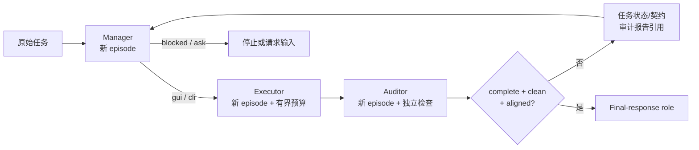

# LongHorizon-Harness 源码调研与 mini-loop 采用边界

> 调研日期：2026-08-15<br>
> 上游仓库：[AMAP-ML/LongHorizon-Harness](https://github.com/AMAP-ML/LongHorizon-Harness)<br>
> 固定源码：`af17ce81bec1d1b585d5104f29b7852fa3c9ec18`（`main`，2026-08-14）<br>
> 发布版本：`v0.1.5`，tag commit `1d4bdf744e0ac13cd0a8152ef9dac8a638ac5fe6`<br>
> 源码树：上述两个 commit 均为 `136e742a9829cea585927e419914ed33ab0558e1`<br>
> 论文：[Long-Horizon Agent Harnessing](https://arxiv.org/abs/2608.01964v1)，arXiv `2608.01964v1`（2026-08-03）<br>
> mini-loop 对照基线：提交 `ecf85f0`；调研时已有的未提交工作不作为已交付基线

本文把内容分成三类：

- **[事实]**：可由固定源码、论文或本次复验直接支持。
- **[判断]**：基于事实形成的工程判断，不冒充上游承诺。
- **[建议]**：面向 mini-loop 的采用方案，尚未实现。

## 0. 结论先行

**[判断] LongHorizon-Harness 值得借鉴，但不适合直接作为 mini-loop 的运行时依赖。**

它最有价值的贡献不是一个新的 `Harness` 类型，也不是某套提示词，而是把长任务变成一个有严格验收门的外层控制循环：

```text
稳定任务契约
  -> 新鲜 Manager 上下文提出单轮计划
  -> 新鲜 Executor 上下文执行一个主要状态变化
  -> 新鲜 Auditor 上下文独立检查
  -> 只提升有证据的事实
  -> complete + clean + aligned 才允许结束
```

这套思路正好补充 mini-loop 当前偏“单 session agent loop + 可选静态只读 workflow”的结构。不过，上游 `v0.1.5` 仍有四个不能直接带入本项目的边界：

1. Manager 的任务状态和任务契约在公开实现中仍是自然语言字符串，不是可并发更新、可验证的类型化状态。
2. “独立 Auditor”保证了新上下文，却不保证不同模型，也不在所有 adapter 上保证强制只读。
3. Codex 默认可绕过 approval/sandbox，本地子进程还继承几乎完整的宿主环境变量。
4. 名为 `resume` 的操作实际会按原任务和配置创建一次新 run；它不是轮次检查点恢复。

**[建议]** 不复制上游 2,000 多行的 Manager、Dashboard 或冻结评测目录；先在 mini-loop 内实现一个默认关闭的 `VerifiedLoopService`，复用现有权限、sandbox、secret scrub、action journal、SQLite、trajectory 和新鲜 Agent 创建机制。其首要对象应是“类型化已验证检查点”，而不是 Manager 提示词。

## 1. 调研范围与证据等级

### 1.1 固定快照

**[事实]** 本次同时固定了 `main` commit、`v0.1.5` tag commit 和 tree hash。`main` 与 tag commit 不同，但 tree 完全一致，因此下文源码结论可视为 `v0.1.5` 结论，而不是随分支漂移的网页印象。

包元数据声明 Python `>=3.10`、MIT License，核心依赖只有 `packaging`、`tomli`、FastAPI、Uvicorn 和 WebSockets；它主要通过外部 CLI 启动 Codex、Claude Code 或 DeepSeek Harness，而不是在 Python 包里实现模型客户端。见固定版本的 [`pyproject.toml`](https://github.com/AMAP-ML/LongHorizon-Harness/blob/af17ce81bec1d1b585d5104f29b7852fa3c9ec18/pyproject.toml#L5-L20)。

### 1.2 本次检查了什么

**[事实]** 调研覆盖：

- README/中文 README 与论文的方法、实验和限制；
- `manager.py`、角色 prompt、audit parser、adapter、local environment、supervisor、Web control plane；
- WeaveBench、OSWorldv2、Terminal-Bench 三套冻结兼容目录；
- mini-loop 的 `Harness`、Goal、Workflow、Subagent、StateStore、ActionJournal、Trajectory、权限和 token-efficiency 边界；
- 上游前后端测试，但没有运行付费模型或三套外部 benchmark。

### 1.3 不能从本报告推出什么

**[事实]** 本报告没有独立复现论文成功率，也没有证明论文中某个单一组件造成了全部提升。三套 benchmark 的外部模型、VM、数据或图片服务成本很高，且部分资源受访问权限或版本漂移影响。

**[判断]** 论文与项目方结果适合证明“这类外层循环值得评估”，不适合直接证明“接入 mini-loop 后会得到相同百分比提升”。

## 2. 它实际上是什么

### 2.1 外层多角色进程 harness，不是新的 agent 内循环

**[事实]** LongHorizon-Harness 包在已有 agent CLI 外面。每个角色调用都启动一个新 episode/进程，核心 adapter 接口只有：给定 prompt、environment、budget 和 trajectory 路径，返回 `EpisodeResult`。见 [`AgentAdapter`](https://github.com/AMAP-ML/LongHorizon-Harness/blob/af17ce81bec1d1b585d5104f29b7852fa3c9ec18/src/lh_harness/adapters/base.py#L9-L17)。

它也不是通用容器编排器。虽然抽象了 `Environment.exec/screenshot/upload/download`，但 stock CLI 目前只接受 `env=local`；容器和 VM 主要存在于冻结的 benchmark 复现套件。见 [`Environment`](https://github.com/AMAP-ML/LongHorizon-Harness/blob/af17ce81bec1d1b585d5104f29b7852fa3c9ec18/src/lh_harness/environment/base.py#L8-L21) 与 [CLI 环境构造](https://github.com/AMAP-ML/LongHorizon-Harness/blob/af17ce81bec1d1b585d5104f29b7852fa3c9ec18/src/lh_harness/cli.py#L1955-L1960)。

### 2.2 Manage–Execute–Audit 控制流



**[事实]** 四个角色的实际职责是：

- **Manager**：读取原始任务、当前任务状态/契约、此前 auditor report 和 harness feedback，选择 `gui`、`cli`、`done`、`blocked`、`ask` 或 `invalid`。它不接收所有原始 executor trajectory。
- **Executor**：拿到原始任务、本轮计划、当前状态和明确引用的 audit 信息，在有预算的新上下文中执行。
- **Auditor**：拿到任务、契约、Executor 的声明和可检查环境；prompt 明确要求自证，不把 Executor 自述当成独立证据。
- **Final-response role**：根据已完成 run 生成面向用户的结束回复；这也是一次额外 episode。

角色输入组装分别可在 [`manager.py`](https://github.com/AMAP-ML/LongHorizon-Harness/blob/af17ce81bec1d1b585d5104f29b7852fa3c9ec18/src/lh_harness/manager.py#L261-L303)、[Executor 调用](https://github.com/AMAP-ML/LongHorizon-Harness/blob/af17ce81bec1d1b585d5104f29b7852fa3c9ec18/src/lh_harness/manager.py#L546-L589)、[Auditor 调用](https://github.com/AMAP-ML/LongHorizon-Harness/blob/af17ce81bec1d1b585d5104f29b7852fa3c9ec18/src/lh_harness/manager.py#L694-L723) 中核对。

### 2.3 真正有用的是验收权与执行权分离

**[事实]** 完成并不由 Executor 的“我做完了”决定。Manager 选择 `done` 时，runtime 还要求最近一次 audit 同时满足：

- `status == complete`；
- `integrity_status == clean`；
- `contract_audit_status == aligned`。

否则 runtime 会生成反馈并进入下一轮。见 [完成门禁](https://github.com/AMAP-ML/LongHorizon-Harness/blob/af17ce81bec1d1b585d5104f29b7852fa3c9ec18/src/lh_harness/manager.py#L446-L483)。

**[判断]** 这是最值得 mini-loop 吸收的机制：执行者可以提出结果，但不能独占“结果已经满足任务”的判定权。

## 3. 上下文、状态与证据语义

### 3.1 新鲜上下文是真实机制

**[事实]** CLI adapter 每次通过新的子进程执行一个 episode，不把上轮 CLI 会话继续传给下一角色。原始轨迹会写入 run 目录，供 operator、Dashboard 或审计取证，但不会把整个历史直接塞回后续模型上下文。

这并非简单“删除历史”：runtime 会有界地保留 Manager 维护的任务状态、任务契约、audit report 引用和 harness feedback。角色 prompt 的历史组装可见 [`role_prompts.py`](https://github.com/AMAP-ML/LongHorizon-Harness/blob/af17ce81bec1d1b585d5104f29b7852fa3c9ec18/src/lh_harness/role_prompts.py#L721-L750)。

**[判断]** 它解决的是“上下文所有权”而不是普通压缩：下一轮只继承被控制面选择的长期状态，而不是让执行轨迹自然膨胀成事实来源。

### 3.2 论文状态模型比公开实现更强

**[事实]** 论文把任务状态描述为需求、artifact、fact 等结构化记录，并给记录赋予 completed/pending/blocked/untrusted 之类状态与证据引用。

但 `v0.1.5` 中 `ManagedRound.task_state` 和 `task_contract` 都是 `str`，主要从 Manager 的自然语言输出中抽取；`AuditReport` 虽有结构化控制头与列表，长期状态本身仍不是带 revision/CAS 的领域模型。见 [`ManagedRound`](https://github.com/AMAP-ML/LongHorizon-Harness/blob/af17ce81bec1d1b585d5104f29b7852fa3c9ec18/src/lh_harness/types.py#L90-L103) 和 [文本抽取](https://github.com/AMAP-ML/LongHorizon-Harness/blob/af17ce81bec1d1b585d5104f29b7852fa3c9ec18/src/lh_harness/role_prompts.py#L603-L622)。

**[判断]** 这是论文概念与当前公开实现之间最重要的落差。自然语言状态适合提示模型，却不应直接成为 mini-loop 的持久权威状态：它难以做并发更新、schema migration、逐约束覆盖、来源追踪和失败恢复。

### 3.3 “独立审计”需要准确解释

**[事实]** Auditor 是独立 episode、独立 prompt 和独立上下文；不同角色也可以配置不同 backend/model。

**[事实]** 默认情况下各角色仍可继承同一 agent/model，Auditor 也仍是 LLM。它不是天然的独立组织、独立模型、统计复核或确定性 verifier。

**[判断]** 应把它称为“上下文独立的语义审计”。对代码测试、文件 hash、schema、发布工件或权限边界，仍应优先使用确定性 verifier；LLM Auditor 负责选择检查、解释证据和发现语义遗漏，而不应成为唯一完成权威。

## 4. Adapter、权限与隔离边界

### 4.1 Adapter SPI 很小，但 CLI 不是插件注册表

**[事实]** `AgentAdapter` 协议足够小，程序化调用者可以实现自定义 adapter；然而 stock CLI 用固定 switch 构造 `codex`、`claude_code` 或 `deepseek_harness`，不是入口点发现或动态 registry。见 [CLI agent 构造](https://github.com/AMAP-ML/LongHorizon-Harness/blob/af17ce81bec1d1b585d5104f29b7852fa3c9ec18/src/lh_harness/cli.py#L1963-L2022)。

**[判断]** 这是一条清楚的内部 seam，但不能据此把 `v0.1.5` 描述成成熟的第三方 adapter 生态。

### 4.2 Codex 角色隔离主要依赖 prompt

**[事实]** Codex adapter 默认加入 `--dangerously-bypass-approvals-and-sandbox`。stock CLI 构造 Codex adapter 时没有把 Manager/Auditor 的角色转成强制 sandbox mode；所谓 hidden path 也只是追加提示。见 [`CodexAdapter`](https://github.com/AMAP-ML/LongHorizon-Harness/blob/af17ce81bec1d1b585d5104f29b7852fa3c9ec18/src/lh_harness/adapters/codex.py#L47-L61) 与 [CLI 构造](https://github.com/AMAP-ML/LongHorizon-Harness/blob/af17ce81bec1d1b585d5104f29b7852fa3c9ec18/src/lh_harness/cli.py#L1963-L1990)。

**[判断]** 新鲜进程不等于最小权限进程。若把上游 CLI 嵌套到 mini-loop 的真实工作区，Manager/Auditor 就可能绕开 mini-loop 已有的 ToolCatalog、approval、journal、sandbox 和 secret 边界。

### 4.3 本地环境变量暴露面偏大

**[事实]** `LocalEnvironment.exec` 从 `os.environ` 复制环境，仅主动移除 Web token，再通过 shell 创建子进程。见 [`LocalEnvironment.exec`](https://github.com/AMAP-ML/LongHorizon-Harness/blob/af17ce81bec1d1b585d5104f29b7852fa3c9ec18/src/lh_harness/environment/local.py#L97-L169)。

**[判断]** 这对个人机器上的方便运行可以理解，但不满足 mini-loop 当前 secret allow-list/scrub 的采用要求。外部 adapter 若后续确有必要，应使用环境白名单、隔离工作区、统一日志脱敏和显式 credential broker。

### 4.4 Claude Code 与 DeepSeek 的边界更细，但仍不完整

**[事实]** Claude Code adapter 为不同角色设置 tool deny list，并对工作区做前后快照；Auditor 仍可保留 shell，快照只检测变更而不恢复工作区，也不能阻止工作区外或 GUI 应用里的副作用。见 [`claude_permissions.py`](https://github.com/AMAP-ML/LongHorizon-Harness/blob/af17ce81bec1d1b585d5104f29b7852fa3c9ec18/src/lh_harness/adapters/claude_permissions.py#L20-L72)。

**[事实]** DeepSeek adapter 区分只读与 workspace-write，并使用独立的 `DSH_HOME`；但当前 runner 把完整 prompt 作为进程参数传递，且 headless 路径只返回最终答案，没有完整 tool event stream。见 [`deepseek_runner.py`](https://github.com/AMAP-ML/LongHorizon-Harness/blob/af17ce81bec1d1b585d5104f29b7852fa3c9ec18/src/lh_harness/adapters/deepseek_runner.py#L35-L79)；上游也把后一点列为当前 phase 的[限制](https://github.com/AMAP-ML/LongHorizon-Harness/blob/af17ce81bec1d1b585d5104f29b7852fa3c9ec18/README.md#L281-L289)。

**[判断]** 上游做了真实的路径、symlink、日志边界和 role-policy hardening，不能简单说它“没有安全设计”；准确结论是：不同 adapter 的强制隔离程度不一致，尚不适合作为 mini-loop 的统一 authority boundary。

## 5. 持久化、恢复与运维成熟度

### 5.1 `resume` 是 retry，不是 checkpoint resume

**[事实]** `RunSupervisor._resume_once` 从旧 run 读取 task、agent、model、workspace 和 config，然后创建一个新 run；源码把关系记录为 `resumed_from`，并明确写入 `resume_kind: retry`。旧轮次的 Manager state、当前 round 和已完成 episode 不会被恢复到新的 Manager loop。见 [`_resume_once`](https://github.com/AMAP-ML/LongHorizon-Harness/blob/af17ce81bec1d1b585d5104f29b7852fa3c9ec18/src/lh_harness/supervisor/service.py#L2064-L2119)。

**[判断]** 上游对内部语义的注释是诚实的，但用户界面的 `resume` 名称容易让人误以为存在 durable checkpoint。mini-loop 采用时必须把“重新执行”和“恢复已验证检查点”分成两个操作。

### 5.2 默认配置文档已经出现漂移

**[事实]** 代码和生成的 config template 使用 `max_rounds=25`、Manager/Auditor `300s`；英文 README 配置表仍写 `30` 和 `600s`。对照 [`types.py`](https://github.com/AMAP-ML/LongHorizon-Harness/blob/af17ce81bec1d1b585d5104f29b7852fa3c9ec18/src/lh_harness/types.py#L31-L40)、[`config.py`](https://github.com/AMAP-ML/LongHorizon-Harness/blob/af17ce81bec1d1b585d5104f29b7852fa3c9ec18/src/lh_harness/config.py#L58-L91) 与 [README 配置表](https://github.com/AMAP-ML/LongHorizon-Harness/blob/af17ce81bec1d1b585d5104f29b7852fa3c9ec18/README.md#L323-L352)。

`HarnessConfig()` 的直接库调用默认又是 `max_total_episodes=4`，与 CLI/Web 的 `max_rounds=25` 属于不同配置入口。它未必是 bug，但调用者若不显式设定预算，很容易误读两者语义。

**[判断]** 这不是架构缺陷，却是 `0.1.5` 运维成熟度的重要信号：预算、安全和恢复语义应以代码与实际 receipt 为准，不能只依赖 README。

### 5.3 运行账本与人工控制是上游强项

**[事实]** 每轮的 Manager prompt/plan、Executor 输出、Auditor 报告和 metadata 会写入 append-only `rounds.jsonl`；provider trajectory 会被归一化，截图另存为私有 artifact。Supervisor 的 `ControlBus` 使用 append-only command/receipt、单调 revision、原子 status/owner JSON 和跨进程文件锁。

Web 控制面提供 snapshot、REST event replay 和 WebSocket；cursor 丢失时要求重新取得 snapshot，不会假装连续。人工注入在轮次边界由 Manager 消费，因此 README 所说的 mid-run instruction 是“run 进行期间排队”，不是对正在执行的 episode 做 token 级实时 steering。见 [round ledger](https://github.com/AMAP-ML/LongHorizon-Harness/blob/af17ce81bec1d1b585d5104f29b7852fa3c9ec18/src/lh_harness/manager.py#L2093-L2148)、[`ControlBus`](https://github.com/AMAP-ML/LongHorizon-Harness/blob/af17ce81bec1d1b585d5104f29b7852fa3c9ec18/src/lh_harness/supervisor/control_bus.py#L446-L535)、[event replay](https://github.com/AMAP-ML/LongHorizon-Harness/blob/af17ce81bec1d1b585d5104f29b7852fa3c9ec18/src/lh_harness/webapi/events.py#L229-L387) 和 [human gate](https://github.com/AMAP-ML/LongHorizon-Harness/blob/af17ce81bec1d1b585d5104f29b7852fa3c9ec18/src/lh_harness/dashboard/gate.py#L100-L174)。

**[事实]** Web bearer token 会从 worker/agent 环境中删除。见 [Supervisor worker 环境](https://github.com/AMAP-ML/LongHorizon-Harness/blob/af17ce81bec1d1b585d5104f29b7852fa3c9ec18/src/lh_harness/supervisor/service.py#L1442-L1529)。这是积极边界，但不能替代前述“其他 ambient secrets 仍默认继承”的判断。

**[判断]** 上游的控制面价值在于账本、receipt 和 operator 可观察性，不在 Dashboard 视觉层。mini-loop 已有事件、SSE、trajectory 和 viewer，若采用，只需补充协调事件和 receipt schema。

### 5.4 测试与发布管线

**[事实，本次复验]** 在固定 checkout 上直接运行 Python suite 得到 `178 passed, 1 failed`；唯一失败是根路由期望 `200`、实际 `404`，原因是源码 checkout 尚未生成前端 bundle。

随后按 release workflow 的顺序执行：

1. `npm ci --prefix frontend/web --no-audit --no-fund`；
2. `npm test --prefix frontend/web`：`47/47 passed`；
3. `npm run build --prefix frontend/web`：通过；
4. `uv run --extra test pytest -q`：`179 passed`。

**[判断]** 这支持“固定源码在发布顺序下通过自身测试”，不支持“外部 benchmark 已复现”。仓库只有 tag/手工触发的 [release workflow](https://github.com/AMAP-ML/LongHorizon-Harness/blob/af17ce81bec1d1b585d5104f29b7852fa3c9ec18/.github/workflows/release.yml#L3-L62)，没有可见的 PR CI workflow；是否在每个合并请求上运行同等门禁不能由当前仓库证明。

## 6. 论文结果：收益与代价必须一起看

下表均为项目方论文/结果记录，非本次独立 benchmark。PassRate、Binary 和 Partial 的定义不同，不能横向相加。

| Benchmark | 对照 | Baseline | LongHorizon | 计算/口径 |
|---|---|---:|---:|---|
| WeaveBench，114 题 | Qwen3.7-Plus + Claude Code | PassRate `51.8%`，Overall `.702` | `80.7%`，`.835` | 最接近同模型、同 agent CLI、只换外层 harness；每题一次；输出 token 约 `2.3x` |
| OSWorld 2.0，108 题 | Qwen，GUI baseline | Binary `2.8%`，Partial `21.5%` | `8.3%`，`35.2%` | LongHorizon 使用 GUI+CLI，工具条件也变化；输出 token/题约 `28.9K -> 104K`（`3.6x`） |
| OSWorld Opus 子集，34 题 | Opus 4.7 | Binary `20.6%`，Partial `55.8%` | `35.3%`，`66.9%` | 论文表格/逐题口径；摘要另有 `20.0 -> 34.3`，34 题选择依据未充分说明 |
| Terminal-Bench 2.1，89 题 × 3 | Qwen + Claude Code | `69.7%` | `77.2%` | 三次 attempt；论文报告总 token 减少 `24%` |
| Terminal-Bench 2.1 | Codex + GPT-5.6 Luna | — | `83.1%` | 不应与 Qwen baseline 当成只换 harness 的因果对照 |

来源：论文的 [HTML 版本](https://arxiv.org/html/2608.01964) 与固定版本 [README 结果表](https://github.com/AMAP-ML/LongHorizon-Harness/blob/af17ce81bec1d1b585d5104f29b7852fa3c9ec18/README.md#L138-L178)。

### 6.1 结果支持什么

**[判断]** WeaveBench 是最强的“外层循环可能有效”证据，因为模型、Claude Code 和 root 权限基本相同。结果说明：在需要跨多步建立和验证可见 artifact 的任务中，新鲜执行上下文加外部审计可能显著减少早期错误的累积。

### 6.2 结果不支持什么

**[事实]** 论文没有提供组件消融，无法分离以下变量各自贡献：外置任务状态、新鲜 Executor、Auditor、更多轮次、更多 token 或工具集变化。WeaveBench/OSWorld 每题一次，未报告置信区间；Terminal-Bench 有三次 attempt，但也没有给出方差/置信区间。论文也没有统一报告墙钟时间和美元成本。

**[事实]** OSWorld 的 baseline 是 single-action GUI，而 LongHorizon 是 hybrid GUI+CLI，不能把差值完全归因于 harness。论文也报告，在瓶颈是单步感知、数学推理、算法或局部编码时，长循环收益较小，部分任务还会回退。

**[判断]** 这些结果证明的是整个实验包的效果，而不是 Manager prompt 的独立效果。mini-loop 需要在自己的任务分布和固定预算上重新做 paired evaluation。

## 7. 三套评测的复现边界

### 7.1 WeaveBench

**[事实]** 冻结指南要求 Linux/KVM/Docker、至少 32GB 内存、较大磁盘、公开图片 host、模型服务和 Opus judge。嵌套官方文档给出了 dataset revision，但 LongHorizon 顶层下载流程没有把所有 dataset、任务内容和活动 VM hash 一并固化。见 [LongHorizon 复现入口](https://github.com/AMAP-ML/LongHorizon-Harness/blob/af17ce81bec1d1b585d5104f29b7852fa3c9ec18/eval/WeaveBench-harness/README.md#L5-L28) 与 [嵌套 WeaveBench pin](https://github.com/AMAP-ML/LongHorizon-Harness/blob/af17ce81bec1d1b585d5104f29b7852fa3c9ec18/eval/WeaveBench-harness/WeaveBench/docs/REPRODUCE.md#L6-L19)。

**[判断]** 可以复现方法，不足以保证未来逐 bit 重放论文环境。

### 7.2 OSWorldv2

**[事实]** 三套中 pin 最完整：冻结 README 指向 release `osworld-v2-2026.06.24`、code commit `2b9b7b4...`，并记录 manifest、task、asset 和 VM tag。与此同时，gated Hugging Face 资源、GitLab、VM image、图片 host 和模型服务仍是外部门槛。见 [OSWorldv2 复现说明](https://github.com/AMAP-ML/LongHorizon-Harness/blob/af17ce81bec1d1b585d5104f29b7852fa3c9ec18/eval/OSWorldv2-harness/README.md#L37-L61)。

### 7.3 Terminal-Bench

**[事实]** 这是最弱的复现链：数据集不随仓库提供，路径没有稳定 dataset SHA；只提供 LongHorizon 配置，没有完整 baseline replay。更关键的是冻结 README 明确说明原实验代码和 prompts 在迭代中丢失，当前内容是 best-effort reconstruction，复现性能可能不同。见 [Terminal-Bench 说明](https://github.com/AMAP-ML/LongHorizon-Harness/blob/af17ce81bec1d1b585d5104f29b7852fa3c9ec18/eval/TB-harness/README.md#L120-L122)。

### 7.4 评测目录不是可复用核心库

**[事实]** 顶层 README 把三套 `eval/` 内容和其中嵌套的 harness copy 定义为冻结兼容副本；新集成应使用顶层 `src/`。见 [评测目录说明](https://github.com/AMAP-ML/LongHorizon-Harness/blob/af17ce81bec1d1b585d5104f29b7852fa3c9ec18/README.md#L518-L528)。

**[建议]** mini-loop 不应 vendor 这些目录。需要对比时固定上游 SHA、数据 revision、模型快照、工具版本、环境镜像和逐题输入 hash，并把结果写成自己的可审计 benchmark manifest。

## 8. 与 mini-loop 的能力对照

### 8.1 已有能力，不要重复造

| 能力 | mini-loop 当前基线 | 采用含义 |
|---|---|---|
| Harness | [`Harness`](../mini_loop/harness.py) 是不可变策略/注入包，含 hooks、skills、compactor、recovery、sandbox、secrets、role tool policy 等 | 不把可变轮次状态塞进 `Harness`，新服务不能也叫 Harness |
| 新鲜 Agent | [`subagents.py`](../mini_loop/subagents.py) 已能派生 Harness、应用角色工具策略并记录 lineage | 复用创建机制，但扩展结构化 episode 结果 |
| Goal | [`goals.py`](../mini_loop/goals.py) 有 durable objective、revision/CAS、预算和默认解除激活 | 复用目标/激活语义，不把自由文本 task state 冒充 Goal |
| Workflow | [`workflows/`](../mini_loop/workflows/) 是固定、无环、严格只读的 AGENT/VERIFY/REDUCE DAG | 动态写入型 MEA loop 应是相邻服务，不强塞静态 DAG |
| Side effect | [`actions.py`](../mini_loop/actions.py) 有 action journal/reconcile；tool pipeline 有 hooks、permission、sandbox 和 secret scrub | Executor 副作用必须继续走这一权威路径 |
| 证据/观测 | [`trajectory.py`](../mini_loop/trajectory.py)、SQLite events、SSE、trace viewer 已存在 | 新轮次只增加事件/receipt，不复制上游 Dashboard/JSONL 子系统 |
| Token 效率 | [`TOKEN_EFFICIENCY_COMPONENTS.md`](TOKEN_EFFICIENCY_COMPONENTS.md) 已分离 authority、projection、mask、recovery、metering | 复用有界投影，不再引入不透明“上下文压缩器” |

### 8.2 不能复用现有 Workflow 的完成语义

**[事实]** mini-loop 的实验性只读 Workflow 可以让 `UNVERIFIED` artifact 满足下游依赖，并允许 verifier 不可用时 run 仍结束为 `COMPLETED`。这适合分析型 DAG 的降级语义。

**[判断]** 对会修改仓库或外部系统的 LongHorizon 风格协调器，这个语义过弱。新服务必须定义：blocking requirement 未逐项验证、证据未知、integrity 不干净或 verifier 缺失时，都不能声称 verified completion。

### 8.3 真正缺少的部分

**[判断]** mini-loop 不是缺少另一个 Agent loop，而是缺少以下四件组合在一起的能力：

1. 原始任务约束的类型化、版本化合同；
2. 每轮只做一个主要变化的新鲜角色上下文；
3. 独立于 Executor 声明的 evidence-backed 审计；
4. 只把审计通过的事实提升为下一轮权威检查点。

## 9. 建议的 mini-loop 设计

### 9.1 组件位置

**[建议]** 在 `SessionManager` 服务层增加默认关闭的 `VerifiedLoopService`（或 `EpisodeCoordinator`），与 `WorkflowService` 相邻，而不是修改 `Agent._loop` 或扩张 `Harness` 的职责。

```text
SessionManager
  ├─ AgentSession -> Agent._loop               现有默认路径，不变
  ├─ WorkflowService                           现有固定只读 DAG，不变
  └─ VerifiedLoopService                       新增、显式启用
       ├─ ManagerRole       纯提案、无副作用
       ├─ ExecutorRole      派生的受限 Harness
       ├─ VerifierRegistry  确定性检查优先
       └─ AuditorRole       语义审计与证据归纳
```

### 9.2 最小类型化合同

```text
TaskContractV1
  run_id
  revision
  original_request_hash
  requirements[]        # blocking/non-blocking、acceptance、authority
  allowed_surfaces[]
  persistence_boundary
  contamination_rules[]

VerifiedCheckpointV1
  contract_revision
  state_revision
  requirements[]        # pending/verified/blocked/untrusted
  artifacts[]           # digest、producer、evidence_refs
  facts[]                # source、freshness、trust
  blockers[]

RoundPlanV1
  round_id
  base_state_revision
  objective              # 单轮唯一主要状态变化
  acceptance[]
  allowed_capabilities[]
  budget
  evidence_refs[]

AuditReceiptV1
  contract_hash
  round_id
  verdict                # complete/incomplete/blocked
  integrity              # clean/suspect/violation
  coverage[]              # 逐 requirement
  evidence_refs[]
  verifier_ids[]
  workspace_diff_digest

StatePatchV1
  base_revision
  operations[]
  supporting_receipts[]
```

### 9.3 Authority 规则

**[建议]** 采用以下不可越过的规则：

1. workspace、ActionJournal、测试 receipt、artifact digest 和外部系统 receipt 是 authority；自然语言任务状态只是 projection。
2. Manager 只能提出 `StatePatchV1`，runtime 通过 schema、base revision 和 receipt coverage 后才 CAS 应用。
3. Manager 和 Auditor 同时通过 ToolCatalog、permission mode 与 sandbox 强制只读，不能只在 prompt 中声明。
4. Executor 的所有副作用必须经过现有工具执行管线，禁止直接在 mini-loop 外层启动一个 danger-bypass CLI 操作真实工作区。
5. Auditor 不能把 Executor 自述当证据；确定性 verifier 优先，LLM 只负责语义判断和证据编排。
6. Final response 只能引用最后一个 `VerifiedCheckpointV1`；未验证工作必须显式标为 partial/unverified。
7. 崩溃恢复读取 durable state/round ledger 后默认解除自动激活；用户明确继续后才进入下一轮。

### 9.4 一轮的建议状态机

```text
PLANNED
  -> EXECUTING
  -> EXECUTED
  -> VERIFYING
  -> VERIFIED ---------> checkpoint CAS -> next round / complete
          \-> REJECTED -> evidence-backed feedback -> next plan
          \-> BLOCKED  -> stop and request authority/input
```

每个状态转换都应有 event id、input digest、role config、budget/usage、tool-policy digest、trajectory ref 和可重建请求 receipt。这样“新鲜上下文”不会变成“丢失可追溯性”。

## 10. 分阶段采用路线

### Phase 0：外部 paired benchmark

**目标**：先证明任务分布中确有收益，不改变 mini-loop authority。

- 固定同一模型/provider/effort、初始 workspace、工具集合、轮次/总 token/墙钟预算；
- 对比现有 Agent loop 与外部 MEA wrapper；
- 记录 pass rate、角色 token、cache、成本、p50/p95、轮数、恢复次数、状态污染和审计误判；
- 外部 LongHorizon 只允许操作隔离副本，禁止接触真实工作区凭据。

**进入下一阶段门槛**：在预先定义的长任务集上提升可重复，且总成本/延迟处于可接受区间。

### Phase 1：只读 shadow contracts

**目标**：验证类型和证据模型，不执行任何 Manager 建议。

- 从既有 trajectory 生成候选 `TaskContractV1`、`RoundPlanV1`、`AuditReceiptV1`；
- 做 schema、prompt injection、证据覆盖和 replay 测试；
- 对比 LLM verdict 与确定性 gate，不改变 completion 状态。

**门槛**：自然语言内容不能越权改写 authority；同一 receipt replay 得到相同 fold。

### Phase 2：默认关闭的 CLI-only 内部协调器

**目标**：最小可用的单 Manager、单 Executor、单 Auditor 路径。

- 三种角色都用新鲜 Agent，并通过 `Harness.derive(...)` 获取最小权限；
- 先支持代码/文件任务和确定性 verifier；
- 限制轮数、总 token、无进展次数和副作用面；
- UI 仅投影已有 SSE/trace，不创建第二套 Dashboard。

**门槛**：只读角色零写入；未验证不完成；请求可重建；失败可安全停止。

### Phase 3：持久检查点与真实恢复

**目标**：实现语义真实的 resume。

- SQLite 保存 coordinator、round、checkpoint revision 和 outbox；
- 重启后重建最后已验证状态，不重复已 journaled 副作用；
- 自动 continuation 默认解除；恢复与 retry 分开建模和展示。

**门槛**：进程在每个状态转换点崩溃都能安全重启，且不会重复外部副作用或跳过审计。

### Phase 4：GUI/外部 CLI adapter（按需）

只有在 CLI-only 实验表明确有需求时再增加：隔离 workspace、环境白名单、credential broker、进程参数脱敏、GUI 前后状态证据和可撤销/人工批准策略必须先成立。

## 11. 明确不采用的内容

**[建议]** 当前不采用：

- 不把上游作为 mini-loop 运行时依赖，也不 vendor 三套 eval/fork；
- 不让所有角色以 danger-bypass 权限操作真实工作区；
- 不把自由文本 Manager state 当 durable authority；
- 不把同模型 LLM Auditor 当唯一 verifier；
- 不复制 Dashboard、JSONL event store 或已有功能的 context reducer；
- 不复用现有只读 Workflow 的 `UNVERIFIED -> COMPLETED` 语义；
- 不把“按旧 task/config 新建 run”称为 checkpoint resume；
- 不默认开启三角色循环；短任务和单步瓶颈仍走现有 Agent loop。

## 12. 最终决策

**采用判断：机制级采用，依赖级不采用，先评测后实现。**

优先顺序应是：

1. 固定预算的 paired benchmark；
2. `TaskContractV1` / `VerifiedCheckpointV1` / `AuditReceiptV1`；
3. enforced role isolation 与 deterministic-verifier-first；
4. 默认关闭的内部 `VerifiedLoopService`；
5. durable checkpoint resume；
6. 最后才考虑 GUI 或外部 CLI adapter。

如果额外三角色调用没有带来可重复的完成率提升，或者无法同时保证“未验证不完成、只读角色零写入、输入可重建、崩溃安全恢复”，就应只把 LongHorizon-Harness 保留为外部评测参考，而不进入默认产品路径。

## 附录 A：关键证据索引

- 项目定位与循环：[README.zh-CN](https://github.com/AMAP-ML/LongHorizon-Harness/blob/af17ce81bec1d1b585d5104f29b7852fa3c9ec18/README.zh-CN.md#L5-L85)
- Manager/Executor/Auditor 主循环：[`manager.py`](https://github.com/AMAP-ML/LongHorizon-Harness/blob/af17ce81bec1d1b585d5104f29b7852fa3c9ec18/src/lh_harness/manager.py)
- 角色 prompt 与状态抽取：[`role_prompts.py`](https://github.com/AMAP-ML/LongHorizon-Harness/blob/af17ce81bec1d1b585d5104f29b7852fa3c9ec18/src/lh_harness/role_prompts.py)
- 审计控制头解析：[`auditor_agent.py`](https://github.com/AMAP-ML/LongHorizon-Harness/blob/af17ce81bec1d1b585d5104f29b7852fa3c9ec18/src/lh_harness/auditor_agent.py#L182-L316)
- 公共类型与预算：[`types.py`](https://github.com/AMAP-ML/LongHorizon-Harness/blob/af17ce81bec1d1b585d5104f29b7852fa3c9ec18/src/lh_harness/types.py#L31-L125)
- 本地环境边界：[`local.py`](https://github.com/AMAP-ML/LongHorizon-Harness/blob/af17ce81bec1d1b585d5104f29b7852fa3c9ec18/src/lh_harness/environment/local.py#L97-L169)
- Resume/retry 语义：[`service.py`](https://github.com/AMAP-ML/LongHorizon-Harness/blob/af17ce81bec1d1b585d5104f29b7852fa3c9ec18/src/lh_harness/supervisor/service.py#L2064-L2119)
- 论文 HTML：[arXiv](https://arxiv.org/html/2608.01964)

## 附录 B：本次验证边界

- 上游前端：`47/47 passed`，production build 通过；
- 上游 Python：按 release 顺序生成前端后 `179 passed`；
- 未运行 WeaveBench、OSWorldv2、Terminal-Bench 的模型/VM 实验；
- 未修改 mini-loop runtime、默认值、Mermaid 或 interactive architecture；
- 本报告只新增研究文档和 README 导航，调研前已经存在的未提交文件不属于本次工作。
