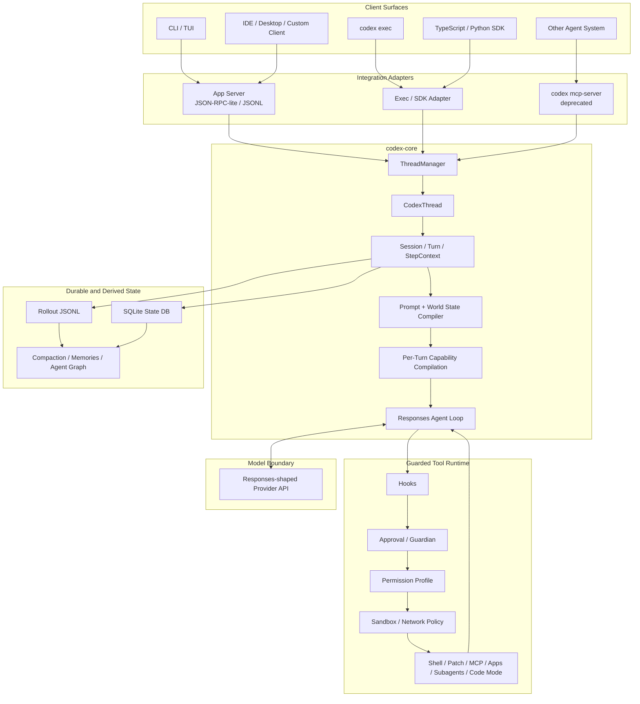
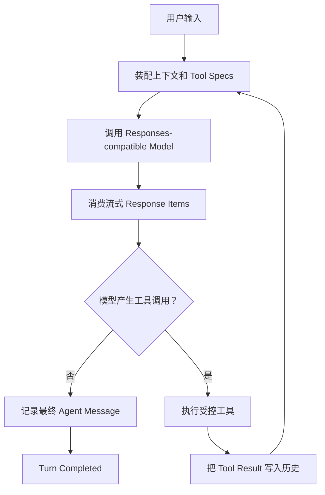
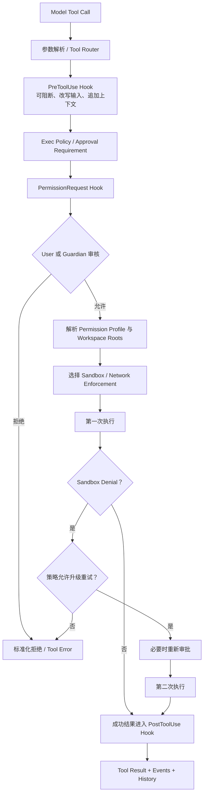

# OpenAI Codex Harness 源码级调研：架构、边界与 mini-loop 启示

> 调研日期：2026-08-21<br>
> 上游仓库：[openai/codex](https://github.com/openai/codex)<br>
> 固定版本：[rust-v0.149.0 / 0.149.0](https://github.com/openai/codex/releases/tag/rust-v0.149.0)<br>
> 固定提交：758ef40f50c1a458425c7cfbf1eb12cbc07af0b0<br>
> 证据口径：固定提交源码 > 同版本仓库文档 > OpenAI 官方架构文章 > 本文判断

## 0. 结论先行

**[判断] openai/codex 中的 Harness 已经不是简单的“LLM + Shell + Patch”，而是一套面向软件开发任务的：**

> **Coding Agent Runtime + Tool Control Plane + Client Integration Protocol**

它覆盖从用户提交任务开始，到上下文装配、模型流式调用、工具能力编译、受控执行、审批与沙箱、长上下文治理、子 Agent、线程持久化，以及面向 CLI、IDE、桌面端和第三方客户端的结构化事件输出。

OpenAI 对 Harness 的官方拆分是：

- 核心 Agent Loop；
- Thread 生命周期与持久化；
- 配置与认证；
- 工具执行与扩展。

官方文章还明确说明，Agent 逻辑集中在 Codex core，App Server 则以长驻进程和 JSON-RPC 协议托管 Core Thread，供富客户端接入。[官方 Harness 文章](https://openai.com/index/unlocking-the-codex-harness/)

**[事实] 截至 2026-08-21，GitHub Releases 中最新稳定版本是 0.149.0，于 2026-08-20 发布。** 本文所有源码结论固定到该 Release 对应的提交，不使用漂移中的 main 分支作为事实基线。

**[判断] 最准确的定位是：**

> Codex Harness 是面向 Coding Agent 的本地执行内核，以及围绕该内核建立的权限控制面、会话控制面和客户端协议。

### 0.1 本次源码核对对原始结论的八项校正

| 原始说法 | 0.149.0 源码校正 |
|---|---|
| Provider 主要是 OpenAI、Ollama、LM Studio 和自定义端点 | 内置列表还包括 Amazon Bedrock 与 Bedrock Runtime；但 Wire API 仍只有 Responses |
| 每次都发送完整上下文 | HTTP 请求会构造完整 input、store=false；健康的 Responses WebSocket 会话在同一 Turn 内可只发送增量后缀 |
| Subagent V2 是当前默认路径 | multi_agent 默认开启，但 multi_agent_v2 默认关闭；默认仍走 V1 工具组 |
| Memories 的配置默认都关闭 | memories Feature 默认关闭；一旦启用，generate_memories 与 use_memories 的有效默认值均为 true |
| Code Mode 远程 Host 整体属于实验能力 | code_mode 本身仍是 under development 且默认关闭；code_mode_host 基础设施已标记 Stable，App Server 的 WebSocket 监听才明确是 experimental / unsupported |
| codex mcp-server 是推荐集成入口之一 | 命令仍存在，但 0.149.0 CLI 已明确打印 deprecated，并说明未来移除 |
| codex mcp-server 只有 codex / codex-reply 两个工具 | 两个兼容工具仍在，但当前实验接口还暴露 Thread / Turn / Account / Config 等 v2 RPC |
| 默认模式无条件是 workspace-write + on-request | 有项目 trust decision 时通常推导为 workspace-write；原始 PermissionProfile 默认仍是只读，Approval 默认是 on-request |

这些校正不改变核心判断，反而说明：**Codex 的能力面由版本、Feature、模型、环境、权限与客户端共同决定，不能只凭工具名或配置项判断实际运行路径。**

## 1. 调研范围与证据纪律

### 1.1 本文分析什么

本文分析的是公开仓库中的：

- Codex CLI / TUI 与非交互执行入口；
- codex-core 的 Session、Turn、模型调用和 Tool Runtime；
- App Server 的 Thread / Turn / Item 协议；
- Shell、Patch、Sandbox、Approval、Guardian 和 Network Policy；
- MCP Client、Skills、Plugins、Hooks、Code Mode 和 Subagents；
- Rollout、Thread Store、State DB、Compaction 与 Memories；
- TypeScript / Python SDK 及 MCP Server 边界。

### 1.2 本文不分析什么

- Codex 模型权重、训练和服务端推理实现；
- Codex Cloud 的完整任务调度、容器、队列和控制平面；
- 未在该仓库公开的 IDE / Desktop 前端完整源码；
- OpenAI Responses 服务端内部实现；
- 组织策略、账号权限和 Hosted Tool 后端的非公开逻辑。

### 1.3 标签约定

- **[事实]**：固定提交源码、同版本文档或 OpenAI 官方文章可以直接验证；
- **[判断]**：由多个事实组合得出的架构解释；
- **[建议]**：对 mini-loop 的采用意见，不代表上游承诺；
- **[待验证]**：公开源码无法独立证明，需要真实账号、客户端或托管环境验证。

## 2. 先划清：公开仓库不等于整个 Codex 产品

| 组件 | 在本仓库中的公开情况 | 边界 |
|---|---|---|
| Codex CLI / TUI | 有 | 本地客户端与交互入口 |
| codex-core / Harness | 有 | Agent Loop、Turn、工具、安全与上下文核心 |
| Codex App Server | 有 | 富客户端协议与 Core Thread Host |
| TypeScript / Python SDK | 有 | 面向应用的封装层，能力面不必与 App Server 完全相同 |
| Skills / Plugins / Hooks | 规范和实现均有 | 仍受客户端、配置和信任状态约束 |
| MCP Client | 有 | 让 Codex 使用外部工具与资源 |
| codex mcp-server | 有但已弃用 | 实验兼容传输，不应作为新集成首选 |
| IDE Extension 完整前端 | 不在仓库中 | App Server 文档和协议仍公开 |
| Codex Cloud 完整后端 | 不在仓库中 | 仓库有部分 Cloud Client / Config，不等于托管平台开源 |
| 模型权重与 Responses 服务端 | 不在仓库中 | Harness 只消费模型服务 |

**[判断]** 因此，本文不能把本地 Harness 的行为外推成 Codex Cloud 全部行为，也不能把 App Server 协议等同于 IDE 的完整产品实现。

## 3. 整体架构

下面的图是源码模块的逻辑抽象，不表示所有入口都必须物理经过 App Server：



**[事实]** Rust workspace 已将 App Server、Code Mode、Exec Server、Sandbox、Network Proxy、Memories、Rollout、Thread Store、Plugins、OTel 等拆成独立 crate；codex-core 负责把它们组合为会话执行路径。

**[判断]** App Server 是最重要的富客户端边界，但“所有入口都经过 App Server”不是必要条件。真正共享的是 Core Harness 的会话、模型、工具与事件语义。

## 4. Agent 生命周期与核心循环

### 4.1 标准 Agent Loop

Codex 的核心循环可以简化为：



run_turn 的源码注释直接规定：

- 模型返回 Function Call 时，执行工具，并把输出放入下一次采样；
- 模型只返回 Assistant Message 时，记录历史并结束 Turn。[run_turn](https://github.com/openai/codex/blob/758ef40f50c1a458425c7cfbf1eb12cbc07af0b0/codex-rs/core/src/session/turn.rs#L145-L159)

因此一个 Turn 内会发生多轮：

```text
Inference -> Tool Call -> Tool Result -> Inference -> ... -> Agent Message
```

这不是传统的一次 request / response，也不是预先编译好的固定 DAG。主要控制流仍由模型通过 Agent Loop 决定。[OpenAI Agent Loop 文章](https://openai.com/index/unrolling-the-codex-agent-loop/)

### 4.2 Thread、Turn、Item

App Server 定义三种顶层对象：[App Server Core Primitives](https://github.com/openai/codex/blob/758ef40f50c1a458425c7cfbf1eb12cbc07af0b0/codex-rs/app-server/README.md#L20-L83)

| 对象 | 含义 |
|---|---|
| Thread | 一个可恢复、可持久化或显式 ephemeral 的 Agent 会话 |
| Turn | 一次用户请求以及随后的全部 Agent 工作 |
| Item | 用户消息、推理、Agent 消息、命令、文件修改等时间线单元 |

客户端可以：

- Start / Resume / Fork Thread；
- List / Read / Archive / Unarchive；
- Start / Interrupt Turn；
- 在 Turn 运行期间接收 Item delta；
- 回应 App Server 反向发起的审批请求。

一个 Turn 的可观察时间线更接近：

```text
turn/started
  -> item/started
  -> reasoning / agentMessage delta
  -> tool call / approval request
  -> command output / file diff delta
  -> item/completed
  -> ...
turn/completed
```

App Server 明确规定每个 Item 的生命周期是：

```text
item/started -> 0..N item-specific deltas -> item/completed
```

其中 completed Item 是该 Item 的最终状态；瞬时事件不一定进入可恢复历史。[事件协议](https://github.com/openai/codex/blob/758ef40f50c1a458425c7cfbf1eb12cbc07af0b0/codex-rs/app-server/README.md#L1532-L1593)

## 5. 模型调用与 Provider 抽象

### 5.1 它是 Responses-shaped，而不是任意 SDK 统一层

**[事实]** 0.149.0 的 WireApi 枚举只有 Responses；旧 chat wire API 会直接返回已移除错误。[WireApi](https://github.com/openai/codex/blob/758ef40f50c1a458425c7cfbf1eb12cbc07af0b0/codex-rs/model-provider-info/src/lib.rs#L55-L89)

内置 Provider 目录包括：

- OpenAI；
- Amazon Bedrock；
- Amazon Bedrock Runtime；
- Ollama；
- LM Studio；
- 用户通过 model_providers 添加的自定义配置。

Provider 配置还承载 Base URL、认证、Header、Query 参数、重试、Stream idle timeout、WebSocket 能力等。[内置 Provider](https://github.com/openai/codex/blob/758ef40f50c1a458425c7cfbf1eb12cbc07af0b0/codex-rs/model-provider-info/src/lib.rs#L493-L526)

**[判断]** Codex 能替换模型端点，但它不是 LiteLLM 式的“任意 Provider SDK 统一层”。它的请求、Response Item、Reasoning、Function Call、Encrypted Content、Streaming 和 Compaction 语义都围绕 Responses 协议设计。

### 5.2 完整请求、Prompt Cache 与 WebSocket 增量

HTTP / 通用 Responses 请求会：

- 从当前 Prompt 构造 formatted input；
- 带上当前 Tool Specs；
- 请求 reasoning.encrypted_content；
- 设置 store=false、stream=true；
- 设置 prompt_cache_key、service_tier 和文本输出约束。[Responses Request](https://github.com/openai/codex/blob/758ef40f50c1a458425c7cfbf1eb12cbc07af0b0/codex-rs/core/src/client.rs#L845-L941)

当前请求结构没有依赖 previous_response_id。**[判断]** 这使 Harness 可以保持客户端侧历史权威，并适配无服务端会话状态的调用方式。

但“每次都重传完整上下文”需要加一个限定：

- 普通请求以完整 input 构造；
- 当 Responses WebSocket 会话健康、请求属性未变化，而且新 input 是旧 input 的严格扩展时，客户端会计算并发送增量后缀。[WebSocket incremental input](https://github.com/openai/codex/blob/758ef40f50c1a458425c7cfbf1eb12cbc07af0b0/codex-rs/core/src/client.rs#L1218-L1260)

所以更精确的说法是：

> **逻辑上下文由 Harness 完整持有；物理传输可以是完整请求，也可以在同一连接中增量复用。**

## 6. Prompt 与上下文装配

Harness 不是把用户文本直接交给模型，而是把多种上下文来源编译成当前 Turn 的模型输入。逻辑上包括：

1. 模型级 Base Instructions；
2. Sandbox、Permission 与环境说明；
3. 用户 / Developer Instructions；
4. Codex Home 级 AGENTS 指令；
5. Project Root 到当前目录的 AGENTS 指令；
6. Skills 目录与按需加载说明；
7. 可选 Memories；
8. 当前工作目录、Shell 和环境快照；
9. 当前 Tool Plan；
10. 历史消息、Reasoning 与 Tool Result；
11. 当前用户输入与 Steering Input。

这里的“逻辑上”不表示所有内容都一定以独立 Message 按该顺序出现；不同模型能力和 Responses Lite 路径会改变具体编码。

### 6.1 AGENTS.md 层级

当前实现分成两层加载：

1. Codex Home User Instructions Provider 在 $CODEX_HOME 中优先选 AGENTS.override.md，否则选 AGENTS.md；
2. Project Loader 从项目根目录到当前目录逐层搜索，每层同样优先 AGENTS.override.md，再选 AGENTS.md 或配置的 fallback 文件。

更接近真实语义的示意是：

```text
$CODEX_HOME/(AGENTS.override.md | AGENTS.md)
        +
project-root/(AGENTS.override.md | AGENTS.md)
        +
...
        +
cwd/(AGENTS.override.md | AGENTS.md)
```

Project Loader 保留从根到 cwd 的顺序和来源信息，并受最大字节预算约束。[Codex Home 指令](https://github.com/openai/codex/blob/758ef40f50c1a458425c7cfbf1eb12cbc07af0b0/codex-rs/codex-home/src/instructions/mod.rs#L9-L74) [项目层级发现](https://github.com/openai/codex/blob/758ef40f50c1a458425c7cfbf1eb12cbc07af0b0/codex-rs/core/src/agents_md.rs#L197-L293)

### 6.2 Skills 的 Progressive Disclosure

初始 Skill Catalog 主要暴露：

- 名称；
- 描述；
- Source Locator / 路径；
- 触发与读取规则。

完整 SKILL.md 只在选中 Skill 后加载；其引用的 scripts、references、templates 和 assets 再按需要读取。[Skill Catalog Prompt](https://github.com/openai/codex/blob/758ef40f50c1a458425c7cfbf1eb12cbc07af0b0/codex-rs/ext/skills/src/catalog_prompt.rs#L3-L40)

**[判断]** 这不是单纯的文档约定，而是控制 Prompt 体积、减少无关指令冲突并保留能力可发现性的上下文治理机制。

### 6.3 World State 与缓存稳定性

**[判断]** Codex 将 cwd、权限、环境和 AGENTS 等视为会变化的 World State。运行中改变这些状态时，系统需要让新事实进入后续上下文，同时尽量不破坏稳定历史前缀；显式 prompt_cache_key 与增量请求逻辑共同支持这一目标。

不能把这个工程策略绝对化为“任何运行时变化都只追加一条消息”。不同上下文类型、Compaction 和 Responses Lite 路径可能采用不同表示。

## 7. 最关键的设计：每个 Turn 编译一份 Capability Plan

**[事实]** Session 在创建当前 StepContext 时，根据 TurnContext、环境、MCP Binding、Extension Data 和推荐能力构建 ToolRouter；不是进程启动时注册一次后永远不变。[StepContext Tool Router](https://github.com/openai/codex/blob/758ef40f50c1a458425c7cfbf1eb12cbc07af0b0/codex-rs/core/src/session/mod.rs#L3204-L3254)

build_tool_router 的主链是：[Tool Plan](https://github.com/openai/codex/blob/758ef40f50c1a458425c7cfbf1eb12cbc07af0b0/codex-rs/core/src/tools/spec_plan.rs#L121-L176)

```text
注册 Core Tool Sources
  -> 追加 MCP Tools
  -> 应用 MCP Exposure Policy
  -> 追加 Extension Tool Executors
  -> 追加 Dynamic Tool Runtimes
  -> 追加 Hosted Model Tool Specs
  -> 应用 Tool Search / Code Mode / Collision Policy
  -> 生成最终 Model-visible Specs
```

影响结果的变量包括：

```text
Model capabilities
× TurnContext
× Environment snapshot
× Permission and reviewer mode
× MCP bindings
× Apps and Plugins
× Feature flags
× Extensions and dynamic tools
× Hosted model tools
```

### 7.1 ToolExposure

当前 ToolExposure 不是简单的 visible / hidden 二值：[ToolExposure](https://github.com/openai/codex/blob/758ef40f50c1a458425c7cfbf1eb12cbc07af0b0/codex-rs/tools/src/tool_executor.rs#L49-L99)

| Exposure | 初始模型 Tool List | Tool Search | Code Mode |
|---|---:|---:|---:|
| Direct | 是 | 否 | 是 |
| Deferred | 否 | 是 | 是 |
| DeferredModelOnly | 否 | 是 | 否 |
| DirectModelOnly | 是 | 否 | 否 |
| CodeModeOnly | 否 | 否 | 是 |
| Hidden | 否 | 否 | 否 |

finalize_tool_router 还会：

- 处理 DirectModelOnly namespace override；
- 在存在 Deferred Tool 时注册 tool_search；
- 注册 Code Mode executors；
- 检查工具与 Namespace 冲突；
- 只把最终可见 Specs 交给模型。[Router Finalize](https://github.com/openai/codex/blob/758ef40f50c1a458425c7cfbf1eb12cbc07af0b0/codex-rs/core/src/tools/spec_plan.rs#L318-L451)

**[判断]** 更准确的问题不是“Codex 一共有多少工具”，而是：

> **当前 Turn 编译出了什么 Capability Plan？**

这是 Codex 同时控制 Prompt 体积、工具冲突、延迟发现、Code Mode 和权限差异的关键机制。

## 8. 内置工具实际封装了什么

并非下表所有能力都会在同一 Turn 同时出现：

| 类别 | 代表能力 | 注册条件或边界 |
|---|---|---|
| 命令执行 | exec_command、write_stdin、Legacy Shell | 需要可执行环境；Unified Exec 默认开启，Legacy Shell 可隐藏保留 |
| 代码修改 | apply_patch | 需要环境，且 ModelInfo 声明支持 Patch Tool |
| 多模态 | view_image | 需要环境与 Feature；细节能力受模型控制 |
| 计划 | update_plan | 需要配置允许 |
| 用户交互 | request_user_input、send_user_message_async | 受实验配置、会话角色和模型声明影响 |
| 权限 | request_permissions | Feature 仍是 under development 且默认关闭 |
| 异步环境 | wait_for_environment | 受 Deferred Executor 配置影响 |
| 上下文 | get_context_remaining、new_context_window | 受 Token Budget Feature 影响 |
| 时间 | current_time、sleep | 受 Current Time 配置影响 |
| 外部扩展 | MCP Resource Tools、Dynamic Tools、Extension Tools | 仅在对应 Server / Runtime 存在时注册 |
| 工具发现 | tool_search | 存在可搜索的 Deferred Tool 且策略允许时注册 |
| 插件 | list / request plugin install | 需要推荐候选、Feature 与客户端支持 |
| Hosted Tools | Web Search、Image Generation 等 | 受 Provider、模型、账号、Feature 和输入模态共同约束 |
| 多 Agent | spawn / send / wait / interrupt / list 等 | 受 multi_agent 版本和配置控制 |

Shell 与 Utility Tool 的条件注册可直接在 spec_plan.rs 中看到。[Shell Tools](https://github.com/openai/codex/blob/758ef40f50c1a458425c7cfbf1eb12cbc07af0b0/codex-rs/core/src/tools/spec_plan.rs#L962-L1011) [Utility Tools](https://github.com/openai/codex/blob/758ef40f50c1a458425c7cfbf1eb12cbc07af0b0/codex-rs/core/src/tools/spec_plan.rs#L1035-L1140)

**[判断]** Codex 没有把 read_file、write_file、glob、grep 全部做成固定核心 Function Tools。常规读、搜、构建主要复用 Shell 环境中的 cat、rg、git 和测试命令；结构化修改主要交给 apply_patch。

这让核心 Coding Tool Surface 更紧凑，但也让运行质量更依赖宿主环境中的开发者工具、Shell 行为和 Sandbox 语义。

## 9. Code Mode：程序化编排工具

0.149.0 已包含 code-mode、code-mode-runtime、code-mode-protocol 和 code-mode-host 等独立 crate。

Code Mode 的目标不是再增加一个普通 Tool，而是把一组 Harness Tool 转换成可由代码调用的 Operator，使模型能在一次程序执行中：

- 调用多个工具；
- 写循环和条件；
- 并发执行；
- 聚合中间结果；
- 减少 Inference / Tool Call 往返。

但 Feature Registry 给出了清晰状态：

| Feature | Stage | 默认 |
|---|---|---:|
| code_mode | UnderDevelopment | 关闭 |
| code_mode_host | Stable | 开启 |
| code_mode_interrupt | UnderDevelopment | 关闭 |
| code_mode_only | UnderDevelopment | 关闭 |

**[判断]** Code Mode 已进入底层架构，Host 基础设施也已稳定化，但它还不是默认 Agent 执行路径。[Code Mode Features](https://github.com/openai/codex/blob/758ef40f50c1a458425c7cfbf1eb12cbc07af0b0/codex-rs/features/src/lib.rs#L899-L927)

App Server 可启动本地 Host，也可连接远程 WebSocket / gRPC Host；这与 App Server 自己的入站监听是两套独立连接。不能因为 remote host 参数存在，就把整个 Code Mode 视为生产默认路径。[App Server transports](https://github.com/openai/codex/blob/758ef40f50c1a458425c7cfbf1eb12cbc07af0b0/codex-rs/app-server/README.md#L20-L83)

## 10. 受控工具执行流水线

安全边界不只存在于 Prompt。当前执行链更接近：



ToolOrchestrator 的模块注释把自身定义为 approvals + sandbox selection + retry semantics 的中心，并给出 approval → select sandbox → attempt → escalated retry 的顺序。[Orchestrator](https://github.com/openai/codex/blob/758ef40f50c1a458425c7cfbf1eb12cbc07af0b0/codex-rs/core/src/tools/orchestrator.rs#L1-L8)

PreToolUse Hook 能：

- 阻止调用；
- 改写 Tool Input；
- 追加上下文。

PostToolUse Hook 只在工具产生成功输出后执行，并接收稳定化后的输入和响应契约。[Hook Runtime](https://github.com/openai/codex/blob/758ef40f50c1a458425c7cfbf1eb12cbc07af0b0/codex-rs/core/src/hook_runtime.rs#L171-L303)

### 10.1 Sandbox、Approval、Permission、Rule 是四个问题

| 层 | 回答的问题 |
|---|---|
| Sandbox | 操作系统层实际能访问什么 |
| Approval Policy | 哪些动作需要暂停并由 Reviewer 决定 |
| Permission Profile | 当前执行被授予哪些文件系统和网络能力 |
| Exec Policy / Rules | 某类命令应允许、询问还是禁止 |

把四层合并成一个 enable_sandbox 开关会丢失关键语义。

### 10.2 默认值需要区分“类型默认”和“可信项目默认”

- PermissionProfile 的原始默认是 Managed read-only + Restricted Network；
- 当目录已有 trust decision，且没有显式 sandbox_mode 时，配置通常推导为 workspace-write；
- workspace-write 默认仍使用 Restricted Network，除非显式打开；
- Approval Policy 的枚举默认是 on-request；
- 未信任项目可推导为 UnlessTrusted；
- danger-full-access 对应 Disabled PermissionProfile，即不施加外层 Sandbox。

源码分别见 [PermissionProfile](https://github.com/openai/codex/blob/758ef40f50c1a458425c7cfbf1eb12cbc07af0b0/codex-rs/protocol/src/models.rs#L411-L480)、[Sandbox 推导](https://github.com/openai/codex/blob/758ef40f50c1a458425c7cfbf1eb12cbc07af0b0/codex-rs/config/src/config_toml.rs#L724-L803) 与 [Approval Policy](https://github.com/openai/codex/blob/758ef40f50c1a458425c7cfbf1eb12cbc07af0b0/codex-rs/protocol/src/protocol.rs#L905-L939)。

### 10.3 Network Proxy 是附加控制层

网络控制至少有三组独立条件：

1. Permission Profile 是否允许网络；
2. network_proxy Feature 是否启用；
3. Proxy 中的 Domain Allow / Deny Policy。

0.149.0 中 network_proxy 仍是 Experimental 且默认关闭；配置只有在 Feature 开启且 Permission Profile 的 Network Policy 已 Enabled 时才激活代理。[Network Proxy Feature](https://github.com/openai/codex/blob/758ef40f50c1a458425c7cfbf1eb12cbc07af0b0/codex-rs/features/src/lib.rs#L1096-L1105) [Network Proxy activation](https://github.com/openai/codex/blob/758ef40f50c1a458425c7cfbf1eb12cbc07af0b0/codex-rs/core/src/config/mod.rs#L3548-L3563)

因此：

- 配置了域名 allow，不会自动打开网络；
- 网络已开但 Proxy 未启用，Domain Rule 不自动约束直接流量；
- Guardian 批准一次网络请求，也不等于永久移除网络策略。

## 11. Guardian / Auto-review

Guardian 可以把原本交给用户的审批请求转给 Reviewer Agent：

```text
Main Agent 提出越界动作
  -> Approval Request
  -> PermissionRequest Hook
  -> User 或 Guardian
  -> Approved / Denied + Reason
  -> Main Agent 继续或改道
```

当前审批优先级在源码中写得很明确：

1. PermissionRequest Hooks；
2. Strict Auto Review 或 Guardian 配置；
3. 否则交给 User。[Approval routing](https://github.com/openai/codex/blob/758ef40f50c1a458425c7cfbf1eb12cbc07af0b0/codex-rs/core/src/tools/approvals.rs#L485-L655)

同时需要区分两个事实：

- guardian_approval Feature 标记为 Stable 且默认开启；
- 默认 approvals_reviewer 仍是 User，GuardianV2 仍是 UnderDevelopment 且默认关闭。

所以 Feature 开启不等于所有 Turn 自动使用 Guardian。

**[判断] Auto-review 是替换审批者，不是提升权限。**

它不会自动：

- 增加 Writable Roots；
- 把 Restricted Network 改成 Enabled；
- 关闭 Sandbox；
- 绕过组织约束；
- 把外部 MCP 服务纳入本地 OS Sandbox。

Orchestrator 在 Reviewer 决策前已从 Environment 解析 Permission Profile；严格自动审核下，从沙箱内执行升级到无沙箱重试还会触发新的 Guardian Review。[Orchestrator retry](https://github.com/openai/codex/blob/758ef40f50c1a458425c7cfbf1eb12cbc07af0b0/codex-rs/core/src/tools/orchestrator.rs#L391-L470)

**[待验证]** 真实账号是否可用 Guardian、使用何种模型、是否被组织策略强制，以及托管侧风险策略，不能仅从开源 Feature Registry 推导。

## 12. MCP 与外部工具

### 12.1 Codex 作为 MCP Client

MCP Server 配置支持：

- 本地 STDIO；
- Streamable HTTP；
- Bearer Token / 动态 Header；
- OAuth 配置与 Scope；
- Startup Timeout 与 Tool Call Timeout；
- Server 级和 Tool 级 Approval；
- enabled_tools / disabled_tools；
- MCP Resources 与 Resource Templates；
- Plugin / Executor 所属的不同 Environment ID。

对应配置结构见 [MCP Server Config](https://github.com/openai/codex/blob/758ef40f50c1a458425c7cfbf1eb12cbc07af0b0/codex-rs/config/src/mcp_types.rs#L181-L546)。

### 12.2 Codex 作为 MCP Server

codex mcp-server 仍能把 Codex 暴露给 MCP Client。当前实验接口不只包含 codex 与 codex-reply 两个兼容 Tool，还复用了 App Server 的 Thread / Turn / Account / Config 等 v2 RPC。[MCP Server Interface](https://github.com/openai/codex/blob/758ef40f50c1a458425c7cfbf1eb12cbc07af0b0/codex-rs/docs/codex_mcp_interface.md#L1-L57)

但 0.149.0 的 CLI 已明确输出：

```text
warning: codex mcp-server is deprecated and will be removed in a future release.
```

因此它只能算实验兼容传输，不应再与 App Server、SDK 并列为新系统的首选集成边界。[弃用证据](https://github.com/openai/codex/blob/758ef40f50c1a458425c7cfbf1eb12cbc07af0b0/codex-rs/cli/src/main.rs#L1181-L1194)

### 12.3 安全域边界

**[判断]** “都是 Codex Tool”不代表“都处于同一个 OS Sandbox”：

| Tool 类型 | 典型执行域 |
|---|---|
| Shell / Patch | Codex 管理的本地或 Executor 环境 |
| STDIO MCP | MCP Server 自己的子进程 |
| HTTP MCP / App Connector | 远程服务或 SaaS |
| Hosted Tool | Model Provider / OpenAI 托管执行域 |
| Code Mode | Local / Remote Code Mode Host |
| Subagent | 独立 Thread，但文件系统取决于上层 Environment |

Codex 可以对 MCP Tool 做暴露策略、Annotation 检查与审批；它不能替代 MCP 服务自身的认证、授权、租户隔离和审计。

## 13. Skills、Plugins 与 Hooks

三者解决的问题不同：

| 机制 | 主要职责 | 核心内容 |
|---|---|---|
| Skills | 告诉 Agent “怎么做” | SKILL.md、scripts、references、templates、assets |
| Plugins | 分发一组可安装能力 | Skills、MCP Servers、Apps、Hooks、Metadata |
| Hooks | 确定性生命周期扩展 | Command / MCP Tool Handler + matcher + trust state |

Plugin Manifest 的 paths 字段直接包含 skills、mcp_servers、apps 和 hooks。[Plugin Manifest](https://github.com/openai/codex/blob/758ef40f50c1a458425c7cfbf1eb12cbc07af0b0/codex-rs/plugin/src/manifest.rs#L1-L38)

### 13.1 Hook 生命周期点

0.149.0 定义的 Hook Event 包括：

- SessionStart；
- UserPromptSubmit；
- PreToolUse；
- PermissionRequest；
- PostToolUse；
- PreCompact；
- PostCompact；
- SubagentStart；
- SubagentStop；
- Stop；
- SessionEnd。

源码索引见 [Hook Events](https://github.com/openai/codex/blob/758ef40f50c1a458425c7cfbf1eb12cbc07af0b0/codex-rs/hooks/src/lib.rs#L91-L106)。

### 13.2 Hook Trust

非 Managed Hook 不会因为文件曾经受信任就永久执行：

- Hook 的规范化配置会计算 Hash；
- Hash 相同为 Trusted；
- 内容变化后成为 Modified；
- 没有信任记录为 Untrusted；
- 只有 Managed、Trusted 或显式 bypass trust 的 Handler 才进入实际执行列表。

这意味着 Hook 修改后需要重新审核，避免“先信任安全脚本，再静默替换内容”。[Hook Trust](https://github.com/openai/codex/blob/758ef40f50c1a458425c7cfbf1eb12cbc07af0b0/codex-rs/hooks/src/engine/discovery.rs#L648-L713)

**[建议]** mini-loop 若引入可执行的项目级 Hook，也应保存内容摘要、来源和信任状态，而不是只保存路径。

## 14. 子 Agent 与 Agent Graph

0.149.0 同时保留两套协作工具：

| 版本 | 工具 |
|---|---|
| V1 | spawn_agent、send_input、resume_agent、wait_agent、close_agent |
| V2 | spawn_agent、send_message、followup_task、wait_agent、interrupt_agent、list_agents |

Feature Registry 的实际状态是：

- multi_agent：Stable，默认开启；
- multi_agent_v2：Stable，默认关闭。

因此默认启用的是协作能力，不代表默认使用 V2 工具集。[Multi-Agent Features](https://github.com/openai/codex/blob/758ef40f50c1a458425c7cfbf1eb12cbc07af0b0/codex-rs/features/src/lib.rs#L1112-L1123) [工具注册](https://github.com/openai/codex/blob/758ef40f50c1a458425c7cfbf1eb12cbc07af0b0/codex-rs/core/src/tools/spec_plan.rs#L1142-L1229)

子 Agent 的主要价值是：

- 隔离中间对话和工具输出；
- 让主 Agent 接收压缩后的任务结果；
- 显式记录父子关系；
- 支持等待、中断、恢复或后续任务。

但必须保留一个边界：

> **Thread 隔离不等于文件系统隔离。**

多个 Agent 是否拥有独立 Worktree、容器或 Workspace，由上层执行环境决定；共享目录并行写仍可能冲突。

## 15. Thread 持久化、Compaction 与 Memories

### 15.1 Event-log-centric，但不是纯 Event Sourcing

Thread Store 对本地持久化的职责拆分是：

- append_items 是 canonical history append；
- LiveThread 管理活动会话的历史和 Metadata 同步；
- RolloutRecorder 写 JSONL；
- SQLite State DB 在可用时保存可查询 Metadata；
- 旧 JSONL 和无 SQLite 环境仍保留兼容读取路径。[Thread Store](https://github.com/openai/codex/blob/758ef40f50c1a458425c7cfbf1eb12cbc07af0b0/codex-rs/thread-store/README.md#L7-L35)

**[判断]** Codex 是 Event-log-centric 的会话运行时，但不是只有一份 Append-only Log 的纯 Event Sourcing：

```text
Canonical Thread Items
  -> Rollout JSONL
  -> SQLite metadata / indexes / claims
  -> App Server timeline / queries
  -> Memories and other derived views
```

客户端应把 completed Item 和 Thread 生命周期事件视为协议事实，而不是自行从终端文本反推状态。

### 15.2 Compaction

当上下文压力达到阈值时，Codex 会运行自动 Compaction。当前源码同时保留多种实现路径：

- /responses/compact；
- Responses Compaction V2；
- 本地模型回退等。

输出不是简单删除前 N 条消息，而是安装可替代旧历史的结构化 Compaction Item，并记录 ContextCompaction 生命周期事件。[Compact Endpoint](https://github.com/openai/codex/blob/758ef40f50c1a458425c7cfbf1eb12cbc07af0b0/codex-rs/codex-api/src/endpoint/compact.rs#L18-L82) [Compaction V2](https://github.com/openai/codex/blob/758ef40f50c1a458425c7cfbf1eb12cbc07af0b0/codex-rs/core/src/compact_remote_v2.rs#L42-L80)

**[判断]** Compaction 的目标是保持当前 Thread 可继续推理；它不是跨 Thread 的长期知识库。

### 15.3 Memories

Memories 是另一条跨会话流水线：

```text
Thread Rollouts
  -> Phase 1: per-thread extraction
  -> State DB memory records
  -> Phase 2: global consolidation
  -> ~/.codex/memories/
     - raw_memories.md
     - rollout_summaries/
     - MEMORY.md
     - memory_summary.md
     - skills/
```

启动条件包括：

- Root Session；
- 非 ephemeral；
- memories Feature 开启；
- 非 Subagent；
- State DB 可用。

Phase 1 并行提取近期合格 Rollout，Phase 2 通过全局锁串行合并文件系统工作区，并可启动专用 Consolidation Agent。[Memories Pipeline](https://github.com/openai/codex/blob/758ef40f50c1a458425c7cfbf1eb12cbc07af0b0/codex-rs/memories/README.md#L29-L157)

默认值需要两层理解：

- memories Feature 默认关闭；
- Feature 一旦开启，generate_memories 和 use_memories 默认均为 true；
- dedicated_tools 默认 false；
- disable_on_external_context 默认 false，可显式开启以避免 MCP / Web 外部上下文参与记忆生成。[Memories Config](https://github.com/openai/codex/blob/758ef40f50c1a458425c7cfbf1eb12cbc07af0b0/codex-rs/config/src/types.rs#L291-L402)

所以：

```text
Current Thread History != Compacted Thread History != Cross-thread Memories
```

## 16. App Server：把 Harness 变成可嵌入平台

App Server 同时承担：

```text
JSON-RPC-lite Protocol
+ Core Thread Host
+ Auth / Config / Model APIs
+ Approval Bridge
+ Event Translation
+ Schema Generation
```

### 16.1 协议与传输

默认协议是：

- JSON-RPC 2.0 语义；
- Wire 上省略 jsonrpc: "2.0"；
- STDIO 使用 JSONL。

还支持：

- Unix Socket 上的 WebSocket Upgrade；
- WebSocket Listener；
- TypeScript Schema 生成；
- JSON Schema 生成。

但 WebSocket Listener 在同版本文档中明确标为 experimental / unsupported，且不建议用于生产。[App Server Protocol](https://github.com/openai/codex/blob/758ef40f50c1a458425c7cfbf1eb12cbc07af0b0/codex-rs/app-server/README.md#L20-L83)

### 16.2 为什么完整客户端协议不是 MCP

OpenAI 官方文章说明，早期 IDE 集成曾尝试把 Codex 暴露为 MCP Server，但富客户端需要：

- Thread 生命周期；
- Streaming Delta；
- 文件 Diff；
- 多 Item 时间线；
- 双向审批；
- Turn 中断；
- Fork / Resume；
- 丰富 UI 状态。

这些语义超出了普通 MCP Tool Call 的定位，因此最终形成 App Server JSON-RPC 协议。[官方 Harness 文章](https://openai.com/index/unlocking-the-codex-harness/)

**[判断]** MCP 适合“让一个 Agent 调用另一个 Agent / Tool”；App Server 适合“让一个产品完整承载 Harness 生命周期”。

## 17. 不同集成入口的定位

| 入口 | 适合场景 | 0.149.0 判断 |
|---|---|---|
| Codex CLI / TUI | 人在终端交互 | 产品入口 |
| codex exec | CI、脚本、一次性非交互任务 | 稳定自动化入口 |
| TypeScript / Python SDK | 应用内启动和管理 Codex 工作流 | 优先于解析 CLI 文本 |
| App Server | IDE、桌面端、审批、历史、完整流式 UI | 最完整的公开集成边界 |
| MCP Client | 让 Codex 使用外部工具和数据 | 需配置并尊重外部安全域 |
| codex mcp-server | 让上层 Agent 使用 Codex | 已弃用，不建议新采用 |
| App Server WebSocket | 分离客户端和 Runtime | 实验 / 不受支持，不用于生产承诺 |
| Remote Code Mode Host | 将 Code Mode Host 外置 | 基础设施存在，但 Code Mode 总体仍非默认 |

**[建议]**

- 自动化优先用 SDK 或 codex exec；
- 需要认证、历史、审批、Fork / Resume 和完整事件时用 App Server；
- 不要把内部 Rust crate 当稳定第三方 API；
- 不要为新系统围绕已弃用的 codex mcp-server 建立协议依赖。

## 18. 默认主路径、条件能力与实验状态

下表以固定版本的 Feature Registry 和注册条件为准：

| 能力 | 0.149.0 状态 |
|---|---|
| Agent Loop | 核心路径 |
| Responses-shaped Model Boundary | 核心路径，唯一 WireApi |
| Thread / Turn / Item | App Server 核心抽象 |
| Shell / Unified Exec | Stable，默认开启 |
| apply_patch | 核心 Coding 能力，但依赖 ModelInfo 与 Environment |
| Sandbox + Approval | 核心本地安全路径 |
| PermissionProfile 原始默认 | Read-only + Restricted Network |
| Trusted Project 常见推导 | Workspace-write + On-request |
| Shell Network | Workspace-write 下默认受限 |
| Auto Compaction | 达到上下文阈值时触发 |
| AGENTS.md | 默认发现 |
| Skills | Catalog 默认可发现，完整内容按需加载 |
| multi_agent | Stable，默认开启 |
| multi_agent_v2 | Stable，默认关闭 |
| MCP Client | 需配置 Server |
| Plugins | Feature Stable 且默认开启；实际能力需安装 |
| Hooks | Feature Stable 且默认开启；实际 Handler 需配置和信任 |
| Memories | Feature Stable，默认关闭 |
| Guardian Approval | Feature Stable 且默认开启；默认 Reviewer 仍是 User |
| GuardianV2 | UnderDevelopment，默认关闭 |
| Network Proxy | Experimental，默认关闭 |
| Image Generation | Feature Stable 且默认开启；工具仍条件注册 |
| Code Mode | UnderDevelopment，默认关闭 |
| Code Mode Host | Stable，默认开启 |
| App Server WebSocket | Experimental / unsupported |
| codex mcp-server | Deprecated |

## 19. 它没有封装什么

### 19.1 不包含模型本身

Harness 组织模型推理和工具执行，不包含模型权重、训练系统或 Responses 后端。

### 19.2 不包含完整 Codex Cloud

仓库里的 Cloud Client、Cloud Config 或协议类型，不足以重建 OpenAI 托管环境的调度、容器、队列、密钥和多租户控制面。

### 19.3 不是完全通用的 Provider Framework

可以配置自定义 Endpoint，但 Wire Contract 是 Responses-shaped，不是任意厂商 SDK 的统一抽象。

### 19.4 不是传统 Workflow DAG Engine

它不会先把任务编译成固定 DAG 再由确定性 Scheduler 执行。Agent Loop、Steering、工具结果和模型判断共同决定后续控制流。

### 19.5 不是统一安全域

本地 Shell、MCP、App Connector、Hosted Tool、Code Mode Host 和 Subagent 可能处于不同执行域；每个域需要自己的认证、权限和审计保证。

## 20. 五项最值得复用的系统设计

### 20.1 Per-Turn Capability Compilation

工具由以下因素编译成当前 Turn 的 Capability Plan：

```text
Model × Environment × Permissions × MCP × Plugin × Feature Flag
```

它同时治理 Prompt 膨胀、工具冲突、延迟发现、Code Mode 和客户端差异。

### 20.2 Agent Loop 与 UI 解耦

Core 产生结构化生命周期和 Item 事件；App Server 把它转换为稳定协议。客户端不需要重写 Agent Loop，也不应解析终端文本恢复状态。

### 20.3 安全边界位于执行层

模型只提出动作，真正的可执行性由：

```text
Exec Policy
+ Permission Profile
+ Approval / Reviewer
+ Sandbox
+ Network Policy
+ Hooks
```

共同决定。

### 20.4 Thread 是可恢复运行实体

Thread 不只是 messages 数组，而是带有历史、工具调用、文件修改、审批、配置快照、子 Agent 关系和 Fork 血缘的 Agent Runtime。

### 20.5 围绕 Coding 场景深度产品化

Codex 优先解决真实软件开发任务中的 Shell、Patch、Git、Workspace、Prompt Cache、长上下文、IDE 事件、审批和 CI 自动化，而不是先抽象一个完全模型中立的“通用 Agent 操作系统”。

## 21. 对 mini-loop 的采用边界

mini-loop 已经拥有：

- 不可变 Harness 注入束与 derive / resolve；
- ToolRegistry 与 ToolCatalogSnapshot；
- Hook、Permission Rule 和 Approval Callback；
- Sandbox、Secret Masking 与 Action Journal；
- AgentSession 事件流与 SQLite StateStore；
- JSONL Trajectory；
- Compactor、Memory Store 和 SubagentProvider。

这些现有边界与 Codex 的方向相近，但不应直接照搬内部 Rust crate。

### 21.1 建议优先借鉴

| 优先级 | 建议 | mini-loop 落点 |
|---|---|---|
| P0 | 把 ToolCatalogSnapshot 提升为每 Turn 派生的 Capability Plan | registry.py、harness.py、run_context.py |
| P0 | 为每个 Tool 标注 Exposure 与 Execution Domain | registry.py、tool_policy.py |
| P0 | 保持 Approval、Permission、Sandbox、Network 四层语义分离 | permissions.py、sandbox.py、run_context.py |
| P1 | 把 Session Event 收敛为 Thread / Turn / Item 的可恢复协议 | events.py、session.py、storage.py |
| P1 | 为 Fork / Resume / Archive 建立显式 Thread 血缘和状态机 | manager.py、storage.py |
| P1 | 区分 Context Compaction 与 Cross-session Memory | compaction.py、memory.py |
| P2 | 为 Subagent 增加文件系统隔离声明，而不只记录逻辑 lineage | subagents.py、worktrees.py |
| P2 | 若引入项目 Hook，持久化 Hash、来源、Trust Status | registry.py、storage.py |

### 21.2 应保留 mini-loop 自己的边界

**[建议]**

- 保留 Provider SPI，不把内部历史模型硬编码成 Responses Item；
- 保留 authoritative Tool Result 与 model-facing projection 的分离；
- 保留现有 Permission Receipt、Secret Masking、Action Journal 和 Replay 边界；
- 保留默认关闭、显式 Feature Flag 的实验能力；
- 先建立内部 CapabilityPlan 数据契约，再考虑 Tool Search 或 Code Mode；
- 不依赖 codex-core 私有 Rust 类型，也不复制其高速变化的 Feature Registry。

### 21.3 暂不建议复制

- Codex 完整 App Server 协议面；
- Code Mode Runtime；
- Guardian 模型审批实现；
- Plugin Marketplace 与安装系统；
- Memories 两阶段后台流水线；
- Hosted Tool 的账号与产品耦合。

这些能力只有在 mini-loop 出现明确产品需求、持久化模型和验收门后才值得实现。

## 22. 最终评价

**[判断]** openai/codex 当前公开的不是一个“调用 Codex 模型的客户端”，而是接近完整的本地 Coding Agent 基础设施：

```text
Model Access
+ Context Compiler
+ Agent Loop
+ Per-Turn Tool Planner / Router
+ Shell and Patch Runtime
+ Sandbox / Approval / Network Policy
+ Thread / Turn / Item Protocol
+ Rollout and State Persistence
+ Compaction and Memories
+ Subagent Graph
+ MCP / Skills / Plugins / Hooks
+ App Server / SDK / CLI
+ Telemetry and Diagnostics
```

从复用角度看：

- **直接嵌入 Codex**：优先评估 App Server 或 SDK；
- **研究 Coding Agent 架构**：重点看 Session、StepContext、Tool Plan、Tool Router、Orchestrator、Thread Store；
- **设计 mini-loop**：借鉴协议与边界，不绑定高速变化的内部实现；
- **评估安全性**：逐一识别 Tool 的执行域，不要把“Codex Tool”当成统一 Sandbox 保证。

这也是 Codex Harness 最准确的定位：

> **高度产品化的 Coding Agent Kernel，而不是完全模型中立、工具中立的通用 Agent Framework。**

## 附录 A：关键源码证据索引

| 主题 | 固定提交证据 |
|---|---|
| 核心 Agent Loop | [core/src/session/turn.rs](https://github.com/openai/codex/blob/758ef40f50c1a458425c7cfbf1eb12cbc07af0b0/codex-rs/core/src/session/turn.rs#L145-L159) |
| Thread / Turn / Item 与事件 | [app-server/README.md](https://github.com/openai/codex/blob/758ef40f50c1a458425c7cfbf1eb12cbc07af0b0/codex-rs/app-server/README.md#L20-L83) |
| Per-Turn Tool Router | [core/src/session/mod.rs](https://github.com/openai/codex/blob/758ef40f50c1a458425c7cfbf1eb12cbc07af0b0/codex-rs/core/src/session/mod.rs#L3204-L3254) |
| Tool Plan | [core/src/tools/spec_plan.rs](https://github.com/openai/codex/blob/758ef40f50c1a458425c7cfbf1eb12cbc07af0b0/codex-rs/core/src/tools/spec_plan.rs#L121-L176) |
| ToolExposure | [tools/src/tool_executor.rs](https://github.com/openai/codex/blob/758ef40f50c1a458425c7cfbf1eb12cbc07af0b0/codex-rs/tools/src/tool_executor.rs#L49-L99) |
| Responses-only WireApi | [model-provider-info/src/lib.rs](https://github.com/openai/codex/blob/758ef40f50c1a458425c7cfbf1eb12cbc07af0b0/codex-rs/model-provider-info/src/lib.rs#L55-L89) |
| Responses Request | [core/src/client.rs](https://github.com/openai/codex/blob/758ef40f50c1a458425c7cfbf1eb12cbc07af0b0/codex-rs/core/src/client.rs#L845-L941) |
| AGENTS 层级 | [codex-home instructions](https://github.com/openai/codex/blob/758ef40f50c1a458425c7cfbf1eb12cbc07af0b0/codex-rs/codex-home/src/instructions/mod.rs#L9-L74) [project agents_md](https://github.com/openai/codex/blob/758ef40f50c1a458425c7cfbf1eb12cbc07af0b0/codex-rs/core/src/agents_md.rs#L197-L293) |
| Skills Progressive Disclosure | [ext/skills/catalog_prompt.rs](https://github.com/openai/codex/blob/758ef40f50c1a458425c7cfbf1eb12cbc07af0b0/codex-rs/ext/skills/src/catalog_prompt.rs#L3-L40) |
| Tool Orchestrator | [core/src/tools/orchestrator.rs](https://github.com/openai/codex/blob/758ef40f50c1a458425c7cfbf1eb12cbc07af0b0/codex-rs/core/src/tools/orchestrator.rs#L1-L8) |
| Permission / Sandbox Defaults | [protocol/models.rs](https://github.com/openai/codex/blob/758ef40f50c1a458425c7cfbf1eb12cbc07af0b0/codex-rs/protocol/src/models.rs#L411-L480) [config_toml.rs](https://github.com/openai/codex/blob/758ef40f50c1a458425c7cfbf1eb12cbc07af0b0/codex-rs/config/src/config_toml.rs#L724-L803) |
| Guardian 路由 | [core/src/tools/approvals.rs](https://github.com/openai/codex/blob/758ef40f50c1a458425c7cfbf1eb12cbc07af0b0/codex-rs/core/src/tools/approvals.rs#L485-L655) |
| MCP 配置 | [config/src/mcp_types.rs](https://github.com/openai/codex/blob/758ef40f50c1a458425c7cfbf1eb12cbc07af0b0/codex-rs/config/src/mcp_types.rs#L181-L546) |
| Hook Events / Trust | [hooks/src/lib.rs](https://github.com/openai/codex/blob/758ef40f50c1a458425c7cfbf1eb12cbc07af0b0/codex-rs/hooks/src/lib.rs#L91-L106) [hooks discovery](https://github.com/openai/codex/blob/758ef40f50c1a458425c7cfbf1eb12cbc07af0b0/codex-rs/hooks/src/engine/discovery.rs#L648-L713) |
| Multi-Agent V1 / V2 | [spec_plan.rs](https://github.com/openai/codex/blob/758ef40f50c1a458425c7cfbf1eb12cbc07af0b0/codex-rs/core/src/tools/spec_plan.rs#L1142-L1229) |
| Thread Store | [thread-store/README.md](https://github.com/openai/codex/blob/758ef40f50c1a458425c7cfbf1eb12cbc07af0b0/codex-rs/thread-store/README.md#L7-L35) |
| Memories | [memories/README.md](https://github.com/openai/codex/blob/758ef40f50c1a458425c7cfbf1eb12cbc07af0b0/codex-rs/memories/README.md#L29-L157) |
| Feature 状态 | [features/src/lib.rs](https://github.com/openai/codex/blob/758ef40f50c1a458425c7cfbf1eb12cbc07af0b0/codex-rs/features/src/lib.rs#L899-L927) |
| MCP Server 弃用 | [cli/src/main.rs](https://github.com/openai/codex/blob/758ef40f50c1a458425c7cfbf1eb12cbc07af0b0/codex-rs/cli/src/main.rs#L1181-L1194) |

## 附录 B：复核命令与验证边界

固定源码：

```bash
git clone --filter=blob:none --no-checkout https://github.com/openai/codex.git
git -C codex fetch --depth=1 origin refs/tags/rust-v0.149.0
git -C codex checkout --detach FETCH_HEAD
git -C codex rev-parse HEAD
git -C codex describe --tags --exact-match
```

预期：

```text
758ef40f50c1a458425c7cfbf1eb12cbc07af0b0
rust-v0.149.0
```

本文完成了：

- Release、Tag 与 Commit 固定；
- 关键模块源码级交叉核对；
- 默认、条件、实验和弃用状态分离；
- 原始结论与版本校正分离；
- mini-loop 采用边界映射。

本文没有完成：

- 构建和运行 openai/codex 全量 Rust Workspace；
- 使用真实 OpenAI / Bedrock / Ollama 账号执行兼容测试；
- 在 macOS、Linux、Windows 上分别验证 Sandbox；
- 真实验证 Guardian、Hosted Tools 和组织策略；
- 用 IDE / Desktop 前端做协议兼容测试；
- 验证 App Server WebSocket 或 Remote Code Mode Host 的生产可靠性。

因此，源码可以证明“公开实现是什么”，不能单独证明“每个账号和托管环境当前都提供什么”。
