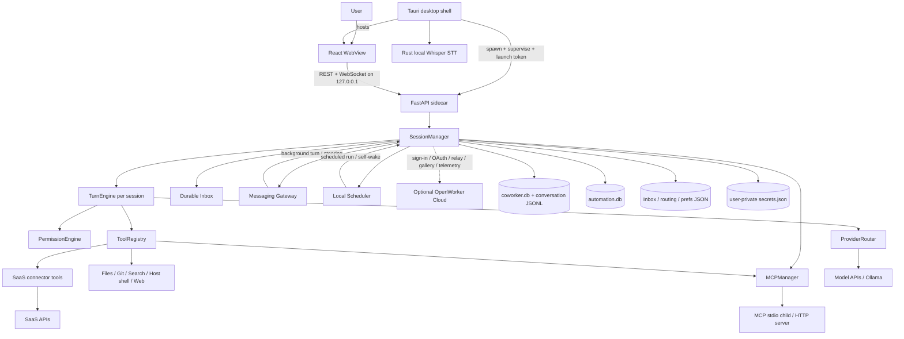

# OpenWorker 功能、模块与架构调研

> 调研对象：[`andrewyng/openworker`](https://github.com/andrewyng/openworker)
>
> 源码快照：[`main@01b6f83b3927e02912dda84bb392942c13ca70d1`](https://github.com/andrewyng/openworker/commit/01b6f83b3927e02912dda84bb392942c13ca70d1)
>
> 快照日期：2026-08-02（Asia/Shanghai）
>
> 最新公开版本：[`v0.1.7`](https://github.com/andrewyng/openworker/releases/tag/v0.1.7)，发布于 2026-07-30
> 研究方式：官方 README、release、GitHub Actions 与固定 commit 的源码静态分析；未连接真实 SaaS、未调用付费模型，也未在本机重跑上游完整测试。

## 1. 结论先行

OpenWorker 是一个面向桌面 knowledge work 的 local-first Agent 产品，而不是名字所暗示的分布式 worker runtime。它把“聊天”包装成能够读写本地文件、运行宿主 shell、调用 SaaS/MCP、接收消息并按计划继续工作的长生命周期 session，产品目标是交付文件、消息、日程变更等结果。

从架构上看，它是一个由桌面壳监管的本地模块化单体：

- Tauri/Rust 负责原生桌面壳、进程监管、系统托盘、自动更新与本地语音输入；
- React/TypeScript 负责 UI，通过 loopback REST + WebSocket 连接本地服务；
- Python FastAPI sidecar 是主体，`SessionManager` 统一编排 session、Agent、provider、tool、permission、connector、MCP、automation 与本地状态；
- `TurnEngine` 实现 provider-neutral 的 model ↔ tool loop；
- SQLite、JSONL 和 JSON 文件构成本地持久化层；
- OpenWorker Cloud 是可选辅助面，但用途不只 OAuth：还包含 sign-in、managed connector token refresh、Slack/GitHub relay、Persona Gallery，以及已登录用户可关闭的 content-free telemetry。

最值得保留的判断是：

1. **它是完整桌面 Agent application，不是 agent library。** 真正可复用的 library 基础被单独指向 `aisuite`，OpenWorker 自己拥有产品级 session、permission、Inbox、connector 与 UI。
2. **它的核心安全机制是 policy + approval，不是 sandbox。** 当前 shell 是宿主 `/bin/bash` 或 PowerShell，继承当前用户环境；文件路径约束、workspace trust 和审批能降低风险，但不是 OS/container isolation。
3. **它有真实的本地持久状态与有限 durable resume。** 对话、memory、audit、automation 和待处理 Inbox 会落盘；未回答的 tool call 可以在重启后继续，但没有通用 action journal/outbox，也不能保证外部副作用 exactly-once。
4. **扩展模型是分层的。** Persona 组合 prompt 与平台审核过的 capability；Skill 是按需装载的 instruction bundle；MCP 扩展任意外部工具；Connector 则是平台维护的产品化 SaaS adapter/tool set。
5. **当前仍应按 Beta 评估。** 功能面很宽、测试很多、默认安全意识较强，但单进程边界、少数超大编排文件、明文 secret store、connector 成熟度差异和文档/版本漂移仍然明显。

## 2. 研究范围与证据口径

### 2.1 固定基线

| 项目 | 快照事实 |
|---|---|
| 默认分支 | `main` |
| 源码 commit | `01b6f83b3927e02912dda84bb392942c13ca70d1` |
| commit 时间 | 2026-08-01 16:26:17 UTC |
| 最新 release | `v0.1.7` |
| main/release 差异 | 当前 `main` 比 `v0.1.7` 领先 10 commits |
| 官方下载 | macOS 12+ Apple Silicon；Windows 10/11 x64；无官方 Linux 安装包 |
| License | MIT |
| 当前 commit CI | `pytest`、`gui-unit`、`gui-e2e` 三项成功 |

版本与下载信息来自 [README](https://github.com/andrewyng/openworker/blob/01b6f83b3927e02912dda84bb392942c13ca70d1/README.md#L7-L23)、[release v0.1.7](https://github.com/andrewyng/openworker/releases/tag/v0.1.7)、[main 与 release 对比](https://github.com/andrewyng/openworker/compare/v0.1.7...main) 和 [MIT LICENSE](https://github.com/andrewyng/openworker/blob/01b6f83b3927e02912dda84bb392942c13ca70d1/LICENSE)。当前 commit 的三个 CI job 可分别查看 [pytest：1112 passed / 1 skipped](https://github.com/andrewyng/openworker/actions/runs/30708127530/job/91390706844)、[GUI unit：108 passed](https://github.com/andrewyng/openworker/actions/runs/30708127530/job/91390706811) 和 [GUI E2E：164 passed、1 个 flaky case 重试后成功](https://github.com/andrewyng/openworker/actions/runs/30708127530/job/91390706821)。

### 2.2 “事实”与“推断”

- **事实**：README、manifest、类型、调用链、持久化 schema、测试与 CI 直接表达的行为。
- **源码推断**：由多个模块共同得出的运行保证，例如“没有分布式 lease，因此不是 exactly-once scheduler”。此类结论会显式标成推断。
- **没有验证**：真实第三方 OAuth、各 SaaS API 权限、模型质量、安装包签名体验、长时间运行稳定性和生产负载。
- **main 与 release 分开看**：本报告分析的是 `main@01b6f83`；`v0.1.7` 安装包可能不包含 main 随后的改动。

## 3. 产品定位与功能

### 3.1 产品主循环

README 给出的用户闭环是：描述 outcome → Agent 拆步骤并跨文件/应用执行 → consequential action 前请求确认 → 返回完成品，而不是待办清单。官方列出的主要结果包括 document、spreadsheet、report、web page、Slack reply、calendar change 与 inbox triage。[来源：README 25–51 行](https://github.com/andrewyng/openworker/blob/01b6f83b3927e02912dda84bb392942c13ca70d1/README.md#L25-L51)

这不是纯粹 marketing wrapper。源码中可以找到对应的 runtime primitives：

| 能力 | 源码实现 | 准确边界 |
|---|---|---|
| 本地交付物 | files、shell、artifact list/read/reveal | 由模型和 tool/Skill 生成普通工作区文件；不是专用 document engine |
| 代码任务 | Code Agent + files/git/search/shell/todo + read-only explorer | 需要显式 workspace；不是隔离 coding sandbox |
| Knowledge work | Cowork/knowledge Persona + scratch workspace + 可添加 roots | 能使用本地文件、web、connector 和 messaging |
| 多模型 | 17 个 provider descriptor + `ProviderRouter` | curated model 有能力矩阵；任意 model string 属于自担风险 |
| SaaS 集成 | connector descriptor + 159 个静态 `ConnectorToolDef` | 并非 159 个工具会同时启用；受连接状态、pin 与 per-tool toggle 影响 |
| MCP | stdio / streamable HTTP / OAuth / include-exclude | 项目 MCP 只在 workspace trusted 后加载；默认需要审批 |
| 消息入口 | Slack、Telegram，以及 managed GitHub relay | 并非所有 connector 都支持 inbound/two-way |
| 自动化 | local Scheduler + `TaskStore` + 每次 run 独立 session | 单 sidecar 内运行；支持 catch-up/skip-overlap，不是分布式 job system |
| Human-in-the-loop | PermissionEngine + unified Inbox | attended inline、unattended Inbox；pending prompt 可重启恢复 |
| Memory | store/implementation 接受 global/workspace/session scope | 公开 tool docstring 只承诺 global/workspace，自动注入也只读这两层；实现虽接受 session，但当前没有绑定 `session_id`，属于不完整路径；不是 embedding/vector retrieval system |
| Voice | Rust `whisper-rs` + 本地 Base English model | 录音只留内存；默认模型约 142 MiB；当前产品检查只支持 Apple Silicon macOS 12+ 与 Windows x64 10 22H2/11 |

### 3.2 内置 Agent / Persona surface

| Surface | Workspace | 主要工具与定位 |
|---|---|---|
| `chat` | 无 | 通用对话；没有 file/shell tool，但仍可使用 web、memory 和 Skill |
| `code` | 必须选择真实目录 | repo files、git、search、host shell、todo、read-only explorer subagent |
| `cowork` | 自动 scratch，可再添加目录 | 产出 memo、analysis、dataset、small script 等；可启用 connector 与 messaging |
| `ops` | knowledge workspace | Markdown Persona；在 Cowork 能力上加入运维 prompt 与 connector recommendation |
| 第三方 Persona | 由 `family` 决定 | Markdown/YAML manifest 组合 prompt、capability IDs、connector/messaging traits |

源码另保留 `myhelper_agent` / `get_agent("myhelper")` 兼容路径，但当前 `PersonaRegistry` 与 GUI picker 不把它作为内置可选 surface。Fresh install 只启用 Cowork，Code、Chat、Ops 均需显式启用，且 Chat 默认隐藏。[来源：Persona registry](https://github.com/andrewyng/openworker/blob/01b6f83b3927e02912dda84bb392942c13ca70d1/coworker/personas/registry.py#L119-L159)、[默认启用状态](https://github.com/andrewyng/openworker/blob/01b6f83b3927e02912dda84bb392942c13ca70d1/coworker/personas/registry.py#L221-L234)、[legacy resolver](https://github.com/andrewyng/openworker/blob/01b6f83b3927e02912dda84bb392942c13ca70d1/coworker/agents/registry.py#L15-L21)

`Agent` 本身只是 prompt、workspace 需求、tool factory 和 traits 的声明；真正的 runtime 由 `build_engine()` 统一组装。[来源：Agent 类型](https://github.com/andrewyng/openworker/blob/01b6f83b3927e02912dda84bb392942c13ca70d1/coworker/agents/base.py#L17-L44)、[Code Agent](https://github.com/andrewyng/openworker/blob/01b6f83b3927e02912dda84bb392942c13ca70d1/coworker/agents/code.py#L8-L74)、[Cowork Agent](https://github.com/andrewyng/openworker/blob/01b6f83b3927e02912dda84bb392942c13ca70d1/coworker/agents/cowork.py#L14-L56)

### 3.3 Model provider

源码在固定快照中注册了 17 个 provider：

- native/specialized adapter：OpenAI、Anthropic、Gemini、AWS Bedrock、Google Vertex AI；
- OpenAI-compatible：Z AI、DeepSeek、Kimi、MiniMax、Qwen、xAI、Mistral、Meta；
- aggregator：Together、Fireworks、OpenRouter；
- local：Ollama。

`Inkling` 在 model matrix 中作为 Together 上的 model，而不是独立 provider。Provider contract 统一成 `AssistantTurn`、`ToolCall`、`TokenUsage` 与 `ModelCapabilities`，再由 `ProviderRouter` 根据 `provider:model` 前缀选择实现。[来源：Provider contract](https://github.com/andrewyng/openworker/blob/01b6f83b3927e02912dda84bb392942c13ca70d1/coworker/providers/base.py#L16-L136)、[Provider registry](https://github.com/andrewyng/openworker/blob/01b6f83b3927e02912dda84bb392942c13ca70d1/coworker/providers/registry.py#L251-L572)、[Router](https://github.com/andrewyng/openworker/blob/01b6f83b3927e02912dda84bb392942c13ca70d1/coworker/providers/router.py#L23-L118)

这里要区分两层：`aisuite` 提供 tool/toolkit 等基础，OpenWorker 自己实现了 `TurnEngine`、provider adapters、capability matrix 与产品级 session。README 的 “built on aisuite” 不表示整个 Agent loop 只是一次 `aisuite.Agent` 调用。[来源：pyproject](https://github.com/andrewyng/openworker/blob/01b6f83b3927e02912dda84bb392942c13ca70d1/pyproject.toml#L8-L36)、[README](https://github.com/andrewyng/openworker/blob/01b6f83b3927e02912dda84bb392942c13ca70d1/README.md#L107-L111)

### 3.4 Connector

固定快照包含 40 个 connector descriptor，其中 35 个 `available=True`，5 个仅作 “soon” 占位：Datadog、Salesforce、Descript、Clay、PagerDuty。可连接的 35 个可以按用途归为：

- messaging / collaboration：Telegram、Slack、Discord、WhatsApp、GitHub；
- mail / calendar：通用 IMAP Email、Gmail、Google Calendar、Outlook；
- work management / docs：Jira、monday.com、Confluence、Zendesk、Linear、Asana、ClickUp、Notion；
- developer / design / content：GitHub、GitLab、Figma、Canva、Docusign、Browser；
- CRM / sales：HubSpot、Close、Attio、Apollo、Hunter；
- file storage：Dropbox、Box、Google Drive；
- finance / analytics：Stripe、QuickBooks、PostHog、Mixpanel、Amplitude。

`GitHub` 同时属于 developer tool 与 collaboration/inbound，因此上面按用途会重复出现一次。源码中的 connector 数量比 README 的 “25+” 更高，但“有 descriptor”不等于成熟度一致：

- Slack、Telegram 有 platform adapter；GitHub managed install 也能通过 relay 接收事件；
- Jira、monday.com 等可以走 vendor-hosted MCP；
- 大量其他集成由 `integration_tools.py` 直接请求 REST/GraphQL API；
- Gmail、Google Calendar、Google Drive 的 managed one-click OAuth 在该快照中暂停，manual token path 仍在；
- Telegram 与手工 Slack Socket Mode 依赖 `messaging` extra；源码 bootstrap 会安装它，当前 release workflow 未显式安装。Managed Slack relay 是不依赖 `slack-bolt` 的另一条路径；
- `Browser` 标成 available，但 Python Playwright 同样是未默认安装的 optional extra，源码运行可能需要额外环境准备。

Connector metadata 与可用性见 [descriptor 类型及语义](https://github.com/andrewyng/openworker/blob/01b6f83b3927e02912dda84bb392942c13ca70d1/coworker/connectors/descriptors.py#L45-L93) 和 [descriptor 列表](https://github.com/andrewyng/openworker/blob/01b6f83b3927e02912dda84bb392942c13ca70d1/coworker/connectors/descriptors.py#L420-L1443)；工具 pin 见 [`TOOL_DEFS`](https://github.com/andrewyng/openworker/blob/01b6f83b3927e02912dda84bb392942c13ca70d1/coworker/connectors/tool_defs.py#L26-L1177)。Optional extra、adapter 缺包行为、源码 bootstrap 与 release 安装项分别见 [pyproject](https://github.com/andrewyng/openworker/blob/01b6f83b3927e02912dda84bb392942c13ca70d1/pyproject.toml#L39-L47)、[adapters](https://github.com/andrewyng/openworker/blob/01b6f83b3927e02912dda84bb392942c13ca70d1/coworker/connectors/adapters.py#L97-L192)、[setup script](https://github.com/andrewyng/openworker/blob/01b6f83b3927e02912dda84bb392942c13ca70d1/packaging/setup_dev_env.sh#L13-L20) 与 [release workflow](https://github.com/andrewyng/openworker/blob/01b6f83b3927e02912dda84bb392942c13ca70d1/.github/workflows/release.yml#L75-L85)。

### 3.5 Permission mode 的产品口径

后端支持五种 mode：

| Mode | 行为 |
|---|---|
| `discuss` | read-only；阻止 write/exec/external side effect |
| `plan` | read-only，并引导 Agent 提出可审批计划 |
| `interactive` | 默认；低风险 read 自动执行，consequential action 请求审批 |
| `auto` | full access，consequential action 不再逐次询问 |
| `custom` | interactive 基础上，对全局配置的工具做 auto-allow |

当前 GUI picker 只展示 Discuss、Ask for approval、Full access；Plan 与 Custom 因产品体验尚未完成而隐藏，但服务端仍能处理。因此“所有写入都会问”只准确描述默认 `interactive`，不适用于用户主动切到 `auto`。[来源：PermissionEngine](https://github.com/andrewyng/openworker/blob/01b6f83b3927e02912dda84bb392942c13ca70d1/coworker/permissions.py#L37-L178)、[GUI options](https://github.com/andrewyng/openworker/blob/01b6f83b3927e02912dda84bb392942c13ca70d1/surfaces/gui/src/components/Composer.tsx#L19-L27)

## 4. Repository module map

| 路径 | 核心职责 | 关键类型/入口 |
|---|---|---|
| `coworker/server/run.py` | CLI server bootstrap、token、Uvicorn | `main()`、`build_app()` |
| `coworker/server/app.py` | REST/WS protocol、auth、input limits、route adapter | `create_app()`、`ws_session()` |
| `coworker/server/manager.py` | application composition 与所有长生命周期 service | `SessionManager` |
| `coworker/engine.py` | model/tool loop、stream、approval、interrupt、resume、compaction | `TurnEngine` |
| `coworker/agent.py` | 将 Agent、workspace、tool、permission、memory、Skill 组装成 engine | `build_engine()` |
| `coworker/agents/` | Chat/Code/Cowork/MyHelper 的 prompt 与 traits | `Agent`、`AgentContext` |
| `coworker/catalog.py` | 平台审核过的 capability → tool factory | `Capability`、`expand()` |
| `coworker/providers/` | provider contract、model matrix、native/compatible adapter | `ProviderClient`、`ProviderRouter` |
| `coworker/tools/` | files、git、search、shell、todo、ask、plan、subagent | `ToolRegistry`、`LocalExecutor` |
| `coworker/connectors/` | SaaS descriptor、tool definition、API 实现、inbound adapter/gateway | `ConnectorDescriptor`、`Gateway` |
| `coworker/mcp/` | MCP config、stdio/HTTP connection、OAuth、tool wrapping | `MCPManager`、`MCPServerDef` |
| `coworker/automation/` | once/cron model、SQLite store、tick scheduler、Agent tools | `ScheduledTask`、`TaskStore`、`Scheduler` |
| `coworker/conversations.py` | session metadata index + append-first JSONL transcript | `ConversationStore` |
| `coworker/memory/` | scoped durable text memory | `MemoryStore`、`SQLiteMemoryStore` |
| `coworker/inbox.py` | approval/question/directory/plan/notification queue | `InboxStore` |
| `coworker/personas/` | Persona manifest、install、consent、registry | `PersonaManifest`、`PersonaRegistry` |
| `coworker/skills/` | `SKILL.md` discovery、CRUD、session mute、按需加载 | `SkillLoader`、`SkillStore` |
| `coworker/cloud.py` | optional sign-in、managed OAuth/refresh、gallery、telemetry | PKCE 与 cloud client functions |
| `surfaces/gui/src/` | React UI、REST/WS client、session/connector/settings surface | `App`、`Session` |
| `surfaces/gui/src-tauri/` | Tauri shell、sidecar supervisor、tray、updater、voice commands | Rust `run()` |
| `stt/` | 本地 microphone capture、Whisper model、transcription | Rust `Dictation` |
| `packaging/` | PyInstaller sidecar、DMG/Windows installer/update manifest | build scripts/spec |
| `tests/`、`surfaces/gui/e2e*` | backend、frontend unit、hermetic/live E2E | pytest/Vitest/Playwright |

虽然目录拆分清楚，application orchestration 仍然高度集中：快照中的 `server/manager.py` 约 4,087 行、`server/app.py` 约 2,078 行、`connectors/integration_tools.py` 约 4,924 行。它更接近“有模块边界的单体”，还不是能够独立部署或独立演进的服务集合。

## 5. 总体架构

### 5.1 架构类型

可以用四个 plane 理解 OpenWorker：

1. **Surface plane**：Tauri、React、Slack/Telegram/GitHub inbound；
2. **Control plane（本地）**：FastAPI protocol、`SessionManager`、permission、Inbox、routing、scheduler；
3. **Execution plane**：`TurnEngine`、ProviderRouter、ToolRegistry、宿主 shell、connector 与 MCP；
4. **State plane**：SQLite、JSONL、JSON、Skill/Persona folders、secret profiles。

可选 OpenWorker Cloud 横跨 surface/control 边界，但不是 Agent runtime 的 source of truth；signed-out + manual credentials 仍能使用本地核心能力。

### 5.2 Component diagram



### 5.3 Desktop startup

1. Tauri 选择随机空闲端口并生成随机 launch token；
2. 它启动 bundled `openworker-server` sidecar，将 port、parent PID 与 token 放进环境变量；
3. 它把 HTTP、WS、token 和 OS 信息通过 initialization script 注入 WebView；
4. React 对 REST 使用 `X-OpenWorker-Token`，对 WebSocket 使用 subprotocol token；
5. Python sidecar 初始化 `SessionManager`、本地 stores、scheduler、connector gateway 与 MCP manager；
6. 关闭到 tray 时 sidecar 继续运行；真正退出时 Tauri kill sidecar。

这条链路可在 [Tauri `run()`](https://github.com/andrewyng/openworker/blob/01b6f83b3927e02912dda84bb392942c13ca70d1/surfaces/gui/src-tauri/src/lib.rs#L580-L772)、[server bootstrap](https://github.com/andrewyng/openworker/blob/01b6f83b3927e02912dda84bb392942c13ca70d1/coworker/server/run.py#L102-L171) 和 [FastAPI auth middleware](https://github.com/andrewyng/openworker/blob/01b6f83b3927e02912dda84bb392942c13ca70d1/coworker/server/app.py#L167-L234) 中对应起来。

## 6. Agent turn 的核心运行链

### 6.1 Interactive turn

```mermaid
sequenceDiagram
  participant U as User
  participant UI as React Session
  participant WS as FastAPI ws_session
  participant SM as SessionManager
  participant E as TurnEngine
  participant P as ProviderRouter
  participant H as Permission + Inbox
  participant T as ToolRegistry
  participant S as Local stores

  U->>UI: Send request
  UI->>WS: user_message + model + attachments
  WS->>SM: prepare MCP tools / get or rebuild engine
  SM-->>WS: TurnEngine
  WS->>E: run(content)
  E->>P: stream canonical history + tool schemas
  P-->>E: text/reasoning deltas + AssistantTurn
  E-->>WS: streamed events
  WS->>SM: save checkpoint from consumed events
  SM->>S: persist session state

  alt ordinary executable tool calls
    E->>H: authorize each call
    alt approval is required
      H-->>UI: permission_required / Inbox item
      H->>S: save pending tool call
      U->>UI: approve or deny
      UI->>H: resolve
    end
    E->>T: execute approved calls
    Note over E,T: low-risk parallel-safe reads can run concurrently; others stay serial
    T-->>E: tool results
    E-->>WS: tool events / iteration checkpoint
    WS->>SM: save checkpoint
    SM->>S: persist session state
    E->>P: next model iteration
  else human-interaction pseudo-tool
    E-->>WS: request_directory / propose_plan / ask_user event
    WS->>SM: dedicated handler + save
    SM->>S: persist interaction state
  else no tool calls
    E-->>WS: turn_end
  end

  WS->>S: final save
  WS-->>UI: turn_done
```

`TurnEngine` 的关键约束是：

- canonical message history 使用统一结构，由各 provider adapter 转换；
- provider stream 被桥接进 asyncio，UI 能收到 text/reasoning delta；
- 一轮的普通可执行 tool call 先逐个授权；`request_directory`、`propose_plan`、`ask_user` 由 engine 的专用 handler 拦截，不走常规 permission/registry 执行路径；
- metadata 明确标记为低风险的 read/search 才允许并发；write、shell、external side effect 维持原顺序串行；
- 任何未执行 tool call 都追加 error result，避免历史中出现 orphan tool call；
- Stop 会中断 model stream 和 foreground shell，并保存用户已经看到的 partial output；
- compaction 只改变 outbound view，不重写 canonical history；
- checkpoint 的持久化归属于消费 engine event 的 WebSocket/session 层：`TurnEngine` 产出事件，`ws_session.run_turn()` 调用 `SessionManager.save()` 落盘。

主要证据见 [`TurnEngine._loop()`](https://github.com/andrewyng/openworker/blob/01b6f83b3927e02912dda84bb392942c13ca70d1/coworker/engine.py#L314-L434)、[tool authorization/execution](https://github.com/andrewyng/openworker/blob/01b6f83b3927e02912dda84bb392942c13ca70d1/coworker/engine.py#L584-L835)、[WebSocket checkpoint](https://github.com/andrewyng/openworker/blob/01b6f83b3927e02912dda84bb392942c13ca70d1/coworker/server/app.py#L1781-L1813) 和 [provider feed](https://github.com/andrewyng/openworker/blob/01b6f83b3927e02912dda84bb392942c13ca70d1/coworker/engine.py#L1025-L1136)。Memory scope 边界见 [`memory/tools.py`](https://github.com/andrewyng/openworker/blob/01b6f83b3927e02912dda84bb392942c13ca70d1/coworker/memory/tools.py#L16-L37)。

### 6.2 Engine composition

`build_engine()` 是核心 composition root。它依次完成：

1. 解析 primary workspace 与可变 roots；
2. 创建宿主 `LocalExecutor` 和 TodoList；
3. 由 Agent capability 生成本地工具；
4. 加入 MCP/connector tools、send message/file、web search/fetch、ask/plan/directory；
5. 选择或注入 ProviderRouter；
6. 对 Code family 加入 read-only explorer；
7. 注入 AGENTS.md、environment、memory 与 live Skill catalog；
8. 建立 PermissionEngine 与动态 context provider；
9. 创建 TurnEngine 并挂载 executor、roots、audit context。

这使同一个 `TurnEngine` 能服务前台对话、connector background turn、self-wake 与 automation run。[来源：`build_engine()`](https://github.com/andrewyng/openworker/blob/01b6f83b3927e02912dda84bb392942c13ca70d1/coworker/agent.py#L141-L410)

### 6.3 Human-in-the-loop 与 durable resume

`InboxStore` 统一存储 approval、question、directory grant、plan 和 notification。Inbox item 对 `(session_id, tool_call_id)` 幂等，first responder wins；attended session 在当前 UI inline 展示，unattended/background session 则在 Inbox 等待。

重启后的恢复链是：

1. pending assistant tool call 已随 session history 落盘；
2. 用户从 app、REST 或 Slack 按钮 resolve Inbox；
3. 如果原 engine 不在运行，`SessionManager` 从 session store 重建 engine；
4. `TurnEngine.resume()` 找到历史尾部仍无 tool result 的调用；
5. 已解决的 Inbox callback 立即返回，runtime 继续 model/tool loop。

这可以准确称为 **durable human prompt / pending tool-call resume**。它不能称为通用 durable workflow：外部 API side effect 没有统一 action ID、transactional outbox 或 replay-safe journal。[来源：Inbox](https://github.com/andrewyng/openworker/blob/01b6f83b3927e02912dda84bb392942c13ca70d1/coworker/inbox.py#L90-L344)、[manager resume](https://github.com/andrewyng/openworker/blob/01b6f83b3927e02912dda84bb392942c13ca70d1/coworker/server/manager.py#L855-L886)、[engine resume](https://github.com/andrewyng/openworker/blob/01b6f83b3927e02912dda84bb392942c13ca70d1/coworker/engine.py#L270-L312)

### 6.4 Automation 与 inbound message

Automation 使用 SQLite `TaskStore` 保存 once/cron schedule 和 run history。Scheduler 每 30 秒查找 due task：

- startup 对 downtime 中错过的任务做一次 catch-up；
- 每个 due task 启动独立 asyncio task，避免一个 approval 阻塞整个 scheduler；
- `_running_ids` 在进程内阻止同一个 task overlap；
- 每次 run 创建独立、持久、可继续对话的 `__run__...` session；
- completion 可发送通知，consequential action 仍受 permission/Inbox 约束。

因此它的保证是 **persistent schedule + single-process execution policy**。`_running_ids` 不是 durable lease，源码也没有多实例 claim；推断上不应把它部署成多个 sidecar 共享同一任务目录，也不能宣称 exactly-once。[来源：Scheduler](https://github.com/andrewyng/openworker/blob/01b6f83b3927e02912dda84bb392942c13ca70d1/coworker/automation/scheduler.py#L23-L113)、[TaskStore](https://github.com/andrewyng/openworker/blob/01b6f83b3927e02912dda84bb392942c13ca70d1/coworker/automation/store.py#L65-L176)、[run session](https://github.com/andrewyng/openworker/blob/01b6f83b3927e02912dda84bb392942c13ca70d1/coworker/server/manager.py#L3125-L3182)

Inbound message 先经过 Gateway allowlist 与 interaction resolver，再由 `SessionManager` 路由：channel message 写入 buffer 并 fan-out 给 subscribed session；mention 走 thread router；DM 交给 designated session；无法路由的消息写 unrouted store。目标 session 忙时消息变为 steering，空闲时启动 background turn。[来源：Gateway](https://github.com/andrewyng/openworker/blob/01b6f83b3927e02912dda84bb392942c13ca70d1/coworker/connectors/gateway.py#L34-L231)、[background delivery](https://github.com/andrewyng/openworker/blob/01b6f83b3927e02912dda84bb392942c13ca70d1/coworker/server/manager.py#L2894-L3009)

## 7. State 与持久化

默认 state directory：

- macOS/Linux：`~/.config/coworker`；
- Windows：`%APPDATA%/coworker`；
- 测试/自定义：`COWORKER_STATE_DIR`。

| 状态 | 载体 | 语义 |
|---|---|---|
| session metadata | `coworker.db` | workspace、model、mode、title、grants、完整 compaction state 等 |
| canonical transcript | `conversations/<session>.jsonl` | append-first message history |
| memory | `coworker.db.memories` | global/workspace/session scoped text |
| audit | `coworker.db.audit_events` | tool proposal、approval、result 摘要等 |
| automation | `automation.db` | task definitions 与 run history |
| Inbox/routing | `inbox.json` 等多个 JSON | pending attention、binding、unattended、wake、subscription、parked/unrouted |
| secrets | `secrets.json` | provider、connector、MCP 与 cloud token profile |
| preferences | `prefs.json` 等 | model、UI、Persona、Skill、connection state |
| Skill | 全局或项目 `.coworker/skills/<name>/SKILL.md` | instruction bundle 与 resources |
| Persona | builtin Markdown 或安装目录 | manifest、prompt、capability recommendation |
| MCP config | 全局 `mcp.json`；trusted workspace 的 `.coworker/mcp.json` | server transport、command、URL 与 tool filters |

`ConversationStore` 以 SQLite 做索引，以 JSONL 保存真正 message history；memory 与 audit 在同一个 SQLite 文件的不同表中；automation 使用单独数据库。[来源：ConversationStore](https://github.com/andrewyng/openworker/blob/01b6f83b3927e02912dda84bb392942c13ca70d1/coworker/conversations.py#L1-L8)、[SessionManager 初始化](https://github.com/andrewyng/openworker/blob/01b6f83b3927e02912dda84bb392942c13ca70d1/coworker/server/manager.py#L113-L240)、[state directory](https://github.com/andrewyng/openworker/blob/01b6f83b3927e02912dda84bb392942c13ca70d1/coworker/secrets.py#L27-L43)

## 8. Extension architecture

### 8.1 Provider

实现 `ProviderClient.complete()`、`stream()`、`capabilities()`，再注册 `ProviderDescriptor.build`。Provider 只负责 model protocol 转换，不拥有 Agent loop。

### 8.2 Capability / Agent / Persona

- `Capability` 是平台审核的稳定 ID，例如 `files`、`git`、`shell`；
- `Agent` 把 prompt、capability tool factory 和 traits 组合起来；
- Persona manifest 可以声明 family、tools、messaging、connectors、recommended model/Skill/MCP；
- capability catalog 明确是 closed，第三方 Persona 不能在 manifest 中自行注册任意 Python tool。

这是一条重要的 least-authority 设计：Persona 是受限组合，不等于任意代码 plugin。[来源：Capability catalog](https://github.com/andrewyng/openworker/blob/01b6f83b3927e02912dda84bb392942c13ca70d1/coworker/catalog.py#L1-L12)、[Persona manifest](https://github.com/andrewyng/openworker/blob/01b6f83b3927e02912dda84bb392942c13ca70d1/coworker/personas/manifest.py#L47-L92)

### 8.3 Skill

Skill 是 folder-backed `SKILL.md`：catalog 只把名称与 description 暴露给 model，需要时通过 `load_skill` 注入完整 instructions 和 resource path。它支持 global/project scope、live rescan、enable/disable、per-session mute 和带审批的保存。

Skill 主要扩展 prompt/workflow knowledge，不直接扩大 OS authority；实际 authority 仍由当前 Agent tools 和 PermissionEngine 决定。[来源：Skill loader](https://github.com/andrewyng/openworker/blob/01b6f83b3927e02912dda84bb392942c13ca70d1/coworker/skills/base.py#L19-L145)、[Skill store](https://github.com/andrewyng/openworker/blob/01b6f83b3927e02912dda84bb392942c13ca70d1/coworker/skills/store.py#L83-L456)

### 8.4 MCP

MCP 支持 stdio 与 streamable HTTP，能做 OAuth 2.1/PKCE，并提供 include/exclude tools 与 `requires_approval`。远端工具被包装为 `mcp__<server>__<tool>` 后进入同一个 ToolRegistry。

安全上有两个关键 pin：

- untrusted workspace 的 `.coworker/mcp.json` 完全不加载，因为 stdio 定义可以启动本地进程；
- productized MCP connector 只暴露 OpenWorker 固定 allowlist 中的工具，vendor catalog 新增能力不会自动扩权。

[来源：MCP config](https://github.com/andrewyng/openworker/blob/01b6f83b3927e02912dda84bb392942c13ca70d1/coworker/mcp/config.py#L25-L109)、[tool wrapper](https://github.com/andrewyng/openworker/blob/01b6f83b3927e02912dda84bb392942c13ca70d1/coworker/mcp/tools.py#L57-L91)、[session MCP preparation](https://github.com/andrewyng/openworker/blob/01b6f83b3927e02912dda84bb392942c13ca70d1/coworker/server/manager.py#L889-L976)

### 8.5 Connector 与 Executor

- Connector descriptor 是 UI/auth/capability metadata；
- direct SaaS tools 与 connector tool definitions 提供出站调用；
- two-way connector 实现 `BasePlatformAdapter` 并交给 Gateway；
- `Executor` 有抽象接口，但当前唯一生产实现是 `LocalExecutor`。

源码为未来 Container/VM executor 留了替换点，但“有接口”不代表“已有 sandbox”。[来源：Executor/LocalExecutor](https://github.com/andrewyng/openworker/blob/01b6f83b3927e02912dda84bb392942c13ca70d1/coworker/tools/shell.py#L55-L209)、[Connector base](https://github.com/andrewyng/openworker/blob/01b6f83b3927e02912dda84bb392942c13ca70d1/coworker/connectors/base.py#L141-L184)

## 9. Security、privacy 与 trust boundary

### 9.1 已实现的防线

| 边界 | 机制 |
|---|---|
| localhost API | 默认绑定 `127.0.0.1`；每次启动随机 token；REST header、WS subprotocol 校验 |
| Web origin | CORS/Origin allowlist，health 对未认证请求只返回最小信息 |
| WebSocket abuse | frame/input size limit、rate limit、同 session busy guard |
| workspace | canonical path trust；项目 `allowed_commands` 与 MCP config 需显式 trust |
| built-in file write | 被分类为 `WRITE_LOCAL` 且带 `path` 的内置写工具，路径必须位于 writable root；这不是通用 filesystem jail |
| tool side effect | READ / WRITE_LOCAL / EXEC / EXTERNAL 风险分类与 mode/approval |
| scheduled external action | 只允许 tool + exact target 的 standing rule；shell 不进入此通道 |
| inbound messaging | user/team allowlist；未授权消息 park；Slack approval owner 校验 |
| web fetch | 拒绝 loopback/private/link-local/metadata/CGNAT，逐跳检查 redirect |
| audit | secret-like argument key 被 redacted，body/content 被摘要化 |

本地 API 与 permission 证据分别见 [server auth](https://github.com/andrewyng/openworker/blob/01b6f83b3927e02912dda84bb392942c13ca70d1/coworker/server/app.py#L184-L233)、[risk model](https://github.com/andrewyng/openworker/blob/01b6f83b3927e02912dda84bb392942c13ca70d1/coworker/risk.py#L18-L57) 和 [PermissionEngine](https://github.com/andrewyng/openworker/blob/01b6f83b3927e02912dda84bb392942c13ca70d1/coworker/permissions.py#L83-L238)。SSRF guard 见 [`web/guard.py`](https://github.com/andrewyng/openworker/blob/01b6f83b3927e02912dda84bb392942c13ca70d1/coworker/web/guard.py#L1-L116)。

### 9.2 需要明确的边界

1. **没有 OS sandbox。** `LocalExecutor` 直接启动宿主 bash/PowerShell，继承完整 process environment。`cwd` 不是 filesystem jail，批准后的 shell 可以访问当前 OS 用户可访问的其他路径。
2. **SecretStore 不是加密 vault。** v1 是 `0600`/Windows ACL 保护的明文 JSON；源码明确把 Keychain/age-encrypted backend 留作未来替换。[来源](https://github.com/andrewyng/openworker/blob/01b6f83b3927e02912dda84bb392942c13ca70d1/coworker/secrets.py#L1-L8)
3. **conversation、memory、audit 也属于本地明文数据。** local-first 表示数据 source of truth 在本机，不表示 encryption at rest。
4. **CSP 当前为 `null`。** 这会扩大 WebView 层一旦发生内容注入时的影响面。React escaping 与 Tauri capability 等属于预防性控制；若同一 renderer 已发生 XSS，脚本可以读取被注入到全局变量的 loopback token，Origin gate 也不会隔离同源恶意请求。[来源：Tauri config](https://github.com/andrewyng/openworker/blob/01b6f83b3927e02912dda84bb392942c13ca70d1/surfaces/gui/src-tauri/tauri.conf.json#L12-L17)、[token 注入](https://github.com/andrewyng/openworker/blob/01b6f83b3927e02912dda84bb392942c13ca70d1/surfaces/gui/src-tauri/src/lib.rs#L580-L589)
5. **SSRF guard 明确不覆盖 DNS rebinding。** 它是应用层的主要风险削减，不是连接级 IP pinning。
6. **单进程 state store 不是多实例 coordination。** JSON store、engine cache、scheduler overlap guard 都以一个 sidecar 为设计中心。
7. **后台 shell 可能超过 session/server 生命周期。** foreground command 会随 Stop 中断，但 detached background task 需要显式 kill；`LocalExecutor.close()` 不负责统一回收这些任务。[来源：shell lifecycle](https://github.com/andrewyng/openworker/blob/01b6f83b3927e02912dda84bb392942c13ca70d1/coworker/tools/shell.py#L300-L416)
8. **Extension metadata 需要 fail-safe discipline。** 内置/MCP/connector 工具大多显式标注风险；但一个新注册工具如果既不在内置风险表、metadata 又漏掉 `requires_approval=True`，基础分类会回落为 READ。[来源：risk fallback](https://github.com/andrewyng/openworker/blob/01b6f83b3927e02912dda84bb392942c13ca70d1/coworker/risk.py#L39-L53)
9. **Audit 不是完整 forensic/event-sourcing 系统。** 它记录 sanitized args，但 `result_preview` 不是 secret-aware；工具返回值前缀仍可能包含敏感内容，也没有把外部副作用包装成可重放事务。[来源：audit append](https://github.com/andrewyng/openworker/blob/01b6f83b3927e02912dda84bb392942c13ca70d1/coworker/audit.py#L52-L81)
10. **JSON 与 SQLite/JSONL 不是一个原子提交。** Inbox 等部分 JSON store 直接写文件，session metadata 与 transcript 也跨两种载体；崩溃一致性弱于事务型 event store。[来源：Inbox persistence](https://github.com/andrewyng/openworker/blob/01b6f83b3927e02912dda84bb392942c13ca70d1/coworker/inbox.py#L90-L113)
11. **不宜直接改成远程服务。** 虽然 CLI 可修改 `--host`，服务没有 TLS、多租户身份或 tenant isolation；其 token/CORS 设计目标是本机 sidecar，不应直接暴露到 LAN/公网。[来源：server CLI](https://github.com/andrewyng/openworker/blob/01b6f83b3927e02912dda84bb392942c13ca70d1/coworker/server/run.py#L139-L171)

### 9.3 “local-first” 的准确解释

本地运行的部分包括 desktop UI、Agent loop、conversation/memory/audit、scheduler、Skill/Persona、credential file，以及可选的 Ollama 与 Whisper。会离开机器的数据取决于用户启用的能力：

- 使用云模型会把 provider-ready context 发给对应 model API；
- web search/fetch 和 SaaS connector 会访问外部服务；
- MCP HTTP 会访问指定 server，MCP stdio 会启动本地 child process；
- managed connector 会使用 OpenWorker Cloud 做 OAuth/refresh；
- Slack/GitHub managed inbound 使用 cloud relay；
- 已登录用户的 session-created telemetry 默认开启，只发送 install/app/platform、hash session id、persona/family/workspace kind，不发送 title/prompt/output/tool args/path/content；后端保留 opt-out API，但当前 Settings 没有暴露原先的 Privacy toggle。[来源：Settings 说明](https://github.com/andrewyng/openworker/blob/01b6f83b3927e02912dda84bb392942c13ca70d1/surfaces/gui/src/components/SettingsView.tsx#L595-L603)

因此 README 中“唯一 cloud piece 是 OAuth broker”的说法过于简化；源码中的 cloud client 已覆盖 relay、gallery 和 telemetry。signed-out 用户不会发送该 telemetry，manual credentials 仍是保留路径。[来源：README privacy](https://github.com/andrewyng/openworker/blob/01b6f83b3927e02912dda84bb392942c13ca70d1/README.md#L61-L63)、[cloud module](https://github.com/andrewyng/openworker/blob/01b6f83b3927e02912dda84bb392942c13ca70d1/coworker/cloud.py#L1-L20)、[telemetry](https://github.com/andrewyng/openworker/blob/01b6f83b3927e02912dda84bb392942c13ca70d1/coworker/cloud.py#L267-L339)

## 10. 工程成熟度与架构评价

### 10.1 已经做得好的部分

- 普通可执行工具调用统一经过 `ToolRegistry` 与 `PermissionEngine`，没有为每个 surface 重写授权逻辑；`request_directory`、`propose_plan`、`ask_user` 等 human-interaction pseudo-tools 则由 engine 特殊拦截；
- canonical history 与 provider adapter 分离，支持跨 provider/model 切换；
- pending human interaction 真实落盘，并有 engine-eviction / restart-style resume 测试；实现路径面向重启恢复，但该测试没有新建 manager 或新进程；
- 低风险并发与 side-effect 串行的边界清晰；
- untrusted workspace 的 command/MCP authority 默认被压低；
- connector tools 使用静态 pin，vendor MCP catalog 不会静默扩权；
- foreground、background、scheduled、inbound 最终收敛到同一个 session/engine 语义；
- 当前 commit 的 backend、GUI unit、hermetic GUI E2E 三项 CI 均通过；
- release workflow 覆盖 macOS/Windows bundle、updater manifest 与签名/公证流程。

### 10.2 仍然明显的风险

| 风险 | 影响 |
|---|---|
| `SessionManager`、`app.py`、`integration_tools.py` 超大 | 新功能容易跨 route、state、UI 与 connector 形成隐式耦合 |
| shell 无 sandbox | approval 失误或 prompt injection 后影响范围是当前 OS 用户权限 |
| secrets/data 明文 at rest | 本机账号或备份泄露时没有第二层加密保护 |
| automation 无 durable claim/lease | crash 或多实例会带来重复调度/执行风险，不能宣称 exactly-once |
| long-running/pending automation | 单进程内 `_running_ids` 会阻止 overlap，但后续周期可能被跳过，属于可用性与调度语义问题 |
| connector 成熟度不一致 | descriptor 存在、manual path、managed OAuth、two-way 与 live-tested 是不同状态 |
| Python dependency 无 lockfile | git-pinned `aisuite` 降低一部分漂移，但完整 release reproducibility 仍有限 |
| PR CI 不编译 Tauri/Rust bundle | Python/React tests 绿色不能证明桌面壳与安装包始终可构建 |
| GUI E2E 是 mocked/hermetic | 不证明真实 model、OAuth、relay 与 SaaS API 兼容性 |
| 版本号分散 | Tauri 为 `0.1.7`，Python package 为 `0.0.0`，STT crate 为 `0.1.0` |
| 文档存在漂移 | `docs/config.example.toml` 与代码默认 model/max iterations 不一致；嵌套 GUI README 仍有旧路径 |

官方 README 明确称其为 open Beta，Windows build 尚未 code-sign。[来源](https://github.com/andrewyng/openworker/blob/01b6f83b3927e02912dda84bb392942c13ca70d1/README.md#L7-L21) CI 当前只定义 pytest、GUI unit、GUI E2E 三个 job。[来源](https://github.com/andrewyng/openworker/blob/01b6f83b3927e02912dda84bb392942c13ca70d1/.github/workflows/ci.yml#L1-L56)

### 10.3 总体判断

| 维度 | 判断 |
|---|---|
| 产品完整性 | 高：桌面 UI、模型、工具、connector、automation、Inbox、artifact 已形成闭环 |
| 架构清晰度 | 中高：核心 contract 清楚，但 application orchestration 集中 |
| 本地持久化 | 中高：关键 session/prompt/task 可恢复，但缺少通用 side-effect journal |
| 安全默认 | 中高：approval/trust/token/SSRF/allowlist 较认真；无 sandbox 与明文 secret 是硬边界 |
| Extension | 高：Provider、Persona、Skill、MCP、Connector、Executor 分层明确 |
| 多实例/分布式 | 低：设计目标就是单 desktop sidecar |
| 生产成熟度 | 中：Beta、快速迭代、测试面宽，但外部集成与发布路径仍需真实环境验证 |

## 11. 对 Agent runtime 设计的可复用启发

本节是从 OpenWorker 提炼的设计原则，不是对 mini-loop 当前代码的 gap analysis，也不表示应该直接移植其实现。

1. **把 human attention 建模成 durable object。** approval、question、plan、directory grant 进入统一 Inbox，比只在 WebSocket 上等待更容易跨 surface、重启和 background run。
2. **把风险标在 tool contract 上。** READ / WRITE_LOCAL / EXEC / EXTERNAL 加 exact-target standing rule，比按 tool name 散落 if/else 更容易审计。
3. **将 run 保存为正常 session。** scheduled run 不是只有 result row，而是可以重开、追问、查看 transcript 的会话，这显著提升可运营性。
4. **将 declarative Persona 与 authority 分开。** Persona 只组合 closed capability catalog；需要任意扩展时走 MCP，避免一个 Markdown manifest 自行扩权。
5. **对 vendor MCP 做 pinned projection。** 外部 server 工具集发生变化时，本地允许面只能缩小、不能自动扩大。
6. **明确 canonical state 与 outbound projection。** history 永久保留，compaction 只改变 provider view，有利于 UI、resume 与 provider switching 共存。
7. **不要复制编排集中化。** OpenWorker 的功能增长已经把 `SessionManager` 和 connector implementation 推到数千行；新增类似能力时应更早拆 application services 与 per-connector modules。

## 12. 最终定位

如果目标是寻找一个开源、桌面、本地状态优先、能够真正操作文件和 SaaS 的 AI coworker，OpenWorker 已经是较完整的参考实现。它最有价值的部分不是某个 prompt，而是以下组合：

```text
desktop supervisor
  + durable session / Inbox
  + provider-neutral tool loop
  + declarative permission model
  + local tools / connector / MCP convergence
  + scheduled and inbound turns sharing one runtime
```

如果目标是寻找 containerized code execution、remote multi-user service、distributed workflow engine、exactly-once job queue 或 encrypted secret vault，当前 OpenWorker 并不匹配。对它最准确的架构标签是：

> **A local-first desktop Agent application implemented as a Tauri-supervised Python modular monolith, with optional cloud-assisted integrations.**

## 13. 主要证据索引

| 主题 | 官方源码 |
|---|---|
| 产品定位、功能、隐私、运行方式 | [`README.md`](https://github.com/andrewyng/openworker/blob/01b6f83b3927e02912dda84bb392942c13ca70d1/README.md) |
| Python package 与依赖 | [`pyproject.toml`](https://github.com/andrewyng/openworker/blob/01b6f83b3927e02912dda84bb392942c13ca70d1/pyproject.toml) |
| Desktop supervisor | [`surfaces/gui/src-tauri/src/lib.rs`](https://github.com/andrewyng/openworker/blob/01b6f83b3927e02912dda84bb392942c13ca70d1/surfaces/gui/src-tauri/src/lib.rs) |
| FastAPI protocol/auth | [`coworker/server/app.py`](https://github.com/andrewyng/openworker/blob/01b6f83b3927e02912dda84bb392942c13ca70d1/coworker/server/app.py) |
| Application orchestration | [`coworker/server/manager.py`](https://github.com/andrewyng/openworker/blob/01b6f83b3927e02912dda84bb392942c13ca70d1/coworker/server/manager.py) |
| Agent engine | [`coworker/engine.py`](https://github.com/andrewyng/openworker/blob/01b6f83b3927e02912dda84bb392942c13ca70d1/coworker/engine.py) |
| Engine composition | [`coworker/agent.py`](https://github.com/andrewyng/openworker/blob/01b6f83b3927e02912dda84bb392942c13ca70d1/coworker/agent.py) |
| Permission/risk | [`permissions.py`](https://github.com/andrewyng/openworker/blob/01b6f83b3927e02912dda84bb392942c13ca70d1/coworker/permissions.py)、[`risk.py`](https://github.com/andrewyng/openworker/blob/01b6f83b3927e02912dda84bb392942c13ca70d1/coworker/risk.py) |
| Provider | [`coworker/providers/`](https://github.com/andrewyng/openworker/tree/01b6f83b3927e02912dda84bb392942c13ca70d1/coworker/providers) |
| Connector | [`coworker/connectors/`](https://github.com/andrewyng/openworker/tree/01b6f83b3927e02912dda84bb392942c13ca70d1/coworker/connectors) |
| MCP | [`coworker/mcp/`](https://github.com/andrewyng/openworker/tree/01b6f83b3927e02912dda84bb392942c13ca70d1/coworker/mcp) |
| Automation | [`coworker/automation/`](https://github.com/andrewyng/openworker/tree/01b6f83b3927e02912dda84bb392942c13ca70d1/coworker/automation) |
| Conversation/state | [`conversations.py`](https://github.com/andrewyng/openworker/blob/01b6f83b3927e02912dda84bb392942c13ca70d1/coworker/conversations.py)、[`secrets.py`](https://github.com/andrewyng/openworker/blob/01b6f83b3927e02912dda84bb392942c13ca70d1/coworker/secrets.py) |
| Persona/Skill | [`coworker/personas/`](https://github.com/andrewyng/openworker/tree/01b6f83b3927e02912dda84bb392942c13ca70d1/coworker/personas)、[`coworker/skills/`](https://github.com/andrewyng/openworker/tree/01b6f83b3927e02912dda84bb392942c13ca70d1/coworker/skills) |
| Optional cloud client | [`coworker/cloud.py`](https://github.com/andrewyng/openworker/blob/01b6f83b3927e02912dda84bb392942c13ca70d1/coworker/cloud.py) |
| Local STT | [`stt/src/lib.rs`](https://github.com/andrewyng/openworker/blob/01b6f83b3927e02912dda84bb392942c13ca70d1/stt/src/lib.rs) |
| CI/release | [`.github/workflows/ci.yml`](https://github.com/andrewyng/openworker/blob/01b6f83b3927e02912dda84bb392942c13ca70d1/.github/workflows/ci.yml)、[`.github/workflows/release.yml`](https://github.com/andrewyng/openworker/blob/01b6f83b3927e02912dda84bb392942c13ca70d1/.github/workflows/release.yml) |
