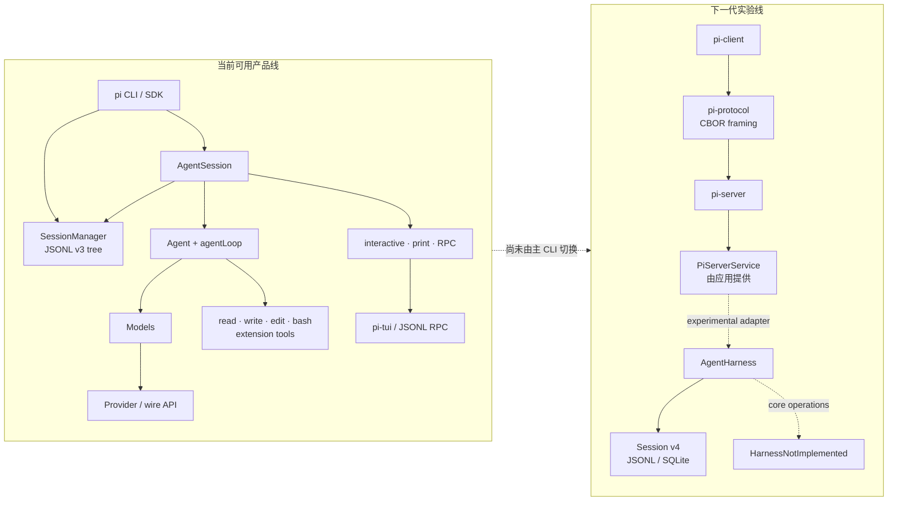

# Pi 项目源码级调研与 mini-loop 采用边界

> - 调研日期：2026-08-16
> - 上游仓库：[earendil-works/pi](https://github.com/earendil-works/pi)
> - 稳定发布：[`v0.84.2`](https://github.com/earendil-works/pi/releases/tag/v0.84.2)，提交
>   [`914cf147`](https://github.com/earendil-works/pi/commit/914cf1472e715297caa30db4b9535d534a9eb718)
> - 源码快照：`main` 提交
>   [`086c32e7`](https://github.com/earendil-works/pi/tree/086c32e74530564922d011ade23ff582c9d63116)，
>   2026-08-15
> - mini-loop 对照基线：已提交的 `1d6be781461c56520ab846abdffdb0a17a1131a9`

本报告回答三个问题：Pi 今天到底是什么、哪些能力已经落到可运行主路径、
mini-loop 应该借鉴什么而不应该引入什么。报告只形成研究与采用边界，不修改
mini-loop 运行时、不增加依赖，也不把调研时工作区中未提交的实现视为当前能力。

文中标记含义：

- **事实**：能由固定提交下的上游文档、源码或测试直接支持。
- **本地验证**：在固定提交的独立检出中实际运行得到。
- **判断**：基于多处事实作出的工程解释，不是上游承诺。
- **建议**：面向 mini-loop 的采用决策。

## 1. 结论先行

Pi 不是单一的 coding-agent CLI，而是一套 TypeScript agent harness monorepo。它的
成熟度呈明显的“双轨”结构：

1. **当前产品线已经成熟可用。** `pi-ai` 统一模型与 provider，低层 `Agent`
   驱动 model/tool loop，`pi-coding-agent` 的 `AgentSession` 组合 JSONL v3 会话、
   扩展、资源加载和 interactive/print/RPC 三种入口，`pi-tui` 提供终端交互。
2. **下一代 durable harness 仍是实现中的公开脚手架。** JSONL v4、SQLite session
   backend、protocol/client/server 等基础件已经存在并有测试，但 `AgentHarness`
   的 prompt、resume、tool execution、lane、watch 等核心操作仍明确抛出
   `HarnessNotImplemented`；server 也要求应用自己提供 `PiServerService`，没有
   standalone coding-agent service。

对 mini-loop 的总建议是：

- **不整体引入 Pi，也不依赖当前 `AgentHarness`/server。** 两个项目语言不同，
  Pi 的本地全权限信任模型也与 mini-loop 的显式 guard、permission、sandbox、
  immutable tool view 和持久化证据边界不一致。
- **优先借鉴四组合同。** provider/catalog/auth/stream 分层；低层 loop 与产品
  session 解耦；entry tree + fork/branch + compaction checkpoint；durable harness
  设计中的 intent/effect/settlement 与 replay classification。
- **把扩展机制当作 API 设计样本，不复制其权限模型。** Pi 的事件与动态工具加载
  很有价值，但任意 TypeScript extension 与 Pi package 都在主进程拥有完整权限。
- **把 durable harness 文档当 RFC，而不是已验证实现。** 其 lane、total operation
  state、effect sandwich、writer lease 设计值得进入 mini-loop 的验证清单，但当前
  源码不足以证明端到端恢复语义。

一句话评价：**Pi 当前最强的是“本地开发者工具的模型兼容层、TUI 与自扩展产品
体验”；mini-loop 当前更应坚持的是“服务端 authority、权限、证据与恢复边界”。**

## 2. 版本、范围与方法

### 2.1 为什么同时看 release 与 main

调研时最新稳定发布是 `v0.84.2`。固定的 `main` 快照相对该 tag 只有 17 个文件、
137 行新增和 26 行删除，主要是小修复；本报告涉及的架构结论在两者之间没有发生
反转。精确差异可由
[`v0.84.2...086c32e7`](https://github.com/earendil-works/pi/compare/v0.84.2...086c32e74530564922d011ade23ff582c9d63116)
复核。

### 2.2 证据层级

本报告按以下顺序判断能力是否“已经交付”：

1. 主 CLI/SDK 是否真的构造并调用该路径；
2. 核心方法是否有实现，而不只是类型、README 或 export；
3. 状态是否进入 durable authority，而不只是内存投影或会话文本；
4. 是否存在覆盖故障窗口的测试；
5. 最后才参考 roadmap、设计文档和 changelog。

这一区分尤其重要：Pi 把 `AgentHarness` 从 experimental subpath 提升到了默认导出，
但 changelog 同时称它为 compile-complete scaffold，源码与测试仍把核心操作标记为
未实现。**“公开可 import”不等于“运行时已可用”。**

## 3. 项目定位与包结构

上游根 README 把 Pi 定位为 agent harness，并列出五个面向用户的核心包：
`pi-ai`、`pi-agent-core`、`pi-coding-agent`、`pi-tui` 和 `pi-telemetry`；仓库采用
`packages/*` workspace，并在同一快照中继续孵化 protocol、client、server、
SQLite session backend 与 evals。核心包列表见
[根 README](https://github.com/earendil-works/pi/blob/086c32e74530564922d011ade23ff582c9d63116/README.md#L13-L36)，
构建顺序见
[package.json](https://github.com/earendil-works/pi/blob/086c32e74530564922d011ade23ff582c9d63116/package.json#L5-L33)。

| 层 | 包 | 当前职责 | 成熟度判断 |
|---|---|---|---|
| 模型适配 | `@earendil-works/pi-ai` | model catalog、auth、OAuth、stream、跨 provider context 转换 | 当前产品主路径 |
| 低层循环 | `@earendil-works/pi-agent-core` | stateful `Agent`、tool loop、事件、steering/follow-up | 当前产品主路径 |
| 产品会话 | `@earendil-works/pi-coding-agent` | CLI/SDK、`AgentSession`、JSONL v3、资源与扩展 | 当前产品主路径 |
| 终端 UI | `@earendil-works/pi-tui` | differential rendering、编辑器、选择器、主题 | 当前产品主路径 |
| 遥测 | `@earendil-works/pi-telemetry` | vendor-neutral contracts 与 adapter | 已构建、较独立 |
| 新会话存储 | agent-core 内 v4 + `pi-session-backend-sqlite-node` | entry/register/usage、JSONL/SQLite repo、lease、conformance | 基础设施已实现 |
| 协议与服务 | `pi-protocol`、`pi-client`、`pi-server` | CBOR framing、客户端、会话服务抽象 | experimental |
| durable runtime | `AgentHarness` | lane、operation、恢复、工具执行 | API scaffold，核心未实现 |

Pi 采用 MIT 许可证，见固定提交的
[README license](https://github.com/earendil-works/pi/blob/086c32e74530564922d011ade23ff582c9d63116/README.md#L106-L108)。
这允许参考或复用，但本报告建议优先移植合同与测试思想，而不是把 TypeScript 实现
翻译进 Python。

## 4. 两条运行时路径必须分开看



### 4.1 当前 CLI 的真实主路径

**事实：** `main.ts` 仍创建旧的 `SessionManager`，再构造
`createAgentSessionRuntime()`，最后进入 interactive、print 或 RPC mode；并没有从主
入口切到 experimental CLI/server。参见
[`main.ts`](https://github.com/earendil-works/pi/blob/086c32e74530564922d011ade23ff582c9d63116/packages/coding-agent/src/main.ts#L646-L977)
和只有一行 `main(process.argv.slice(2))` 的
[`cli.ts`](https://github.com/earendil-works/pi/blob/086c32e74530564922d011ade23ff582c9d63116/packages/coding-agent/src/cli.ts#L1-L21)。

`AgentSession` 订阅低层 `Agent` 事件，在 `message_end` 时把最终 message 追加到
session manager；这使当前持久化以**已经完成的 conversation entry**为中心。证据见
[`AgentSession` 事件处理](https://github.com/earendil-works/pi/blob/086c32e74530564922d011ade23ff582c9d63116/packages/coding-agent/src/core/agent-session.ts#L630-L667)。

**判断：** 当前 Pi 能可靠恢复“已经写入 JSONL 的对话树”，但不能由这条路径推出
“崩溃后可精确恢复正在发生的 provider/tool effect”。tool queue、stream 中间状态和
外部副作用 intent 并没有作为当前 v3 会话的 durable operation state 被提交。

### 4.2 低层 `Agent` 的价值

Pi 的低层 loop 边界很清楚：provider stream、message events、tool preflight、tool
execution、steering 和 follow-up 都由 `Agent`/`agentLoop` 管理；产品层再决定如何
持久化、展示和扩展。

工具批次支持 `parallel` 与 `sequential`。默认并行时先顺序 preflight，再并行执行
允许的工具；完成事件按真实完成顺序发出，但最终 tool-result message 仍按模型调用
顺序写入。如果批次中任一工具要求 sequential，整个批次降级为顺序执行。参见
[agent-core 行为合同](https://github.com/earendil-works/pi/blob/086c32e74530564922d011ade23ff582c9d63116/packages/agent/README.md#L113-L146)
和
[`executeToolCalls`](https://github.com/earendil-works/pi/blob/086c32e74530564922d011ade23ff582c9d63116/packages/agent/src/agent-loop.ts#L411-L554)。

**判断：** 这比把 provider、session、UI、tool execution 全塞进一个 loop 更容易做
合同测试。mini-loop 不应替换自己的安全执行管线，但可采用同样的层次拆分和批次
顺序不变量。

## 5. `pi-ai`：最值得优先借鉴的部分

### 5.1 Provider 拥有完整模型请求边界

`pi-ai` 不是按“厂商名直接 if/else”分发。一个 provider 同时拥有：

- model catalog；
- API key/OAuth 等 auth resolution；
- stream behavior；
- 它所使用的 wire API implementation。

`Models` collection 只负责注册、查询、刷新并把 model 请求路由给所属 provider。
多个 provider 可以共享 `anthropic-messages`、`openai-responses` 或
`openai-completions` wire implementation；provider factory 又保持独立 import 和
lazy SDK chunk。见
[`Providers and Models`](https://github.com/earendil-works/pi/blob/086c32e74530564922d011ade23ff582c9d63116/packages/ai/README.md#L230-L264)。

这组边界比“一个模型枚举 + 一个全局 client”更适合：

- 同一 wire protocol 下的多个网关或租户；
- provider 自己管理动态 catalog；
- auth refresh 与 request dispatch 保持同一所有者；
- 测试 fake provider 而不 fake 整个 app；
- 只加载实际使用的 SDK。

### 5.2 跨 provider 对话转换

Pi 在模型切换时保留普通文本、tool calls 与 tool results；不同 provider 的 thinking
block 会转成 `<thinking>` 文本，以避免把厂商专属结构直接送给另一个 API。见
[Cross-Provider Handoffs](https://github.com/earendil-works/pi/blob/086c32e74530564922d011ade23ff582c9d63116/packages/ai/README.md#L1295-L1335)。

**建议：** mini-loop 若扩展多 provider，不应让每个 provider 直接读写现有 transcript
对象。应先定义 vendor-neutral message/tool/usage IR，再由 provider adapter 做入站、
出站转换，并记录转换 provenance；thinking 降级不能静默发生。

### 5.3 需要保留的限制

模型和 context 可 JSON 序列化，不代表 auth、request、计费或 tool side effect 已经
durable。浏览器构建也明确警告前端暴露 API key 的风险，见
[Context Serialization 与 Browser Usage](https://github.com/earendil-works/pi/blob/086c32e74530564922d011ade23ff582c9d63116/packages/ai/README.md#L1337-L1397)。

因此 mini-loop 应借鉴 provider SPI，不应把“可序列化 context”误写成“可恢复执行”。

## 6. 会话树、分支与压缩

当前 coding-agent 的 session format 是 JSONL v3：每条 entry 有 `id` 和 `parentId`，
一个文件内形成树；当前 leaf 决定活跃路径。用户可以原地 `/tree` 导航，也可以
`/fork`、`/clone` 生成新 session。长上下文由 compaction summary + retained tail
重建，完整历史仍留在文件中。参见
[Sessions](https://github.com/earendil-works/pi/blob/086c32e74530564922d011ade23ff582c9d63116/packages/coding-agent/README.md#L236-L280)
与
[session-format](https://github.com/earendil-works/pi/blob/086c32e74530564922d011ade23ff582c9d63116/packages/coding-agent/docs/session-format.md#L301-L342)。

这套设计的优点：

- branch 是 leaf/cursor 选择，不需要复制全部历史；
- compaction 是显式 entry，原始树仍可审计；
- branch summary 能把离开的分支信息带入新路径；
- UI 可以在同一数据结构上做树导航、bookmark 与 fork。

但也有三条采用边界：

1. JSONL v3 是单机产品会话格式，不是多 writer 服务端 authority；
2. compaction summary 是有损投影，必须与原始 transcript、生成模型和 usage 分开；
3. entry tree 只证明历史分支，不证明 in-flight operation 的恢复。

**建议：** mini-loop 可复用 `entry_id + parent_id + active_leaf + compaction checkpoint`
语义，但应落在自己的 SQLite epoch/owner/lease/receipt 约束里，不要用 Pi JSONL 替换
现有 authority。

## 7. 扩展、Skills 与动态工具加载

### 7.1 扩展面非常强

Pi extension 可注册 tools、commands、shortcuts、flags、provider、事件处理与 TUI
组件，也可替换 compaction、实现 subagent、plan mode、permission gate、SSH、sandbox
或 MCP。官方 README 把“核心最小、工作流由扩展决定”作为产品哲学，见
[Extensions](https://github.com/earendil-works/pi/blob/086c32e74530564922d011ade23ff582c9d63116/packages/coding-agent/README.md#L369-L399)
和
[Philosophy](https://github.com/earendil-works/pi/blob/086c32e74530564922d011ade23ff582c9d63116/packages/coding-agent/README.md#L494-L510)。

Skills 使用 Agent Skills 格式，可从用户级、项目级目录和 Pi package 发现；prompt、
theme 与 extension 也有类似的分层资源模型。

### 7.2 动态工具加载值得借鉴

Pi 允许初始只激活少量工具，再由 loader tool 调用 `setActiveTools()` 做纯增量扩展。
支持 native deferred tool loading 的模型会在 tool-result 位置引入定义；其他模型退回
普通完整 active-tool list。文档还明确指出：移除工具或修改 system-prompt metadata
会破坏这一缓存优势。见
[Dynamic Tool Loading](https://github.com/earendil-works/pi/blob/086c32e74530564922d011ade23ff582c9d63116/packages/coding-agent/docs/extensions.md#L2337-L2368)。

**建议：** 这与 mini-loop 的 token-efficiency registry 方向一致，但 mini-loop 需要
额外保持：

- 初始 catalog snapshot 不可变；
- 每次激活是带来源、scope、digest 和 capability 的 receipt；
- transcript 中能重建“某一模型请求到底看见哪些工具”；
- 子 agent 只能继承明确允许的 catalog projection；
- dynamic loading 不能绕过 guard 与 permission pipeline。

### 7.3 不能复制的权限模型

Pi package 与 extension 都是主进程任意代码，官方文档明确说明它们拥有完整系统权限。
项目 trust 只决定是否加载项目级输入，不限制模型启动后的 tool 行为。见
[Pi Packages security](https://github.com/earendil-works/pi/blob/086c32e74530564922d011ade23ff582c9d63116/packages/coding-agent/README.md#L407-L437)。

因此 mini-loop 不应加入“从 npm/git 自动安装并在 server 进程执行任意 extension”这类
机制。若未来需要第三方扩展，应先定义签名、所有者、版本固定、进程隔离、能力清单、
加载时机和撤销策略。

## 8. 安全与信任模型

Pi 的安全立场非常清楚：

- 默认没有内建 permission system；
- built-in tools 与 extensions 使用启动 Pi 的进程权限；
- project trust 是 input-loading guard，不是 sandbox；
- prompt injection 被视为本地 agent 的预期风险；
- 不受信或无人值守工作应使用 container、VM、micro-VM 或 policy sandbox。

证据见
[根 README 的权限说明](https://github.com/earendil-works/pi/blob/086c32e74530564922d011ade23ff582c9d63116/README.md#L38-L46)
和
[security.md](https://github.com/earendil-works/pi/blob/086c32e74530564922d011ade23ff582c9d63116/packages/coding-agent/docs/security.md#L31-L53)。

这不是“Pi 忘了做安全”，而是它对本地 developer tool 的明确取舍；其建议的真实边界
是 OS/container，而不是进程内确认弹窗。

mini-loop 的场景包含 REST/SSE、多 session、owner scope、可选持久化与后台能力，不能
直接继承该取舍。需要继续区分：

| 边界 | Pi 当前默认 | mini-loop 应保持 |
|---|---|---|
| 文件/进程权限 | 启动用户全部权限 | workspace safe-path + guard + permission + sandbox seam |
| 项目信任 | 控制项目资源加载 | 资源来源、owner、digest、生命周期与执行权限分别建模 |
| 扩展 | 同进程任意代码 | 默认不加载；若引入则能力化并隔离 |
| 无人值守 | 依赖外部容器 | 外部隔离 + 内部 authority/receipt 双层边界 |
| prompt injection | 接受为本地风险 | 仍不可“解决”，但要限制其可获得的 capability 与秘密 |

需要诚实说明：mini-loop README 中不少 hardening 能力是可选、default-off 或依赖真实
backend 配置；有 seam 不等于部署时已经启用。Pi 的资料反而提醒我们继续在文档与
运行时姿态中区分“存在能力”和“当前生效”。

## 9. 下一代 durable harness：设计很强，实现未完成

### 9.1 设计文档提出的关键不变量

`packages/agent/docs/harness.md` 描述了一套比当前 v3 产品线更强的 runtime：

- session 由 entry、mutable register、usage ledger 构成；
- lane 是共享历史树上的命名 cursor，每个 lane 最多一个 operation；
- `op.meta` 记录 immutable intent，`op.state` 保存完整、可替换的 total state；
- provider/tool effect 前后各做一次提交，即 effect sandwich；
- tool 声明 `replay: safe | never`；
- 终态事务删除 operation state，并写 `lane.lastResult`；
- JSONL v4 与 SQLite backend 实现相同 session contract，SQLite 使用 writer lease；
- “exactly once external effect”不是承诺，未知窗口必须显式表示。

这些设计可在
[harness overview](https://github.com/earendil-works/pi/blob/086c32e74530564922d011ade23ff582c9d63116/packages/agent/docs/harness.md#L94-L137)
和
[effect recovery walkthrough](https://github.com/earendil-works/pi/blob/086c32e74530564922d011ade23ff582c9d63116/packages/agent/docs/harness.md#L176-L205)
中复核。

**判断：** 这是本项目最值得研究的架构材料之一。尤其是“total state 而非从缺失事件
推断 program counter”“effect_pending + replay policy”“operation 结束后删除运行态”
三点，适合作为 mini-loop verified-loop/action-journal 的反例测试来源。

### 9.2 但 `AgentHarness` 仍是 scaffold

固定提交中的实现只允许在空 session 上 create；只要存在 record，restore 就抛
`HarnessNotImplemented("create.restore")`。prompt、skill、compact、navigate、resume、
abort、steer、follow-up、usage、actions、watch、lane 等核心方法全部走
`unavailable()`。只有配置 getter/setter、leaf 读取与 close 等 scaffold-safe 行为可用。
见
[`AgentHarness`](https://github.com/earendil-works/pi/blob/086c32e74530564922d011ade23ff582c9d63116/packages/agent/src/harness/agent-harness.ts#L347-L507)
及其明确枚举未实现操作的
[scaffold test](https://github.com/earendil-works/pi/blob/086c32e74530564922d011ade23ff582c9d63116/packages/agent/test/harness/agent-harness-scaffold.test.ts#L145-L188)。

这意味着：

- v4 storage 通过测试，不等于 harness 能驱动一轮 durable agent；
- 类型与设计文档不能替代 crash-point/mutation/recovery 测试；
- 默认 export 不能作为生产可用性信号；
- mini-loop 现在引入依赖只会绑定一个快速变化且核心未实现的 API。

### 9.3 server/client/protocol 也是实验基础件

`pi-server` README 首行标注 experimental，并明确“不提供 standalone CLI 或
coding-agent service，应用负责实现 `PiServerService`”。它提供的价值主要是协议、
transport-neutral service interface、Unix socket preset、snapshot 与 conformance
测试。见
[`pi-server` README](https://github.com/earendil-works/pi/blob/086c32e74530564922d011ade23ff582c9d63116/packages/server/README.md#L1-L48)。

**判断：** mini-loop 已有真实 FastAPI/REST/SSE 路径，当前没有理由用 Pi server 替换。
未来可对照它的 wire DTO 与 domain object 隔离方式，但必须保留 mini-loop 自己的
authentication、ownership、lease、event replay 和 HTTP/SSE compatibility。

## 10. 工程质量与本地验证

### 10.1 上游工程习惯

Pi 对供应链的处理值得肯定：直接依赖精确 pin、lockfile 为 ground truth、发布包带
shrinkwrap、CI 使用 `npm ci --ignore-scripts`、release 前做隔离 smoke test，并审查
lifecycle scripts。见
[Supply-chain hardening](https://github.com/earendil-works/pi/blob/086c32e74530564922d011ade23ff582c9d63116/README.md#L76-L88)。

源码也大量使用 contract/conformance tests。特别是 session backend 把 in-memory、
JSONL 与 SQLite 放到同一类行为合同下，这一做法比只测试某个实现更适合移植到
mini-loop 的 provider/storage SPI。

### 10.2 固定快照验证记录

本地验证环境使用临时 Node `22.19.0`，满足仓库声明的 `>=22.19.0`；model data 先通过
上游 hydration script 生成，再执行 offline build。

| 命令 | 结果 | 说明 |
|---|---|---|
| `npm run hydrate:model-data` | 通过 | 从 live provider catalog 生成本地 model data；结果具有时间性 |
| `npm run build:offline` | 通过 | tui、telemetry、ai、agent、SQLite backend、protocol、client、server、coding-agent 全部构建 |
| `npm run test:harness`（agent 包） | 通过 | 19 files；360 passed，1 skipped |
| `npm test` | 部分通过 | 核心 agent、client、protocol、server、SQLite、evals、telemetry 通过；环境相关套件未全绿 |

完整 `npm test` 的非绿色项没有被伪装成项目回归：

- `pi-ai` 有 6 项依赖本机 Ollama；本机 Ollama `0.9.0` 无法拉取测试要求的
  `gpt-oss:20b`，随后 model 为 undefined；
- coding-agent 有 10 项、TUI 有 6 个 autocomplete 子项受本机 `fd 8.2.1` 影响；该
  版本不支持测试使用的 `--no-require-git`。

因此本报告能确认固定快照**可完整类型构建，harness 测试集通过**；不能把本机完整
`npm test` 描述为 clean pass。环境失败也不改变 `AgentHarness` scaffold test 对未实现
操作的明确结论。

## 11. 与 mini-loop 的能力对照

对照只使用 mini-loop 已提交基线。当前架构与 default-on/default-off 边界以
[README Architecture](../README.md#architecture) 为准。

| 能力 | Pi 固定快照 | mini-loop 已提交基线 | 采用决策 |
|---|---|---|---|
| 多 provider | catalog/auth/stream/provider factory 成熟 | 主路径仍较集中，未形成同等级 provider registry | **高优先级借鉴合同** |
| 低层 agent loop | 独立 `Agent`，事件和工具批次语义清晰 | `Agent._loop` 同时承载更多 guard/context/evidence 责任 | **逐步拆接口，不替换安全管线** |
| 工具并发 | 默认并行，per-tool 可强制整批顺序 | 有 `parallel_safe` 与受控并发 | **补批次顺序与降级合同测试** |
| 扩展系统 | 极强、同进程全权限 | typed seam + immutable Harness/catalog，更强调边界 | **选取事件词汇，拒绝任意代码加载** |
| Skills/资源 | 用户/项目/packages 多层发现 | agent/user 资源区分 owner、digest、snapshot、lifecycle | **保留 mini-loop 更严格语义** |
| session tree | v3 JSONL tree、branch/fork/clone/compaction 成熟 | SQLite epoch/transcript/cursor，可选 durability | **移植 tree 合同到现有 authority** |
| durable operation | 文档与存储强，`AgentHarness` 未实现 | action journal/lease/recovery 有独立边界，但不是全循环 exactly-once | **只借鉴不变量，继续 mutation/crash 验证** |
| 服务端 | protocol/client/server experimental，需应用 adapter | FastAPI/REST/SSE 已是实际入口 | **不替换；只对照 DTO/adapter 分层** |
| 安全 | 本地进程全权限，外部容器为真实边界 | 内部 guard/permission/sandbox seam + 外部部署边界 | **坚持 mini-loop 方向并诚实标注默认** |
| TUI | 产品级、differential rendering | 基础 browser console | **有明确产品需求时再研究** |

## 12. 建议的采用路线

### P0：现在即可吸收的设计与测试合同

1. **Provider SPI 设计稿。** 定义 `ModelProvider`、`ModelCatalog`、
   `CredentialResolver`、vendor-neutral stream event、usage 与 error taxonomy。
2. **工具批次不变量。** preflight 顺序、并行完成顺序、transcript 稳定顺序、任一
   sequential tool 触发整批降级，并覆盖 cancellation/steering。
3. **运行态与对话态分离检查。** 审计哪些字段只是 transcript，哪些是 operation
   authority，禁止用“最后一条 message”猜正在进行的 effect。
4. **Pi durable RFC 反例集。** 把 provider intent 后崩溃、unsafe tool effect 前后崩溃、
   terminal transaction 前崩溃、lease loss 写成 mini-loop 的验收场景。

P0 不需要引入 npm 包，也不需要改默认 provider。

### P1：适合独立实施的本地能力

1. **多 provider registry。** 先用 fake provider + 现有 provider 做 conformance，
   再接第二个真实 provider；auth 与 model catalog 必须由 provider 所有。
2. **session tree/fork contract。** 在 SQLite authority 中增加 parent/leaf/fork 语义，
   保持 owner、epoch、lease 与 transcript invariant；不要另建不受控 JSONL authority。
3. **可重建 tool visibility。** 动态激活只允许 additive receipt，记录 request 所见
   catalog fingerprint，并让 child/team 继承显式 snapshot。
4. **compaction checkpoint。** summary、retained tail、原始历史、生成 usage 与 provenance
   分开持久化，并证明恢复路径不依赖被压缩文本之外的隐式内存。

### P2：等上游实现成熟后再复核

- `AgentHarness` 的 prompt/tool/resume/lane 是否有真实实现；
- crash-point tests 是否覆盖 effect sandwich 的每个不确定窗口；
- coding-agent 主 CLI 是否切到 v4 session + harness；
- `PiServerService` 是否出现正式 coding-agent adapter 与 authorization contract；
- v3 到 v4 migration 是否在真实用户 session 上完成验证。

建议把重新评估门槛设为“核心方法不再抛 `HarnessNotImplemented` + 主产品实际接入 +
故障恢复测试通过”，而不是版本号或 default export 变化。

## 13. 明确不采用的内容

- 不引入 `@earendil-works/pi-agent-core` 作为 mini-loop runtime 依赖；
- 不用 Pi JSONL v3 替换 SQLite session/event authority；
- 不在服务进程中自动安装或执行 Pi packages/任意 TypeScript extensions；
- 不把 project trust 当作 tool permission 或 sandbox；
- 不把 `AgentHarness` 类型、harness.md 或 v4 storage 的存在写成 durable loop 已交付；
- 不用 experimental server 替换现有 FastAPI/SSE；
- 不为了“支持很多模型”复制 catalog 数据，catalog 必须可刷新、可审计并有来源时间；
- 不照搬 `<thinking>` 静默降级；跨 provider 转换要留下 provenance。

## 14. 上游优点、风险与最终判断

### 14.1 主要优点

- provider、wire API、catalog 和 auth 分层清楚；
- 低层 agent loop 的事件与工具批次语义可测试；
- JSONL session tree 带来的 branching UX 很完整；
- TUI、扩展、Skills、RPC/SDK 形成实际产品闭环；
- 动态工具加载认真考虑 provider-native protocol 与 prompt cache；
- 依赖 pin、shrinkwrap、release smoke 和 conformance tests 显示工程纪律；
- durable harness RFC 对不确定 effect 窗口的表述比“exactly once”宣传更诚实。

### 14.2 主要风险

- 本地全权限 extension/package 模型不适合直接迁移到多用户服务；
- `AgentSession`、extension types、package manager 等应用层文件体量较大，扩展能力带来
  复杂度集中；
- 公开的 durable API 与实际实现成熟度存在明显落差；
- 当前 v3 产品线和 v4/harness/server 实验线并存，容易被包名与 export 误导；
- 部分文档源码链接仍指向旧仓库名 `pi-mono`，固定 SHA 阅读比依赖文档内跳转更可靠；
- 模型 catalog、provider 登录与外部 CLI 测试容易受网络和本机工具版本影响。

### 14.3 最终判断

Pi 是一个值得长期跟踪的 agent harness 参考项目，但对 mini-loop 的价值不是“拿来替换
现有 runtime”，而是提供两类高质量输入：

1. **已验证的产品机制：** provider registry、低层 loop、session tree、TUI、扩展事件、
   动态工具激活；
2. **尚待验证的 durable 设计：** lane、total operation state、effect sandwich、replay
   policy、writer lease 与 v4 storage。

近期最划算的动作是先做 provider SPI 与 tool/session 合同测试；durable harness 只进入
设计审查和故障用例库。这样既吸收 Pi 的强项，也不牺牲 mini-loop 已经建立的
authority、permission、provenance 和 recovery 边界。

## 15. 复核命令

以下命令用于复核本报告的固定快照，不应直接在 mini-loop 工作区运行：

```bash
git clone --filter=blob:none https://github.com/earendil-works/pi.git
cd pi
git checkout 086c32e74530564922d011ade23ff582c9d63116

# 上游要求 Node >= 22.19.0；本次使用 npm 10.9.0 安装依赖。
npm ci --ignore-scripts
npm run hydrate:model-data
npm run build:offline

cd packages/agent
npm run test:harness
```

若执行根目录 `npm test`，还需要满足各 optional integration 的本地前置条件，例如当前
`fd` 参数支持和 Ollama 测试模型；否则应逐项报告环境边界，不能把 partial suite 当成
clean pass。
