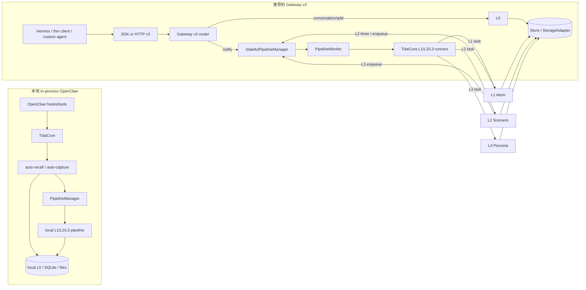
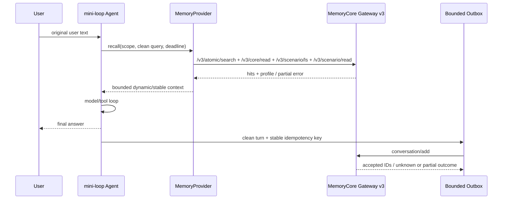

# TencentDB Agent Memory 源码级调研与 mini-loop 接入评估

> - 调研日期：2026-08-08
> - 上游仓库：[`TencentCloud/TencentDB-Agent-Memory`](https://github.com/TencentCloud/TencentDB-Agent-Memory)
> - 固定源码快照：[`feat/server_team@fe3230f176f1bf5832fee79d12494bbc2d19a8aa`](https://github.com/TencentCloud/TencentDB-Agent-Memory/tree/fe3230f176f1bf5832fee79d12494bbc2d19a8aa)
> - 最新 release：[`v2.0.0@0aff21a`](https://github.com/TencentCloud/TencentDB-Agent-Memory/releases/tag/v2.0.0)
> - 评估对象：开源仓库、官方云产品文档，以及 mini-loop 当前实现
> - 一句话结论：**产品方向和分层模型值得借鉴；当前 v2 开源快照适合做受控 sidecar 试验，不适合直接成为 mini-loop 的生产记忆权威。**

---

## 1. 结论先行

TencentDB Agent Memory 已经不只是一个“向量库 memory plugin”。它试图把 Agent 长期上下文做成团队资产平台：

- 对话沿 `L0 原始记录 → L1 原子记忆 → L2 场景 → L3 Persona` 异步生长；
- Chat Memory、Skill、Wiki、CodeGraph 被统一登记为资产，再通过 binding 和 ACL 装配给 Agent；
- Memory Core 提供数据面，Memory Hub 提供治理面，Knowledge 负责 Wiki/CodeGraph，Proxy 为既有 coding agent 改写模型请求；
- 本地运行可以退化到 SQLite、FTS/BM25 和本地文件，embedding 并非最小闭环的硬依赖。

对 mini-loop，最值得复用的是四件事：

1. 将“原始事件”“可精确召回的事实”“场景摘要”“稳定画像”分成不同权威层；
2. 将动态 L1 放在每轮消息流，将更稳定的 L2/L3 单独处理，避免无差别塞进全局 system prompt；
3. capture 只接收未被 recall 污染的本轮增量，而不是反复抽取整段 transcript；
4. 把 user、agent、session、task 和资产权限当成 memory contract 的一部分，而不是查询参数的附属品。

但当前固定快照存在几类阻塞项：

- GitHub 的默认/发布分支是与 `main` 无共同历史的 8-commit 产品快照；CI 仍只监听 `main`；
- 固定树没有 tracked unit/spec tests，源码构建脚本引用缺失目录；release、源码 package、npm/PyPI、Docker 的版本坐标不一致；
- Gateway 的 Bearer 鉴权和 v3 严格隔离都不是默认 fail-closed；一键部署还可能把未鉴权 Core 发布到 `0.0.0.0`；
- 本地 in-process `TdaiCore` 与 Gateway v3 是两套数据面；前者的 L1 recall/capture 存在实际隔离缺口，不能把其 README 抽象直接当作运行保证；
- 部分失败路径会先推进 checkpoint、再发现持久化失败；SQLite TTL 删除还可能留下可被 FTS 召回的“幽灵记忆”；
- Hermes、thin OpenClaw、旧 `/recall` 的文档和实际协议有漂移；v3 也尚无调用方幂等键和 session-end API。

因此推荐：

| 决策 | 建议 | 原因 |
|---|---|---|
| 直接替换 mini-loop `MemoryStore` | 暂不做 | 生命周期、身份、幂等、失败语义尚未对齐 |
| 进程内嵌入 TypeScript Core | 不做 | 跨语言、两套数据面、运行依赖和升级面过大 |
| 通过 Memory Proxy 接入 | 不做 | Proxy 会接管模型 endpoint、鉴权和 prompt 改写，与 mini-loop 自己的 agent loop 重叠 |
| HTTP 直连 Memory Core v3 | 可做受控试点 | 边界最薄，能单独限流、降级、审计和回滚 |
| 一开始启用 L0–L3、Skill、Wiki、CodeGraph | 不做 | 难以定位质量、延迟和一致性问题 |
| 第一阶段只做 L0 capture + L1 search | 推荐 | 能验证最核心收益，失败面和数据迁移面最小 |

---

## 2. 研究范围与证据口径

### 2.1 固定基线

| 项目 | 2026-08-08 观察值 |
|---|---|
| GitHub 默认分支 | `feat/server_team`，不是 `main` |
| 审计 commit | `fe3230f176f1bf5832fee79d12494bbc2d19a8aa`，2026-08-06 |
| 最新 release | `v2.0.0`，tag `0aff21a2d9f2b8a0354aaa80a2e586aab4054562`，2026-08-03 |
| HEAD 与 release | HEAD 领先 2 commits，只改了根中文 README 和 OpenClaw plugin package |
| 当前 v2 分支历史 | 8 commits；根提交无父提交，与 `main` 无 merge base |
| `main` | `3c6fc642...`，旧 v0.3.6/OpenClaw plugin 线，不代表当前 v2 产品树 |
| 固定树规模 | 837 tracked files；未发现 tracked `test/spec` 文件 |
| License | 根文件包含完整 MIT 条款；GitHub API 当前返回 `Other/NOASSERTION`，复用时仍应保留原声明 |

版本信息以 [release v2.0.0](https://github.com/TencentCloud/TencentDB-Agent-Memory/releases/tag/v2.0.0)、固定 commit 的 [`CHANGELOG.md`](https://github.com/TencentCloud/TencentDB-Agent-Memory/blob/fe3230f176f1bf5832fee79d12494bbc2d19a8aa/CHANGELOG.md#L12-L110) 和 [`LICENSE`](https://github.com/TencentCloud/TencentDB-Agent-Memory/blob/fe3230f176f1bf5832fee79d12494bbc2d19a8aa/LICENSE) 为准。

### 2.2 事实、声明与推断

- **源码事实**：固定 commit 的类型、路由、调用链、持久化实现和 workflow 直接表达的行为。
- **本地观察**：在临时 clone 中执行的安装、构建和测试命令；不等同于上游 CI。
- **上游声明**：README、release、云产品页的 benchmark、性能和产品能力；没有对应源码/数据时不当成本次复现结果。
- **架构判断**：从多处源码共同推出的边界，例如“本地 JSONL 是镜像而 SQLite 是 Gateway standalone 权威”。
- **未验证**：真实云账号、托管 VectorDB、公开镜像内容、长时间并发负载、生产备份恢复、真实模型提取质量。

### 2.3 云产品与开源实现必须分开

官方云产品介绍的是托管“Agent Memory”，包含腾讯云 VectorDB、混合检索、服务化存储和控制台能力；官方文档也给出短期/长期记忆、RRF 与 token/task 改善等产品口径。参见[产品页](https://cloud.tencent.com/product/agm)、[产品架构](https://cloud.tencent.com/document/product/1813/132100)和[自定义 Agent 接入](https://cloud.tencent.com/document/product/1813/132103)。

固定 OSS 快照能直接证明的 standalone 边界则是：

- SQLite + sqlite-vec + FTS5/BM25；
- 本地 JSONL、Markdown、状态文件；
- 进程内队列、锁和 timer；
- 可选 OpenAI-compatible embedding/LLM；
- Docker/HTTP Gateway 和若干 adapter。

云端 VectorDB、备份、SLA、多副本状态后端和私有 `src/integrations` 的能力，不能反向算作 OSS standalone 的保证。源码也明确指出 `deployMode=service` 要加载当前树中不存在的 private submodule。[证据](https://github.com/TencentCloud/TencentDB-Agent-Memory/blob/fe3230f176f1bf5832fee79d12494bbc2d19a8aa/MemoryCore/src/gateway/server.ts#L1678-L1704)

---

## 3. 产品定位与仓库模块

### 3.1 四种“记忆资产”

| 资产 | 作用 | 固定快照中的主要实现 |
|---|---|---|
| Chat Memory | L0–L3 对话记忆、召回和提取 | `MemoryCore` |
| Skill | 从任务经验沉淀 SOP、版本和资源 | `MemoryCore/src/core/skill` + metadata |
| Wiki | 文档解析、页面与链接图 | `MemoryKnowledge` |
| CodeGraph | 文件、符号、调用与影响路径 | `MemoryKnowledge` |

根 README 对四层记忆、asset/loadout 和按需知识工具的说明见[技术实现](https://github.com/TencentCloud/TencentDB-Agent-Memory/blob/fe3230f176f1bf5832fee79d12494bbc2d19a8aa/README_CN.md#L216-L247)。这已经超出一般的“conversation vector store”：其目标是 memory control plane + agent loadout。

### 3.2 Repository module map

| 模块 | 职责 | 默认部署口径 |
|---|---|---|
| `MemoryCore` | L0–L3、SQLite/TCVDB store、pipeline、Gateway、OpenClaw/Hermes adapter | Gateway 端口示例 `8420` |
| `MemoryKnowledge` | Wiki/CodeGraph 的索引、搜索和工具调用 | Hub 组合部署内端口示例 `8424` |
| `MemoryPanel` | Team/User/Agent/Task、资产和 binding 的 Web 管控面 | Hub 端口示例 `8125` |
| `MemoryProxy` | Anthropic/OpenAI protocol proxy，注入 memory/skill/knowledge 后转发模型 | 端口示例 `8096` |
| `sdk/memory-core` | Python/TypeScript v2/v3 client | SDK，不是服务 |
| `deploy` | Core/Hub/Proxy 一键脚本、镜像配置 | 本地演示优先，不是 production baseline |

MemoryPanel 本身不是独立身份/记忆权威；它通过外部服务持久化和读取。Proxy 也不是 memory store，而是模型流量中间人。

---

## 4. 实际架构：不是一条统一的数据面

README 容易让人形成“所有 adapter 都进入同一个 TdaiCore 门面”的印象。固定源码显示至少两条主路径：



关键含义：

- `TdaiCore` 在本地插件路径上是 recall/capture 门面；
- Gateway v3 的请求由名为 `v2-router.ts` 的统一路由直接操作 store/storage，再通知 stateful pipeline；
- Gateway 后台 worker 才复用 `TdaiCore` 的 L1/L2/L3 runner；
- 因此必须按路径评价隔离、checkpoint 和 API，不能把一条路径的性质泛化给整个产品。

核心证据：[`TdaiCore` 生命周期](https://github.com/TencentCloud/TencentDB-Agent-Memory/blob/fe3230f176f1bf5832fee79d12494bbc2d19a8aa/MemoryCore/src/core/tdai-core.ts#L224-L364)、[Gateway v2/v3 dispatch](https://github.com/TencentCloud/TencentDB-Agent-Memory/blob/fe3230f176f1bf5832fee79d12494bbc2d19a8aa/MemoryCore/src/gateway/v2-router.ts#L410-L641)、[Gateway 后台 L1/L2/L3 runner](https://github.com/TencentCloud/TencentDB-Agent-Memory/blob/fe3230f176f1bf5832fee79d12494bbc2d19a8aa/MemoryCore/src/gateway/server.ts#L2323-L2627)。

### 4.1 HostAdapter 没有成为请求级身份边界

`HostAdapter` 只暴露 runtime context、logger 和 LLM factory。[接口](https://github.com/TencentCloud/TencentDB-Agent-Memory/blob/fe3230f176f1bf5832fee79d12494bbc2d19a8aa/MemoryCore/src/core/types.ts#L228-L250)

当前树只有 OpenClaw 和 standalone 实现；源码注释提及 Hermes，但没有 `HermesHostAdapter`。更重要的是，`TdaiCore` 构造时读取一次 adapter，OpenClaw/standalone 中部分 per-session context builder 没有进入主调用链。因此这个 abstraction 目前更像依赖注入 seam，不是可证明的多租户 request context。

---

## 5. L0–L3 数据与检索管线

### 5.1 四层各自保存什么

| 层 | 权威数据 | 生成方式 | 主要读取方式 |
|---|---|---|---|
| L0 Conversation | Gateway 保留调用方提交的消息及 scope；in-process 会清洗/过滤文本且隔离字段不完整 | 每轮 capture/add | 时间/会话查询、FTS/向量回溯 |
| L1 Atom | persona / episodic / instruction / work_fact / work_task / work_method / work_artifact，含来源、场景、优先级、版本 | 规则质量门 + LLM 抽取/去重判定 | BM25、向量、hybrid RRF |
| L2 Scenario | 带 META 的 Markdown Scene Blocks | 增量 L1 聚合 | 场景目录与按文件读取 |
| L3 Core/Persona | 长期画像、稳定模式 | 冷启动/恢复/阈值触发的工具型 LLM | profile read |

L0/L1 schema 分别见 [`L0Record`](https://github.com/TencentCloud/TencentDB-Agent-Memory/blob/fe3230f176f1bf5832fee79d12494bbc2d19a8aa/MemoryCore/src/core/store/types.ts#L138-L160) 和 [L1 writer input](https://github.com/TencentCloud/TencentDB-Agent-Memory/blob/fe3230f176f1bf5832fee79d12494bbc2d19a8aa/MemoryCore/src/core/record/l1-writer.ts#L55-L98)。L2 格式见 [`scene-format.ts`](https://github.com/TencentCloud/TencentDB-Agent-Memory/blob/fe3230f176f1bf5832fee79d12494bbc2d19a8aa/MemoryCore/src/core/scene/scene-format.ts#L5-L68)，L3 触发规则见 [`persona-trigger.ts`](https://github.com/TencentCloud/TencentDB-Agent-Memory/blob/fe3230f176f1bf5832fee79d12494bbc2d19a8aa/MemoryCore/src/core/persona/persona-trigger.ts#L35-L95)。

### 5.2 L1 并非“embed 后直接存”

管线会：

1. 从 L0 取有限批次；默认一次最多读 20 条、处理 10 条；
2. 用确定性规则做质量过滤，再让 LLM 做场景分段和原子信息抽取；
3. 用向量或 FTS 找候选；
4. 再让 LLM 判定 `store / update / merge / skip`；
5. 产出 L1 后推进 L2/L3 聚合条件。

这比 mini-loop 当前的“词法候选 + side LLM selector + Markdown file”丰富，但也让 LLM 配置、失败策略、checkpoint 和成本成为数据正确性的一部分。L1 去重失败时默认 `store`，强调可用性而不是强一致去重。[证据](https://github.com/TencentCloud/TencentDB-Agent-Memory/blob/fe3230f176f1bf5832fee79d12494bbc2d19a8aa/MemoryCore/src/core/record/l1-dedup.ts#L89-L195)

### 5.3 Recall 是有预算的混合检索

SQLite 路径提供 jieba + FTS5 BM25、sqlite-vec cosine；hybrid 在客户端用 `k=60` 的 RRF 合并。显式选择 `keyword` 策略时不需要 embedding；若配置为 `embedding/hybrid` 而资源缺失，当前实现返回配置错误，并不会自动退回 keyword。recall 还有默认 5 秒 timeout、条数和总字符预算。[hybrid/RRF](https://github.com/TencentCloud/TencentDB-Agent-Memory/blob/fe3230f176f1bf5832fee79d12494bbc2d19a8aa/MemoryCore/src/core/hooks/auto-recall.ts#L638-L773)、[预算](https://github.com/TencentCloud/TencentDB-Agent-Memory/blob/fe3230f176f1bf5832fee79d12494bbc2d19a8aa/MemoryCore/src/core/hooks/auto-recall.ts#L835-L899)

需要注意：hybrid 的 threshold 参数没有参与最终过滤；SQLite 是先取 `5 × topK` 再做租户过滤，某个租户的合法命中可能落在 oversample 之外而出现假空。这是召回率边界，不等同于越权返回。

### 5.4 动态与稳定 context 分流

`RecallResult` 明确区分：

- `prependContext`：动态、每轮变化的 L1；
- `appendSystemContext`：相对稳定的 persona、scene navigation、tool guide。

见 [`RecallResult`](https://github.com/TencentCloud/TencentDB-Agent-Memory/blob/fe3230f176f1bf5832fee79d12494bbc2d19a8aa/MemoryCore/src/core/types.ts#L283-L302) 和 [auto recall 组装](https://github.com/TencentCloud/TencentDB-Agent-Memory/blob/fe3230f176f1bf5832fee79d12494bbc2d19a8aa/MemoryCore/src/core/hooks/auto-recall.ts#L148-L313)。

这与 mini-loop 将 turn-to-turn facts 放入消息流以保护 prompt cache 的方向一致。不过 L2/L3 仍会变化，只有在带版本、稳定且可审计时才适合作为 system prefix；不能因其名为 persona 就默认永久稳定。

### 5.5 Context offload 是另一套短期记忆

Offload 不属于 L0–L3：它把大工具结果原文写到 `refs/*.md`，把摘要写入 session JSONL，再聚合成 MMD；恢复时注入 MMD，模型需要沿 `result_ref` 主动读取原文。[数据结构](https://github.com/TencentCloud/TencentDB-Agent-Memory/blob/fe3230f176f1bf5832fee79d12494bbc2d19a8aa/MemoryCore/src/offload/types.ts#L13-L57)

这个设计适合借鉴“摘要不是原文权威、原文可追溯”的原则，但当前实现不适合直接引入 mini-loop，原因见第 8 节的 TLS、并发状态和预算问题。

---

## 6. Asset、binding 与 ACL

metadata 层把 Team、User、Agent、Task、Asset、Binding、ACL 分开建模；v3 metadata router 提供独立治理 API。Chat Memory/Skill 首次使用时可自动建 asset，再绑定给 agent。默认 Chat Memory asset 是 private。

可见性大体为：

| visibility | 语义 |
|---|---|
| `private` | owner-only |
| `team` | team 可见 |
| `restricted` | 由 user/role/agent ACL 限定 |
| `agent` | 定向给某 agent |
| `task` | 定向给某 task |

权限检查见 [`permission-checker.ts`](https://github.com/TencentCloud/TencentDB-Agent-Memory/blob/fe3230f176f1bf5832fee79d12494bbc2d19a8aa/MemoryCore/src/metadata/service/permission-checker.ts#L43-L139)，自动建 asset 见 [`metadata-service.ts`](https://github.com/TencentCloud/TencentDB-Agent-Memory/blob/fe3230f176f1bf5832fee79d12494bbc2d19a8aa/MemoryCore/src/metadata/service/metadata-service.ts#L1077-L1260)。

这里有两个应保留的设计边界：

- **存储隔离**和**资产可见性**是两层控制，不能互相替代；
- asset/binding 登记失败在 conversation add 中是 best-effort，记忆仍可能写入，所以“数据已写”和“治理面已登记”不是同一状态。

mini-loop 若未来引入团队 memory，也应把 `owner` 数据归属、agent loadout 和读取授权拆开，而不是继续让一个字符串同时承担三种语义。

---

## 7. API 与现有 adapter 的真实契约

### 7.1 v3 custom-agent 路径

推荐路径不是旧 `/recall`/`/capture`，而是 v3 原语的组合：

- capture：`/v3/conversation/add`；
- dynamic recall：`/v3/atomic/search`；
- L2：`/v3/scenario/ls` + `/v3/scenario/read`；
- L3：`/v3/core/read`；
- tools/knowledge：单独 list/call。

官方自定义 Agent 指南也把接入拆成 recall 与 write 两部分。v3 强隔离要求 team/agent/user；`conversation/add` 写入还要求 session，读取可以省略 session 并形成跨 session 聚合视图。[官方指南](https://cloud.tencent.com/document/product/1813/132103)

当前 Python v3 SDK 会在 client 侧要求 team/agent/user，且 HTTP client 默认校验证书；但包顶级 import 仍导出旧 v2，必须显式选择 v3。更关键的是，v3 SDK 没有统一语义化 `recall()`、`capture()`、`session_end()`，它只是数据面 client。

### 7.2 OpenClaw 有本地版和 thin client 两种

本地 plugin：

- `before_prompt_build → TdaiCore.handleBeforeRecall()`；
- `agent_end → handleTurnCommitted()`；
- `before_message_write` 清理 `<relevant-memories>`；
- `gateway_stop` 销毁 core。

Thin client 则并行调用 v3 atomic/core/scenario，capture 只提交清洗后的增量消息。它只注册 `before_prompt_build` 和 `agent_end`，没有本地版的 `before_message_write` 清理 hook；注入块是否进入持久化历史取决于 host 行为。其“每轮最多搜索 3 次”也只是 prompt 提示，没有 hard counter。

### 7.3 Hermes 当前实现与 README 漂移

Hermes 实现会并行 prefetch v3 atomic/core/scenario，并在后台调用 `/v3/conversation/add`；`on_memory_write` 和 `on_session_end` 当前分别为空/no-op。[prefetch](https://github.com/TencentCloud/TencentDB-Agent-Memory/blob/fe3230f176f1bf5832fee79d12494bbc2d19a8aa/MemoryCore/hermes-plugin/memory/memory_tencentdb/__init__.py#L607-L714)、[sync turn](https://github.com/TencentCloud/TencentDB-Agent-Memory/blob/fe3230f176f1bf5832fee79d12494bbc2d19a8aa/MemoryCore/hermes-plugin/memory/memory_tencentdb/__init__.py#L720-L778)、[no-op hooks](https://github.com/TencentCloud/TencentDB-Agent-Memory/blob/fe3230f176f1bf5832fee79d12494bbc2d19a8aa/MemoryCore/hermes-plugin/memory/memory_tencentdb/__init__.py#L911-L932)

已确认两个协议 bug：

1. Gateway conversation search 返回 `data.messages`，Hermes handler 读取 `data.items`，所以真实命中会显示为空；
2. Hermes README 配置 `MEMORY_TENCENTDB_LLM_*`，Gateway 实际读取 `TDAI_LLM_*`，固定树中没有转换层。

证据：[Gateway search response](https://github.com/TencentCloud/TencentDB-Agent-Memory/blob/fe3230f176f1bf5832fee79d12494bbc2d19a8aa/MemoryCore/src/gateway/v2-router.ts#L886-L957)、[Hermes tool handler](https://github.com/TencentCloud/TencentDB-Agent-Memory/blob/fe3230f176f1bf5832fee79d12494bbc2d19a8aa/MemoryCore/hermes-plugin/memory/memory_tencentdb/__init__.py#L830-L907)、[Gateway LLM env](https://github.com/TencentCloud/TencentDB-Agent-Memory/blob/fe3230f176f1bf5832fee79d12494bbc2d19a8aa/MemoryCore/src/gateway/config.ts#L443-L493)。

### 7.4 旧 `/recall` 不能作为 mini-loop 接口

旧 handler 只把 `appendSystemContext` 返回为 `context`，丢掉主要动态 L1 的 `prependContext`；它还忽略 request 的 `user_id`，而 TdaiCore 使用 `default_user`。[handler](https://github.com/TencentCloud/TencentDB-Agent-Memory/blob/fe3230f176f1bf5832fee79d12494bbc2d19a8aa/MemoryCore/src/gateway/server.ts#L1341-L1375)、[TdaiCore recall](https://github.com/TencentCloud/TencentDB-Agent-Memory/blob/fe3230f176f1bf5832fee79d12494bbc2d19a8aa/MemoryCore/src/core/tdai-core.ts#L374-L406)

这条 API 可能返回非零 memory count，却没有把 L1 文本交给调用方，也不满足多租户要求。未修改 upstream 的多租户接入不应使用该旧 API，应优先用 v3 原语组合；自行修复或重新封装 v1 属于另一条维护分支。

---

## 8. 数据权威、一致性与安全审计

### 8.1 Standalone 的实际权威

Gateway v3 standalone 的 conversation add 先写 SQLite store，再 best-effort 镜像到本地 JSONL；源码注释明确称 SQLite 是 source of truth。[证据](https://github.com/TencentCloud/TencentDB-Agent-Memory/blob/fe3230f176f1bf5832fee79d12494bbc2d19a8aa/MemoryCore/src/gateway/v2-router.ts#L647-L781)

本地 in-process auto-capture 是另一套顺序：先通过 JSONL recorder/checkpoint，再 best-effort upsert store。这两条路径的故障恢复语义不同。state backend 的默认实现是进程内 Map/queue/lock/timer，重启后的 pipeline readiness 不能由“SQLite 文件存在”推导出来。

### 8.2 需要在生产接入前关闭的风险

下表只列固定源码能直接支撑、且会影响 mini-loop 选型的项。

| 严重度 | 范围 | 发现 | 影响 |
|---|---|---|---|
| Critical | 本地 in-process `TdaiCore` recall/capture | L1 search 不传 IsolationFilter，capture record 缺 team/user/agent；`assertIsolation()` 不抛错且无调用方 | 共享 store 时可能跨 user/agent recall，写入落入 default bucket |
| High | 本地 auto-capture/L1 pipeline | JSONL、DB/VDB 写失败在部分路径被降级，但 cursor/checkpoint 仍可能前移 | 已确认但未持久化的数据不再重试 |
| High | SQLite TTL | TTL delete 只删 metadata/vector，不删 contentless FTS；FTS 查询不 join metadata | 经 TTL 到期清理的内容仍可能被 keyword recall；普通 delete 不受此项影响 |
| High | TCVDB store | degraded upsert 可能返回成功；deleteL1 接口接受隔离 filter，但实现只按 document ID 删除 | receipt 虚报、底层隔离契约不成立 |
| High | 本地 in-process session end | auto-capture 给 scheduler 传空 buffer；flush 仅在 buffer 非空时 enqueue | 阈值以下的 L0 可能在 session end 后仍未提炼为 L1 |
| High | context offload | HTTPS client 设置 `rejectUnauthorized:false`，上传工具参数、结果和近期上下文 | token 与敏感上下文可能遭 MITM |
| High | offload 并发 | per-session manager 共享 agent `state.json`/refs，但锁只在 manager/进程内 | 同 agent 并发 session 可能 lost update/覆盖 ref |
| Medium | L3 pipeline | LLM timeout、未写/空文件都返回 false，runner 仍推进 persona checkpoint | 真实失败被当作“无变化”，后续触发延迟 |
| Medium | MMD injector | 计算 20% token budget，但注入完整 MMD，不执行截断 | 大 MMD 可突破配置预算 |
| Medium | v3 capture | 服务端生成随机 message ID，没有调用方 idempotency key | 网络超时后的重试可能重复写 |

关键源码：

- auto recall 不传 isolation：[auto-recall](https://github.com/TencentCloud/TencentDB-Agent-Memory/blob/fe3230f176f1bf5832fee79d12494bbc2d19a8aa/MemoryCore/src/core/hooks/auto-recall.ts#L148-L186)；对比 v3 atomic search 会传 filter：[v2-router](https://github.com/TencentCloud/TencentDB-Agent-Memory/blob/fe3230f176f1bf5832fee79d12494bbc2d19a8aa/MemoryCore/src/gateway/v2-router.ts#L1144-L1231)。所以该隔离结论限定于 in-process 路径，不泛化到 v3 atomic API。
- capture/checkpoint 顺序：[checkpoint](https://github.com/TencentCloud/TencentDB-Agent-Memory/blob/fe3230f176f1bf5832fee79d12494bbc2d19a8aa/MemoryCore/src/utils/checkpoint.ts#L481-L507)、[auto-capture](https://github.com/TencentCloud/TencentDB-Agent-Memory/blob/fe3230f176f1bf5832fee79d12494bbc2d19a8aa/MemoryCore/src/core/hooks/auto-capture.ts#L173-L239)。
- TTL 与 FTS：[普通删除](https://github.com/TencentCloud/TencentDB-Agent-Memory/blob/fe3230f176f1bf5832fee79d12494bbc2d19a8aa/MemoryCore/src/core/store/sqlite.ts#L1501-L1555)、[L1 TTL](https://github.com/TencentCloud/TencentDB-Agent-Memory/blob/fe3230f176f1bf5832fee79d12494bbc2d19a8aa/MemoryCore/src/core/store/sqlite.ts#L1580-L1616)、[L0 TTL](https://github.com/TencentCloud/TencentDB-Agent-Memory/blob/fe3230f176f1bf5832fee79d12494bbc2d19a8aa/MemoryCore/src/core/store/sqlite.ts#L2059-L2096)、[FTS query](https://github.com/TencentCloud/TencentDB-Agent-Memory/blob/fe3230f176f1bf5832fee79d12494bbc2d19a8aa/MemoryCore/src/core/store/sqlite.ts#L2980-L3025)。
- TCVDB degraded write 与 delete：[L1 upsert](https://github.com/TencentCloud/TencentDB-Agent-Memory/blob/fe3230f176f1bf5832fee79d12494bbc2d19a8aa/MemoryCore/src/core/store/tcvdb.ts#L524-L536)、[delete](https://github.com/TencentCloud/TencentDB-Agent-Memory/blob/fe3230f176f1bf5832fee79d12494bbc2d19a8aa/MemoryCore/src/core/store/tcvdb.ts#L635-L662)、[L0 upsert](https://github.com/TencentCloud/TencentDB-Agent-Memory/blob/fe3230f176f1bf5832fee79d12494bbc2d19a8aa/MemoryCore/src/core/store/tcvdb.ts#L946-L958)。
- session flush：[auto-capture notify](https://github.com/TencentCloud/TencentDB-Agent-Memory/blob/fe3230f176f1bf5832fee79d12494bbc2d19a8aa/MemoryCore/src/core/hooks/auto-capture.ts#L301-L308)、[pipeline flush](https://github.com/TencentCloud/TencentDB-Agent-Memory/blob/fe3230f176f1bf5832fee79d12494bbc2d19a8aa/MemoryCore/src/utils/pipeline-manager.ts#L487-L512)。
- offload TLS：[backend client](https://github.com/TencentCloud/TencentDB-Agent-Memory/blob/fe3230f176f1bf5832fee79d12494bbc2d19a8aa/MemoryCore/src/offload/backend-client.ts#L296-L313)。

### 8.3 默认安全姿态不是 fail-closed

`V3_STRICT_ISOLATION` 默认关闭；在 `/v3` L0–L3 data-plane 上，缺失 team/agent/user 的直接 HTTP 请求可落入 default bucket。`/v3/skill/*` 和 `/v3/knowledge/*` 明确不受这项检查约束；SDK 构造器对 memory client 要求这些值，但 SDK 检查不等于 server guarantee。[配置](https://github.com/TencentCloud/TencentDB-Agent-Memory/blob/fe3230f176f1bf5832fee79d12494bbc2d19a8aa/MemoryCore/src/utils/env-config.ts#L148-L163)

Gateway API key 未配置时 `verifyAuth` 直接放行，非 loopback 只告警、不拒绝启动。[认证](https://github.com/TencentCloud/TencentDB-Agent-Memory/blob/fe3230f176f1bf5832fee79d12494bbc2d19a8aa/MemoryCore/src/gateway/server.ts#L1084-L1097)

官方一键脚本还存在 Proxy 不发送 Bearer、因此建议 Core key 留空，同时把 Core 发布到 `0.0.0.0` 的组合。[环境示例](https://github.com/TencentCloud/TencentDB-Agent-Memory/blob/fe3230f176f1bf5832fee79d12494bbc2d19a8aa/deploy/global-images/.env.example#L73-L80)、[启动脚本](https://github.com/TencentCloud/TencentDB-Agent-Memory/blob/fe3230f176f1bf5832fee79d12494bbc2d19a8aa/deploy/global-images/start-memory-core.sh#L19-L63) 这适合本机演示，不是可接受的生产默认。试点至少必须：

- Core 仅监听 loopback/私网；
- Core 启用真实 Bearer；跨主机访问时由反向代理终止 TLS；
- 显式 `V3_STRICT_ISOLATION=1`；
- 镜像固定 digest，不用 `latest`；
- 对 delete、TTL、跨租户 search 做黑盒契约测试。

---

## 9. 工程成熟度与可复现性

### 9.1 版本坐标漂移

| Surface | 固定快照/registry 状态 |
|---|---|
| GitHub release | `v2.0.0` |
| `MemoryCore/package.json` | `2.0.0-beta.1` |
| npm Core latest | `1.0.0-beta.1` |
| TypeScript SDK source | `1.0.0-beta.2`；npm `latest` 仍指 beta.1 |
| Python SDK source | `0.2.0`；README 所列 PyPI 包名在调研日返回 404 |
| Docker | tag 独立演进；部署示例默认 `latest`/`beta` |

生产 pin 不能只写“v2.0.0”，而要同时记录 Git SHA、SDK 精确版本和镜像 digest。

### 9.2 CI 不能覆盖当前发布线

唯一 PR workflow 只监听目标分支 `main`，而当前默认/发布分支是 `feat/server_team`。[trigger](https://github.com/TencentCloud/TencentDB-Agent-Memory/blob/fe3230f176f1bf5832fee79d12494bbc2d19a8aa/.github/workflows/pr-ci.yml#L1-L16)

workflow 只做 install、pack/build、manifest、包大小和 isolation guard，没有 unit test、SDK test、lint、完整 typecheck、容器 build 或安全扫描。[jobs](https://github.com/TencentCloud/TencentDB-Agent-Memory/blob/fe3230f176f1bf5832fee79d12494bbc2d19a8aa/.github/workflows/pr-ci.yml#L18-L159)

固定 Git tree 没有 tracked test/spec 文件；`package.json` 虽声明 Vitest 和若干 E2E script，对应路径多处不存在。README 中的 standalone/service E2E 通过数字因此不能在该发布树独立复现。

### 9.3 本地验证观察

在临时 clone 中观察到（本机 Node `22.12.0` / npm `10.9.0`，低于 manifest
声明的 Node `>=22.16.0`；安装结果只代表这个本地环境，缺文件/缺测试则由固定 Git tree 独立确认）：

| 命令/检查 | 结果 |
|---|---|
| 普通 npm 依赖安装 | 在这个不满足 engine 的本地环境遇到 peer resolution / 未发布依赖问题；不外推为兼容环境必然失败 |
| 补齐依赖后的 `npm run build` | plugin bundle 成功；scripts 阶段以 `TS5058` 失败，因为 `scripts/seed-v2/tsconfig.json` 不存在 |
| `npm test` | `No test files found`，退出码 1 |
| Git tree 扫描 | 837 files，0 个 tracked `test/spec` 文件 |

这里的结论是“固定快照未提供可复现的源码验证闭环”，不是“所有 Docker 镜像都无法运行”。镜像是另一个发布产物，本次没有把镜像内部状态冒充源码状态。

迁移工具也还不是可中断恢复的 production migrator：L0/L1 只保存进程内分页 cursor，失败后目标已经部分写入，而默认 `fail-nonempty` 会阻止直接重跑；`--layers l1` 的 count verifier 仍比较未选层；验证只比数量，不比 ID、hash、内容或可检索性。[实现](https://github.com/TencentCloud/TencentDB-Agent-Memory/blob/fe3230f176f1bf5832fee79d12494bbc2d19a8aa/MemoryCore/scripts/migrate-sqlite-to-tcvdb/sqlite-to-tcvdb.ts#L348-L487)

### 9.4 Benchmark 证据边界

OSS README 只有 PersonaMem `48% → 76%（+59%）` 一行及一句简介，没有固定数据集版本、模型、prompt、样本量、重复次数、显著性、原始结果或可运行脚本。[README](https://github.com/TencentCloud/TencentDB-Agent-Memory/blob/fe3230f176f1bf5832fee79d12494bbc2d19a8aa/README_CN.md#L248-L255)

因此本报告将其标成项目方结果，未复现，也不据此估算 mini-loop 的收益。

### 9.5 总体成熟度判断

| 维度 | 判断 |
|---|---|
| 产品完整性 | 中高：Core、Hub、Knowledge、Proxy、SDK 已形成完整叙事和可部署形态 |
| 记忆模型 | 高：分层、预算、来源、资产装配值得参考 |
| OSS 架构一致性 | 中低：两套数据面、private service integration、adapter 漂移 |
| 安全默认 | 低：认证/严格隔离默认可关闭，一键部署偏本地演示 |
| 数据一致性 | 中低：有事务、checkpoint 和降级设计，但关键失败路径会虚报/前移 |
| 测试与发布可复现性 | 低：当前发布线没有匹配 CI 和 tracked tests，版本/包/镜像漂移 |
| 作为实验 sidecar | 中高：边界独立，能受控验证价值 |
| 作为生产唯一权威 | 低：必须先补齐隔离、幂等、删除、恢复和 supply-chain gates |

---

## 10. 与 mini-loop 当前 memory 的对照

mini-loop 当前不是空白：[`MemoryStore`](../mini_loop/memory.py) 已提供 Markdown file authority、owner-bound `ScopedMemory`、secret masking、bounded index、缓存、lexical search、side-LLM selection、extract 和 consolidation。runtime facts 被放进消息流而不是易失效的 system prefix。

但它仍是一个具体实现，而不是 provider seam：

- `SessionManager` 直接构造共享 `MemoryStore`，没有 provider 参数；
- agent state 依赖 `memory.dir`，调用方知道底层是文件系统；
- `memory_on_stop` 是普通最终回答路径上的 turn hook，不是真正的 session close；异常、取消、stuck、max-round 等终点未统一 capture/flush；
- recall context 被拼进 user message，之后 extraction 又读取 transcript 尾部，存在把 recall 内容重新抽取为新 memory 的反馈环；
- 现有 `owner` 只表达调用者归属，还没有稳定的 service/team/agent/task identity；
- `SessionManager.stop()` 没有 memory provider drain/close。

| 维度 | mini-loop 当前 | TencentDB v2 OSS | 接入后的目标 contract |
|---|---|---|---|
| 权威 | 本地 Markdown | standalone SQLite + file mirror/profile；service 另有私有集成 | 明确 primary、mirror、derived、cache |
| 层级 | durable memory 单层 + index | L0/L1/L2/L3 + offload | 先 L0/L1，逐层开放 capability |
| 检索 | lexical + LLM selector | BM25/vector/RRF + LLM extraction | deadline、budget、provenance、partial |
| 身份 | owner/session/agent label 零散 | team/user/agent/session/task | 强类型 `MemoryScope`，部署方显式映射 |
| capture | transcript 尾部抽取 | 原始 turn delta + async pipeline | clean delta + idempotency/action receipt |
| 生命周期 | final turn 上 best-effort | hook/HTTP/pipeline 多套 | initialize/recall/sync/end/close |
| 降级 | 内置 lexical/file | 多处 best-effort/degraded | fail-open recall；durability 不虚报 |
| 删除/保留 | owner scoped replace | TTL/ACL/delete 多层 | 可证明删除、保留、审计和恢复 |

---

## 11. 推荐的 mini-loop 集成设计

### 11.1 先建立 provider contract，不直接写 TencentDB adapter

建议最小接口：

```python
class MemoryProvider(Protocol):
    async def initialize(self) -> MemoryCapabilities: ...
    async def recall(
        self, scope: MemoryScope, query: str, *, budget: RecallBudget, deadline: float
    ) -> RecallResult: ...
    async def sync_turn(
        self, scope: MemoryScope, turn: CleanTurn, *, idempotency_key: str
    ) -> SyncReceipt: ...
    async def end_session(self, scope: MemoryScope, *, deadline: float) -> None: ...
    async def health(self) -> MemoryHealth: ...
    async def close(self, *, deadline: float) -> None: ...
```

必要模型：

- `MemoryScope`：`service_id, team_id, agent_id, user_id, session_id, task_id?`，附 schema version 和来源；
- `CleanTurn`：原始 user text、最终 assistant text、本轮规范化增量消息、稳定 turn/message ID、时间；
- `RecallResult`：dynamic/stable context、命中项、score/type/source/provenance、partial/error/retryable；
- `SyncReceipt`：accepted/persisted/degraded/ambiguous、远端 IDs、幂等键；
- `MemoryCapabilities`：session flush、cross-session search、retention/delete、strong isolation 是否真实可用。

### 11.2 身份映射必须显式配置

| mini-loop 概念 | TencentDB 字段 | 注意 |
|---|---|---|
| 部署/租户 | `service_id` / `team_id` | 不要使用临时编排 team |
| `AgentSession.owner` | `user_id` | `anonymous` 不能用于生产共享服务 |
| 稳定 agent profile/label | `agent_id` | teammate 实例名不一定是长期 agent identity |
| `session.id` | `session_id` | 可直接作为会话隔离 ID |
| 需新增的稳定 task identity | `task_id` | 当前 `RunContext` 没有该字段；候选是 [`WorkflowRun.run_id`](../mini_loop/workflows/models.py) 或 [`Task.id`](../mini_loop/tasks.py)，两者语义不同，须由调用边界显式选择 |

mini-loop 的 `team_id=session.id` 是一次 agent 编排组，不是组织层长期 Team；直接映射会让资产碎片化并混淆授权。

### 11.3 运行模式

Provider 应显式支持：

- `builtin`：只使用当前 `MemoryStore`；
- `augment`：内置 memory 仍是 fallback，远端 recall/capture 并行观测；
- `replace`：远端成为唯一主要 provider，只能在全部 acceptance gates 通过后启用。

首个迭代用 `augment + shadow write`：远端故障不阻断 agent turn，结果只用于测量，不直接改变答案。

### 11.4 HTTP v3 adapter 的调用方式

下图是 Phase 3 的完整目标态；Phase 1/2 必须删去 `core/scenario` 读取，只保留
`conversation/add + atomic/search`。L2/L3 profile scope 只有 `team_id + agent_id`，
明确忽略 user/session/task；启用前要么为每个 owner 分配独立 `agent_id`，要么明确
接受团队共享语义并完成脱敏、ACL 和跨用户泄露测试。[scope 公式](https://github.com/TencentCloud/TencentDB-Agent-Memory/blob/fe3230f176f1bf5832fee79d12494bbc2d19a8aa/MemoryCore/src/core/profile/profile-sync.ts#L20-L28)



实现要求：

- 不经 Memory Proxy；mini-loop 保持 LLM transport、tool loop 和 compactor 的唯一控制权；
- recall 短 timeout、fail-open；capture 用有界 outbox、backpressure 和 shutdown drain；
- capture 只提交 clean turn delta，绝不提交注入过 memory 的 user text；
- upstream 尚无 idempotency key，且多消息 add 是逐条 upsert、没有请求级事务；请求发出后的 timeout、断连或 5xx 都可能是 `unknown/partial`，不能自动整体 retry；本地 action journal 记录 `started/acked/unknown`。[handler](https://github.com/TencentCloud/TencentDB-Agent-Memory/blob/fe3230f176f1bf5832fee79d12494bbc2d19a8aa/MemoryCore/src/gateway/v2-router.ts#L685-L727)
- dynamic L1 进入消息流；stable L2/L3 必须版本化后才允许进入 system layer；
- 首阶段不启用 offload、Skill、Wiki、CodeGraph、Proxy、Panel；
- 不依赖当前 PyPI 顶级 SDK export，可先实现很薄的 `httpx` v3 transport，协议锁到固定 SHA。

---

## 12. 分阶段落地与验收门槛

### Phase 0：只修 mini-loop seam

- 引入 `MemoryProvider` 和 `builtin | augment | replace` 配置；
- 消除 agent 对 `memory.dir` 的直接依赖；
- 捕获 clean turn delta，并覆盖正常、异常、取消、stuck、max-round、session delete、manager shutdown；
- 定义稳定 `MemoryScope`、provenance、receipt 和事件；
- 内置 `MemoryStore` 适配现有 provider contract，行为不变。

验收：现有 tests 全绿；所有终止路径 exactly-one local capture intent；关闭时有界 drain；多 owner 隔离不回退。

### Phase 1：v3 shadow sidecar

- 只启用 `/v3/conversation/add` 和 `/v3/atomic/search`；
- loopback/私网、Bearer、`V3_STRICT_ISOLATION=1`；跨主机时由反向代理终止 TLS；
- pin Git SHA、镜像 digest、配置 schema；
- 远端结果不注入答案，只记录 latency、hit、duplicate、error、scope。

验收：

- 跨 team/user/agent/session 的正反向隔离测试；
- capture 网络超时/断连/5xx 后的 duplicate、unknown、partial 比例可测；
- delete/TTL 后 keyword 和 vector 均不可召回；
- 远端不可用不影响主 agent；
- p95 recall 和 outbox backlog 在预算内；
- 不将 secrets、tool raw output 或 recall 注入块再次 capture。

### Phase 2：augment recall

- 小流量把 L1 hits 作为 bounded dynamic context；
- 内置 memory 保持 fallback；
- 用固定评测集比较无 memory、builtin、TencentDB augment；
- 记录命中来源、相关性人工标注、token、延迟、答案正确率。

验收：收益来自可复现评测，不使用上游 48→76 替代本地数据；错误/空结果可区分；每条注入能追溯 source ID。

### Phase 3：再评估 L2/L3 和治理面

只有在以下条件满足后再做：

- upstream 或本地补丁解决 strict/auth 默认、TTL FTS、checkpoint durability、caller idempotency、session end；
- 发布线有匹配 CI、tracked tests、lock/pinned artifacts；
- L2/L3 更新有版本、回滚、冲突与失败重试语义；
- 数据导出、删除、备份恢复和 provider 迁移演练通过。

`replace` 模式、Skill/Wiki/CodeGraph 和 Memory Hub 都属于 Phase 3 之后的独立决策，不因 L1 试验成功自动获批。

---

## 13. 值得借鉴但不必直接依赖上游的设计

即使最终不引入 TencentDB runtime，以下模式也值得留在 mini-loop 设计里：

1. **分层权威**：L0 原始事件不可由 L1 摘要替代；L2/L3 是派生视图，可重建、有版本。
2. **动态/稳定分流**：动态 recall 留在 message stream；稳定 context 才参与 cache-friendly prefix。
3. **clean capture contract**：capture 的输入在 recall 之前冻结，避免记忆自我复制。
4. **budgeted recall**：deadline、item count、characters/tokens 是 API contract，而非 prompt 建议。
5. **asset 与数据隔离分开**：存储分区回答“能不能越界”，binding/ACL 回答“允许不允许使用”。
6. **可追溯摘要**：每条 L1/L2 指向 L0/source；offload summary 指向完整 raw ref。
7. **明确 degradation**：空结果、partial、degraded write、ambiguous timeout、not configured 必须是不同状态。
8. **异步不等于可丢**：后台提取可以 fail-open，但 durable receipt/checkpoint 不能虚报成功。

---

## 14. 最终定位

```text
TencentDB Agent Memory v2 OSS
= 有价值的团队记忆产品架构
+ 仓库提供 standalone / Docker / adapter 试验面
+ 设计成熟度高于发布与验证成熟度
- 不是当前可直接托付生产权威的数据基础设施
```

对 mini-loop 的具体结论是：**先抽象自己的 memory lifecycle 和 authority contract，再把固定 SHA 的 Memory Core v3 当作可替换 sidecar 做 L0/L1 shadow 试验。** 不从 Proxy 接入，不一开始迁移既有 memory，不把云产品保证或 README benchmark 当作 OSS 运行保证。

---

## 15. 主要证据索引

| 主题 | 固定源码/官方文档 |
|---|---|
| 产品定位与四层 | [`README_CN.md`](https://github.com/TencentCloud/TencentDB-Agent-Memory/blob/fe3230f176f1bf5832fee79d12494bbc2d19a8aa/README_CN.md) |
| Release 与模块变更 | [`CHANGELOG.md`](https://github.com/TencentCloud/TencentDB-Agent-Memory/blob/fe3230f176f1bf5832fee79d12494bbc2d19a8aa/CHANGELOG.md) |
| MemoryCore 架构/API/安全 | [`MemoryCore/README.md`](https://github.com/TencentCloud/TencentDB-Agent-Memory/blob/fe3230f176f1bf5832fee79d12494bbc2d19a8aa/MemoryCore/README.md) |
| Core contract | [`core/types.ts`](https://github.com/TencentCloud/TencentDB-Agent-Memory/blob/fe3230f176f1bf5832fee79d12494bbc2d19a8aa/MemoryCore/src/core/types.ts) |
| Core lifecycle | [`tdai-core.ts`](https://github.com/TencentCloud/TencentDB-Agent-Memory/blob/fe3230f176f1bf5832fee79d12494bbc2d19a8aa/MemoryCore/src/core/tdai-core.ts) |
| v2/v3 数据面 | [`v2-router.ts`](https://github.com/TencentCloud/TencentDB-Agent-Memory/blob/fe3230f176f1bf5832fee79d12494bbc2d19a8aa/MemoryCore/src/gateway/v2-router.ts) |
| Gateway lifecycle/auth | [`gateway/server.ts`](https://github.com/TencentCloud/TencentDB-Agent-Memory/blob/fe3230f176f1bf5832fee79d12494bbc2d19a8aa/MemoryCore/src/gateway/server.ts) |
| Auto recall/capture | [`auto-recall.ts`](https://github.com/TencentCloud/TencentDB-Agent-Memory/blob/fe3230f176f1bf5832fee79d12494bbc2d19a8aa/MemoryCore/src/core/hooks/auto-recall.ts)、[`auto-capture.ts`](https://github.com/TencentCloud/TencentDB-Agent-Memory/blob/fe3230f176f1bf5832fee79d12494bbc2d19a8aa/MemoryCore/src/core/hooks/auto-capture.ts) |
| SQLite store | [`sqlite.ts`](https://github.com/TencentCloud/TencentDB-Agent-Memory/blob/fe3230f176f1bf5832fee79d12494bbc2d19a8aa/MemoryCore/src/core/store/sqlite.ts) |
| TCVDB store | [`tcvdb.ts`](https://github.com/TencentCloud/TencentDB-Agent-Memory/blob/fe3230f176f1bf5832fee79d12494bbc2d19a8aa/MemoryCore/src/core/store/tcvdb.ts) |
| Metadata/ACL | [`metadata/`](https://github.com/TencentCloud/TencentDB-Agent-Memory/tree/fe3230f176f1bf5832fee79d12494bbc2d19a8aa/MemoryCore/src/metadata) |
| Context offload | [`offload/`](https://github.com/TencentCloud/TencentDB-Agent-Memory/tree/fe3230f176f1bf5832fee79d12494bbc2d19a8aa/MemoryCore/src/offload) |
| Hermes adapter | [`hermes-plugin/`](https://github.com/TencentCloud/TencentDB-Agent-Memory/tree/fe3230f176f1bf5832fee79d12494bbc2d19a8aa/MemoryCore/hermes-plugin) |
| Thin OpenClaw adapter | [`openclaw-plugin/`](https://github.com/TencentCloud/TencentDB-Agent-Memory/tree/fe3230f176f1bf5832fee79d12494bbc2d19a8aa/MemoryCore/openclaw-plugin) |
| CI | [`.github/workflows/pr-ci.yml`](https://github.com/TencentCloud/TencentDB-Agent-Memory/blob/fe3230f176f1bf5832fee79d12494bbc2d19a8aa/.github/workflows/pr-ci.yml) |
| 官方云产品边界 | [产品页](https://cloud.tencent.com/product/agm)、[产品架构](https://cloud.tencent.com/document/product/1813/132100)、[自定义 Agent 接入](https://cloud.tencent.com/document/product/1813/132103) |
| mini-loop memory | [`mini_loop/memory.py`](../mini_loop/memory.py)、[`manager.py`](../mini_loop/manager.py)、[`agent.py`](../mini_loop/agent.py)、[`prompts.py`](../mini_loop/prompts.py) |
