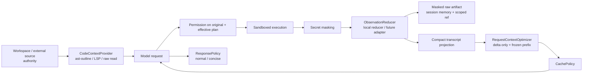

# Token 效率工具与 Agent Harness 组件化调研

> 调研日期：2026-08-11
> mini-loop 基线：`b19a4949fafb327369668c7db5f2ec91f2f5090b`
> 状态：研究与接口设计，**尚未在 mini-loop 中实现或接线**

## 0. 摘要

`ast-outline`、RTK、Caveman、Headroom 不是四个可互换的“token
压缩器”。它们分别作用在四个不同位置：

| 位置 | 代表工具 | 真正减少的内容 | 推荐接入方式 |
|---|---|---|---|
| 代码获取前 | ast-outline | 本来会整文件读入的源码 | first-class typed tools + 读取路由策略 |
| 工具执行/回传 | RTK | shell、测试、构建、Git 等命令输出 | command adapter + 结构化 observation reducer |
| 请求上下文 | Headroom | 已进入消息历史的 tool result、日志、JSON、RAG 片段 | request-time context optimizer，先 shadow |
| 模型输出 | Caveman | 助手解释与过程性叙述 | 可选 response policy / provider verbosity |

核心结论：

1. **优先避免无关 token 进入上下文，再考虑压缩已进入的 token。** 对
   coding agent，`ast-outline` 这种按需获取通常比通用文本压缩更低风险。
2. **不要比较宣传页上的百分比。** ast-outline 的 “2–10×” 是单文件结构
   输出比，RTK 的 “60–90%” 是特定 shell 输出比，Caveman 的 “65%” 是
   chat-style output，Headroom 的 “60–95%” 主要是结构化数据场景；它们都
   不等于会话账单下降同样比例。
3. **Harness 需要分阶段、带类型的协议，而不是一个万能 string hook。**
   至少需要 `CodeContextProvider`、`CommandAdapter`、
   `ObservationReducer`、`RequestContextOptimizer`、`ResponsePolicy` 五类
   边界；每次转换都必须给出 receipt、失败语义、可恢复引用和真实用量。
4. **权威数据与模型投影视图必须分离。** workspace 与脱敏后的原始 tool
   result 是 authority；outline、折叠结果、request copy、简短回答是
   projection。投影失败时可以 fail open，不能反向覆盖 authority。
5. **mini-loop 已落地本地、显式、可关闭的第一版。** ast-outline 以四个 typed
   tools 接入；RTK 的设计原则被实现为结构化 `CommandResult` 与确定性 reducer，
   但没有调用 RTK binary 或透明改写 shell；Caveman 只被借鉴为短小的本地
   `ConciseResponsePolicy`；Headroom adapter/proxy 尚未交付。
6. **两个 correctness 前置问题已经修复。** 最新尚未被 assistant 消费的完整
   tool-result batch 会被保护；memory/compaction 等 side query 不再重锚 live
   conversation `TokenMeter`。这表示现在可以做可信 benchmark，但本报告没有把
   尚未执行的 benchmark 写成节省结论。

### 0.1 当前实现状态

| 层 | 状态 | 当前边界 |
|---|---|---|
| Phase 0 正确性 | **已落地** | 未消费并行 batch 保护、side-query meter 隔离、单请求 catalogue snapshot |
| 代码获取 | **已落地，可选** | ast-outline 1.9.x direct-argv adapter；外部 binary 由运维提供，默认关闭 |
| 工具回传 | **已落地基础设施** | `CommandResult`、post-mask reducer、receipt、masked raw recovery；没有 RTK binary rewrite |
| 请求上下文 | **已落地 SPI** | request copy、frozen prefix、protocol guard；没有内置 Headroom/ML optimizer |
| 模型输出 | **已落地本地策略** | Caveman-inspired concise policy；默认关闭，不打包 Caveman 项目 |
| 外部压缩器 | **未交付** | Headroom adapter/proxy、RTK executable integration、通用 ML compressor 均未启用 |

## 1. 调研口径与证据等级

### 1.1 固定快照

四个主项目均按固定源码快照审计，而不是只看 README：

| 项目 | 固定源码 | 快照中的版本标识 | 许可证 |
|---|---|---|---|
| ast-outline | [`v1.9.0` / `e1798296`](https://github.com/ast-outline/ast-outline/releases/tag/v1.9.0) | `1.9.0`，2026-07-28 | 0.6+ 代码 Apache-2.0；文档/提示词 CC BY 4.0 |
| RTK | [`v0.45.0` / `b34be37c`](https://github.com/rtk-ai/rtk/releases/tag/v0.45.0) | `0.45.0`，2026-08-07 | Apache-2.0 |
| Caveman | [`v1.10.0` / `fcf76633`](https://github.com/JuliusBrussee/caveman/releases/tag/v1.10.0) | `1.10.0`，2026-08-03 | MIT |
| Headroom | [`v0.34.0` / `9fd5ae3d`](https://github.com/headroomlabs-ai/headroom/releases/tag/v0.34.0) | `0.34.0`，2026-08-05 | Apache-2.0 |

同时检查了主项目在 2026-08-10 左右的 HEAD：ast-outline 与其 release commit
一致；Caveman 为 `30983423`；Headroom 为 `1a04c957`；RTK 默认 `develop` 为
`9936b2b9` 且包版本反而是 `0.42.4`。因此生产引用一律固定上表稳定 tag/commit，
不裸跟默认分支。

本机 smoke 环境不是上述最新快照：已安装 `ast-outline 0.8.9` 和 `rtk
0.40.0`。后者处于已披露的 rewrite permission bypass 受影响范围，**不得用于
透明 command rewrite**。本报告不会把本机旧版本的行为冒充为当前上游行为。

### 1.2 证据等级

- **A：源码/实际调用链。** 固定 SHA 下的实现、配置默认值、测试或本仓库
  实际观测。
- **B：可复现实验。** 仓库内有输入、脚本、结果或独立团队的配对实验，仍需
  检查任务、模型和评价器是否适合目标场景。
- **C：项目自报。** README、产品文档或未附原始结果的数字，只用于形成假设。
- **D：本文推断/建议。** 由 A–C 证据推导出的 harness 设计，不描述为已实现。

下文使用“事实”“限制”“建议”明确区分观察与设计判断。

## 2. 先定义什么叫 token 效率

### 2.1 不用单一压缩率

对一个 agent turn，应记录一个 ledger，而不是只记 `before/after`：

```text
TokenLedger = {
  provider_input_uncached,
  provider_cache_write,
  provider_cache_read,
  provider_output,
  provider_reasoning,
  tool_observation_raw,
  tool_observation_visible,
  tool_schema_tokens,
  system_policy_tokens,
  model_round_trips,
  tool_round_trips,
  retries,
  local_compute_ms,
  provider_latency_ms,
  task_score
}
```

真正应优化的是：

```text
净成本变化
= provider 实际 usage × 当时价格
+ 本地/远端压缩计算成本
+ 因信息丢失导致的重读、重试和额外回合
- cache 命中带来的折扣
```

因此，“10 KB 变成 1 KB”只证明该 payload 变小；若新增一个回合、破坏稳定
prefix cache、或迫使模型回读原文，整个任务可能更贵。

### 2.2 四个不同分母

| 数字 | 分母 | 能回答 | 不能回答 |
|---|---|---|---|
| 结构输出缩减 | 原始源码/日志字符或 token | 单次投影有多小 | 整个任务省多少 |
| tool-visible 缩减 | 所有暴露给模型的 tool result | observation 层收益 | system/schema/output 成本 |
| provider input 缩减 | API usage 中的 input/cache 分类 | 实际请求变小多少 | 质量和额外回合 |
| end-to-end 成本缩减 | 完整任务的账单与本地成本 | 真实经济收益 | 是否保留关键事实，仍需任务 verifier |

## 3. 工具版图

### 3.1 四个主项目

| 维度 | ast-outline | RTK | Caveman | Headroom |
|---|---|---|---|---|
| 首要目标 | 少读源码 | 少看命令噪声 | 少说解释性文字 | 压缩已有上下文 |
| 主机制 | tree-sitter AST 按需 outline/show/grep | 命令分类 + 格式专用过滤 | prompt/skill 约束输出风格 | 内容检测 + 多 compressor + CCR |
| 运行形态 | stateless CLI | Rust CLI proxy / hooks | skill/plugin/CLI | Python/TS library、proxy、MCP |
| 状态 | 无索引、无 cache | 本地统计 DB，可保存失败原文 | mode/session 状态 | cache、CCR store、可选 memory/模型 |
| 损失性 | outline 是投影；原源码不变 | 多数过滤为有损投影 | 生成时省略叙述 | 同时有 lossless、lossy、recoverable |
| 最佳集成层 | typed code tools | command/observation 层 | response policy | request context 层 |
| 主要风险 | parser coverage、误把 no-match 当成功、提示词许可 | rewrite 绕过权限、丢失败细节、双重过滤 | 指令开销、语义过度简写、收益分母错误 | cache bust、恢复存储、ML 延迟、遥测/代理信任边界 |
| 证据结论 | 单文件结构缩减可信；无完整任务账单实验 | 特定命令输出缩减可信；不是账单数字 | chat 65% 不代表 coding；独立实验约 8.5% output | 能力丰富；公开 headline 多为项目场景，需自有 A/B |

### 3.2 邻近参照

以下项目用于定位设计空间，未做与四个主项目同等深度的固定 SHA 审计：

| 项目 | 可借鉴点 | 与主项目的区别 |
|---|---|---|
| [Aider repo map](https://aider.chat/docs/repomap.html) | tree-sitter tags、依赖图排名、按动态 token budget 选 repo map | 比 stateless outline 更偏 stateful、任务相关的全仓选择 |
| [Serena](https://github.com/oraios/serena) | LSP/IDE 级 symbol retrieval、references、refactor，经 MCP 暴露 | 语义能力更强，但有 server 生命周期、索引和更大的 tool catalogue |
| [LLMLingua](https://github.com/microsoft/LLMLingua) | 小模型做 prompt token selection，适合超长通用文本/RAG | 有模型下载、延迟、语言/任务漂移；不适合默认改写代码、错误和权限文本 |
| [context-mode](https://github.com/mksglu/context-mode) | 在沙箱内处理大输出，只把 stdout/检索结果送入上下文；hooks 做强制路由 | Elastic License 2.0，是 source-available 而非可无条件当作宽松 OSS 依赖 |

这组参照说明：成熟 harness 最终需要“获取、执行、投影、恢复、缓存、预算”六个
协作边界，而不是再注册一个名为 `compress` 的工具。

## 4. ast-outline：在读取之前省 token

### 4.1 事实：能力与协议

固定快照提供四类结构命令：

- `digest`：目录/仓库一页式地图，并标注文件大小；
- `outline`：签名、字段、继承和行号范围，不带方法体；
- `show`：按 symbol 拉一个或多个 body；
- `grep`：AST-aware、带 enclosing scope 和 def/import/call/ref 分类的搜索。

它是按需 tree-sitter CLI，无常驻 daemon、索引、embedding 或网络。四个结构命令
都有 `--json`，固定 envelope 含 `tool/schema_version/command`。这比解析面向 LLM
的文本输出更适合作为 harness adapter。

一个不寻常但重要的失败语义是：文件不存在、无匹配、坏参数等用户错误会在
stdout 输出 note/error 并以 `0` 退出，目的是不打断并行 shell batch；内部 crash
才保留非零退出。因此 adapter **不能只看 exit code**，必须检查 JSON error、
`parse_errors` 和 match count。

### 4.2 证据与限制

- 项目的 “2–10× smaller” 是结构输出相对整文件的项目声明，不是完整 agent
  任务实验。
- 本仓库旧版 `ast-outline 0.8.9` 的只读 smoke：
  `mini_loop/agent.py` 为 1,255 行、53,432 bytes；outline 为 128 行、7,358
  characters，即字符投影约小 86.2%（约 7.3×）。这是**候选上下文体积**，不是
  provider usage 或账单缩减。
- parser 出错时 outline 可能不完整；生成代码、动态语言、宏、模板和跨语言关系
  仍需要 raw read、LSP 或 build/test 证据。
- mini-loop adapter 为了让 pre-process 校验有界，只接受静态工作区目录下的末级
  basename glob；拒绝 `**` 和中间目录通配。需要递归发现时先用受限 catalogue 工具
  选出显式路径，再调用 typed AST tool。
- 0.6+ 代码是 Apache-2.0，但 README、CLI help、prompt snippet、digest legend
  按 CC BY 4.0 发布。可以封装 CLI；若复制长篇 prompt 文案，应保留 attribution。

### 4.3 建议：native typed tools，不只靠 AGENTS.md

首期注册四个稳定工具：

```text
repo_map(paths, density, include_imports)
file_outline(paths, view, include_imports)
show_symbol(path_or_glob, symbols, signature_only)
symbol_references(patterns, paths, kinds, max_per_file)
```

共同约束：

- 工作区路径 canonicalization 和 allowlist 在调用 CLI 前完成；
- 不经过 shell 字符串拼接，直接 argv exec；
- 固定 binary path、最小/最大兼容版本和 JSON schema version；
- timeout、最大 stdout、cancel、missing-binary fallback 都有测试；
- 返回结构化 `status = applied | no_match | partial | error`；
- `parse_errors > 0` 明确进入 warnings；
- 始终保留 `read_file` 作为显式逃生通道。

仅把规则写进 `AGENTS.md` 是可用的零代码 PoC，但模型可能绕过规则，Explore
subagent 也未必继承主 agent 的提示词。Harness 层应增加读取策略：对超过阈值的
源码首次整读给出 outline 建议；若用户要求 exact bytes、文件很小、parser 不支持
或前次 outline partial，则允许 raw read。

## 5. RTK：在工具回传处做确定性降噪

### 5.1 事实：不是通用 prompt compressor

RTK 的核心路径是：agent hook 改写 shell command → command registry 分类 → 执行
原工具 → 按命令类型过滤/分组/截断/去重 → 返回紧凑输出。未知命令 passthrough。
其主要价值是保留失败、错误和变更摘要，去掉进度条、重复成功项、冗长列表与
格式噪声。

不同 agent 的集成强度不同：支持 native pre-tool hook 的客户端可透明 rewrite；
Codex 集成在该快照中仍主要是 `AGENTS.md + RTK.md` 指令。内置 Read/Grep/Glob
若不走 shell hook，也不会自动被 RTK 覆盖。

源码中值得复用的工程策略包括：

- command registry 与 pure passthrough；
- compound shell 仅在安全位置改写，复杂 heredoc/arithmetic 保守跳过；
- JSON parser → regex degraded parser → 带标记的 passthrough；
- filtered 结果若比原文更大则 `never_worse` 返回原文；
- 命令失败时可 tee 完整原始输出并给出回读路径；
- 保留被执行程序的 exit code，而不是用过滤器状态覆盖它。

### 5.2 证据与限制

- “60–90%” 指常见命令的 **bash output reduction**；项目自身也明确说不是
  bill reduction。
- 本地 token 统计以约 `ceil(chars/4)` 估算，适合趋势，不等同 provider
  tokenizer/usage。
- RTK 不直接减少 system prompt、tool schema、对话历史、reasoning 或 final
  answer。任务以代码读取为主而非大命令输出时，整场收益可能很小。
- 过滤器对新工具版本、locale、彩色输出、截断 JSON 都可能退化；关键失败输出
  必须可回读。
- RTK 遥测为默认关闭、显式 opt-in。Harness 侧仍应默认关闭外部组件 telemetry，
  由平台统一上报本地 ledger。

### 5.3 建议：不要在权限之后偷偷替换 shell 字符串

在设计 adapter 前还必须处理三个官方安全公告：

- [`GHSA-fvvm-949w-qj4w`](https://github.com/rtk-ai/rtk/security/advisories/GHSA-fvvm-949w-qj4w)：
  `<0.32.0` 会自动信任仓库内 `.rtk/filters.toml`，恶意仓库可静默隐藏 diff、
  scan 或其他命令输出；0.32.0 引入显式 trust 与 SHA-256 绑定。
- [`GHSA-7gxq-fvfc-g327`](https://github.com/rtk-ai/rtk/security/advisories/GHSA-7gxq-fvfc-g327)：
  `<=0.40.0` 的 `rtk rewrite` 对 newline、`&`、command substitution 等切分不
  保守，可把隐藏命令误判成 allow。公告中的 patched version 文本有格式错误，
  生产应固定已含保守 splitter 和回归测试的 `v0.45.0`，同时坚持 harness 二次授权。
- [`GHSA-fqgj-m2gp-mr3q`](https://github.com/rtk-ai/rtk/security/advisories/GHSA-fqgj-m2gp-mr3q)：
  OpenClaw npm rewrite plugin `1.0.0` 使用 shell-backed template string 造成命令
  注入；公告尚无明确 patched package version。不要依赖该 npm 发布物，直接以
  argv array、`shell=false` 调固定 Rust binary。

此外，RTK 的失败 tee 与本地 SQLite 可能保存完整命令、项目路径或含 secret 的
原文。mini-loop 应接管 masked evidence store 与 ledger，并显式关闭 RTK telemetry，
而不是把第三方本地状态当成平台审计记录。

若 `before_tool` 只审核用户/模型原始命令，之后再透明改成 `rtk ...`，action
journal 记录的意图、实际 argv 和权限检查会不一致。可靠接入有两种：

1. **首期：专用工具或显式 backend。** 模型调用 `compact_test`、
   `compact_git_status` 等 typed tools；adapter 明确记录原始命令、有效命令、
   exit code 和 reducer receipt。
2. **正式期：`CommandAdapter`。** adapter 先提出 execution plan，permission
   对 original 和 effective plan 都做检查，再由现有 sandbox backend 执行。

不要让 RTK 直接替代 mini-loop 的 shell sandbox。它只能选择/过滤输出，不能绕过
现有 cwd、env、secret、timeout、process-group cancellation 和 risk policy。

## 6. Caveman：生成时少说，不是生成后压缩

### 6.1 事实：输出风格 skill

Caveman 的核心规则是删 filler、hedging、重复解释和工具调用 narration，同时要求
代码、命令、错误、数字、否定和 technical terms 保持精确；在安全、破坏性操作和
多步歧义时自动恢复清晰表达。它主要通过 session/prompt 注入约束**模型生成**，
不是对已生成文本做 post-processing。

需要消歧：[`JuliusBrussee/caveman-code`](https://github.com/JuliusBrussee/caveman-code)
是另一个完整 terminal agent harness，不是本文 Caveman 输出 skill。不能把前者的
tool-output budget、read dedup 等 harness 能力算到后者头上。

因此，在 API 返回后再把答案缩短不会节省这次已计费的 output tokens。正确接入点
是稳定 system suffix、provider 原生 verbosity/max-output 控制或 response plan。

Caveman 仓库还包含一个边界不同的 `caveman-shrink`：它代理 stdio MCP，主要压缩
`tools/list`、`prompts/list`、`resources/list` 等 catalog response 的
`description` 字段，不改 `tools/call` 返回值。这个思路对应 harness 的
`ToolCatalogPolicy`，而不是 `ObservationReducer`。其字符统计、英语 regex 和有损
description 改写可能改变模型选工具的行为；若采用，应固定原 schema fingerprint、
测 tool-selection accuracy，并把压缩后的 catalog 作为稳定 snapshot 缓存。

### 6.2 证据：65% 与 8.5% 同时成立，但分母不同

- 项目 10 个 chat-style 单轮 prompt 的平均 output reduction 为 65%，范围
  22–87%。仓库也明确承认 skill 本身每 turn 增加约 1–1.5k input tokens，input、
  reasoning 不变，短任务可能净负收益。
- JetBrains 在 2026-07 用 SkillsBench 做了独立配对实验：86 个候选任务，完整
  coding run 强制启用 Caveman；大规模结果约为 **8.5% output-token reduction**。
  82 个 paired tasks 的质量差异在该实验中不可检出（sign test `p=0.82`），但单个
  long-context outlier 足以反转总成本。
- 结论不是“Caveman 无效”，而是 coding agent 的 output 中大量是代码、diff、
  tool call 和 exact error，规则本来就不应压它们；可压的 narration 占比远小于
  chat QA。

### 6.3 建议：短、静态、可选的 `ResponsePolicy`

- 默认关闭，由用户、任务类型或成本策略显式启用 `normal | concise | terse`；
- 规则放进稳定 system prefix/suffix，一次注入，避免每 turn 变化破坏 cache；
- 优先使用 provider 原生 `verbosity`、`max_output_tokens`、reasoning effort 能力；
- tool call、代码、diff、error、security warning 不做 post-hoc 改写；
- 持久化文档、设计报告、代码注释不自动采用 caveman style；
- A/B 必须把 policy input overhead 计入 ledger。

不建议直接复制项目完整 skill 文本作为默认系统提示。对 mini-loop，更短的内建
policy 往往能得到大部分风格收益，同时减少输入开销与外部 prompt 漂移。

## 7. Headroom：最接近通用组件框架，也最需要边界

### 7.1 事实：ContentRouter + pipeline + recoverability

Headroom 暴露 `compress(messages)` library、SDK wrapper、HTTP proxy 和 MCP。其
`ContentRouter` 检测 JSON、search、log、diff、HTML、table、config、code、plain
text 等内容，再路由到格式专用 compressor 或 ML compressor。默认配置中：

- code-aware compressor 默认关闭；
- SmartCrusher、search、log、tabular、config、HTML、Kompress 默认开启；
- user messages、recent code、analysis context、较短 error output 受保护；
- assistant text compression 默认关闭，以降低 prefix-cache 风险；
- 小于 500 chars 的 block 默认不压；
- CCR 默认开启，可注入 retrieval marker；
- external compressors 必须显式 opt-in。

入口之间还有两个不能忽略的契约差异：Python SDK 的
`compress_system_messages` 默认是 `True`、`compress_user_messages` 默认是
`False`，而 proxy/profile 可能覆盖该行为；必须显式配置，不能凭文档措辞假设
system 一定保持原样。其次，Python `CompressResult.compression_ratio` 表示
`saved / before`，HTTP `/v1/compress` 同名字段表示 `after / before`。Harness 必须
归一成不歧义的 `tokens_before/tokens_after/tokens_saved`，不能直接汇总 ratio。

最值得 harness 复用的是它的纯数据 compressor contract：

```text
CompressorDescriptor {
  name, content_types, lossless, cost_tier, recoverable
}

CompressInput {
  content, content_type, query, config, budget
}

CompressOutput {
  content, tokens_before, tokens_after, lossless,
  markers, recoverable, warnings, compressed
}
```

registry 默认空、entry-point discovery fail open、真实 traffic selection 默认
opt-in。这些都比“任意 hook 返回一个 string”更适合作为插件基础。

### 7.2 cache 与 recovery 是核心，不是附加功能

Headroom 的 CCR 将原文存入本地 store，用 marker 让模型按需 retrieve。该思路能
降低模型默认可见内容，但 harness 必须回答：

- 原文何时被脱敏；
- recovery key 是否按 tenant/session/workspace 隔离；
- TTL、配额、加密、删除和 crash recovery 如何处理；
- replay/action journal 需要 compact text、raw ref 还是二者；
- provider cache 的 frozen prefix 到哪里；
- 旧消息重压后是否改变此前发送过的 bytes。

对长会话，正确策略是只优化新 delta，复用上次已发送的投影，并给出
`frozen_message_count`/prefix fingerprint。每轮从 authoritative transcript 重新压
全部历史，可能让内容更小却让 provider cache 全部失效。

### 7.3 证据限制

- README 的 coding-agent/JSON 百分比是项目报告值。仓库中的
  `real_world_agent_benchmark.py` 由代码生成“realistic” filesystem、search、
  GitHub、DB 和 log payload，并以关键词匹配估计答案质量；它不是已提交的真实
  生产 trace 集。
- 文档中仍有旧版本结论和当前源码默认值不一致的地方。部署判断应以固定 SHA
  的源码、配置和实测 request 为准。
- ML compressor 会引入模型下载、冷启动、CPU/GPU 与语言/任务漂移；remote
  compressor 还扩大数据边界。mini-loop 不应默认把 secret-bearing raw result
  发给它。

### 7.4 必须显式处理的 telemetry 矛盾

固定 SHA 下，本地统计 `HEADROOM_TELEMETRY` 是 opt-in；但**匿名 upload beacon
是另一套开关且默认开启**：`BEACON_DEFAULT_ON = True`，未识别的值也按开启处理。
`session.py` 会将 content-free 的聚合 session payload POST 到默认 Cloudflare
Worker endpoint。与此同时，README 使用 “runs locally / your data stays here”
等更宽泛措辞，部分 docstring 还写着 “off by default”。

这不等于源码、prompt 或 tool result 被上传；当前实现描述的是匿名、无内容的
聚合指标。但对于要求严格本地/离线的 harness，不能把“content-free beacon”与
“完全无网络”混为一谈。部署时应同时设置：

```text
HEADROOM_OFFLINE=1
HEADROOM_BEACON=off
DO_NOT_TRACK=1
```

并通过网络隔离/测试验证，而不是只依赖文档。若未来直接集成其 compressor
contract，也应由 mini-loop 统一计量，禁用组件自己的上传路径。

### 7.5 建议：library/sidecar shadow，而非默认全代理

第一阶段仅对已脱敏的大型 JSON、search result、log 做 shadow：同时生成 compact
candidate 和 receipt，但仍把原文给模型；观察命中类型、潜在节省、延迟和错误。
第二阶段只启用 deterministic/recoverable 本地路由。第三阶段再对可回读、低风险内容启用
lossy+CCR。不要一开始把整个 provider 流量切到 proxy，也不要同时叠加 RTK、
Headroom 和 compactor 对同一 block 重复压缩。

## 8. mini-loop 调研基线与落地后审计

### 8.1 落地后的真实调用链

当前关键路径是：

```text
AgentSession.run
  -> Agent.run / _run_one_turn
  -> memory.prepare_memory_context
  -> Agent._loop
       -> injectors
       -> Compactor.maybe_compact
       -> one immutable ToolCatalogSnapshot
       -> system_builder + snapshot.schemas
       -> ResponsePolicy (stable settings)
       -> RequestContextOptimizer (detached copy + frozen prefix)
       -> message protocol guard
       -> CachePolicy.annotate
       -> Recovery -> Transport -> provider
       -> Agent._exec_tool_batch
            -> Hooks.before_tool
            -> ActionJournal.begin/reconcile
            -> Tool.run -> Toolset.dispatch / CommandResult
            -> Hooks.after_tool
            -> SecretRegistry.mask(authority)
            -> ObservationReducer
            -> SecretRegistry.mask(projection)
            -> optional session-scoped masked artifact + guarded recovery envelope
            -> ActionJournal.finish(bounded masked-authority prefix)
            -> receipt / event / trajectory / transcript (guarded projection)
```

源码入口：[`Harness`](../mini_loop/harness.py)、
[`Agent._create`](../mini_loop/agent.py)、
[`Agent._loop`](../mini_loop/agent.py)、
[`Agent._exec_tool`](../mini_loop/agent.py)、
[`TokenEfficiencyRuntime`](../mini_loop/token_efficiency.py)、
[`ToolRegistry`](../mini_loop/registry.py)、
[`DefaultCompactor`](../mini_loop/compaction.py)、
[`SessionManager`](../mini_loop/manager.py)。

### 8.2 已有 seam 与缺口

下表保留调研时发现的缺口，并给出当前状态：

| 能力 | 调研时缺口 | 当前状态 |
|---|---|---|
| semantic read | subagent 硬重建 registry | 四个 ast typed tools + capability `RoleToolPolicy` 已落地 |
| tool middleware | `after_tool` 早于统一 mask | reducer 已成为 mask 后的独立 stage |
| context reduction | 只有 transcript mutation | request copy、frozen prefix、receipt、protocol guard 已落地 |
| prompt cache | catalogue 重复拟合、无 fingerprint | 单请求 immutable `ToolCatalogSnapshot` 已落地 |
| oversized output | 无统一 recovery contract | session-scoped in-memory masked artifact + paged `read_token_artifact` 已落地 |
| command output | 混合字符串、exit metadata 丢失 | `CommandResult` 已分离 stdout/stderr/exit/timeout；格式专用 adapter 未交付 |
| dynamic tools | MCP 进程边界更宽 | 仍按 external risk 管理；本轮没有改变 MCP sandbox 边界 |
| provider / memory | capability、budget provider seam 不完整 | 不在本轮实现范围，仍是后续平台工作 |

`Harness` 现已增加正式 `token_efficiency` 与 `role_tool_policy` 字段；stage
协议由 `TokenEfficiencyRegistry` 聚合，而不是继续扩大 `Hook`。调研中提出的更宽
边界仍可作为后续方向：

```text
command_adapter
observation_reducer
request_context_optimizer
response_policy
tool_catalog_policy
context_provider / memory_provider
```

### 8.3 两个接入前 P1（已修复）

#### P1-A：最新并行 tool batch 可能首次消费前被清空

原实现的 `microcompact()` 只保留最后三个 tool results；它在下一轮 model request
前执行。
若一个 assistant response 并行调用五个工具，五个结果进入同一最新 user message，
前两个长结果可能在模型第一次看到它们前就变为 `[cleared]`。注释假设“模型已经
处理过”，但对最新 batch 不成立。

当前修复：`microcompact()` 只把最后一个 assistant 之前的 tool-result 视为已消费；
最后 assistant 之后的完整尾部都受保护，即便 injector 又追加 user messages 也不会
改变其“尚未消费”状态。已消费区域仍保留最近三个 result 的既有策略。

#### P1-B：side query 污染主会话 TokenMeter

原实现让所有 `_create()` response 都更新同一个 conversation meter，包括 memory
selection/extraction 和 LLM compaction summary。这些旁路 request 的
system/tools/messages 与 live conversation 不同，却会重锚 context size，使后续
compaction 过早或过晚。

当前修复：`Agent._create(..., purpose=...)` 仍把全部 usage 写入 model-end event，
但只有 `purpose="agent_turn"` 且输入确实别名到 live history 时才更新 conversation
meter；`memory_selection`、`memory_consolidation` 与 `compaction` 不再重锚它。

## 9. 目标架构与已实现切片

### 9.1 authority 与 projection



关键不变量：

- optimizer 只生成 projection，不覆盖 workspace 或 masked raw artifact；
- secret masking 在任何远端 reducer、artifact retention 和 telemetry 之前；
- 若未来增加 command adapter，permission 必须同时审核模型原始意图和有效计划；
- transcript 的 tool-use/result pairing 永远合法；
- request optimizer 在副本上工作，不改变 authoritative conversation；
- provider projection ledger 让上一轮 tail 在下一轮成为 byte-identical prefix；
- 任一组件 timeout/crash 时有明确定义的 fail-open 或 fail-closed 行为。

### 9.2 通用 descriptor 与 receipt

不同 stage 不能共用一个 `transform(str) -> str`，但可以共享元数据：

```text
ComponentDescriptor {
  id, version, stage,
  content_types,
  deterministic,
  lossiness,
  recoverable,
  cost_tier,
  network_access,
  timeout_ms,
  max_input_bytes,
  capabilities
}

OptimizationReceipt {
  component_id, component_version,
  stage, mode,
  status: applied | passthrough | shadowed | degraded | error,
  reason,
  raw_bytes, projected_bytes,
  tokens_before_estimate, tokens_after_estimate,
  input_digest, output_digest,
  lossiness, deterministic,
  raw_ref, raw_digest,
  warnings,
  elapsed_ms
}
```

`tokens_before_estimate` / `tokens_after_estimate` 是轻量估算，不可伪装成 provider
usage。provider usage 由 model event 单独记录。receipt 进入 event/trajectory，但 raw
content 不进入普通 event。

### 9.3 分 stage 协议

```text
AstOutlineAdapter                         [已实现的窄 code-context adapter]
  repo_map(workspace, paths, ...)
  file_outline(workspace, paths, ...)
  show_symbol(workspace, target, symbols, ...)
  symbol_references(workspace, patterns, paths, ...)

CommandAdapter                           [未来 seam，当前未实现]
  plan(original_argv, tool_context) -> EffectiveExecutionPlan
  classify(result_metadata) -> content_type

ObservationReducer
  reduce(masked_observation, query, budget) -> Projection + Receipt

RequestContextOptimizer
  optimize(request_copy, frozen_prefix, budget) -> RequestCopy + Receipts

ResponsePolicy
  plan(task, provider_capabilities, budget) -> StableRequestSettings

ComponentLifecycle
  initialize(services=None)
  health()
  close(deadline_seconds=None)
```

当前 manager 调用 lifecycle 时给 `initialize` 传 `None`，不会把 manager、credentials、
stores 或进程服务交给组件；artifact store 由 runtime/agent 绑定。未来若增加窄
services object，也必须按 descriptor capability 显式授权。

### 9.4 安全执行顺序

```text
1. capture original tool call
2. Hooks.before_tool / permission checks the original call
3. action journal begin/reconcile
4. sandbox executes; CommandResult preserves stdout/stderr/exit/timeout
5. Hooks.after_tool runs for compatibility
6. secret mask the finalized observation
7. observation reducer creates a candidate projection
8. only an accepted recoverable candidate may retain the masked authority in session memory
9. action journal records status + masked authoritative result, never an ephemeral raw ref
10. event/trajectory/transcript receive the re-masked projection and content-free metrics
11. compactor only touches previously consumed batches
12. response policy produces stable request settings
13. request optimizer transforms a request copy/newest delta
14. role/tool-pair protocol guard validates the candidate
15. cache policy annotates the final stable copy
16. provider call
```

`Hooks.after_tool` 为兼容性仍在统一 mask 前运行，所以远端 Headroom reducer 不能作为
该 hook。正式 observation stage 已位于 mask 后；外部 reducer 只能接这里。

### 9.5 Tool catalogue 也是 token 组件

`ToolRegistry` 已有 60,000-char definition budget，但一次 request 中 system prompt、
`tools`、sent names 和 omitted names 应消费**同一个 immutable snapshot**：

```text
ToolCatalogSnapshot {
  canonical schema_json -> detached schemas(),
  sent_names,
  omitted_names,
  trimmed_to,
  inventory_count,
  revision,
  fingerprint
}
```

未来若做 deferred tools，推荐稳定的 `tool_search + invoke_deferred_tool` meta-tools，
但 `invoke` 必须重新执行底层工具的 permission/risk/capability 检查，不能成为通用
权限逃逸口。动态工具集会改变 provider prefix，收益评估必须包含 cache miss。

### 9.6 role-aware 继承

主 Harness 由 child derive，`CapabilityRoleToolPolicy` 已按父 registry 的 capability
裁剪，而不是硬重建具体工具名：

```text
repo.read
repo.semantic_outline
repo.search
repo.symbol
repo.references
workspace.write
process.exec
```

Explore 继承五类 repo read/search/semantic capability，并继续排除 write/exec 与父会话
observation recovery；Worker 增加 write/exec/`observation.recover`。无 capability 的
custom tool 不会被隐式下放。

## 10. 配置与插件发现

mini-loop 保持显式 Python composition，不执行任意 entry-point/package discovery。
当前 `Settings` 只选择代码库内审查过的 built-ins；调用方传入
`SessionManager(..., token_efficiency=runtime)` 时，注入值优先。

| 环境变量 | 默认值 | 作用 |
|---|---:|---|
| `MINILOOP_TOKEN_EFFICIENCY_MODE` | `off` | `off`、`shadow`、`enforce` |
| `MINILOOP_TOKEN_EFFICIENCY_RESPONSE_STYLE` | `normal` | `concise` 时注册本地 response policy |
| `MINILOOP_TOKEN_EFFICIENCY_PERSIST_RAW` | `true` | enforce observation 时允许保存已脱敏原文 |
| `MINILOOP_TOKEN_EFFICIENCY_RAW_MIN_BYTES` | `16384` | 可进入会话内存恢复区的最小输入大小 |
| `MINILOOP_TOKEN_EFFICIENCY_ARTIFACT_TTL_SECONDS` | `3600` | artifact TTL |
| `MINILOOP_TOKEN_EFFICIENCY_MAX_ARTIFACT_BYTES` | `2000000` | 单 artifact 上限 |
| `MINILOOP_TOKEN_EFFICIENCY_MAX_TOTAL_BYTES` | `20000000` | 单 session store 上限 |
| `MINILOOP_AST_OUTLINE_ENABLED` | `false` | 安装四个 semantic-read tools |
| `MINILOOP_AST_OUTLINE_BINARY` | `ast-outline` | 启用时必须是运维固定的绝对路径 |
| `MINILOOP_AST_OUTLINE_SHA256` | 未设置 | 启用时必填的 64 位十六进制摘要 |
| `MINILOOP_AST_OUTLINE_TIMEOUT` | `10` | 单次 wall-clock 秒数 |
| `MINILOOP_AST_OUTLINE_MAX_OUTPUT_BYTES` | `1000000` | stdout/stderr 捕获上限 |

`mode != off` 时 manager 注册 `DeterministicLosslessReducer`；
`RESPONSE_STYLE=concise` 额外注册 Caveman-inspired
`ConciseResponsePolicy`。`shadow` 只产候选 receipt，`enforce` 才改变模型投影。
`Settings`/`SessionManager` 启用的 ast-outline adapter 固定接受
`>=1.9.0,<1.10.0`，每次执行前复核 SHA-256，并拒绝工作区内可被 agent 改写的
binary；missing/incompatible 是 typed status，不会触发自动下载或 shell fallback。
直接构造 `AstOutlineAdapter(AstContextConfig(...))` 是可信 embedding seam，可显式
省略 digest 或使用 PATH；此时 binary 验证责任属于调用方，不继承 manager 的保证。

自定义 reducer/optimizer 通过 `TokenEfficiencyRegistry` 显式注册，再把 immutable
runtime 注入 manager 或 `Harness`；完整示例见
[`EXTENDING.md`](../EXTENDING.md#4c-token-efficiency-stages)。

如果以后支持包发现，manifest/allowlist 至少固定 package、hash/signature、版本范围、
license、network、filesystem、subprocess、secret access、stage 与 capability；发现可
fail open，启用必须显式。不同 reducer 对同一 block 只能有一个 owner，默认顺序为：

```text
deterministic lossless fold
-> format-specific recoverable reduction
-> optional generic ML reduction
```

## 11. mini-loop 的具体落点

这里区分**本轮已经落地**与**外部适配器仍未交付**：

| 状态 | 文件 / 能力 | 当前实现边界 |
|---|---|---|
| **已落地** | `mini_loop/compaction.py` / `agent.py` | 未消费 batch 保护；只有 live agent turn 更新 conversation meter |
| **已落地** | `mini_loop/token_efficiency.py` | descriptor、receipt、三类 stage protocol、explicit registry、off/shadow/enforce、fail-open、inflation/double-reduction guard、lifecycle |
| **已落地** | `mini_loop/harness.py` / `manager.py` | `token_efficiency`、`role_tool_policy` 可注入且 `derive()` 继承；manager 有序 initialize/close |
| **已落地** | `mini_loop/agent.py::_exec_tool` / `token_tools.py` | secret mask 后 reduction、projection 再 mask；journal 保存 masked authority，事件/trajectory/transcript 收 projection；receipt event 无 warning/digest 内容；可分页恢复 eligible masked raw |
| **已落地** | `mini_loop/agent.py::_create` | response plan 后在 request copy 上优化；frozen-prefix 与 message protocol 双重 guard；之后才 cache annotate |
| **已落地** | `mini_loop/registry.py` / `prompts.py` | 单 request immutable `ToolCatalogSnapshot`，system prompt 与 tools 共用 fingerprint |
| **已落地** | `mini_loop/tool_policy.py` / `builtins.py` | capability `RoleToolPolicy`；Explore 不继承 write/exec，Worker 可继承 |
| **已落地，可选** | `mini_loop/ast_context.py` | 1.9.x probe、绝对路径+SHA 固定、workspace containment、timeout/cap、direct argv、四个 typed tools |
| **已落地** | `mini_loop/tools.py` | `CommandResult` 分离 stdout、stderr、exit code、timeout、overflow、duration、harness error |
| **已落地** | `mini_loop/config.py` | mode、response style、in-memory store quota/TTL 与 ast binary/hash/timeout/cap settings |
| **未交付** | RTK executable integration | 没有安装/调用 RTK binary，也没有透明 command rewrite；当前只复用其结构化降噪设计原则 |
| **未交付** | Headroom adapter/proxy | 没有 import、sidecar 或 provider proxy；未来必须 offline、关闭 upload beacon/telemetry、先 shadow |
| **未交付** | 通用 ML/context compressor | request SPI 已有，但没有默认 lossy optimizer，也没有宣称 benchmark savings |

`ConciseResponsePolicy` 是仓库内的 Caveman-inspired 小策略，不是对 Caveman 项目的
打包。Headroom 也不应被粗暴包装成 `Compactor`：后者修改历史，而当前 request stage
明确表达 frozen prefix、component provenance 和 per-request copy。

## 12. Benchmark 与验收

### 12.1 三层实验

1. **组件 fixture。** 固定源码、日志、JSON、失败输出，测 deterministic、关键行
   retention、exit code、never-worse、latency、recovery。
2. **Harness replay。** 用同一 tool trace 回放 baseline/shadow/enforce，验证
   tool-use/result pairing、cache prefix 和 provider request bytes。
3. **完整任务 A/B。** 同任务、模型、effort、预算、环境、次数；以测试/verifier
   评质量，以真实 provider usage 和账单评成本。

### 12.2 必须记录

- provider input/cache-write/cache-read/output/reasoning usage；
- system policy 与 tool schema token；
- raw/projected observation bytes 和估算 token；
- model/tool round trips、重复读取、fallback、recovery、retry；
- task pass/score、patch correctness、失败恢复率；
- p50/p95 reducer latency、cold start、CPU/RSS；
- 每个 component id/version/config、input digest、receipt；
- 分布、置信区间与 outlier，不只报平均值。

### 12.3 建议验收门槛

| Pilot | 收益门槛 | 正确性门槛 |
|---|---|---|
| ast-outline | code-read candidate tokens 至少下降 30%，且 model/tool round trips 不上升 | 任务通过率不降；parser partial 必须触发 fallback |
| RTK adapter | 适用命令的 tool-visible tokens 至少下降 20% | exit code 100% 一致；所有失败原文可回读；关键 error 100% 保留 |
| Headroom lossless | end-to-end provider 成本为正收益，p95 额外延迟在预算内 | cache hit 不显著下降；tool pairing 与 retrieval 100% 正确 |
| Headroom lossy/CCR | 多次 A/B 后仍有净收益 | verifier 无可检测退化；recovery scope/TTL/权限测试全过 |
| concise response | 完整任务 output token 有稳定收益 | 代码/命令/error byte exact；安全警告不被省略；质量无显著下降 |

百分比是首轮推荐 gate，不是通用行业标准。若 workload 的 baseline 本来很短，应允许
组件判定 `passthrough`，而不是为了达标强行压缩。

### 12.4 回归覆盖与待补

当前实现已加入针对核心 contract 的回归覆盖：binary missing/incompatible/timeout/
output cap、direct argv 与 path containment、mask-before/after-reducer、raw-ref session
scope/TTL、最新未消费 batch、side-query meter 隔离、deterministic projection、catalogue
fingerprint、frozen-prefix/protocol guard、capability role inheritance、inflation 与
double-reduction guard。这里不把测试覆盖等同于端到端节省结论。

仍需随着后续 adapter 补齐：真实 RTK/Headroom process cancel/crash、format-specific
failure recovery、持久化 artifact adapter policy、真实 provider cache/usage A/B，以及完整任务
的质量 verifier。Headroom/RTK 尚未接入，因此不能宣称它们的集成测试已通过。

## 13. 安全、隐私、运维

1. **版本与供应链。** 固定 binary/package/hash，component health 或执行前 probe 返回
   实际版本；不能只信 PATH 上同名可执行文件。ast-outline 与 RTK 都存在同名/兼容
   shim 风险。
2. **权限不变量。** optimizer 不新增文件、网络、进程权限；command rewrite 后重新
   检查 effective plan。
3. **脱敏顺序。** raw secret 只能在受控执行内存中短暂存在；持久化与外部调用前
   mask。远端 compressor 默认禁用。
4. **恢复存储。** masked raw artifact 只存在于 session-scoped memory，使用不可猜
   id，不向模型暴露宿主路径；有 TTL、quota、delete、checksum，删除 session/停止
   manager 会撤销 store。若未来需要持久化，必须另设计不在工具可读根下的 authority。
   活跃 event loop 中的 session delete 会调度异步 drain/revoke；manager stop 会等待
   这些 cleanup 完成。
5. **遥测。** 平台只发出有界 receipt，并维护进程内 provider projection ledger；完整
   benchmark ledger 仍在 Phase 0 待做。第三方 telemetry 默认禁用。Headroom 需额外
   关闭默认 upload beacon，并用 egress test 验证。
6. **提示词注入。** 日志、源码和 tool output 都是不可信数据；reducer 不能把其中
   的指令提升为 system policy，recovery marker 也必须是 harness 生成并校验。
7. **fail-open 边界。** 只读 projection/reducer 可在安全检查通过后 fail open 到已
   脱敏原文；permission、secret mask、scope 校验必须 fail closed。
8. **当前已知边界。** `Settings`/`SessionManager` 启用路径会在每次执行前重算运维
   固定的绝对路径 binary hash，并限制输入数量、长度与 glob 展开量，但 hash 校验与
   `exec` 之间仍有 TOCTOU 窗口，因此它属于可信运维安装边界，不是恶意 binary
   沙箱。进程内 token component 同样只接受可信插件：`asyncio` timeout/cancel 不能
   硬隔离阻塞事件循环或吞掉取消的实现；不可信/远程 reducer 应放到受限 sidecar。
9. **回收与进程边界。** memory artifact 到期后立即拒绝读取，但物理内存清除是
   lazy eviction（`get`/`put`/`sweep`/`close`）；这应称为“逻辑过期”，不是实时清零。
   `CommandResult` 的共享 cap 当前按字符计数，且 shell sandbox 不是容器/PID namespace；
   需要 byte-exact cap 或恶意进程隔离时，应使用独立 worker/container。

## 14. 路线图与当前进度

### Phase 0：先建立可信 baseline

- **完成：**修复最新 tool batch 首次消费问题；
- **完成：**分离 live-turn 与 side-query TokenMeter；
- **完成：**给一次 request 固化 `ToolCatalogSnapshot`；
- **待做：**扩展 `tools/bench.py` 的真实 usage/cache/output/quality ledger。

### Phase 1：ast-outline typed tools

- **完成：**固定 1.9.x version range 与 JSON schema；
- **完成：**`Settings` 启用路径固定 absolute binary + SHA-256，并在每次 exec 前复核；
- **完成：**注册四类 semantic-read tools；
- **完成：**Explore/Worker 按 capability 继承；
- **待做：**shadow 记录 raw read 与 outline 的候选体积和后续回读率。

### Phase 2：RTK-inspired observation contract

- **完成：**分离 stdout/stderr/exit code/timeout 的 `CommandResult`；
- **完成：**mask 后 observation stage、projection + session-memory scoped raw ref + receipt；
- **坚持：**不做任意 shell 透明 rewrite；
- **待做：**git status/log、pytest、build/lint 三类格式专用 adapter；RTK binary 未接入。

### Phase 3：正式 `ObservationReducer`

- **完成：**stage protocol、in-memory artifact store、receipt、inflation 与 double-reduction guard；
- **完成：**deterministic/recoverable reducer 可 shadow/enforce；
- **待做：**Headroom structural adapter；若实现，只能先 shadow、offline、关闭 upload beacon/telemetry。

### Phase 4：request-time context optimizer

- **完成：**只处理 request copy 和最新 delta，并用 projection ledger 跨轮稳定前缀；
- **完成：**frozen prefix、thinking/tool pair protocol guard、cache annotate 顺序；
- **待做：**内置 lossless optimizer 与小流量 recoverable lossy/CCR。

### Phase 5：response policy 与 ML compressor

- **完成：**本地 Caveman-inspired `concise` policy，可 shadow/enforce，默认关闭；
- **待做：**真实 A/B 与 provider 原生 verbosity capability negotiation；
- **待做：**LLMLingua/Kompress 等仅在长通用文本、收益覆盖延迟且 verifier 成熟时评估。

## 15. 最终决策建议

| 项目 | 建议 | 理由 |
|---|---|---|
| ast-outline | **已按原生 typed tools 接入，默认关闭** | stateless、只读、边界小；在 token 进入上下文前避免浪费 |
| RTK | **已复用设计模式；binary/rewrite 不交付** | command-specific 过滤价值高，但透明 rewrite 会越过权限计划边界 |
| Caveman | **已落地本地可选 response policy，不设默认** | 完整 coding run 的现实收益远小于 65%，且长 skill 有 input overhead |
| Headroom | **尚未接入；未来 offline + beacon off + shadow** | contract 与 recoverability 有参考价值，但 cache、ML、store、telemetry 都扩大边界 |
| Aider/Serena | **作为下一阶段 code-context 参照** | 任务相关 repo map/LSP 能覆盖跨文件语义，但引入索引与生命周期 |
| LLMLingua | **只做长文本实验** | 通用压缩比高，但不是代码/error/permission 文本的安全默认项 |
| context-mode | **借鉴沙箱内处理与检索，不直接当宽松 OSS 依赖** | 架构方向有价值；ELv2 与运行时强制路由需要单独评估 |

一句话现状：**用 ast-outline 减少获取，用 RTK-style 本地 reducer 减少
observation，用 Headroom-style receipt/recovery 管理上下文投影，用
Caveman-style 本地 policy 控制输出；由 Harness 统一 authority、权限、脱敏、缓存、
预算与生命周期。Headroom/RTK 外部运行时都没有被静默启用。**

## 16. 主要来源

### ast-outline

- [README：定位、命令、JSON、退出码、stateless 设计、许可证](https://github.com/ast-outline/ast-outline/blob/e17982960cdf0893236eeb9f7002f9098459d8bc/README.md)
- [pyproject：版本与依赖](https://github.com/ast-outline/ast-outline/blob/e17982960cdf0893236eeb9f7002f9098459d8bc/pyproject.toml)

### RTK

- [README：作用范围、命令过滤、集成方式与 raw tee](https://github.com/rtk-ai/rtk/blob/b34be37caf3796b69a50952a28e60e32b5daad43/README.md)
- [Savings explained](https://github.com/rtk-ai/rtk/blob/b34be37caf3796b69a50952a28e60e32b5daad43/docs/guide/resources/savings-explained.md)
- [Supported agents](https://github.com/rtk-ai/rtk/blob/b34be37caf3796b69a50952a28e60e32b5daad43/docs/guide/getting-started/supported-agents.md)
- [`rtk rewrite` exit-code contract](https://github.com/rtk-ai/rtk/blob/b34be37caf3796b69a50952a28e60e32b5daad43/src/hooks/rewrite_cmd.rs#L18-L65)
- [Runner、child exit code 与 never-worse](https://github.com/rtk-ai/rtk/blob/b34be37caf3796b69a50952a28e60e32b5daad43/src/core/runner.rs#L91-L216)
- [三个官方安全公告](https://github.com/rtk-ai/rtk/security/advisories)

### Caveman

- [README：能力、honest-number warning 与 benchmark](https://github.com/JuliusBrussee/caveman/blob/v1.10.0/README.md)
- [核心 skill 规则](https://github.com/JuliusBrussee/caveman/blob/v1.10.0/skills/caveman/SKILL.md#L19-L88)
- [项目 eval 的已知限制](https://github.com/JuliusBrussee/caveman/blob/v1.10.0/evals/README.md#L70-L84)
- [`caveman-shrink` MCP schema transform](https://github.com/JuliusBrussee/caveman/blob/v1.10.0/src/mcp-servers/caveman-shrink/README.md)
- [JetBrains 独立 SkillsBench 实验](https://blog.jetbrains.com/ai/2026/07/speak-to-ai-agents-like-cavemen-tosave-tokens/)

### Headroom

- [README：library/proxy/MCP、CCR 与 headline claims](https://github.com/headroomlabs-ai/headroom/blob/v0.34.0/README.md)
- [Compressor contract 与 registry](https://github.com/headroomlabs-ai/headroom/blob/v0.34.0/headroom/transforms/compressor_registry.py#L62-L154)
- [Python `compress()` 配置与返回契约](https://github.com/headroomlabs-ai/headroom/blob/v0.34.0/headroom/compress.py#L77-L362)
- [ContentRouter](https://github.com/headroomlabs-ai/headroom/blob/v0.34.0/headroom/transforms/content_router.py)
- [默认开启的 upload beacon 与关闭条件](https://github.com/headroomlabs-ai/headroom/blob/v0.34.0/headroom/telemetry/beacon.py#L48-L92)
- [默认 endpoint 与 POST 实现](https://github.com/headroomlabs-ai/headroom/blob/v0.34.0/headroom/telemetry/session.py#L67-L75)
- [项目 benchmark 输入生成与简单 token 估算](https://github.com/headroomlabs-ai/headroom/blob/v0.34.0/benchmarks/real_world_agent_benchmark.py)

### 邻近参照

- [Aider repository map](https://aider.chat/docs/repomap.html)
- [Serena](https://github.com/oraios/serena)
- [Microsoft LLMLingua](https://github.com/microsoft/LLMLingua)
- [context-mode](https://github.com/mksglu/context-mode)
